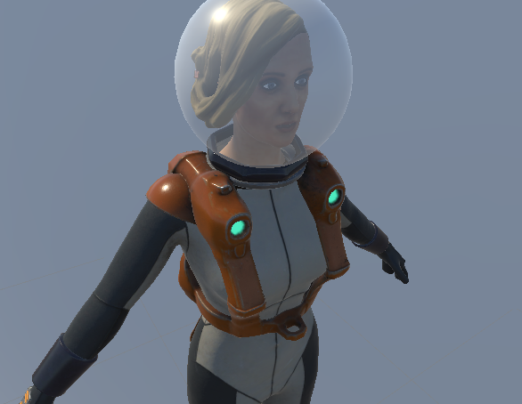
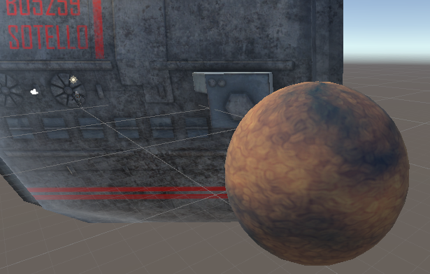

<!--more-->

## 掌握标准着色器

- Alt+鼠标左键 旋转摄像机，Alt+鼠标中键 平移摄像机，Alt+鼠标右键 拉近拉远摄像机 （感觉用了这么久的 Unity 我连这些都不知道！）
- Unity 新建的 Standard 材质就直接上Aldebo、AO、Normal、Metallic 贴图就可以了，如果有自发光，还需要添加自发光贴图
- 对于透明物体，需要设置透明模式，然后调整不透明度和光滑度



- 在上纹理时，Tiling 是缩放倍数，Offset 是 UV 起始位置，贴花就是为原模型覆盖一层材质，但是因为对同样的模型上了多个材质，会造成效率低下的问题
- 在设置星球的材质时，选择 Shader 类型为标准高光设置，它可以指定物体表面的颜色、反射程度、闪亮程度等，关键就是可以为反射光线设置颜色，平滑度控制高光区域反映表面的粗糙程度



- 设置光源时可以勾选 Halo 产生光晕效果


## 创建自定义着色器

- 创建一个最简单的着色器，可以直接设置颜色和纹理

```GLSL
Shader "MY_Shader/Moon"
{
    Properties
    {
        _Color ("Color", Color) = (1,0.5,0,1)
        _MainTex ("Albedo (RGB)", 2D) = "white" {}
    }
    SubShader
    {
       Pass 
        {
            Color [_Color]
            SetTexture [_MainTex] {
                Combine Primary * Texture // 将纹理颜色与当前颜色相乘
            }
        }
    }
    FallBack "Diffuse"
}
```

- 要创建一个带有光照效果的 Shader，需要用到 Cg 代码，在 CGPROGRAM ENDCG 语句之间声明表面着色器的光照模型，定义输入，为了让 Cg 代码能获取属性，需要定义它们为变量，纹理用 smapler2D，颜色用 float4，表面着色器的输出是 SurfaceOutput，使用 `tex2D` 对纹理进行采样

```GLSL
SubShader
    {

        CGPROGRAM
        #pragma surface surf Lambert
            
        sampler2D _MainTex;
        float4 _Color;
            
        struct Input
        {
            float2 uv_MainTex;
        };

        void surf (Input IN, inout SurfaceOutput o)
        {
            o.Albedo = tex2D(_MainTex, IN.uv_MainTex).rgb * _Color.rgb;
        }
        ENDCG
    }
```


## 进阶的透明效果

- 要设置一个透明 shader，最关键的设置是 `Tags { "RenderType"="Transparent" }`，以及在 `#pragma surface surf Standard fullforwardshadows` 后面添加 alpha
- Cull Off 可以关闭剔除背面，Cull Back Cull Front 分别剔除背面和正面，可以通过此方式分别渲染正面和背面，因为如果同时渲染正面背面可能会产生问题

```GLSL
Shader "MY_Shader/Glass"
{
    Properties
    {
        _Color ("Color", Color) = (1,1,1,1)
        _MainTex ("Albedo (RGB)", 2D) = "white" {}
        _Glossiness ("Smoothness", Range(0,1)) = 0.5
        _Metallic ("Metallic", Range(0,1)) = 0.0
        _Thickness ("Thickness", Range(-1, 1)) = 0.5
    }
    SubShader
    {
        Tags { "RenderType"="Transparent" }
        LOD 200
        
        // 渲染正面
        Cull Back

        CGPROGRAM
        #pragma surface surf Standard fullforwardshadows alpha
        #pragma target 3.0

        sampler2D _MainTex;

        struct Input
        {
            float2 uv_MainTex;
        };

        half _Glossiness;
        half _Metallic;
        fixed4 _Color;

        void surf (Input IN, inout SurfaceOutputStandard o)
        {
            fixed4 c = tex2D (_MainTex, IN.uv_MainTex) * _Color;
            o.Albedo = c.rgb;
            o.Metallic = _Metallic;
            o.Smoothness = _Glossiness;
            o.Alpha = c.a;
        }
        ENDCG
        
        // 渲染背面
        Cull Front
        
        CGPROGRAM
        #pragma surface surf Standard fullforwardshadows alpha vertex:vert
        #pragma target 3.0
        
        struct Input
        {
            float2 uv_MainTex;
        };
        float _Thickness;

        void vert(inout appdata_full v)
        {
            v.vertex.xyz += v.normal * _Thickness;
        }

        sampler2D _MainTex;
        half _Glossiness;
        half _Metallic;
        fixed4 _Color;

        void surf (Input IN, inout SurfaceOutputStandard o)
        {
            fixed4 c = tex2D (_MainTex, IN.uv_MainTex) * _Color;
            o.Albedo = c.rgb;
            o.Metallic = _Metallic;
            o.Smoothness = _Glossiness;
            o.Alpha = c.a;
        }
        ENDCG
    }
    FallBack "Diffuse"
}
```


## 小结


## References

- [Mastering Unity Shaders and Effects](https://www.amazon.com/Mastering-Unity-Shaders-Effects-Jamie/dp/1783553677)
- [PacktPublishing/Mastering-Unity-Shaders-and-Effects](https://github.com/PacktPublishing/Mastering-Unity-Shaders-and-Effects)