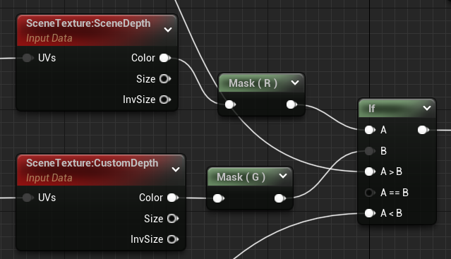
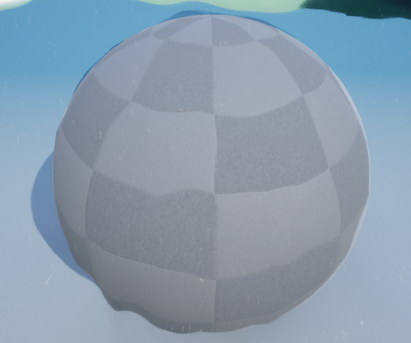

<!--more-->

后处理可以创建很多有趣的效果，接下来就来学习一下吧~

## Night Vision

- 首先新建一个第一人称游戏，然后在 FirstPersionCharacter 蓝图中添加一个 PostProcess 组件，调整上面的一些参数

### 使用查找表（LUT）进行颜色校正

- 在 PostProcess 中可以设置 LUT，可以提供更精细的色彩变换，从而可用于去饱和度之类的用途，UE 里面使用的默认查找表是中性色调 LUT，是一张 256*16 的纹理，我们可以在 PS 中对该 LUT 进行 Adjustment，调整其饱和度，从而生成新的 LUT，比如我想要一个全灰的场景，我就可以先截取一张场景图到 PS，然后调整颜色


- 然后 copy 官方的 LUT，将调整应用到该 LUT 生成新的 LUT，这样就得到了不同的颜色视效，好神奇有木有


- LUT 本质就是通过一个表，把一个颜色映射为另一个颜色，大致的思路就是将原来的颜色作为坐标，去查找 LUT 上对应的颜色，这样就可以将原来的色调映射到想要的色调了
- 创建材质，类型设置为后处理材质，这里是为了模拟抖动的效果利用一张噪声贴图调整 UV，SceneTexture:PostProcessInput0 这个节点其实就是SceneColor，也就是场景本来的颜色。SceneColor 只能用于 MaterialDomain 为 Surface（表面）的材质
- 创建两个 UserWidget，第一个是显示相机窗口，加上了一点图片，第二个是用来过渡的，是全黑色的，然后加上了一段动画让不透明度由 0 到 1 到 0，形成过渡效果，在 Event Construct 的时候 PlayAnimation 即可


- 然后在角色蓝图中添加相关逻辑，在 BeginPlay 时 Create Widget，Add to Viewport，Set Visibility，然后检测键盘按下 C，创建过渡 UI 并添加到视口，因为有动画可以添加 Delay，然后设置 Visibility，PostProcess 可以通过设置 Enabled 来设置是否开启后处理效果，Flip Flop 这个节点挺方便的


- 所以总结起来，上面的方法就是通过调整 LUT 和后处理节点的一些参数来实现夜视效果

### Material

- RadialGradientExponential 径向梯度指数，我感觉就是生成了一张从圆心到四周产生渐变的 Mask，然后将这个 Mask 与 SceneTexture 和自定义个颜色相乘，就可以形成一种绿色的夜视效果了


- 相机也是可以直接加后处理材质的，可以通过 Blend Weight 调整效果，这种方法本质上就是对场景叠加了一层颜色

## Thermal Vision

### 利用 World Normal 得到颜色

- 新建后处理材质，输出 WorldNormal，设置 Before Tonemapping，After Tonemapping (色调映射后) 会在后期处理流程的最后阶段将 GBuffer 从低动态范围空间内提取出来，Before Tonemapping (色调映射前)将在高动态范围空间内提取基础颜色，Tone Mapping 翻译过来是色调映射，其作用是把大范围 HDR 的颜色，映射为小范围的LDR 颜色，以便显示器可以正常显示。显示器所能显示的颜色范围，小于真实世界的颜色范围。在UE4中，Tone Mapping是在后处理阶段，正常渲染之后进行的。
- 这里的做法是将将角色的 Custom Depth 打开，CustomDepth 自定义深度，该物体的PixelDepth就会被渲染到一张单独的Buffer中。这张Buffer是一张与SceneDepth很相似的Buffer，不同的地方在于它将没有开启CustomDepth的区域扣掉了，用一个极大的值去填充（10^8），得到了一张只有CustomDepth区域有效的Buffer。这样就可以筛选出角色，然后为角色赋予暖色，为环境赋予冷色（其实并不想要这种效果）



- 根据物体的表面法向再细分颜色，这里利用 WorldNormal 和 Fresnel 节点得到比例值


### 利用成像的颜色确定红外颜色

- 参考别人的做法，先把图像RGB数值先做灰度处理也就是 value=(R+G+B)/3，然后有如下伪代码（看起来好奇怪，这个人真的不是乱写的吗？我还是去看几篇红外成像的 Paper 好了...）

   ```c++
   //用200-255表示为输出的暖色数值
   //0-80表示为输出的冷色数值
   if(value>128) 200+((value-128)/128)*(255-200);
   if(value<128) 80+(（value-128）/128)*80;
   ```


## UnderWater

### Saturate Effect

- 创建后处理材质，将 Blendable Location 改为 Before Tonemapping（我还是没理解这个有啥作用，但是从观察上来看 Before Tonemapping 颜色边界比较明显，After Tonemapping 像是做了混合），对 SceneColor 做 Desaturation，也就是去饱和度操作，创建一个参数控制 Fraction
- 新建一个 Collection Parameter，（这是新东西之前没用过！），然后设置一个 Alpha 变量，将其应用到材质中调整 Saturation，这样就可以通过代码调整系数，可以在蓝图中添加 Timeline 实现更细致的变化效果，用 Set Scalar Paramter Value 节点赋值


- 要对特定物体做 Mask，也用到了上面的方法，用 CustomDepth - SceneDepth 作为输出值，因为没有开启 CustomDepth 的对象结果会很大，开启之后的二者相等，结果为 0，那么我们就可以用这个 Mask 来决定对哪些像素做处理


### Drunk Effect

- 要产生视觉变化的效果，利用贴图 + Panner 可以做到，这种方法经常遇到，将 TexCoord 做 Pannner 然后对贴图进行采样作为偏移加到原坐标上，然后传入 SceneTexture 的 UV，贴图的制作用到了 Substance，主要是利用 Tile Sampler 生成很多不规则的圆形，然后使用 Dircetional Warp 对其做扰动，然后就可以 Blur Blend 了，应用这张贴图，就可以产生水下视觉扰动的效果了


- 然后添加幻影效果，类似的，将 UV 做一些偏移，然后与原图叠加起来（怪不得要加 Drunk Effect，我看到已经开始头晕了）


### Underwater Effect

- 要模拟水下的效果，首先可以借用前面的 Drunk Effect 形成波动效果，然后形成水深效果，当像素越深时，水的颜色越深，这里用到了 Scene Depth 节点，因为深度很大，将其除以 1000 放缩到 1 以下，将深度值作为 Alpha 让场景颜色和水颜色混合，就可以形成水的颜色从浅到深的效果


- 水里的杂质也用贴图来完成，因为图片比较小，直接采样生成的杂志看起来会很大很糊，所以需要对 UV 做一点偏移缩放处理



### Night Vision & Thermal

- 这里的实现方法和之前的大同小异，这里比较有意思的地方是扫描线的做法，将 ScreenPosition 的 y 乘以一个比较大的数取小数


## 小结


## References

- [UE4 Tutorial: Night Vision Camera (Outlast)](https://www.youtube.com/watch?v=O-0DDBn04mY)
- [使用查找表（LUT）进行颜色校正](https://docs.unrealengine.com/4.27/zh-CN/RenderingAndGraphics/PostProcessEffects/UsingLUTs/)
- [LUT（look up table）调色的原理与代码实现](https://www.jianshu.com/p/d09aeea3b732)
- [UE4 FPS Night Vision l Unreal Engine 4.26 (Tutorial)](https://www.youtube.com/watch?v=3Eo7vM90XCI)
- [UE4/UE5实现红外图的效果，主要用在仿真模拟上面](https://zhuanlan.zhihu.com/p/410755593?utm_id=0)