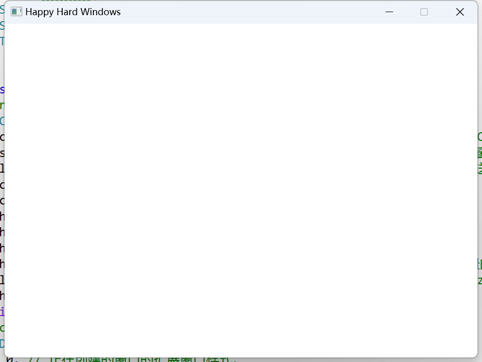

<!--more-->

开个新坑，keep learning ~

## WinMain

- 新建 VS 项目，属性中子系统改为窗口，这个时候如果按照 Console 的写法写个 main 然后 run，就会出现错误说无法解析符号，在 Windows 下创建窗口时，我们首先需要一个窗口 Class，生成时创建一个窗口的 Instance
- WinMain 的入口如下，主要就是一些句柄、命令参数
  
  ```C++
  int WINAPI wWinMain(HINSTANCE hInstance, HINSTANCE hPrevInstance, PWSTR pCmdLine, int nCmdShow);
  ```

- 要创建窗口，首先需要使用 `RegisterClassEx()` 注册，它需要一个 `WNDCLASSEX` 对象，该对象比较重要成员有比如 `lpfnWndProc`，用来决定怎么处理 message 以及窗口的样子等

  ```C++
  const auto pClassName = _T("mini engine");
  // register window class
  WNDCLASSEX wc = { 0 };
  wc.cbSize = sizeof(wc); // 将此成员设置为 sizeof(WNDCLASSEX). 在调用 GetClassInfoEx 函数之前，请务必设置此成员。
  wc.style = CS_OWNDC; // 此类样式指示系统创建专用设备上下文，即为类中的每个窗口分配唯一的设备上下文。 应用程序只需检索一次上下文，然后将其用于所有后续绘制。
  wc.lpfnWndProc = DefWindowProc; // 在应用程序中定义的回调函数，用于处理发送到窗口的消息。DefWindowProc 调用默认窗口过程，为应用程序未处理的任何窗口消息提供默认处理。 此函数可确保处理每个消息。
  wc.cbClsExtra = 0; // 要按照窗口类结构分配的额外字节数。
  wc.cbWndExtra = 0; // 在窗口实例之后分配的额外字节数。 
  wc.hInstance = hInstance; // 包含类的窗口过程的实例的句柄。
  wc.hIcon = nullptr; // 类图标的句柄。 此成员必须是图标资源的句柄。
  wc.hCursor = nullptr; // 类游标的句柄。 此成员必须是游标资源的句柄。 
  wc.hbrBackground = nullptr; // 类背景画笔的句柄。 此成员可以是用于绘制背景的画笔的句柄，也可以是颜色值。
  wc.lpszClassName = pClassName; // 指向空终止字符串或原子的指针。 如果 lpszClassName 是字符串，则指定窗口类名称。 
  wc.hIconSm = nullptr; // 与窗口类关联的小图标的句柄。 
  RegisterClassEx(&wc);
  ```

- 然后是创建窗口，使用 `CreateWindowExA`，

    ```C++
    // create window instance
    HWND hwnd = CreateWindowEx(
        0, // 正在创建的窗口的扩展窗口样式。
        pClassName, // 如果 lpClassName 是字符串，则指定窗口类名称。 类名可以是注册到 RegisterClass 或 RegisterClassEx 的任何名称，前提是注册该类的模块也是创建窗口的模块。
        _T("Happy Hard Windows"), // 窗口名称。 
        WS_CAPTION | WS_MINIMIZEBOX | WS_SYSMENU, // 窗口具有双边框 | 窗口的标题栏包含问号 | 有菜单栏
        200, 200, // x, y 
        640, 480, // width, height
        nullptr, // 正在创建的窗口的父窗口或所有者窗口的句柄。
        nullptr, // 菜单的句柄。
        hInstance, // 要与窗口关联的模块实例的句柄。
        nullptr // 指向通过 CREATESTRUCT 结构传递给窗口的值的指针
    );
    ```

- 最后需要 Show 出来我们的窗口（不容易，这么多接口怎么记住的...）
  
  ```C++
  ShowWindow(hwnd, SW_SHOW); // SW_SHOW 激活窗口并以当前大小和位置显示窗口。
  ```




##


## 小结


## References

- [C++ 3D DirectX Tutorial [Introduction] 0](https://www.youtube.com/watch?v=_4FArgOX1I4&list=PLqCJpWy5Fohd3S7ICFXwUomYW0Wv67pDD&index=1&t=1s)
- [Hardware 3D (C++ DirectX Graphics) Tutorial 1](https://wiki.planetchili.net/index.php/Hardware_3D_(C%2B%2B_DirectX_Graphics)_Tutorial_1)
- [WinMain：应用程序入口点](https://learn.microsoft.com/zh-cn/windows/win32/learnwin32/winmain--the-application-entry-point)
- [(winuser.h) WNDCLASSEXA 结构](https://learn.microsoft.com/zh-cn/windows/win32/api/winuser/ns-winuser-wndclassexa)
- [CreateWindowExW 函数 (winuser.h)](https://learn.microsoft.com/zh-cn/windows/win32/api/winuser/nf-winuser-createwindowexw)
- [ShowWindow 函数 (winuser.h)](https://learn.microsoft.com/zh-cn/windows/win32/api/winuser/nf-winuser-showwindow)