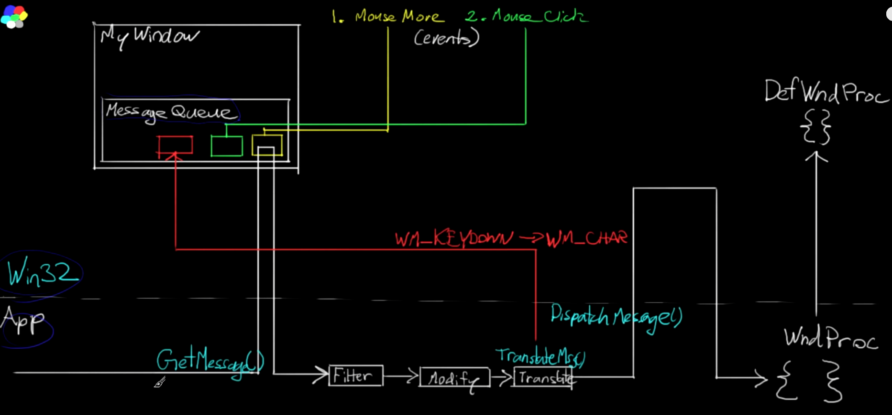
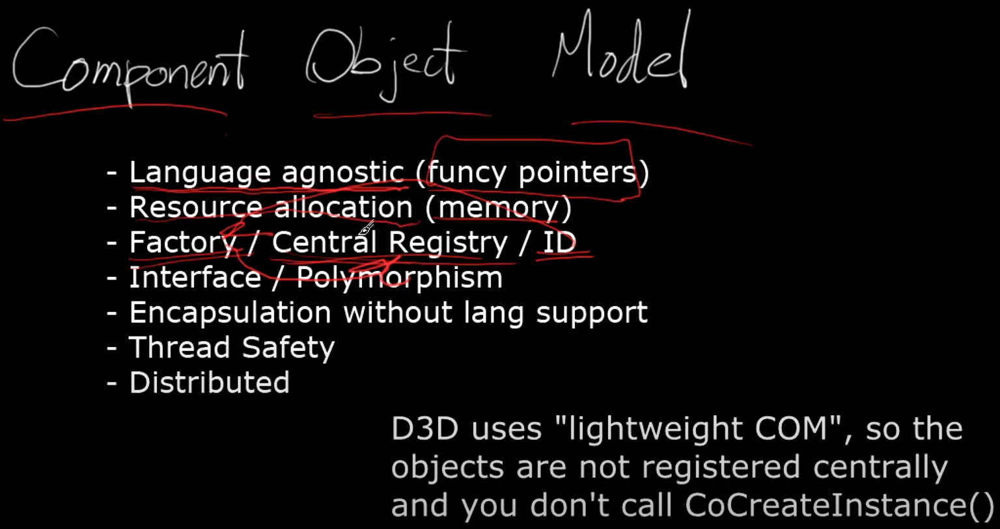
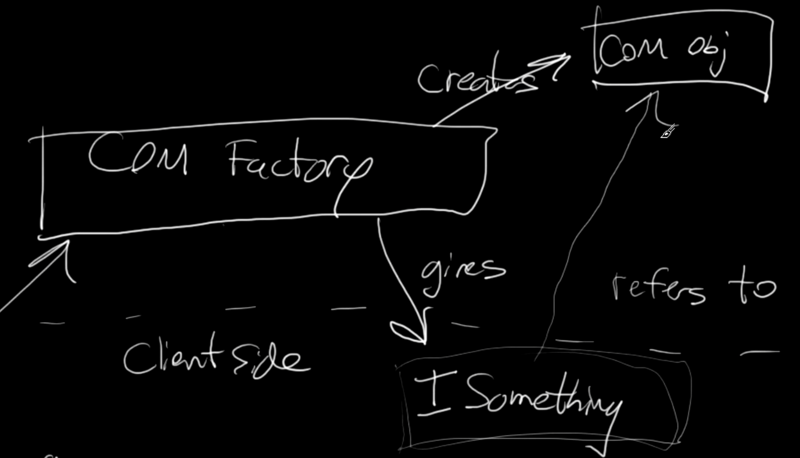
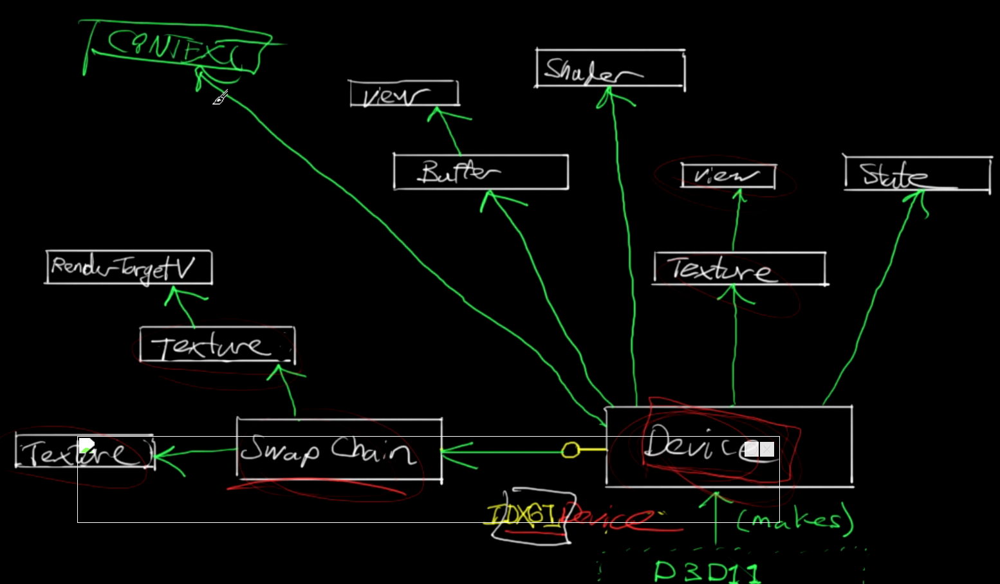
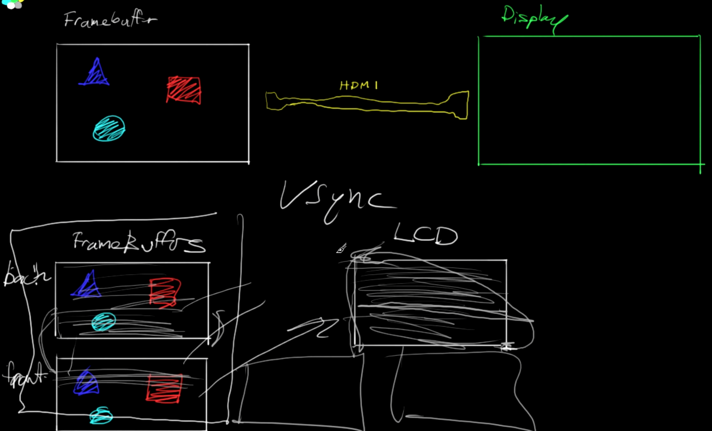

<!--more-->

开个新坑，keep learning ~

## WinMain

- 新建 VS 项目，属性中子系统改为窗口，这个时候如果按照 Console 的写法写个 main 然后 run，就会出现错误说无法解析符号，在 Windows 下创建窗口时，我们首先需要一个窗口 Class，生成时创建一个窗口的 Instance
- WinMain 的入口如下，主要就是一些句柄、命令参数
  
  ```C++
  int WINAPI wWinMain(HINSTANCE hInstance, HINSTANCE hPrevInstance, PWSTR pCmdLine, int nCmdShow);
  ```

- 要创建窗口，首先需要使用 `RegisterClassEx()` 注册，它需要一个 `WNDCLASSEX` 对象，该对象比较重要成员有比如 `lpfnWndProc`，用来决定怎么处理 message 以及窗口的样子等

  ```C++
  const auto pClassName = _T("mini engine");
  // register window class
  WNDCLASSEX wc = { 0 };
  wc.cbSize = sizeof(wc); // 将此成员设置为 sizeof(WNDCLASSEX). 在调用 GetClassInfoEx 函数之前，请务必设置此成员。
  wc.style = CS_OWNDC; // 此类样式指示系统创建专用设备上下文，即为类中的每个窗口分配唯一的设备上下文。 应用程序只需检索一次上下文，然后将其用于所有后续绘制。
  wc.lpfnWndProc = DefWindowProc; // 在应用程序中定义的回调函数，用于处理发送到窗口的消息。DefWindowProc 调用默认窗口过程，为应用程序未处理的任何窗口消息提供默认处理。 此函数可确保处理每个消息。
  wc.cbClsExtra = 0; // 要按照窗口类结构分配的额外字节数。
  wc.cbWndExtra = 0; // 在窗口实例之后分配的额外字节数。 
  wc.hInstance = hInstance; // 包含类的窗口过程的实例的句柄。
  wc.hIcon = nullptr; // 类图标的句柄。 此成员必须是图标资源的句柄。
  wc.hCursor = nullptr; // 类游标的句柄。 此成员必须是游标资源的句柄。 
  wc.hbrBackground = nullptr; // 类背景画笔的句柄。 此成员可以是用于绘制背景的画笔的句柄，也可以是颜色值。
  wc.lpszClassName = pClassName; // 指向空终止字符串或原子的指针。 如果 lpszClassName 是字符串，则指定窗口类名称。 
  wc.hIconSm = nullptr; // 与窗口类关联的小图标的句柄。 
  RegisterClassEx(&wc);
  ```

- 然后是创建窗口，使用 `CreateWindowExA`，

    ```C++
    // create window instance
    HWND hwnd = CreateWindowEx(
        0, // 正在创建的窗口的扩展窗口样式。
        pClassName, // 如果 lpClassName 是字符串，则指定窗口类名称。 类名可以是注册到 RegisterClass 或 RegisterClassEx 的任何名称，前提是注册该类的模块也是创建窗口的模块。
        _T("Happy Hard Windows"), // 窗口名称。 
        WS_CAPTION | WS_MINIMIZEBOX | WS_SYSMENU, // 窗口具有双边框 | 窗口的标题栏包含问号 | 有菜单栏
        200, 200, // x, y 
        640, 480, // width, height
        nullptr, // 正在创建的窗口的父窗口或所有者窗口的句柄。
        nullptr, // 菜单的句柄。
        hInstance, // 要与窗口关联的模块实例的句柄。
        nullptr // 指向通过 CREATESTRUCT 结构传递给窗口的值的指针
    );
    ```

- 最后需要 Show 出来我们的窗口（不容易，这么多接口怎么记住的...）
  
  ```C++
  ShowWindow(hwnd, SW_SHOW); // SW_SHOW 激活窗口并以当前大小和位置显示窗口。
  ```


## Message

- 窗口由 Window 和 Message 组成，需要接收用户输入和处理事件



- 使用 GetMessage 获取信号，然后用 TranslateMessage 转换信号，和用 DispatchMessage 调度

    ```C++
    // Message
    MSG msg;
    while (GetMessage(&msg, nullptr, 0, 0) > 0) { // 从调用线程的消息队列中检索消息。 
        TranslateMessage(&msg); // 将虚拟键消息转换为字符消息。
        DispatchMessage(&msg); // 将消息调度到窗口过程。
    }
    ```

- 自定义回调函数，在之前的例子中，我们设置 `wc.lpfnWndProc` 为默认的回调函数，这里我们可以自定义一个处理应用程序的退出事件，因为默认的只是关掉了窗口并没有终止掉程序，但后面仍然加上 `DefWindowProc` 为我们处理其他事件，`PostQuitMessage` 发出了一个退出消息 `WM_CLOSE`，返回值为 69，这样我们就会收到一条 wParam 为 69 的退出消息，而程序也能正常退出了

   ```C++
   LRESULT CALLBACK WndProc(HWND hWnd, UINT msg, WPARAM wParam, LPARAM lParam) { // 在应用程序中定义的回调函数，用于处理发送到窗口的消息。
    switch (msg)
    {
    case WM_CLOSE:
        PostQuitMessage(69); // 向系统指示线程已发出终止 (退出) 的请求。
        break;
    default:
        break;
    }
    return DefWindowProc(hWnd, msg, wParam, lParam);
   }
   ```

- 捕获键盘事件，使用 WM_KEYDOWN、WM_KEYUP 可以获取当前按下、松开的键盘信息

   ```C+++
   case WM_KEYDOWN:
        if (wParam == 'F') {
            SetWindowText(hWnd, "Hit Keyborad");
        }
        break;
    case WM_KEYUP:
        if (wParam == 'F') {
            SetWindowText(hWnd, "Not Hit Keyborad");
        }
        break;
   ```

- `WM_CHAR` 用于接收键盘输入，能够识别大小写，`WM_LBUTTONDOWN` 捕获用户按下鼠标左键的事件

    ```C++
    case WM_CHAR: {
        static std::string title;
        title.push_back((char)wParam);
        SetWindowText(hWnd, title.c_str());
        break;
    }
    ```

- 设置 Icon

    ```C++
   wc.hIcon = static_cast<HICON>(LoadImage(
		GetInstance(), MAKEINTRESOURCE(IDB_APPICON),
		IMAGE_ICON, 32, 32, 0
	 ));
    ```

- 教程提供了一系列封装得很好的 Window FrameWork、Error Handling、KeyBoard Class、Mouse Class、App Class（我暂时不打算深究每一行的具体含义）

## COM(Component Object Model)

- C++ 传统的局限性在于不同编译器带来的不一致的二进制布局造成不兼容，以及接口版本更新造成布局变化的不兼容，COM 模型就是用来解决该问题的。对于各个对象，我们都要提供一个创建它的方法，那么创建对象实例的这个类，我们叫做工厂类，在 COM 中，直接被称作是类。我们通过某些方法拿到类，然后就可以通过类来创建实例。



- 对象的释放也是在实现它的模块中进行。每一个对象，在被客户持有时，自身的引用计数会加1，释放时会减去1。一旦它计数变为0，那么一般就会调用delete this删除自己。这也就意味着，客户通过减去引用计数，触发了模块中的对象的释放，从而避免了客户自己用delete来删除对象的操作，因为它是编译器相关的行为。



- COM底层接口IUnknown，所有的COM对象，必须继承IUnknown接口，并且实现它的语义，QueryInterface(): 这个是IUnknown最核心的一个接口，第一个参数名字叫做接口ID，接口ID是我们人为给每个接口生成的一个唯一的GUID，它一般命名为IID_接口名。第二个接口得到对象变身后的值。
- COM 关键利用了 Virtual Table 来实现多态

## D3D Architecture

- D3D 驱动的对象是 Device，比如一些图形逻辑处理硬件，分配资源、Swap Chain、Texture、Shader、State 等等



- Swap Chain 可以创建很多 Frame Buffer，决定了像素如何从 Framebuffer 渲染到最终的显示器上，一般都是 Double Frame Buffers，Front 保存 Finished Scene，Back 在进行后台计算，Front 和 Back 可以互相 Flip



- DXGI 是 D3D 和 Hardward Driver 之间的桥梁，DXGI 的主要目标是管理独立于 DirectX 图形运行时的低级别任务。 DXGI 为未来的图形组件提供通用框。

## Device Init

- 要在设备初始化的同时初始化交换链，使用 `D3D11CreateDeviceAndSwapChain` 函数，他需要指明我们的 Device、SwapChain、Context、RenderTarget 指针，然后先设置 swap chain desc 的一些参数，之后便可以创建 device and swap chain，为 SwapChain 创建 buffer，为 device 绑定 rendertargetview
- 要显示时需要调用 swapchain 的 present，如果要清除屏幕，需要 clearrendertargetview

## ComPtr Smart Pointer

- Microsoft::WRL::ComPtr 是一种智能指针，这样就不需要手动 Release 了，在用 & 时会 GetAndRelease

## 小结

感觉 D3D 比 OpenGL 复杂好多 QAQ，感觉首先要创建实例，然后生成 Device 和 SwapChain 设置 RenderTarget，要绘制时调用 Swap 的 Present。

## References

- [C++ 3D DirectX Tutorial [Introduction] 0](https://www.youtube.com/watch?v=_4FArgOX1I4&list=PLqCJpWy5Fohd3S7ICFXwUomYW0Wv67pDD&index=1&t=1s)
- [Hardware 3D (C++ DirectX Graphics) Tutorial 1](https://wiki.planetchili.net/index.php/Hardware_3D_(C%2B%2B_DirectX_Graphics)_Tutorial_1)
- [WinMain：应用程序入口点](https://learn.microsoft.com/zh-cn/windows/win32/learnwin32/winmain--the-application-entry-point)
- [CreateWindowExW 函数 (winuser.h)](https://learn.microsoft.com/zh-cn/windows/win32/api/winuser/nf-winuser-createwindowexw)
- [ShowWindow 函数 (winuser.h)](https://learn.microsoft.com/zh-cn/windows/win32/api/winuser/nf-winuser-showwindow)
- [getMessageA 函数 (winuser.h)](https://learn.microsoft.com/zh-cn/windows/win32/api/winuser/nf-winuser-getmessagea)
- [COM编程攻略（二 COM最基本接口 IUnknown）](https://zhuanlan.zhihu.com/p/122482719)