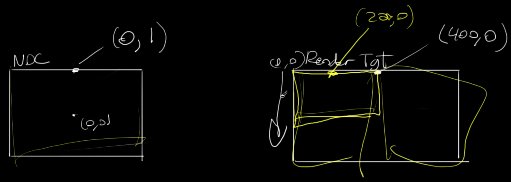
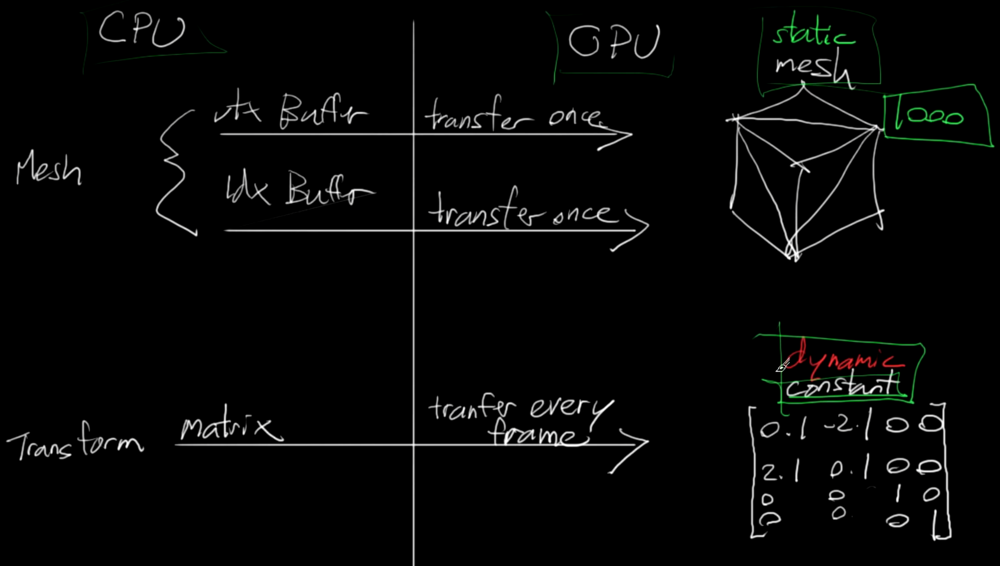
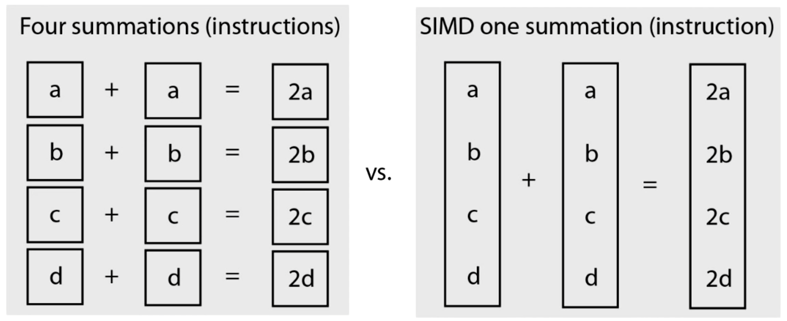
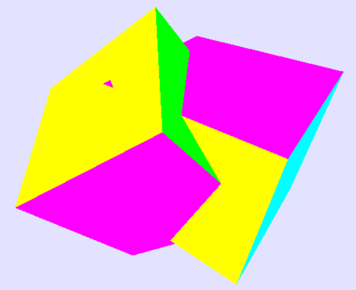
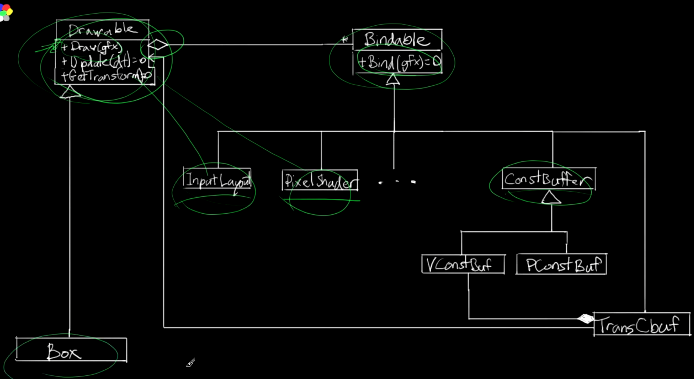

<!--more-->

## 绘制一个三角形

### Buffer

- D3D 的渲染管线


- 创建缓冲区和数据，使用 ComPtr 智能指针创建 Buffer 指针，定义一个 Buffer Desc，设置 BindFlag、Usage、Width、Stride 等参数，创建 Subresource data，设置 pSysMem 为我们定义的三角形数组数据，然后调用 device 的 CreateBuffer 根据我们的 desc、data、buffer 创建 buffer

    ```C++
		wrl::ComPtr<ID3D11Buffer> pVertexBuffer;
		D3D11_BUFFER_DESC bd = {};
		bd.BindFlags = D3D11_BIND_VERTEX_BUFFER;
		bd.Usage = D3D11_USAGE_DEFAULT;
		bd.CPUAccessFlags = 0u;
		bd.MiscFlags = 0u;
		bd.ByteWidth = sizeof(vertices);
		bd.StructureByteStride = sizeof(Vertex);
        D3D11_SUBRESOURCE_DATA sd = {};
		sd.pSysMem = vertices;
        GFX_THROW_INFO(pDevice->CreateBuffer(&bd, &sd, &pVertexBuffer));
    ```

- 创建好 buffer 就可以绑定了，设置 stride 和 offset，然后为 Context 调用 IASetVertexBuffers 设置缓冲区、index、stride 等

    ```C++
    const UINT stride = sizeof(Vertex);
	const UINT offset = 0u;
	pContext->IASetVertexBuffers(0u, 1u, &pVertexBuffer, &stride, &offset);
    ```

### Shader

- 必须为管线设置 Shader 才能正常运行，顶点着色器输出 float4 作为 SV_Position
- 创建一个 ID3D11VertexShader 指针，然后使用 D3DReadFileToBlob 读取 Shader 文件，然后用 device CreateVertexShader 创建 VertexShader，之后为 context 绑定 Shader，同时 Context 需要绑定 RenderTarget

    ```C++
	wrl::ComPtr<ID3D11VertexShader> pVertexShader;
	wrl::ComPtr<ID3DBlob> pBlob;
	GFX_THROW_INFO(D3DReadFileToBlob(L"VertexShader.cso", &pBlob));
	GFX_THROW_INFO(pDevice->CreateVertexShader(pBlob->GetBufferPointer(), pBlob->GetBufferSize(), nullptr, &pVertexShader));
    pContext->VSSetShader(pVertexShader.Get(), nullptr, 0u);
    pContext->OMSetRenderTargets(1u, pTarget.GetAddressOf(), nullptr);
    ```

- `SV_` 开头的是系统的参数，不能改，而其他的参数是可以改名字的，比如 color : Color 可以改成 color : Colorr

### Viewport

- 因为最终显示的屏幕和 RenderTarget 的坐标系不一样，所以为了要渲染到屏幕，我们需要绑定 Viewport



- 设置 viewport 的大小、位置，然后 SetViewports

  ```C++
    D3D11_VIEWPORT vp;
	vp.Width = 800;
	vp.Height = 600;
	vp.MinDepth = 0;
	vp.MaxDepth = 1;
	vp.TopLeftX = 0;
	vp.TopLeftY = 0;
	pContext->RSSetViewports(1u, &vp);
  ```

### Primitive Topologies

- 要绘制形状，需要告诉 D3D 我们想要的拓扑结构，比如三角形，需要指定
  
  ```C++
  pContext->IASetPrimitiveTopology(D3D11_PRIMITIVE_TOPOLOGY::D3D11_PRIMITIVE_TOPOLOGY_TRIANGLELIST);
   ```

### Input Layout

- 虽然我们绑定了 buffer 和 data，我们还需要告诉 layout 这样才能知道如何获取我们的数据，创建 layout，指明 input semantic lable、semantic 的 index、data format、slot、offset、classification data 等，然后 context 绑定 layout

  ```C++
    wrl::ComPtr<ID3D11InputLayout> pInputLayout;
	const D3D11_INPUT_ELEMENT_DESC ied[] = {
		{"Position", 0, DXGI_FORMAT_R32G32_FLOAT, 0, 0, D3D11_INPUT_PER_VERTEX_DATA, 0}
	}; 
    GFX_THROW_INFO(pDevice->CreateInputLayout(
		ied, (UINT)std::size(ied),
		pBlob->GetBufferPointer(),
		pBlob->GetBufferSize(),
		&pInputLayout
	));
    pContext->IASetInputLayout(pInputLayout.Get());
  ```

- 总结一下，要绘制一个三角形，我们先定义顶点数据，然后创建并绑定 buffer，然后读取 shader 并设置和绑定，然后定义并绑定数据的 layout，并设置顶点的拓扑，然后绑定 rendertarget，最后创建 viewport 并绑定，这样就可以使用 Present 绘制了。整套流程和 OpenGL 挺像的，但是感觉更复杂，这怎么记得住 🤦‍

## Color

- 三角形默认是会做 backcull 的，所以顶点需要按照逆时针方向给
- 如果我们要修改我们的结构，那么对应的需要修改 layout，比如我们给之前的 Vertex 结构添加了 Color 结构，Vertex Shader 的输入添加一个 color 语义为 Color，并输出给 PixelShader，在 layout 中就需要加一个指向 Color 的说明，因为 pos 已经占用了 8 个字节，所以这里的 index 需要写为 `8u`

```C++
{ "Color",0,DXGI_FORMAT_R8G8B8A8_UNORM,0,8u,D3D11_INPUT_PER_VERTEX_DATA,0 },
```

## Index Draw

- 给定一些顶点，可以设置他们的 index，也是需要创建 buffer 的，创建 buffer 的流程是：声明一个 buffer 指针，创建一个 buffer desc，然后设置 bind flag 为对应功能的 buffer 类型，设置大小、stride 等，创建 subresource data，设置其 pSysMem 为我们的数据，之后 device 根据上面三个变量创建 buffer，最后 context 绑定我们做好的 buffer 并设置 format

    ```C++
    wrl::ComPtr<ID3D11Buffer> pIndexBuffer;
	D3D11_BUFFER_DESC ibd = {};
	ibd.BindFlags = D3D11_BIND_INDEX_BUFFER;
	ibd.Usage = D3D11_USAGE_DEFAULT;
	bd.CPUAccessFlags = 0u;
	bd.MiscFlags = 0u;
	bd.ByteWidth = sizeof(indices);
	bd.StructureByteStride = sizeof(unsigned short);
	D3D11_SUBRESOURCE_DATA isd = {};
	isd.pSysMem = indices;
	GFX_THROW_INFO(pDevice->CreateBuffer(&ibd, &isd, &pIndexBuffer));
	pContext->IASetIndexBuffer(pIndexBuffer.Get(), DXGI_FORMAT_R16_UINT, 0u);
    ```

## Transformation

- 通常我们会将坐标变换放到 Vertex Shader 里去做，这样 CPU 端我们只需要一开始加载一个静态模型就可以了，而且 GPU 做矩阵计算本来就占有优势，比较快。所以最高效的一种做法是利用 Constant Buffer 传递变换矩阵，然后喂给 Vertex Shader 去计算



- 创建 Constant Buffer，和之前不太一样的地方是 Usage 设成了 Dynamic，因为我们可能中途会改变它，因为是 CPU 会改变数据，所以 CPUAccessFlags 需要改成 CPU Access

  ```C++
    wrl::ComPtr<ID3D11Buffer> pConstantBuffer;
	CD3D11_BUFFER_DESC cbd;
	cbd.BindFlags = D3D11_BIND_CONSTANT_BUFFER;
	cbd.Usage = D3D11_USAGE_DYNAMIC;
	cbd.CPUAccessFlags = D3D11_CPU_ACCESS_WRITE;
	cbd.MiscFlags = 0u;
	cbd.ByteWidth = sizeof(cb);
	cbd.StructureByteStride = 0u;
	D3D11_SUBRESOURCE_DATA csd = {};
	csd.pSysMem = &cb;
	GFX_THROW_INFO(pDevice->CreateBuffer(&cbd, &csd, &pConstantBuffer));
	pContext->VSSetConstantBuffers(0u, 1u, pConstantBuffer.GetAddressOf());
  ```

- 这样在顶点着色器中就可以先声明一个 cbuffer，然后使用 `mul` 进行坐标变换

```C++
cbuffer CBuf {
	matrix transform;
};

VSOut main(float2 pos : Position, float3 color : Color)
{
	VSOut vso;
    vso.pos = mul(float4(pos.x, pos.y, 0.0f, 1.0f), transform);
	vso.color = color;
	return vso;
}
```

- CPU 存储 array 是 row major 的，所以在 vertex shader 中需要声明 `row_major`，否则会出现 GPU 读到的数据是 CPU 上的数据的转置，同时因为画布的大小，在缩放时我们需要指定比例，否则物体会被放缩

## DirectXMath

- SIMD 可以将多个独立的运算整合成一次运算，速度上会快很多



- 有了数学库做缩放旋转转置就简单很多了，可以直接用库函数生成变换矩阵

  ```C++
    struct ConstantBuffer {
		dx::XMMATRIX transform;
	};

	const ConstantBuffer cb = {
		{
			dx::XMMatrixTranspose(dx::XMMatrixRotationZ(angle) * dx::XMMatrixScaling(3.0f / 4.0f, 1.0f, 1.0f))
		}
	};
  ```

- Device Coordinate 和画布的坐标系不同，需要将其归一化到 -1~1，且 y 轴的方向也有所不同

  ```C++
	wnd.Gfx().DrawTestTriangle(timer.Peek(), wnd.mouse.GetPosX() / 400.0f - 1.0f, -wnd.mouse.GetPosY() / 300.0f + 1.0f);
  ```

- 向量操作可以使用 XMVECTOR、XMVector4Dot、XMVectorGetX、XMVector3Transform

## 3D Cube

- 投影变换使用 XMMatrixPerspectiveLH
- 要为立方体的每个面设置颜色，需要在 Pixel Shader 中声明 `uint tid : SV_PrimitiveID`，SV_PrimitiveID 会告诉 pipeline 为每个三角形生成一个 unique id，然后为颜色创建一个 constant buffer，因为立方体的每个面由两个三角形组成，所以需要将 tid / 2

```GLSL
cbuffer CBuf {
	float4 face_color[6];
};

float4 main(uint tid : SV_PrimitiveID) : SV_TARGET{
	return face_color[tid / 2];
}
```

## Z-Buffer

- 存储深度信息的 buffer，创建深度缓存首先需要创建 depth stensil state，然后绑定 depth state，之后再创建 depth stensil texture，然后需要为 texture 创建 view，最后需要绑定一下 rendertarget

  ```C++
    // create depth stensil state
	D3D11_DEPTH_STENCIL_DESC dsDesc = {};
	dsDesc.DepthEnable = TRUE;
	dsDesc.DepthWriteMask = D3D11_DEPTH_WRITE_MASK_ALL;
	dsDesc.DepthFunc = D3D11_COMPARISON_LESS;
	wrl::ComPtr<ID3D11DepthStencilState> pDSState;
	GFX_THROW_INFO(pDevice->CreateDepthStencilState(&dsDesc, &pDSState));

	// bind depth state
	pContext->OMSetDepthStencilState(pDSState.Get(), 1u);

	// create depth stensil texture
	wrl::ComPtr<ID3D11Texture2D> pDepthStencil;
	D3D11_TEXTURE2D_DESC descDepth = {};
	descDepth.Width = 800u;
	descDepth.Height = 600u;
	descDepth.MipLevels = 1u;
	descDepth.ArraySize = 1u;
	descDepth.Format = DXGI_FORMAT_D32_FLOAT;
	descDepth.SampleDesc.Count = 1u;
	descDepth.SampleDesc.Quality = 0u;
	descDepth.Usage = D3D11_USAGE_DEFAULT;
	descDepth.BindFlags = D3D11_BIND_DEPTH_STENCIL;
	GFX_THROW_INFO(pDevice->CreateTexture2D(&descDepth, nullptr, &pDepthStencil));

	// create view of depth stensil texture
	D3D11_DEPTH_STENCIL_VIEW_DESC descDSV = {};
	descDSV.Format = DXGI_FORMAT_D32_FLOAT;
	descDSV.ViewDimension = D3D11_DSV_DIMENSION_TEXTURE2D;
	descDSV.Texture2D.MipSlice = 0u;
	GFX_THROW_INFO(pDevice->CreateDepthStencilView(
		pDepthStencil.Get(), &descDSV, &pDSV
	));

    // bind depth stensil view to OM
	pContext->OMSetRenderTargets(1u, pTarget.GetAddressOf(), pDSV.Get());
  ```

- 每帧要记得清空深度缓存

  ```C++
	pContext->ClearDepthStencilView(pDSV.Get(), D3D11_CLEAR_DEPTH, 1.0f, 0u);
  ```



## Bindable / Drawable System

- 为我们的小引擎设计更好的架构，首先是 Bindable 对象，它们是可以绑定到渲染管线上的东西如 Inputlayout、Shader、Buffer、State，可以绑定到 GFX 上，另一种类为 Drawable，它们包含了一系列 Bindable，可以绘制该对象




## Texture Mapping

- 纹理用 `ID3D11ShaderResourceView` 表示，首先也是要创建纹理资源，设置大小等，然后创建相应的资源和指针
- 纹理还需要 Sampler，设置采样参数等，在 Pixel Shader 中使用 Sample 就可以采样了

```GLSL
Texture2D tex;

SamplerState splr;

float4 main( float2 tc : TexCoord ) : SV_Target
{
	return tex.Sample( splr,tc );
}
```

## Dynamic Lighting

- 添加一个简单的 Phone 模型，将光照信息传入 Constant Buffer，然后在 Pixel Shader 中计算夹角等数据，在 Vertex Shader 中需要获取法线并输出

## Imgui / Assimp

- 使用优秀的库设置 UI 和导入模型

## Scene Graph

- 当一个模型导入进来后，我们需要知道它的层级关系，所以需要利用一个 Graph 在背后做支撑，这样就可以从父级传递变换等操作到子级上

## 小结

D3D 和 OpenGL 有的地方其实挺相似的，创建缓冲区、设置 Shader、设置 InputLayout，主要就是将我们的程序中的一些数据传递给 Shader，但是这个教程讲的有点乱，架构一直在更新，打算下一章节认真梳理一下目前的引擎架构。

## References

- [C++ 3D DirectX Tutorial [First Triangle Pt 1]](https://www.youtube.com/watch?v=pfbWt1BnPIo&list=PLqCJpWy5Fohd3S7ICFXwUomYW0Wv67pDD&index=17)
- [Intrinsic Functions](https://learn.microsoft.com/en-us/windows/win32/direct3dhlsl/dx-graphics-hlsl-intrinsic-functions)