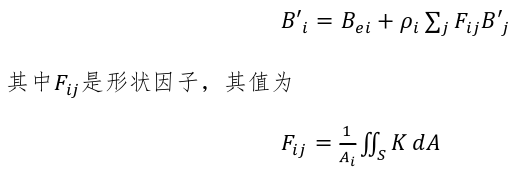

<!--more-->

## 系统构成

- 干扰弹：动作行为、模型材质、外观呈现 -> 可以被上级对象生成并发射 -> 间接操作对象
- 导弹 -> 间接操作对象
- 飞机 -> 用户可直接操作对象
- 环境：地形、天空、光照、云雾 

我将系统一共看成了六个部分，对象是场景中直接可见可操作的一些物体，如干扰弹、战机、环境，世界管理器管理并更新着所有对象，在启动时先从配置管理器获取场景中对象的配置初始化仿真计算器并初始化对象，然后每帧获取仿真计算器的仿真结果并赋予给场景中对象。世界管理器可以打开配置编辑器，根据配置管理器中的一些设置，提供用户可以自定义编辑配置的工具。配置管理器在系统启动时会首先查看内置配置库加载已有配置。

## 对局流程

## 新增配置

系统的可配置性关键在于类的抽象设计要足够通用，规定一套统一的 API 供用户续写，这里让用户编译成 dll 最方便，也可以预先设定一些行为逻辑供用户组合生成新的行为逻辑，比如运动模型，那就要把 update 接口留出来，输出是下一帧的运动状态，这样就可以继承出多种运动模型，可以实现自己的运算逻辑，输入输出定义好，初始化接口留出来，这样世界管理器只需要一开始调用一个初始化函数，之后每帧调用更新函数即可。

如果要变成分布式系统，那么现有系统也很容易扩展，因为这些管理器计算器其实不局限于所在哪台机器，它们也可以在服务器上部署，只不过还是得有一个总的调度器来管理不同对局，然后分发到不同用户上独立的管理器中。在计算时需要加上标识，说明是哪个地址的服务。同时世界管理器需要多一点同步操作。

## 开题报告

收集了一些相关的论文资料，东西比较杂乱，后续会整理。

### 刘延峰. 基于OpenGL的实时红外图像仿真引擎设计与实现[D].西安电子科技大学,2021.DOI:10.27389/d.cnki.gxadu.2021.000738.

- 传统的基于外场的红外图像获取方法和基于半实物的红外图像仿真方法往往无法快速、廉价的提供大量特定环境下的红外图像，因此基于计算机的红外仿真技术受到越来越多的关注。红外仿真技术就是通过分析实际红外成像系统的工作方式并使用计算机重现这一过程以生成满足需求的红外图像，这种方式可以有效避免利用实场获取红外图像工作量大、花费高、灵活性差等问题，具有非常大的军事与民用价值。 
- 本文以构建一个轻量易用的实时红外图像仿真引擎为目标，紧密围绕实时性这一要求，以战斗机三维模型作为主要研究对象，通过分析红外成像系统的基本物理原理，结合计算机图形学、图像处理、软件工程等领域的技术，对红外成像系统的各个关键环节进行了研究，主要工作包括：（1）研究了红外成像系统的基本物理原理，分析了影响红外成像系统的常见因素，包括独立热源、大气传输效应、太阳、遮挡、成像设备，对以上物理原理和影响因素一一建模，忽略次要因素提取主要特征，奠定本文后续提出的红外仿真数学模型的合理性和实时性。（2）通过分析仿真中各个环节的具体工作任务，对CPU和GPU进行了合理的任务分配和调度，结合OpenGL和GLSL语言构建了一套基于GPU的红外仿真系统框架。与实场拍摄的红外图像和其他红外仿真方法对比，本文的仿真图像灰度分布与实际红外图像分布基本一致，仿真速度也快于其他仿真方法。（3）针对飞机尾焰的实时红外图像仿真，提出了一种结合尾焰建模与C-G谱带法的GPU尾焰红外仿真方法。在此基础上还提出了一种基于单参数控制的尾焰网格实时更新的动态尾焰仿真方法，该方法通过控制单一参数使得尾焰模型各个顶点在GPU上独立并行的调整其空间位置以实现实时更新尾焰，从而获得尾焰扰动的逼真效果。实验结果表明，本文提出的方法可以快速、有效的仿真出飞机尾焰的红外图像。（4）针对目前国内红外图像仿真软件以及专用的红外图像仿真引擎较少的问题，依靠OpenGL与C++编程语言，结合面向对象编程思想，构造了一个轻量、专用、接口清晰、扩展性强、低耦合高内聚的红外仿真引擎。并利用此引擎二次开发了一个基于GPU的激光仿真引擎和红外仿真软件。 
- 红外成像系统具有可全天候工作、设备轻便、抗烟雾干扰能力强等特点在军事与民用领域有着广阔的应用。在军事中可以进行红外侦查、红外夜视、红外制导、红外光电对抗等。民用领域中可以进行红外测温、红外成像探伤、红外医疗等。红外图像仿真技术基于红外物理学、光学、图像处理、计算机图形学等多门学科。原理上讲红外探测器接收到目标以及背景自身或者反射的特定波段的辐射，这些辐射受到大气、成像系统等影响后传入探测器，探测器将辐射通过光电信号的转换生成最终的图像。基于数学模型的红外成像仿真技术以三维数字模型为研究对象，通过分析物体表面温度分布、红外辐射量化、成像信号转换、大气环境衰减等红外成像链路中关键步骤的物理特性并对这些过程一一建模，再利用计算机完整的模拟上述整个步骤，最后结合现代计算机中强大的硬件设备，利用计算机图形学相关领域的技术准确、快速的给出符合需求的红外图像。为了快速获取大量的红外图像，使用计算机去进行红外图像的仿真是十分必要的，而随着硬件的进步与计算机技术的发展，这种仿真方法更加快捷、先进，因此依据计算机去模拟仿真红外图像具有很大的现实意义和应用前景。
- 对飞行器等空中目标的红外仿真研究主要集中在两个方面，分别是蒙皮与尾焰。对于蒙皮来说仿真理论基础基本上都是基于热力学传播定律进行温度场求解。对于尾焰部分的仿真，大部分学者使用软件进行流体建模与红外仿真。对于基于光栅化的实时红外仿真技术来说，这种方法利用现有图形API并结合现代GPU的强大性能，快速且尽可能真实的将红外图像实时的仿真出来；而另外一种是离线红外仿真，即不考虑耗时，尽可能的考虑红外仿真精度，这种方法代表的技术有光线追踪等。但是随着硬件技术的发展与计算机图形学等学科的发展，这两种技术都有着一种融合的趋势，即在实时仿真技术中适当的使用一些离线仿真的技术以提高仿真精度，而在离线仿真中适当的使用GPU等进行加速仿真。
- 本文以战斗机模型为研究对象，考虑大气辐射、独立热源、速度、尾焰、太阳等的影响，主要做了以下几点工作：（1）结合红外辐射基本原理，考虑太阳、大气、阴影遮挡、独立热源、飞行器蒙皮效应等条件，构建了一个完整的基于OpenGL的飞机实时红外仿真框架，该框架将全部的红外计算以及后期的图像处理全部放入GPU中去进行处理，可以达到很高的仿真速率和较为理想的红外仿真结果。另外在计算温度与辐射时没有采用传统的基于三角形面片的辐射计算，而是采用了基于顶点的计算方法，可以有效地避免网格化现象。（2）提出了一种结合尾焰建模与C-G谱带法的GPU尾焰红外仿真方法。在此基础上还提出了一种基于单参数尾焰网格实时更新的动态尾焰仿真方法，该方法通过CPU控制单一参数使得尾焰模型各个顶点可以在GPU上独立并行的调整其空间位置以实现实时更新尾焰，从而获得尾焰扰动的逼真效果。（3）利用C++与OpenGL设计一款红外仿真渲染引擎，该引擎封装了本文的所有算法。本引擎具有的跨平台、扩展性强、使用简单等特点可以使得用户简单、方便的进行实际项目的开发，有效的降低了开发难度。
- 红外探测器通过接受目标和背景在特定波段下的辐射，将其量化并最终生成红外图像。在这一过程中探测器接收到的辐射会受到各种各样的影响，红外仿真就是通过分析量化各种因素对探测器接受到的辐射的影响，并计算出探测器接受到的具体辐射量。因此掌握红外辐射相关理论对研究红外仿真技术是必不可少的。
- 现实生活中，任何物体都在向外界辐射电磁波，这些电磁波在红外波段则属于红外线。对于一个有温度的物体而言，红外热成像仪接收到的红外辐射主要来自于三个方面。第一种就是最典型的自发辐射，这种辐射是由于物体具有温度从而不断地向外部辐射能量；第二种是物体表面反射的一部分外界辐射，这些辐射主要来自于太阳辐射与环境辐射的反射；第三种则是红外热成像仪本身也会接收到一部分由于大气介质效应产生的大气程辐射。这些辐射经过大气后传输到红外热成像仪中最终生成红外图像。

（目标红外辐射特性）

- （物体自身辐射）普朗克定律->给定的温度下单位面积的黑体在单位时间和单位波长内辐射出的能量；斯蒂芬·玻尔兹曼定律->理想黑体单位面积与时间内辐射的能量与温度的四次方成正比。该公式说明了理想黑体辐射的能量只与波段与温度有关，而与其他条件如材质等无关；一般来说生活中的所有物体是达不到理想黑体的光谱辐射出度的，为了具体量化不同物体辐射能力的大小，我们用相同温度下物体辐出度与黑体辐出度之比来定义物体的红外发射率，生活中的大部分物体在一定波段范围内都不会发生变化，在计算时可以带入材料的平均发射率进行计算；维恩-位移定律->维恩-位移定律是针对绝对黑体的定律，该定律指出黑体的温度与此温度下的红外辐射最大值所对应波长的乘积为常数，维恩-位移定律指出当温度降低时，绝对黑体的红外辐射最大值对应的波长向长波方向移动，维恩-位移定律为红外探测奠定了基础。对于温度较高的物体，其辐射主要集中在短波区域，对于温度较高的物体，辐射集中在中长波波段。因此在观测某些大气层外的高速飞行目标时，一般使用短波红外探测器，因为空中目标的尾焰温度极高，其红外辐射主要集中短波部分；空中目标的尾焰、尾喷口和其他外露在外的金属喷管等部分温度都比较高，其红外辐射均集中在短波波段；蒙皮的温度比较低，所以集中在中长波波段。
- （反射辐射）理论上讲每个有温度的物体都是辐射源，这些辐射到达目标表面后会存在反射。这些反射辐射在特定的角度下会进入到红外探测器中，就会将效果叠加到最终的红外图像上。 一般的，反射可以分为漫反射与镜面反射。
- （物体零视距辐射度）

（环境红外辐射特性）

- 红外探测器可观测的对象不仅仅只有目标，除去目标外还有环境辐射会对最终的红外图像造成影响。一般来说大部分的环境红外辐射都是可以测量的，它们的空间特性、光谱特性、时间特性均揭示了环境的固有属性。研究环境红外辐射特性可以为红外系统仿真提供物理特征和数学模型，为红外仿真提供提供理论基础。环境辐射可以来自于地物、海面、天空等。一般来说最常见的环境辐射源是来自天空的辐射，而天空辐射的主要来源是太阳辐射。
- （太阳辐射计算）直接来自于太阳，进过大气衰减后再次经过物体表面反射到达红外传感器中。这部分的计算需要结合物体表面红外吸收、反射等各种数据进行计算。来自于太阳，但是没有经过目标反射而是直接到达红外探测器。在计算时直接使用太阳常数与摄像机看向方向与太阳直射方向的夹角的余弦的积来表示。
- （大气传输模型）大气对红外辐射的影响主要在两方面，分别为衰减和叠加。导致衰减的原因是大气中的某些成分（二氧化碳、水蒸气、雾霾等）对光线产生了折射、反射，使得最终探测器接收到的光线能量下降；导致叠加的原因是红外辐射在传输过程中与其他反射、折射的红外辐射叠加。本文只考虑大气衰减效应。比尔定律

（飞机红外特性）

- 对于正在空中飞行的飞机来说，主要影响其红外特性的为蒙皮效应和独立热源。（1）蒙皮效应：飞机在飞行时由于大气摩擦等影响会导致蒙皮温度上升，是影响飞机红外成像的一个关键因素；（2）独立热源，对于飞机来说，其尾焰会有很高的温度，这就导致其本身会向外辐射较多的热辐射；另一方面，高温尾焰还会影响蒙皮，导致越靠近热源的地方温度越高，从而影响最终的成像结果。 
- （蒙皮效应）飞机在高速飞行中与大气的摩擦也会对物体产生热量，对于飞机来说，其蒙皮温度还受到独立热源的影响，其内部热源可以抽象的简化为一个或多个点

- （尾焰红外辐射原理）对于飞机来说，其发动机具有相当高的温度，一般可以达到上千摄氏度，是飞机等空中目标重要的辐射源。飞机发动机辐射主要包含两部分：尾喷管和尾焰部分。对于尾焰部分，目前主要计算尾焰辐射方法有热流法、有限体积法、离散坐标法、C-G谱带传输法。由于本文提出的引擎具有一定的实时性要求，因此本文采用C-G谱带传输法作为尾焰红外计算方法。

（三维空间变换）

- 空间中的一个点最终变换到二维坐标上

- （基于顶点的温度与辐射计算）令dQ=0，就可以解出模型的稳态温度分布。采用基于顶点的温度计算方法。其基本思想为对于每一个三角形面片，只计算该三角形三个顶点上的温度，三角形上的其他点则通过这三个顶点的温度与这个点的重心坐标求得。求出温度分布后，对于不同的波段，采用拟合辐射方程这一方法，将不同波段下的辐射方程拟合为k·T^s形式，以降低辐射量化时的运算量。
- （太阳光线可达性计算）将太阳作为相机去观察目标，然后将顶点的深度值写入深度贴图中。比较1K是否大于2K，若是，则认为该顶点太阳光线不可达，否则可达。判断一个顶点是否太阳光线可达，只需要在红外计算前获取一张太阳光线空间变换下的深度贴图。从频域的角度去理解，我们在将数据映射到图像中实质上就是一个下采样的过程，当图像分辨率较低时（即采样频率较低），由奈奎斯特采样定理可知此时会导致频谱混叠，表现在图像上即为观察到的锯齿现象。解决上述问题最直观的方法为增大采样频率，即增大最终投影图像的大小。
- （大气模型）平均大气透过率。仿真过程中再使用GPU查表法得出最终的大气衰减、大气辐射通量等参数。在仿真开始时，预先计算出不同海拔、天顶角、距离下的大气衰减参数，并将保存为纹理数据传入GPU中，每次渲染周期可以直接从纹理数据中读取大气透过率数据。这样就避免了在每次渲染的时候都需要重新计算一次大气透过率的问题。纹理的形式可以使用3通道32位浮点型纹理来保存，三个通道分别为短波、中波、长波的平均透过率，纹理的高与宽分别为探测器的天顶角与探测器的海拔高度。每次渲染时计算当前的探测器与目标的距离、探测器的海拔高度、探测器与顶点的天顶角。然后通过线性插值的方法计算出其最终的透过率。对于大气辐通量来说，采用同样的方法进行计算即可，这种方法可以较好的平衡速度与效果。
- （探测器成像模型）经过温度计算、辐射量化、大气模型计算后，热辐射到达红外探测器。经过一些光电效应变换后生成最终的红外图像。这其中主要包括两部分：光学系统模型与探测器模型。一般来说光学系统模型对成像的影响主要在两个方面，一方面是几何透视投影，另一方面是弥散效应。探测器模型主要负责灰度级的量化。这里假设探测器接受到的辐射亮度到最终像素的灰度级的量化关系为线性的。

- （基于GPU的实时红外仿真框架）任务初始化是为了提前计算或处理一些在整个仿真任务中都不发生改变的数据，如模型数据、场景数据、大气模型数据等，这些数据的计算通常都是比较耗时的，将这些数据提前进行处理能够保证在后续的仿真周期中快速的使用这些处理好的数据，提高仿真速度。红外仿真部分（包括温度计算、辐射量化、大阳光可达性计算、大气模型计算、探测器模型等）完全在GPU上进行处理，但是也有一小部分在CPU上进行处理（图3.15中的调整参数），比如最直观的每次渲染周期内目标与探测器在姿态与位置上都会发生该变，即每次渲染周期都要对每个顶点进行一次与上一个渲染周期不同的数学变换，但是这对每个顶点来说是相同的。
- （基于几何建模的尾焰）对于飞机尾焰来说，其形状一般不规则，但是还是需要用一个函数来描述其基本形态，通过观察可以知道，尾焰的形态类似于弓形，因此可以使用余弦函数或者二次函数来表示。在计算尾焰上的每个点的辐射时，仅仅与路径以及尾焰内部热量分布有关，因此十分适合采用GPU去进行计算，即将尾焰上的每个点独立并行的进行计算以提高效率。在计算该点具体发射的幅亮度时需要知道视线在尾焰内的具体长度和起点与终点，因此需要计算视线与尾焰的交点。然而在计算交点前，先要解决尾焰模型偏移的问题。

- （1）最底层的模块为数据管理与数学计算模块，这一模块是整个引擎的最底层，所有模块都依赖该模块，这个模块主要负责管理基本的数据结构以及数学计算。（2）窗口模块主要负责仿真图像的显示，窗口系统的回调系统设计。（3）相机模块主要负责管理相机系统，依靠探测器的朝向、焦距、位置、扫描设置等参数计算对应的变换矩阵。（4）红外仿真模块是进行红外计算并显示的模块，这一模块依赖窗口模块、相机模块、探测器模块并调用场景管理模块。（5）资源管理模块主要负责将模型数据从磁盘读入内存中。（6）物理与特效模块主要负责物理特效的模拟，如碰撞检测等；还要进行一些特效数据生成，如粒子系统、尾焰网格数据等。（7）场景管理模块主要负责对仿真场景中的数据进行管理，该模块要依赖资源管理模块和物理与特效模块。（8）二次开发基础模块是进行二次开发的基础层。
- 针对无法快速、有效、便捷的获取大量的红外图像且国内尚没有一款专用的红外仿真引擎与软件这一问题，本文结合国内外关于红外仿真技术的已有成果，主要以数字三维模型作为研究对象，结合红外物理学、计算机图形学、图像处理等学科，利用计算机模拟红外热成像过程，从而仿真出满足需求的红外图像。（1）研究了红外成像系统的基本物理原理；在此基础上，分析了影响空中目标红外成像的关键因素，包括热源、尾焰、大气、太阳、遮挡、成像设备等；为了满足实时性红外仿真的需求，对上述因素进行合理的简化并进行建模，最终建立了红外成像链路数学模型。（2）结合OpenGL和GLSL语言构建了一套基于GPU的红外仿真系统框架。通过分析仿真中各个环节的具体工作任务，对CPU和GPU进行合理的任务分配和调度。CPU只负责两方面的工作：数据传输、参数设置等运算量较小的工作和仿真模型数据的预计算；而将比较耗时的太阳光线可达性判断、红外计算与量化、探测器效应等步骤均放入GPU中进行处理。在GPU中的计算主要分为以下几个部分，分别是阴影贴图的生成、模型红外的计算与量化、背景辐射的计算以及最终红外图像的生成，这几部分均在GPU上进行计算，具有较高的计算效率。经实验验证，本文的红外仿真系统与实拍的红外图像在模型和背景的灰度值基本吻合，仿真速率上也高于其他方法。（3）提出了一种结合尾焰建模与C-G谱带法的GPU尾焰红外仿真方法，该方法利用了建模法构建尾焰时尾焰模型表面方程确定的特点，在GPU上对尾焰和视线的求交点进行并行计算并结合C-G谱带法求出每一点的辐射亮度。此外，在建模法的基础上提出了一种基于单参数尾焰网格实时更新的动态尾焰仿真方法，通过使用CPU在每帧生成一个新的尾焰长度以生成新的约束方程，在GPU中尾焰模型的每个顶点独立地使用该约束方程更新其空间位置，以达到快速模拟尾焰不规则扰动的效果。实验结果表明，本文提出的方法可以快速、有效的仿真出飞机尾焰的红外图像。（4）结合OpenGL与C++语言构建了一个方便易用、接口清晰、扩展性强的红外仿真引擎。通过分析仿真时各部分工作性质，将引擎划分为三个层次，分别是：底层的数据管理与数学计算层，这部分包含了所有的模型管理与数学计算；中间层为引擎内部功能层，构建出了窗口类、相机类、模型类等高一级别对象，这些类独立完成其各自的功能，一定程度上降低了整个系统的耦合性，利于后期维护；最高层为抽象的探测器层，探测器层提前设置了一些构建OpenGL对象的接口，例如顶点缓冲数组对象、帧缓冲对象、大气模型纹理贴图对象、计算着色器对象等等，这避免了最终开发时调用复杂的OpenGL API，该层也是进行二次开发的基础层，在进行其他光电仿真系统的开发时继承该层可以大大降低开发难度；最后为用户层，该层灵活使用各底层内的成员函数、变量，构建红外仿真链路。（5）利用本文构建的红外仿真引擎进行二次开发，构建了一个基于GPU的激光仿真引擎和一个红外仿真软件。 
- （1）出于实时性仿真的需求，本文在计算飞机蒙皮热量分布时只考虑了稳态条件，而没有考虑温度场随时间变化这一条件。后续可以结合几何建模与热力学相关领域的内容，进行瞬态温度场的求解。（2）没有细致考虑飞机的材质信息，只考虑了飞机蒙皮的物理材质信息，然而现代飞机蒙皮经常有一层特殊的涂层，该层材料对不同波段的电磁波有不同的反射与吸收特性，后续将结合实际飞机的涂层材料针对这一点进行研究。（3）对于红外仿真系统的评价部分，目前来说还是集中在人眼主观评价上，然而这一评价准则过于主观，不具有代表性。目前国内对于红外仿真系统的评价研究也较少，下一步将研究如何具体的量化、评价一个红外仿真系统的性能。 
- 评价：这篇文章理论部分还是比较充足，红外这边主要基于黑体辐射和辐射系数来算，考虑了大气因素，没太看出来是否结合了飞机自身材质特性，提供了一种计算尾焰的方案，根据光谱来算，但没太看懂

### 张繁,王通,黄可蒙,茅佳明,黎美玲,王章野.基于Unity3D的改进实时红外仿真系统[J].计算机辅助设计与图形学学报,2018,30(07):1177-1186.

- 基于红外物理基础理论和自然场景仿真理论. 通过改进已有算法以满足红外仿真系统中的实时性和准确性2 个基本要求. 提出基于 Unity3D 的改进实时红外仿真系统. 首先探讨并修正了部分零视距离辐射计算模型和影响温度场的主要计算模型, 在计算中考虑太阳赤纬角, 改进经验公式, 提高了计算的准确性; 然后在讨论了热源放置和热传递计算问题之后. 在红外仿真中考虑物体不同材质特性对红外效果的影响. 使得绘制结果更为逼真; 最后借助 GPU 对不同场景对象多角度下的红外辐射灰度进行并行计算. 提升计算速度. 该系统基于 Unity3D 游戏引擎. 可以构建包含多种目标对象的红外场景, 如植被、建筑以及车辆; 重建的三维场景仿真效果图与实地拍摄的真实红外场景图像高度相似. 仿真实验渲染速度达到 30 帧/s, 基本满足实时性计算要求.
- 当物体温度大于绝对零度的时, 物体就会对外产生红外辐射, 即向外发射红外电磁波, 红外电磁波的波长范围介于可见光波和微波之间, 波长范围大约是 0.76~1 000 μm. 在夜间等光线较弱或者目标伪装隐蔽的条件下, 由于目标对象自身辐射红外波, 而且辐射的强度与温度成正相关, 因此利用红外波进行热成像可以提供许多可见光无法提供的信息, 红外技术在军事侦察、机械故障诊断等领域具有重要作用.红外仿真是对实际红外成像设备的成像图片进行模拟仿真, 通过物理模型对物体表面温度场进行计算, 求解出物体表面的零视距离红外辐射值; 在此基础上, 考虑多种外界条件对红外辐射值的影响, 如大气条件和设备干扰, 近一步计算出输入到接收设备的辐射值, 并将该辐射值转化为灰度值作为仿真图像的颜色值, 从而得到仿真图像.在利用实际的红外成像设备进行实地拍摄实验时,常常受到多方面的因素制约, 如不可控的环境因素、人力资源以及经济成本. 一个较为准确的红外仿真系统可以仿真出多种环境条件下的任意时段的红外场景图像, 因而, 借助红外仿真系统, 可以大大节约人力资源以及经济成本, 并且操作灵活度较高. 虽然红外仿真技术在军用和民用上用途广泛, 但是其计算复杂度较高, 仿真结果的准确性难以衡量等问题急需解决.因为地球大气对红外波段的不同子波段的透过率不同, 所以通常将红外波段分为短波红外、中波红外和长波红外 3 个区域. 红外物理成像模型包括温度场分布计算模型、大气传输计算模型以及成像过程仿真模型 3 个方面

（零视距离辐射计算模型）

- 物体表面的零视距离辐射主要包括自身辐射和反射辐射 2 个方面，（自身辐射）普朗克
定律.在求解自身辐射时, 关键是准确地求解模型的表面温度. 影响物体表面温度主要有辐射换热、对流换热和导热换热。辐射换热即高温物体通过辐射作用, 将能量传递给相对低温物体. 在自然界中, 主要的辐射是太阳对地球的辐射, 分为太阳直接辐射和大气造成的太阳散射辐射, 由于日地距离较远, 因此通常将太阳垂直辐射大气表面的辐射力视为定值, 称为太阳辐射常数。对流换热分为自然对流和受迫对流. 前者是因为温度不同导致密度差异, 从而产生压力差; 后者则是外力作用产生的对流,如风的作用。某一时间间隔内, 同一区域的物体表面温度
差异较小, 可近似认为相等. 所以对于物体表面,可以将其视为是一维稳态导热, 即只有物体表面与物体内部存在温差, 热流从物体表面流入物体内部.

- （反射辐射）当周围环境的辐射到达物体表面时, 一部分辐射被吸收, 另一部分被物体表面反射, 而这反射的部分辐射同样对物体辐射成像造成影响. 自然环境中, 物体表面反射的辐射主要源自大气辐射和太阳辐射
- （热平衡方程）自然环境中, 物体通过辐射作用从外界吸收热量, 同时也向外界释放热量, 通过对流换热向空气中释放或吸收热量, 并通过导热换热与物体自身其他部分或者直接接触的外界物体释放或吸收热量

- （红外热源仿真）没看懂这块逻辑

- 1) 对于自然红外场景仿真, 太阳高度等参数对计算结果的精确性影响较大. 本文通过对影响温度场的主要计算模型进行修正, 改进了前人使用的经验模拟公式, 在保证一定系统渲染帧率的基础上应用了更加精确的理论推导公式, 如太阳赤纬角的计算公式 2) 基于 Unity3D 提出新的红外仿真算法, 使得任意物体对象能够在系统中反映自身的特性,包括内在物理特性或外在关系等因素, 如内在物理材质参数和外在相对位置关系等.3) 根据场景模型表面材质属性和内部热源属性, 利用 GPU 并行加速能力快速求解受热源影响的表面温度场分布, 合理分配 CPU, GPU 的计算量,充分利用计算资源, 提高了系统的运行效率.随着虚拟现实和增强现实技术的发展, 人们对自然场景仿真提出了更高的要求. 下一步, 将结合头盔、双目眼镜等硬件设备, 将红外仿真系统拓展到虚实结合环境中, 进一步提升用户的体验

### 陈书恒,朱倪瑶,陈宁,马贤杰,刘杰.飞机红外辐射特性测试及红外干扰弹投放方式研究[J].红外技术,2021,43(10):949-953.

- 通过研究飞机的红外辐射特征，为干扰弹投放策略提供参考，采用光谱辐射计、中波热像仪、长波热像仪对飞机的静态红外辐射特性进行测试，选择迎头（ 0o）、正侧向（ 90o）、尾后（ 180o）共 3 个测试点，测试结果表明：迎头红外辐射强度和辐射面积均最小，尾后红外辐射强度最大，辐射面积较小，正侧向红外辐射面积最大，辐射强度较大。根据测试结果分析了飞机面临不同方向来袭导弹攻击时，红外干扰弹的投放使用策略。尾后攻击时，采用多点源和面源红外干扰弹；侧向攻击时，采用面源红外干扰弹；引头攻击时，采用多点源、面源红外干扰弹。
- 为保护飞机免受红外制导导弹的攻击，红外干扰弹应运而生，现今发展的红外干扰弹包括多点源红外干扰弹和面源红外干扰弹。多点源红外干扰弹依靠烟火药柱产生一个与飞机红外辐射特性类似，但能量大于飞机辐射能量 2～10 倍的热源， 以质心干扰的方式达到欺骗来袭红外制导导弹的目的；面源红外干扰弹依靠在空间形成大面积红外辐射云团，使飞机“淹没”在红外辐射云团中，以掩盖飞机自身的红外辐射特征，导致红外导引头无法分辨飞机红外辐射源和面源红外干扰弹辐射源，飞机采用机动规避的方式逃逸出导引头视场，从而免遭红外制导导弹的攻击；多点源红外干扰弹在空中形成强红外辐射源诱骗红外导引头，面红外辐射源在空中形成大面积红外辐射源掩盖飞机自身的红外辐射源，两者结合，可有效迷惑红外制导导引头，提高载机的自卫对抗能力。飞机的红外辐射特性是红外制导导弹识别、捕获、跟踪、摧毁飞机的信号来源，飞机的红外辐射信号主要由机身蒙皮、尾喷管和尾焰组成，其中尾焰和尾喷管是飞机红外辐射的主要来源，红外制导导弹从不同方向攻击飞机时，由于方向不同，导致导引头探测目标的辐射强度和辐射面积差异很大，飞机投放干扰弹的时机和种类也不同。
- ①飞机正侧向的中长波红外辐射面积比迎头和尾后都高，这是由于正侧向时，飞机最大截面与红外热像仪视场垂直，导致红外辐射面积最大；②飞机尾后的中长波红外辐射强度远远高于正侧向和迎头，尤其是中红外辐射强度达到最高说明发动机工作时，尾焰和尾喷管能显著提高飞机的红外辐射特征，但是辐射面积较小；③由于飞机机身的遮挡作用，飞机的红外辐射强度和面积均最小
- 面源红外干扰弹投放后在载机附近迅速扩散开来形成红外干扰云团，其与被保护载机的红外图像相似，或改变载机的红外图像特征，欺骗红外成像制导导弹，继而诱使红外成像制导导弹偏离被保护的载机。面源红外干扰弹对抗红外成像制导导弹，各个阶段可以采用不同的方式进行干扰目标搜索阶段，导弹距离目标通常很远，目标机形成的红外图像很小，处于点目标阶段，当面源红外干扰弹连续投放后，在真目标附近形成大面积红外辐射云团，掩盖目标的红外辐射特征，使红外成像制导导弹导引头无法锁定真目标，面源红外干扰弹起到“隐真示假”的作用。目标跟踪阶段初期，弹目距离逐渐缩短，目标形成的红外图像逐渐变大，且逐渐显示目标的外形特征，此时，红外成像制导导弹使用形心跟踪或是质心跟踪方式跟踪目标。当连续投放面源红外干扰弹后，在目标附近形成大面积红外辐射云团，其红外特征与目标相似，并与目标融合在一起形成共同的目标信息，甚至完全掩盖目标的红外辐射特征，从而改变导弹视场内的目标红外辐射特征，常用的灰度、面积、长宽比、圆度等识别特征均发生较大变化，制导系统难以识别出真目标，此时，实际目标的特征或运动参数将以不稳定或“非目标”的方式变化（如机动逃逸），而面源红外干扰弹的特征保持稳定（持续燃烧或连续投放），此时，成像导弹的识别系统将会锁定假目标，而达到干扰目的。目标跟踪阶段后期，弹目距离很近，目标在导引头视场内外形特征清楚，导引头可根据目标的外形特征（面积、长宽比、圆度等）对目标进行跟踪。此时，连续投放面源红外干扰弹后，面源红外干扰弹形成大面积红外辐射云团，与目标红外辐射特征融合，增大了整个红外辐射云团的辐射面积，改变目标的外形特征，增大导引头识别算法的运算量和识别难度，使其难以识别真目标，导致成像导引头无法通过目标的面目标特征识别出目标，从而有效降低其命中目标概率
- 点源红外干扰弹发射后形成单个热点目标，连续投放后形成多个点目标，通过质心干扰的方式诱骗红外制导导引头。由于点源红外干扰弹能量高，远大于飞机的红外辐射强度，在对抗早期第一代、第二代红外制导导引头时有效；随着具有辐射强度阈值鉴别能力的第三代、第四代红外制导导引头的装备，点源红外干扰弹由于能量太高，且干扰源数量少，干扰效能不高的缺点越来越明显。因此，点源红外干扰弹逐步被多点源红外干扰弹取代。多点源红外干扰弹发射后形成多个分散的点源红外干扰弹，连续投放后形成多个点状发热体。采用多发齐射或多方位齐射时，可迅速在一定空域形成红外高辐射区，在导引头瞬时视场内形成持续的多个干扰源，将目标信号淹没，且多点源红外干扰弹的辐射能量比点源红外干扰弹的小，略高于飞机，导引头无法通过强度阈值鉴别滤除干扰，导引头必须处理多组脉冲信号，降低了其检测目标的概率，红外导引头即使启动了抗干扰措施，但因探测器的噪声几何级数增大，而难以提取有效的制导信号，从而起到保护载机的作用
- 1）当来袭红外制导导弹从尾后攻击飞机时，开始导弹距飞机较远，飞机在红外导引头中显示为一个热点，此时采用多点源红外干扰弹，以质心干扰的方式诱骗红外导引头；随着来袭导弹与飞机距离缩短，飞机在导引头中面积逐渐增大，采用面源红外干扰弹，其红外辐射云团与飞机融合，改变目标的红外辐射特征和在导引头视角下的面目标特征，使导引头分辨不出目标，从而形成有效干扰。多点源红外干扰弹和面源红外干扰弹组合使用，两者结合可有效干扰红外导引头。2）当来袭红外制导导弹侧向攻击飞机时，由于飞机在红外导引头中显示的面积较大，且能量较高，此时可采用面源红外干扰弹有效掩盖目标的红外辐射特征，干扰来袭导弹导引头。3）当来袭红外制导导弹迎头攻击飞机时，由于此时飞机在红外导引头中显示的面积和能量均很低，此时采用多点源红外干扰弹和面源红外干扰弹组合使用，通过多点源红外干扰弹的质心干扰，形成假目标，结合面源红外干扰弹的大面积特征，掩盖目标的红外辐射特征，隐藏真实目标特征，点和面结合，达到“隐真示假”的效果，可有效干扰红外制导导弹导引头

### 潘笑天. 基于辐射度的红外场景绘制模型研究[D].浙江大学,2022.DOI:10.27461/d.cnki.gzjdx.2022.000055.

- 红外视景仿真技术指部分或完全基于物理原理，在计算机上生成与现实场景物理特征一致的红外图像。红外视景仿真技术理论上允许我们在没有实地红外图像的情况下，模拟出不同复杂场景的红外画面，从而可在军事领域用于辅助战略决策和精准战术制导。本文探索了基于物理原理的红外真实感绘制技术，主要聚焦于辐射度算法在红外仿真中的应用，包括计算物体表面热辐射传热以及环境红外漫反射光照，从而实现了一个基于有限元的针对三维红外场景的真实感绘制模型。
- 斯蒂芬玻尔兹曼定律.黑体是一个理想化的物体，实际上现实中大部分物体被近似为灰体，灰体表面的单色吸收率与入射辐射的波长无关，即吸收系数和反射系数为介于0-1之间的常数。实际物体在某温度下的吸收率与入射辐射波长的关系是不规则的，严格来说并不是灰体。但在工程上为了便于计算，常常把它们近似成灰体。

- 当有温度差存在时，热量会从高温处传递到低温处，这种由于温度差引起的能量转移现象被称为传热。在传热学中，热量的传递有对流、导热和热辐射三种基本形式。对流传热指相互接触的流体和固体壁面之间的热量传递过程，要综合考虑宏观的热对流与微观的热传导，对流的热通量的计算较为复杂，本论文采用了如下经验公式计算对流热通量

- 在计算传热时将场景模型简化为有厚度的三维平面，地面视为无限厚度的平面。本文将平面根据厚度分层，认为其由 N 层材料组成，每一层之间都有一定的厚度，将最后一层（第N层）视为绝热的，不会再继续传导。对于无限厚度的地面，本文将其第N层视为无穷厚度，且第N层的温度是固定的

- 物体向外发射的热辐射在遇到其他物体时会被部分吸收并转化为热能，同时物体也会吸收来自其他物体的热辐射并转化成热能，这个过程称为热辐射传热。
- 经典辐射度线性方程

- 依据辐射度算法的基本原理，我们需要做这几件事： 首先对网格做细分。计算面片之间的可见性与形状因子。迭代计算出射辐射度。最后一轮迭代后，我们可以得到每个面片的入射辐射度，此时根据应用场景的不同计算出两类结果： 计算热辐射时：根据面片吸收率计算被吸收的热辐射，并得到其转化的热能。计算场景红外全局光照时：计算面片的辐射亮度并显示。
- （网格细分）针对每个面片𝑃𝑖 ，我们在计算过程中涉及以下几个变量： 面片𝑃𝑖 的世界坐标𝑝𝑖 与法线方向𝑛𝑖 ，用于计算𝑃𝑖 法向的半球空间。面片𝑃𝑖 的自辐射，其接收到的来自场景其他面片的入射辐射度，以及面片𝑃𝑖 处物体的反射率，用于计算出射辐射度。出射辐射度需要被存储下来，作为下一轮迭代的输入参数，最后一轮迭代存储的出射辐射度作为计算结果用于之后的绘制。上述变量中，自辐射就是面片在初始状态下的出射辐射度，是不需要额外存储的，入射辐射度就是上一轮迭代计算得到的出射辐射度，因此也不需要额外存储。因此对于场景中每一个网格，我们仅需要构造三个纹理贴图：坐标贴图，法线贴图，出射辐射度贴图。
- （可见性与形状因子计算）没太理解。为了计算形状因子，我们从面片 𝑃𝑖 的位置与法向方向对场景作光栅化，我们需要得到每个面片含有的片元数量我们使用纹理的单个像素来代表单个面片，因此对于面片的每一个需要存储的数据，我们都使用纹理来存储，这里我们同样使用了一张单通道的整型纹理贴图来存储每个面片所包含的片元数量。在片元着色器中，我们根据当前片元的uv值，将贴图中对应位置的值加1。这样当所有片元完成计算后，贴图中每一个位置的数值就代表了对应面片的片元数𝑁𝑗。
- （平行光的绘制）对于每一个被平行光𝑁照射到的面片𝑃，根据其世界坐标与法向，由以下公式计算得到该面片接收到的来自平行光源𝑁的入射辐射亮度𝐿。计算结果被保存在光照贴图中，这一步得到的光照贴图作为后续辐射度计算时第一轮迭代的输入数据。

- （辐射度模型整体架构）

- （红外辐射特性分析及计算流程）室外场景物体表面的红外辐射主要由四部分组成：表面自辐射，太阳直射中波辐射，大气长波背景辐射，周围其他表面的热辐射。此外还需要考虑大气对辐射传输的影响。地球表层的大气本身也会对辐射有吸收和散射等作用，对地面目标进行仿真时，所有辐射都在大气中传输，因此大气本身对辐射传输的影响不可忽视，主要有两方面的影响。一是场景中的辐射在大气中传输时会与大气作用而发生衰减，二是地球表层的大气由于受到太阳直射热辐射和地面热辐射的影响，产生复杂的升温以及大气运动过程，因而大气自身也会产生一定的热辐射。  由于大气组成成分复杂，其中各种成分对不同波长电磁波的散射吸收和发射率均不相同，因此比较难对大气辐射传输过程中的衰减建立计算模型。另外大气自身的热辐射由于受到季节、时间、天气、地理条件等诸多因素的影响，同样需要建立比较复杂的计算模型。大气辐射的物理计算模型的建立并不是本文研究的重点，因此，本文使用较为成熟的Modtran软件计算太阳直射辐照度和大气背景辐射。红外辐射在到达成像系统之前，会受到大气传输的影响，比如会受到大气的吸收、散射、折射、湍流等影响。大气的各种特性十分复杂，会随着空气的压力、密度、温度等因素的变化而变化，还受大气组成成分，大气中各类分子的吸收光谱参数等影响，计算模型较为复杂。基于这一事实，本文使用在算法和应用方面已经较为成熟的Modtran程序辅助计算大气辐射传输的影响。热辐射是物体用电磁辐射把热能向外散发的热传方式，是热的三种主要传递方式之一，以热辐射传热时不需要介质。本文将场景中的物体简化为灰体场景中某一表面的热辐射会对其他表面产生两种影响：在其他表面发生反射；被其他表面吸收并转化为热能。

- 初始热辐射贴图由太阳直射辐射和大气背景辐射生成。虽然太阳直射辐射和大气背景辐射的波段不同，由于我们将场景各物体近似为灰体，因此不同波段共享同一发射率和反射率，近似使用式计算其红外辐射亮度。在算热辐射的过程中，我们需要考虑大气传输效应的影响，因此这里对第三章节辐射度描述的辐射度实现稍作更改，我们在计算出形状因子后，对其用大气透过率加权，得到一个同时考虑形状因子和大气辐射传输效应的新因子，继续进行后续热辐射的计算。我们实际上将应用两次辐射度算法进行计算，第一次计算得到的热辐射贴图，应用式更新场景表面的温度场，并根据新的温度场重新生成场景的初始热辐射贴图，再进行第二轮辐射度算法的计算。这里实际上应该进行多次迭代直到温度场的变化收敛，但由于复杂度过高，我们只进行了对温度场影响最大的第一次迭代。第二轮计算得到的热辐射贴图直接作为最终的计算结果，并用光栅化成像，最后的成像同样需要考虑大气传输效应

- （仿真系统总体架构）OpenGL封装模块：对OpenGL API作了一定封装，以解决其一些固有缺陷，方便其他模块使用。 资源管理模块：主要负责管理程序运行过程中需要的资源数据的生命周期。并对资源进行包装，控制其访问读写，对外提供访问接口。 计算模块：负责与GPU作交互，管理着色器程序的运行，完成一次指定的与GPU交互的指令，为辐射度模块提供计算形状因子的功能，为绘制模块提供计算辐射亮度的功能。 辐射度模块：包装了第三章所述的辐射度算法的实现，供其他模块使用。 绘制模块：主要负责计算场景中物体表面的辐射度，也负责画面的绘制。 红外模块：负责计算大气辐射和太阳辐射，并根据场景辐射度的迭代计算结果，计算热辐射对场景物体表面温度的影响。用户界面与窗口模块：主要负责管理窗口和UI系统，处理用户交互事件，向绘制模块和红外模块发送指令。 

- 本文系统被分为主线程和绘制线程两个线程，分别负责如下工作：主线程：控制程序的生命周期，负责窗口管理，UI系统管理以及处理用户交互。绘制线程：负责场景的加载，管理绘制场景所需资源的生命周期，计算大气辐射与太阳辐射，迭代计算场景中物体表面的辐射度，绘制场景

- （灰度直方图巴氏距离相似度原理）图像相似度计算主要用于度量两幅图像的相近程度，基于巴氏距离的直方图匹配是用的比较多的一种图像相似度计算方法。该方法由Bhattacharyya等人于1946年提出，基于向量之间的差异来度量图像的相似程度，两幅不同的图像可以直接通过计算直方图来计算两者之间的相似度，计算量较小，直观便捷。该方法用巴氏系数（Bhattacharyya Coefficient）度量图像相似度，巴氏系数可近似地指代对两个统计样本的重叠程度。在图像相似度测量的应用范围中，两组样本对应两幅图像的灰度直方图，即灰度的离散概率分布。灰度分布相近，其巴氏系数就较大，灰度分布偏差较大，其巴氏系数就较小。巴氏系数BC的范围为[0，1]。 

- 1.由于辐射度算法自身的局限性，本文对于红外场景的镜面反射，高光等效果不能很好的模拟，特别是对于红外海面的高光场景。2. 本文目前的红外辐射度算法是基于温度场分布的，尚不能直接求得场景物体的表面温度场分布，而场景温度场是红外仿真的关键步骤之一。 3. 目前的红外仿真系统中，在计算时仍较为费时，对CPU和GPU之间的数据传输协同计算尚不够优化，仿真效率较为低下。4. 本文开发的红外仿真程序目前功能较为单一，可以读取模型、纹理、温度场等资源并计算场景红外辐射亮度，但是不能在程序中对场景进行编辑，且无法实时看到仿真效果，实际的应用体验有待提升。
- 1.尝试探索光线跟踪技术与红外视景仿真技术的结合，以提升场景的反射光的仿真效果。 2. 尝试综合光线跟踪技术与红外辐射度结合，以实现红外高光场景的真实感仿真效果。 3. 改进现有红外辐射度算法，从场景目标的受热分析开始建立热平衡方程组，由此求解出场景表面温度场的分布，进而求出红外辐射亮度场，从而使红外辐射度算法真正成为构建红外成像仿真软件的核心技术。4. 完善对典型红外材质BRDF模型的研究，对全局红外仿真系统进行GPU优化加速，提高红外仿真效率，提高用户使用体验。5. 在此基础上，打造具有完全知识产权和自主可控的我国红外仿真软件，从而打破西方国家在这一领域对我们的“卡脖子”困境。 

### 李晨阳. 基于三维场景的红外成像仿真系统及实现[D].中国科学院大学(中国科学院国家空间科学中心),2019.

- 由于红外成像具有作用距离远、抗干扰性好、穿透能力强和可以全天时工作等优点，在军用和民用领域得到了广泛的应用。例如在军用领域，研制出能够捕获各种目标的红外制导系统以及各种红外对抗装备，在现代战争中是一个非常重要的问题。在民用领域，各种红外安防设备的出现，极大地保障了人们生活的安全。在这其中，急需大量各种条件下的红外图像进行测试、训练和评估。但是现阶段通过靶场试验获取红外图像时，一方面需要耗费很长的时间和大量的人力、物力和财力，同时又很难获取到不同时间、不同环境下的各种红外图像，而且许多的地物军事目标的红外图像很难拍摄到，这样将很大程度上影响到各种红外系统性能的测评（1）基于辐射传输理论，通过对太阳、大气和地物热辐射对红外成像的影响进行分析，完善并确立整个红外仿真过程中需要考虑的因素，进而建立了红外成像链路数学模型。在分析和建模过程中，充分考虑了外界环境与场景、场景内部地物之间的相互作用关系，使建立的模型更加精确，进而提高仿真图像的准确性。（2）基于以上建立的红外成像链路模型，提出了一种基于三维场景的红外成像仿真框架。依据国外成熟的商业仿真软件在设计过程中遵循的模块化、层次化和系统化等设计原则，将仿真框架按照红外成像过程划分为不同的模块，同时针对不同的模块进一步进行层次划分，并对每个部分的关键技术进行了分析和研究。（3）针对基于三维场景的成像仿真计算耗时问题，提出了一种高性能仿真计算优化方法，通过对仿真流程采用离线与在线相结合的设计优化方法，同时针对关键计算模块利用GPU进行并行加速优化，最终显著提升了计算效率。经过对十万面片级规模的场景计算性能的实验分析，与未优化的计算性能相比，优化后系统实现了十倍左右的加速比提升。（4）设计研制了一套基于三维场景的红外成像仿真原型系统，实现了不同波段，不同时间段，不同能见度条件下红外图像序列生成。经对仿真结果综合分析，红外温度反演结果符合实测温度变化趋势，序列仿真图像结果能够逼真反映实际场景物理变化规律，验证了论文所提出的框架和模型方法的适用性和有效性。
- 随着对红外光学和红外辐射的研究，红外的相关理论和技术迅速发展，在许多领域都有非常重要的应用。在军事领域，红外制导、红外监视、红外跟踪和红外预警等应用；在民用领域，红外遥感、红外探测、红外温度检测和红外救援等都离不开红外技术的发展。红外技术在科学研究和国民经济等方面有着极其重要的作用，受到了越来越多的重视。 红外波段是无法被人眼所感知的，但是由于其具有的特有的性质，能够获取到可见光波段无法获取的信息。由于红外辐射相比于可见光有更强的穿透能力，同时能够根据不同地物的温度差异成像，因此相比于可见光有更大的成像优势。正是由于这种独特的成像方式，红外成像技术在各行各界有越来越多的应用。红外成像技术是一种基于图像信号的技术，是光学成像、红外探测和信息处理等多种学科技术的融合。红外相机获取到地物目标的红外辐射，然后将能量值转换为电信号，经过信号处理模块，最终输出红外图像。红外波段成像原理不同于可见光波段成像，在红外成像中，不仅需要考虑太阳相关的辐射，同时也需要考虑物体自身的热辐射。正是由于红外波段的这种成像原理，使得红外相机、红外探测器等在夜晚也能正常使用。同时，红外成像还具有成像距离远和抗干扰性强等特点，是目前军用和民用领域中不可或缺的技术手段之一。在军事方面，红外成像技术在目标的探测、跟踪和识别等领域都有诸多应用；在民用方面，红外成像技术在食品安全、医药、资源探测等领域也有诸多应用。在这些红外设备的研制过程中，会需要用到很多不同条件下的红外图像进行试验、测试、训练和评估。但是在目前阶段，直接获取特定时间特定天气下的红外图像，这种方法首先成本较高，需要耗费很长的时间和大量的人力、物力和财力。同时，许多军事目标的红外图像由于涉密等原因很难被拍摄到。在许多测试环节中，往往需要大量不同时间段、不同天气条件下的一系列红外图像，通过实地测试的方法仅仅能获取某一特定条件下的红外图像，无法满足当前的测试样例。本文首先对太阳、大气和地物自身辐射对红外成像的影响进行分析，对影响红外成像的因素进行了充分的考虑，进而构建了红外成像链路数学模型，以保证仿真的结果更加真实。然后基于以上模型，本文提出了一种基于三维场景的红外仿真框架，将仿真框架的每个部分模块化并对其进行系统实现，最终构建了一套红外仿真系统，为后续国内相关仿真软件的研究提供参考。同时在面对大部分仿真系统在进行图像仿真时计算速度慢，耗费时间长的问题，本文提出了一种在线计算与离线计算相结合的计算模式，同时提出基于GPU的辐射能量场计算方法，利用GPU的高效并行计算速度以提升整个仿真系统的计算性能，以满足部分高速红外设备的测试需求。

- 在自然界中的任何物体，比如大气、土地或建筑物等，在温度高于绝对零度的情况下，都会具有发射、吸收或者透射电磁波的特性。我们将在任何温度下都能够全部吸收任何波长入射辐射的物体称为黑体。黑体是一种理想化的物体，黑体能够吸收所有外部的辐射，对外部来的辐射没有反射和透射作用。在自然界的大多数物体并不是黑体，大部分物体都对辐射具有不同程度反射和透射作用，我们将同一温度下物体的辐出度和黑体的辐出度之比称之为发射率，用来表征不同的物体的辐射能力
- 黑体与黑体辐射 斯蒂芬-玻尔兹曼定律 维恩位移定律 基尔霍夫定律

- 红外成像链路是指地物接收外界辐射，经过自身反射作用，同时叠加自身的热辐射，向上传输，经过大气的衰减作用，到达红外成像系统，红外成像系统将辐射量转换为数字图像的过程。结合在上节中对能量在光源、大气、场景和红外成像系统之间的传递路径的分析，在本节中将红外成像链路模型分为下行入射辐射模型、零视距辐射模型和上行出射辐射模型，并对各个环节的链路模型进行分析，最后构建出红外成像全链路数学模型。
- （1）三维场景的构建模块主要负责对三维场景中的所有对象进行几何建模，生成几何特征数据库，同时配合纹理数据库和材质数据库，最终生成三维场景数据库。（2）大气要素计算模块主要负责计算红外成像链路数学模型中特定大气条件下的大气参数，包括特定天顶角和方位角的太阳辐照度、大气上下行透过率、大气程辐射、大气热辐射和天空下行辐射等，计算结果作为后续辐射能量场计算模块的输入。（3）场景可见性计算模块主要负责计算基于某一特定视点下当前场景中的面元是否可见，在本文的仿真框架中主要分为太阳光直射可见性、天空光漫射可见性和面元间可见性，计算结果作为后续辐射能量场计算的输入。（4）辐射能量场计算模块主要是使用大气要素模块的计算结果和场景可见性模块的计算结果，依据红外成像链路数学模型，求解出场景中所有三角面元的入瞳前辐亮度值，按照计算流程分为温度能量场计算，针对场景中的每一个面元，计算其自身热辐射能量值；入射能量场计算，针对场景中的每一个面元，计算到达其表面、来自任意方向的入射辐射，从而形成整个场景的入射辐射场；出射能量场计算，针对场景中的每一个面元，计算出其入瞳前辐亮度值。（5）混合像元主要是由于遥感器单个视场内包含多种地物目标或者同种地物具有不同的三维结构、大气传输过程中的混合效应和传感器本身的混合效应等原因，需要对辐射能量场的计算结果进行混合像元处理。（6）红外成像系统模型主要负责将经过混合像元模块处理后的入瞳前能量值转换为对应的电信号，然后经过信号处理模块，生成相应视场的红外仿真图像。 

- 地物表面与环境的热量交换通常有三种方式，分别为辐射、对流和传导。热传导部分主要是在地物内部之间进行。外界环境和地物目标之间的交换主要包括太阳辐射、大气热辐射、地物自身的总辐射、地物与周围空气对流产生的显然交换和地物水分蒸发和凝结引起的潜热交换等。太阳相关辐射对地物目标有很大的影响，将太阳相关辐射分为三类，分别为太阳直射辐射、太阳散射辐射和地物反射辐射。对于内部不含有热源的物体，可以采用一维的热传导计算模型来计算物体的温度。以地表的温度计算过程为例，对其温度求解过程进行推导

- 在进行红外图像仿真时，首先构建出三维场景、纹理数据库和材质数据库，同时通过大气要素预计算模块和场景可见性计算模块离线生成特定时间段的大气参数数据库和场景的可见性计算结果文件，然后根据需要基于GPU并行计算出特定视场的出射能量场，经过混合像元和红外成像系统效应，最后生成特定视场的红外图像。 

- 本文首先对国内外红外仿真技术进行研究，结合红外成像链路模型，提出了一种基于三维场景的红外成像仿真框架，并且进行了系统实验和验证，生成了不同波段、不同时间和不同能见度的红外图像序列，基本满足红外设备的测试需求。本文中的红外仿真系统支持短波红外、近红外、中红外和长波红外的仿真，可以根据不同的观测视角生成相应的红外图像。同时，针对传统的基于CPU设计模式的仿真方法进行改进，提出一种离线预计算结合在线计算的设计模式，并将其中计算相对耗时的辐射能量场计算模块基于GPU架构进行设计，进一步提升了红外仿真系统的性能。本文所做的主要工作如下： （1）对红外成像的过程进行了研究，对光源、大气、场景和相机之间的能量传递路径进行了分析，分别列举了太阳、大气和地物辐射对红外成像的影响，进而建立了红外成像链路的数学模型。（2）提出了一种基于三维场景的红外系统仿真框架，将整个框架分为三维场景的构建、大气要素计算、场景可见性计算、辐射能量场计算、混合像元和红外成像系统效应部分，并针对其中各个模块的关键技术和内容进行分析和研究（3）针对传统基于CPU设计模式下的红外仿真系统计算速度慢的情况，提出一种离线与在线计算相结合的设计模式，并将其中计算耗时的辐射能量场计算模块基于GPU进行设计，极大的提升了仿真系统的仿真速度。（4）对整个仿真框架进行系统实现和验证，支持不同红外波段的仿真成像，并且生成了不同波段、不同时间和不同能见度的红外图像序列，满足大部分红外设备的测试需求。 其中也存在一些改进的地方，在今后可以进一步的研究：（1）本文在构建温度场时，温度的计算仅仅使用的是一维的热传导模型，计算结果为每个材质的温度，并没有考虑到三维模型的几何信息，在后续可以结合每个模型的几何信息，针对三维场景中的每一个面元进行温度求解，这样计算的温度将会更加准确。（2）本文在进行红外成像链路建模时，没有考虑I类辐射即邻近效应和J类辐射的影响，尽管这些辐射在一般的应用场景下影响极小，但在一些极为特殊的情况下仍然对红外成像效果有一定的影响，所以在后续仿真框架可以将其对红外成像的影响进行模拟。（3）本文的红外仿真系统对地面的场景进行红外仿真，可以在后续对该系统的功能进行进一步的改进和扩展，使其支持海洋和天空的场景仿真，进一步加强红外仿真系统的通用性。（4）随着一些高性能、可搭载的便携式高性能硬件平台的推出，例如NVIDIA Jetson TX2[ 78,79]等设备，红外仿真系统也可以向这些设备上移植，这样可以在一些无人机或机器人上进行搭载，为其完成在线测试任务。例如在本仿真系统中，可以将场景的温度场和入射场进行预计算，提前存储至便携设备中，然后根据无人机或机器人等的姿态数据，利用出射场模块实时的生成对应视场的出射能量场，同时进行混合像元和叠加红外成像系统效应，实时的为这些设备生成对应视场的红外图像。

### 赵雷鸣,钟雷声,葛学仕.基于Unity3D视景的机载红外干扰弹仿真系统设计[J].电子信息对抗技术,2022,37(06):66-71.

- 针对机载红外干扰弹对抗训练成本高、风险大、组织实施难的问题，在分析研究红外视景
仿真基本原理的基础上，综合运用 Unity3D 引擎、地理信息系统和计算机仿真技术，构建了面向机载红外干扰弹对抗过程的实时仿真系统。针对 4 种不同制导类型导引头开展仿真试验，通过分析命中概率、脱靶量、引偏过程等相关过程数据和图像，表明点面结合投放的红外干扰弹使用策略能够较好应对未知体制的导引头，而大面积散布的多点干扰弹是干扰弹可能的发展方向。
- 仿真系统采用模块化设计，主要由三维视景仿真分系统、运动学与导引头仿真分系统和导调
分系统组成

- 设置的初始化参数包括飞行器类、导弹类、红外干扰弹类、想定规划类等初始化参数。飞
行器初始化参数主要规定飞行器的型号、基本飞行特性、投弹后机动方式等；导弹类初始化参数主要规定导弹导引头制式、导弹飞行特性、导弹毁伤特性等；红外干扰弹类初始化参数主要规定红外干扰弹物理特性、投放方式、投放策略等；想定规划类参数规定飞行器航线、导弹攻击阵位、自然环境要素等。
- 根据红外干扰弹对抗红外制导导弹的物理过程，红外图像的生成包括辐射产生、辐射传播与辐射接收三个环节.在辐射产生环节，仿真主体自身产生的红外辐射与外界红外辐射一起向导引头方向传递。 在传递的过程中辐射能量经过大气介质产生衰减，并叠加大气自身的红外辐射能量。 在接收阶段，导弹导引头的光学系统将接收到的红外辐射汇聚到红外感应元件生成红外图像。根据上述物理过程，红外视景仿真的主体主要包括飞机蒙皮、飞机尾焰和红外干扰弹；图像生成包括温度计算、辐射出度计算、辐射亮度分布、大气传递和导引头处理等仿真步骤

- 对于发动机尾喷管，可假设辐射温度与排气温度一致，辐射面积等于排气口截面积。 对尾焰
采用圆锥型区域近似，平均温度约 1000 k，根据内外焰温度不同可设置 3 ～ 5 个温度层。 尾焰长度应基于不同飞机进行调整，一般战斗机在非加力情况下尾焰长度约为 4 m，加力情况下为 8 m。尾焰的精确温度、长度、与尾喷管的夹角等参数可通过实测或相关资料获得。与尾焰原理类似，基于干扰弹不同的散布类型、装药配方等进行建模，组合使用 Unity3D 的烟雾与粒子系统。 根据干扰弹单点、多点、面分布等不同散布方式，和不同的燃烧温度、持续时间、单点截面积等因素，动态调整粒子系统的粒子数量、粒子体积、粒子亮度、运动轨迹等仿真参数.辐射在大气中的衰减由指数衰减公式决定.不同的导引头，其可接收的红外波长是不同的，因此需根据导引头可接收波长、接收面积，对接收到的场景内各物体的辐射强度进行修正

### 佘少波,李凡,王丙乾,张小威,范凡.基于粒子系统的尾焰红外图像实时仿真技术[J].系统仿真技术,2022,18(04):285-290.DOI:10.16812/j.cnki.cn31-1945.2022.04.015.

## 小结

## References

- [Building a Scalable AAA Game Engine (Presented by Amazon Lumberyard)](https://gdcvault.com/play/1024276/Building-a-Scalable-AAA-Game)