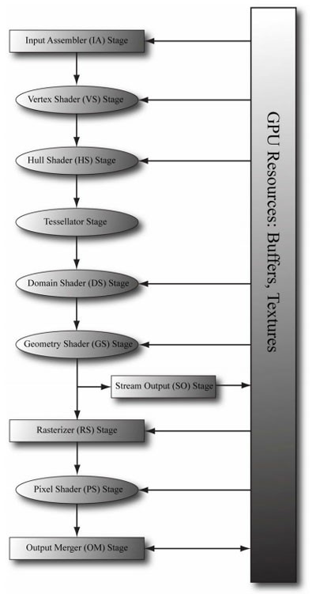

<!--more-->

## Graphics

Graphics 主要负责提供 device、context、swapchain、depthstencilview、rendertargetview 这种基础底层的绘制工具，负责每一帧调用渲染命令，设置相机，输出错误等。

### Init

- HWND：窗口句柄
- ID3D11DeviceContext interface：可以生成渲染命令的设备上下文
- ID3D11Device interface：设备接口，一个虚拟适配器，可以用来创建资源、运行渲染
- device 可以理解为我们的物理设备，它可以创建资源、着色器对象、状态对象等，还可以检查硬件特性，诊断调试等，可以将 device 看作程序中使用的各种资源的提供者。而 device context 主要包含了环境和设置，它可以使用 device 创建的资源设置管道以及建立渲染指令，提供了操作设备创建的资源的方法，device context 可以看作是设备产生的资源的消费者，分为实时渲染（即时上下文）和延时渲染（延迟上下文），即时上下文会在调用时立即提交以在驱动程序中执行，延迟上下文记录来自次要线程的一系列命令，生成一个命令列表对象，该对象可以稍后在即时上下文中回放。
- SwapChain 实现了一个或多个 surface 用来存储输出到输出设备之前的各种渲染数据，使数据后台加速，这样一帧绘制好了才会将完整的帧显示在屏幕上，前后缓冲区形成了一个 Swap Chain，用 IDXGISwapChain 接口表示，该接口保存了前后缓冲区纹理，并提供了用于调整缓冲区尺寸的方法和呈现方法
- DXGI_SWAP_CHAIN_DESC 描述了一个 Swap Chain，BufferDesc 描述了我们要创建的后台缓冲区的属性，宽度、高度、像素格式，SampleDesc 描述了多重采样数量和质量界别，BufferUsage 设为 DXGI_USAGE_RENDER_TARGET_OUTPUT 即将场景渲染到后台缓冲区，BufferCount 是后台缓冲区的数量，OutputWindow 要渲染到的窗口的句柄，Windowded 窗口模式，SwapEffect 设为DXGI_SWAP_EFFECT_DISCARD，让显卡驱动程序选择最高效的显示模式，Flags 可选的标志值。如果设为DXGI_SWAP_CHAIN_FLAG_ALLOW_MODE_SWITCH，那么当应用程序切换到全屏模式时，Direct3D会自动选择与当前的后台缓冲区设置最匹配的显示模式。如果未指定该标志值，那么当应用程序切换到全屏模式时，Direct3D会使用当前的桌面显示模式。
- 在试验 BufferDesc.Format 其他类型时有的不能正常绘制，没有找到原因
- ID3D11Resource interface：提供所有资源的常规操作
- __uuidof 获取某种结构、接口及其指针、引用、变量所关联的 GUID，类似于 typeof
- ID3D11Texture2D 的 BindFlag 决定了绑定到 pipeline 的方式，比如 D3D11_BIND_DEPTH_STENCIL 是说把该纹理作为 depth stencil target
- D3D 描述资源时，用的是 Model-View 模式，ID3D11Resource是Model，负责数据创建销毁、内存布局之类的功能，View的话有以下几种：
  - ID3D11ConstantBufferView（CBV），表示Resource是只读的Buffer。
  - ID3D11ShaderResourceView（SRV），表示Resource是只读的Texture。
  - ID3D11RenderTargetView（RTV），表示Resource是只写的RenderTarget。
  - ID3D11DepthStencilView（DSV），表示Resource是只写的DepthStencil。
  - ID3D11UnorderedAccessView（UAV），表示Resource可以随机读写。
- ComPtr &会把管理的对象reset掉的，之后取指针地址。getaddressof就是单纯取指针地址。get是取与此相关联的接口。
- CreateRenderTargetView 创建渲染目标视图，OMSetRenderTargets 将渲染目标绑定到设备上
- 所以总结起来，DX11 的初始化可以分为以下几个步骤：
  - 创建 device、context、swapchain：D3D11CreateDeviceAndSwapChain
  - 为 backbuffer 创建 view：GetBuffer、CreateRenderTargetView
  - 创建 depth stencil 及其 view：CreateDepthStencilState、OMSetDepthStencilState、CreateTexture2D、CreateDepthStencilView
  - 将 view 绑定到 context 中：OMSetRenderTargets
  - 设置 viewport：RSSetViewports
- 最后再将 Imgui 初始化：ImGui_ImplDX11_Init

### Frame

- 在每一帧开始前，先调用 ImGui 的 NewFrame，然后 context 清空 rendertargetview 和 depthstencilview，用颜色填充背景
- 每一帧完成准备后，先是 ImGui render，然后是 swapchain present，IDXGISwapChain::Present 就是将一张渲染好的图片呈现给用户
- ID3D11DeviceContext::DrawIndexed方法：根据顶点和索引缓冲区进行绘制

## Bindable

Bindable 是 Graphics 的友元类，主要表示了一些可以被绑定到渲染管线上的资源，主要的方法就是绑定 bind()。

### ConstantBuffer

带有一个 buffer 指针，可在初始时赋值，也可后面更新

- ID3D11Buffer interface 可以访问缓存的 buffer interface，通常拿来存 vertex or index data
- D3D11_MAPPED_SUBRESOURCE：当需要用CPU读写（GPU的）subresouce（最常用如buffer）时，就用Map()得到该subresource的pointer（D3D11_MAPPED_SUBRESOURCE*），然后将D3D11_MAPPED_SUBRESOURCE::pData强制转换成CPU理解的类型（struct，class），CPU就可以对得到的struct*或class*读写了
- Update() 就是将 CPU 端的数据更新到 GPU 的 Constant Buffer 上，使用了 map 获取 subresouce 的指针，然后用 memcpy 拷贝数据，最后 unmap 释放指针让 GPU 重新可访问该资源
- 构造函数需要先定义 buffer desc，如果有数据需要定义 subresource，设置 pSysMem，最后 device createbuffer
- using 的作用：导入命名空间、指定别名、在派生类中引用基类成员，这样如果是私有继承，也可以访问 protected 成员变量和 public 成员函数了
- 公有继承时，对基类的公有成员和保护成员的访问属性不变，派生类的新增成员可以访问基类的公有成员和保护成员，但是访问不了基类的私有成员。派生类的对象只能访问派生类的公有成员（包括继承的公有成员），访问不了保护成员和私有成员。保护继承中，基类的公有成员和保护成员被派生类继承后变成保护成员，派生类的新增成员可以访问基类的公有成员和保护成员，但是访问不了基类的私有成员。派生类的对象不能访问派生类继承基类的公有成员，保护成员和私有成员。私有继承时，基类的公有成员和保护成员都被派生类继承下来之后变成私有成员，派生类的新增成员可以访问基类的公有成员和保护成员，但是访问不了基类的私有成员。派生类的对象不能访问派生类继承基类的公有成员，保护成员和私有成员。不管是哪种继承方式，派生类中新增成员可以访问基类的公有成员和保护成员，无法访问私有成员。而继承方式影响的是派生类继承成员访问属性，而使用友元（friend）可以访问保护成员和私有成员。
- c++中声明一个模板类及子类，在子类中如果需要访问父类的protected变量，需要使用父类的类作用域限定符
- VertexConstantBuffer：context 使用 VSSetConstantBuffers 为 vertex shader 设置常量缓冲区
- PixelConstantBuffer：context 使用 PSSetConstantBuffers 为 pixel shader 设置 constant buffers

### IndexBuffer

带有一个 buffer 指针和数量，将传入的索引数组传入 buffer，然后绑定到 input assembler stage

- 初始化时接收索引数组，根据 desc、subresource createbuffer
- bind()：context 使用 IASetIndexBuffer 将 index buffer 绑定到 input-assembler stage
- 初始化输入汇编程序 (IA) 阶段需要执行几个步骤。 例如，需要创建包含管道所需的顶点数据的缓冲区资源，告知 IA 阶段缓冲区的位置及其包含的数据类型，并指定要从数据组合的基元类型。
- The Input Assembler stage(输入装配器阶段)读取几何数据(vertex buffer 和 index buffer),然后用它们来装配几何图形(线，三角形)。Input Assembler Stage，输入装配阶段，从显存读取几何数据用来组合几何图元
- input-assembler（IA） stage是管道的第一个阶段。此阶段的目标是从用户填充的缓存中读取基础数据（点、线和/或三角形），并将数据装配成其他管道阶段使用的元素数据。IA阶段将顶点集成为各种不同的基本类型。新的基本元素（如线列表、线条带、三角形条带或邻接元素）已经被加入到geometry shader支持之列。IA的另一个目标是附加系统产生值来使渲染器更加高效。系统产生值是文本字符串，成为语义（semantics）。所有三个shader阶段都是有一个基础的shader核心构建，而内核使用系统产生值（如primitive id、instance id或vetex id），以此来减少着色阶段的处理，使其专注与哪些还没有被处理的元素、实例或顶点。这一阶段需要定义输入数据的缓存，定义接收、输出数据的类型、slot等信息，并对输入的数据类型根据定义进行验证，然后通过定义装配成元素输出给下个阶段使用。IA阶段的初始化需要几步。例如，你需要创建管道需要的顶点数据缓存资源，告诉IA他们包含哪些缓存和哪种类型的数据，并指定元素类型让IA从数据中装配。

### InputLayout

带有一个 layout 指针根据传入的 desc 创建，然后绑定到 IA

- 初始化时接收 desc 创建 IA 阶段的 input layout 对象
- bind()：IASetInputLayout 设置 layout

### PixelShader

带有一个 pixel shader 指针，从传入的路径中读取编译好的着色器，然后为 device 设置 shader

- D3DReadFileToBlob 将磁盘上的文件读取到内存中，初始化时从传入的地址读取数据到 ID3DBlob，因为它可以返回任意长度的数据，然后 device 使用 CreatePixelShader 根据获取到的着色器创建 PixelShader
- bind：使用 PSSetShader 为 device 设置 pixel shader

### Sampler

带有一个 Sampler State 指针，在 bind 时将 sampler state 设置为 pixel shader

- 在3D渲染中，一般我们会为每个显示在屏幕上的平面贴上纹理。在处理这个过程中，我们需要创建纹理图和与之对应的采样器，采样器的作用就是按照某种规则把纹理上的像素点采集并绘制到模型平面上
- 初始化时使用 CreateSamplerState 创建一个采样器状态对象，该对象封装纹理的采样信息
- bind：使用 PSSetSamplers 将 sampler states 设置给 pixel shader pipeline stage

### Texture

带有一个 shader resource view，初始化时使用读取到得纹理数据创建 texture resource 及其 view，然后将该资源绑定到 pixel shader stage 上

- 初始化时使用 CreateTexture2D 创建 textur2d resouce，然后使用 CreateShaderResourceView 创建 texture2d resource view
- bind：绑定 shader resource 到 pixel shader stage
- 用到了 Surface 类来存储读到的图片数据（还没太看懂用处）

### Topology

带有一个 primitive topology，在 bind 时设置给管线

- D3D11_PRIMITIVE_TOPOLOGY 指示管道如何解释绑定到输入汇编程序阶段的顶点数据的值。这些基本拓扑值决定了如何在屏幕上呈现顶点数据
- bind：使用 IASetPrimitiveTopology 绑定关于基元类型的信息，以及描述输入汇编程序阶段的输入数据的数据顺序

### TransformCbuf

带有一个 drawable 对象指针和 VertexConstantBuffer<Transform> 指针，初始化时创建指针，bind 时计算当前 drawable 的矩阵然后更新 buffer 并 bind

- 初始化时创建一个 constant buffer 存储 transform 数据
- bind：计算模型的世界坐标变换矩阵和投影矩阵（这个计算还需要考虑一下）

### VertexBuffer

带有一个 stride 记录步长、buffer 指针存储 vertex，然后将 buffer 绑定给 IA

- 初始化时根据 vertex 数组或者 VertexBuffer 创建 buffer 指针
- bind：使用 IASetVertexBuffers 为 IA 绑定 vertex buffers

### VertexShader

带有一个 vertexshader 和对应的 blod 指针，初始化时从路径中读取 vertex shader 创建 vertex shader 对象，然后将其绑定给 device

- 初始化时从路径中读取 vertex shader，使用 CreateVertexShader 从已编译的着色器创建顶点着色器对象
- bind：使用 VSSetShader 给 device 设置 vertex shader

总结起来，Bindable 系统就是可以绑定到渲染管线上的组件，比如 buffer、inputlayout、shader、sampler、texture、topology，作为 IA 输入的一些数据，IA 输入装配阶段，就是从内存读取几何数据（顶点和索引）并将这些数据组合为几何图元，那么如何知道这些数据怎么读取、结构怎样，需要我们传入图元拓扑、采样信息等

## Drawable

- Drawable 维护了一个列表，存储了所有与之有关的 bindable 对象，同时还存有一个 IndexBuffer，AddBind 就是给数组添加 bindable 对象
- 然后 draw 方法负责调用 bindable 对象的 Bind，然后再调用 graphics 的绘制命令，需要传入 indexbuffer 的大小，这里之所以需要存一下 IndexBuffer 就是因为需要获取他的大小 

### DrawableBase

包含一个静态数组 staticBinds 存储 binds

- 在模板类中声明 static 变量时，需要在类的外部通过使用范围解析运算符 :: 来重新声明静态变量从而对它进行初始化
- 类做友元可以访问另一个类的私有成员

### SolidSphere

一个可绘制的实心球相关代码，包含自身位置，负责一个实心球的绘制逻辑

- 在初始化时先检查是否已经有 static binds，如有则设置 pIndexBuffer，如无则创建相关 bind：普通（vertexbuffer、indexbuffer），静态（vertexshader、pixelshader、pixelconstantbuffer、inputlayout、topology）（为什么需要分一下 static 没明白，我在想是不是因为这样在创建多个对象的时候基本的设置比如 shader、layout、topology就可以复用了，但是顶点和索引需要传入新的，好像很有道理的样子！）无论那种最后都需要 bind TransformCbuf 传入变换矩阵

小结一下，Drawable 代表了一个可以绘制的元素，保存了绘制元素所需要的 binds 列表，DrawableBase 让同类元素享有一些共同的 binds，需要绘制时调用 draw 命令，就可以调用 bind 将 binds 都绑定到管线上，然后调用 graphics 的 drawindexed 进行实际的渲染绘制。

## Geometry

生成需要绘制的图形的三角形面片数据

### IndexedTriangleList

存储三角形面片的顶点和索引数组，会检查数据是否合法，即索引是否是 3 的整数倍，同时提供位移变化，可将顶点数据按照传入的变换矩阵进行位移变换

- XMStoreFloat3 会将一个 FXMVECTOR 数据存到 XMFLOAT3 中
- XMVector3Transform 会根据 matrix 变换三维向量

### Sphere

根据传入的经度纬度细分数量生成球形的 indexedtrianglelist

- 先计算经度纬度的单位度数，然后均匀计算各个顶点位置，先绕 x 轴旋转，然后绕 z 轴旋转
- 然后加上极点的顶点
- 最后生成顶点的索引（有一点复杂，没太看懂）

## App

负责生成绘制窗口

- 初始化时新建窗口和点光源，并设置投影矩阵，XMMatrixPerspectiveLH 生成一个左手坐标系投影矩阵

## 小结

## References

- [C++ 3D DirectX Tutorial [Node Tree / Transform Propagation]](https://www.youtube.com/watch?v=K7VqSmCiGiM&list=PLqCJpWy5Fohd3S7ICFXwUomYW0Wv67pDD&index=34)
- [DirectX11基础 ---设备(Device)和设备上下文(Device context)](https://blog.csdn.net/u014128662/article/details/90679565)
- [Direct3D11 Device(设备对象)，Device Context(设备上下文)官方SDK翻译](https://blog.csdn.net/pizi0475/article/details/7786306)
- [【DirectX11】【学习笔记（1）】初始化DirectX11](https://blog.csdn.net/qq_40947718/article/details/84100283)
