<!--more-->

## Cursor

- 使用 ::ShowCursor 显示或隐藏鼠标 维护了一个 count，当 count 大于等于 0 时会显示鼠标，小于 0 时隐藏鼠标
- 需要对 Imgui 的鼠标响应单独做处理，因为虽然窗口能看不到鼠标了，但是仍然能够和菜单交互，通过设置 ImGui::GetIO().ConfigFlags
- GetClientRect 获取窗口的坐标 rect
- MapWindowPoints 将 (映射) 一组相对于一个窗口的坐标空间的点转换为相对于另一个窗口的坐标空间
- ClipCursor 将鼠标限制在屏幕上的矩形区域内
- WM_ACTIVATE 当窗口切换到最上层会触发该信号
- 要接收鼠标点击事件，需要使用 RegisterRawInputDevices 将 mouse raw input device 进行注册
- 用 WM_INPUT 捕获鼠标点击事件，需要使用 GetRawInputData 获取一个 byte 数组数据

## Camera

- 提供移动、旋转操作，移动时需要朝着相机的正方向移动
- 使用 clamp 防止正上方正下方视角抖动
- 使用 XMMatrixLookAtLH 计算投影矩阵

## Material Loading

修改 Mesh 结构加载纹理，修改 Shader 显示纹理

- 在利用 Specular Map 计算高光时，计算公式为 specularPower = pow(2.0, 13.0 * shininessMap)


## Bindable Codex

在之前的架构中，相同类型的 Drawable 实例可能会公用一些 Bindable 对象，但是对于不同实例他们之间的 Bindable 是不共享的，所以我们添加上 CodeX 架构，让其存储 Bindable 对象，这样不管我们的绘制实例是什么，都可以去拿到一些自己需要的 Bindable


- 拥有一个 map 存储 bindable，每个 bindable 用唯一 string 标识，比较关键的点就是给 Bindable 对象生成唯一标识
- 单例，接口负责存取 bindable 对象
- 因为 Shader 是可以复用的，所以修改 VertexShader，将它的 typeid 和 name 作为唯一 id，添加 Resolve 方法，在 CodeX 中查找是否已经有该 Shader 对象，若无则加到 map 中
- std::static_pointer_cast 将 shared_ptr 指针进行静态指针类型转换，一般用在继承行为中，当子类想要获取父类中的一些属性时，将父类的 shared_ptr 转化为子类的 shared_ptr

## Normal Mapping

- 利用 Normal Mapping 可以在较低数量的面片模型上呈现更多细节
- HLSL 的 bool 有 4byte，在 C++ 中使用 BOOL，其实就是 int
- 使用 sample 从 normal map 中采样，然后将 x y 映射为 -1~1 作为该顶点的 Normal，z 取负数，为什么 z 不需要转到 -1~1 呢，因为 z 为负数的我们看不到，所以不用管 -1~0，取负数是为了让 normal 朝向相机，因为一般 z 轴是向内的（但是这种 mapping 不推荐甚至是不正确的，还是应该把所有分量都映射到 -1~1）同时，因为 DirectX 和 OpenGL 的 Texture Coordinate 的 y 轴是相反的，需要将 y 变成 1~-1

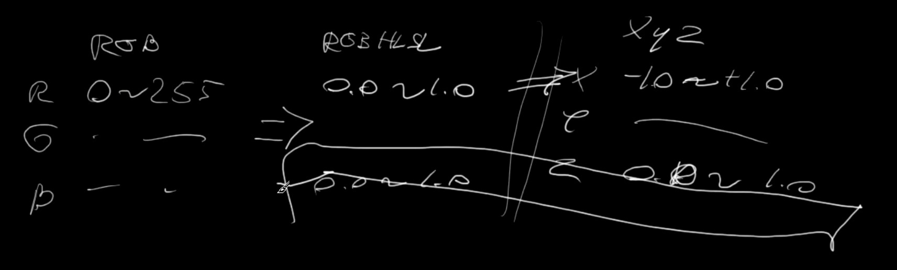

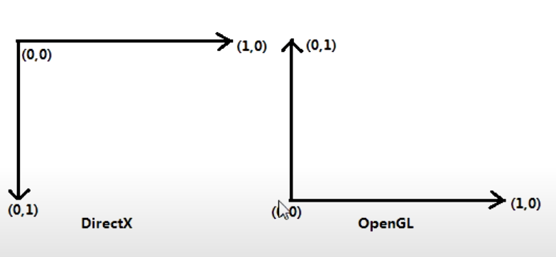

加上 Normal Map 视觉效果真的提升好大~

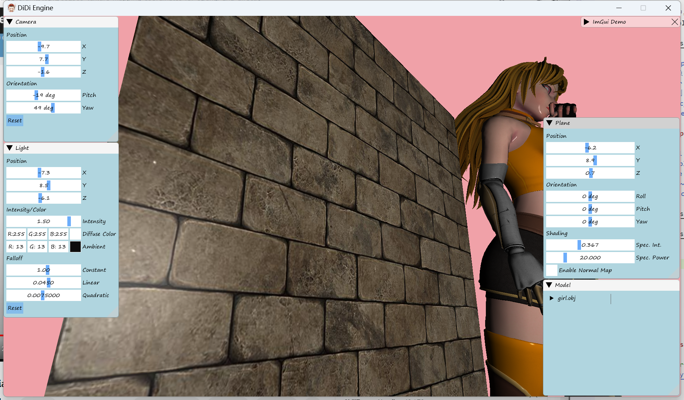

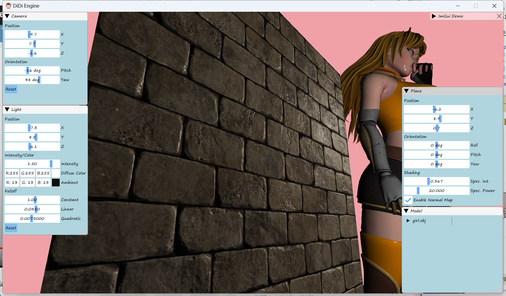

- 但是这里有一个问题，我们从 Vertex Shader 获取到的 Pos 是 view space，但是 normal mapping 得到的 normal 是物体的 object space，所以我们需要将 modelView、modelViewProj 矩阵也传入到 Pixel Shader 中
- 在使用 Object Space 的时候，对于一个立方体来说，单纯地转入物体的观察矩阵并不能体现每个面的法线关系，但是如果贴图用的同一张，那么算出来的法线就会有问题，所以我们需要 Tangent Space（TBN），将 TBN 变换到 view space，而且要记得 normal 需要归一化 normalize

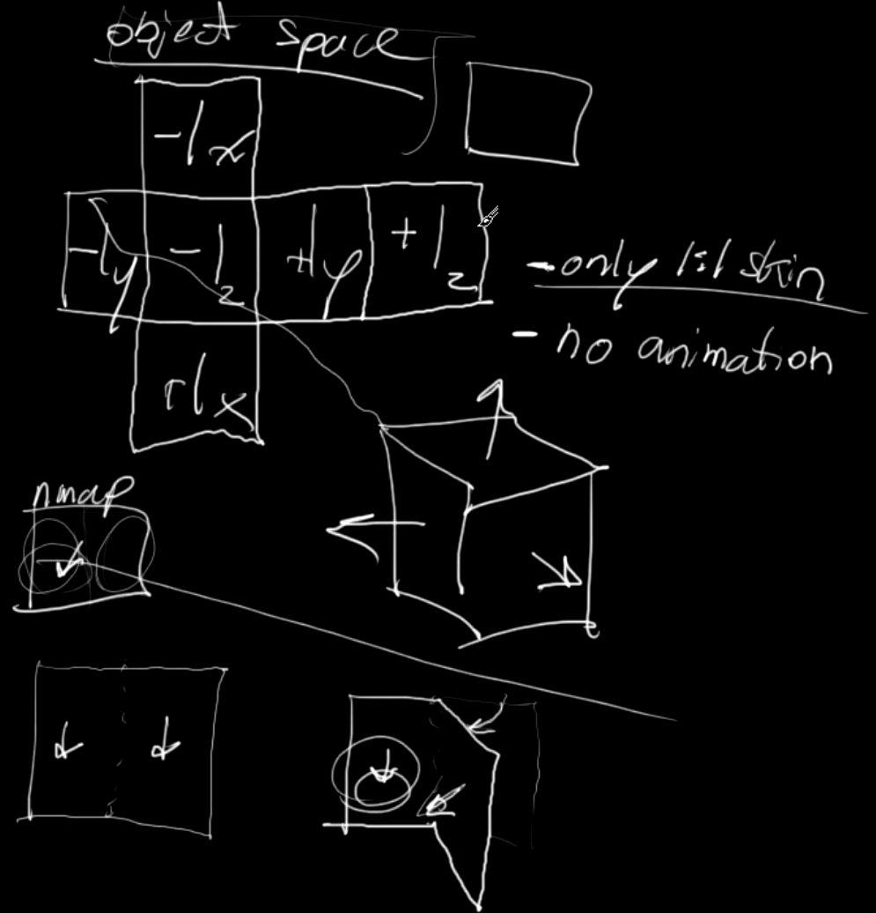

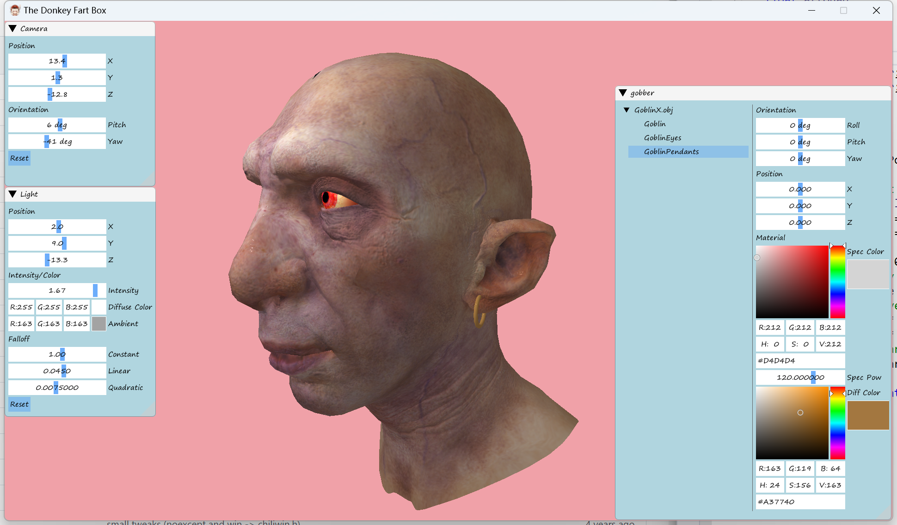

- CommandLineToArgvW 分析 Unicode 命令行字符串，并返回指向命令行参数的指针数组，以及此类参数计数
- std::tie 可用于解包 std::pair ，因为 std::tuple 拥有从 pair 的转换赋值；std::tie会将变量的引用整合成一个tuple，从而实现批量赋值

## Sponza Crytek Scene

- 终于知道了这个很经典的场景原来是叫 Sponza，导入生成我们的基础场景，好激动！看起来像模像样的，虽然效果上还差了很多~

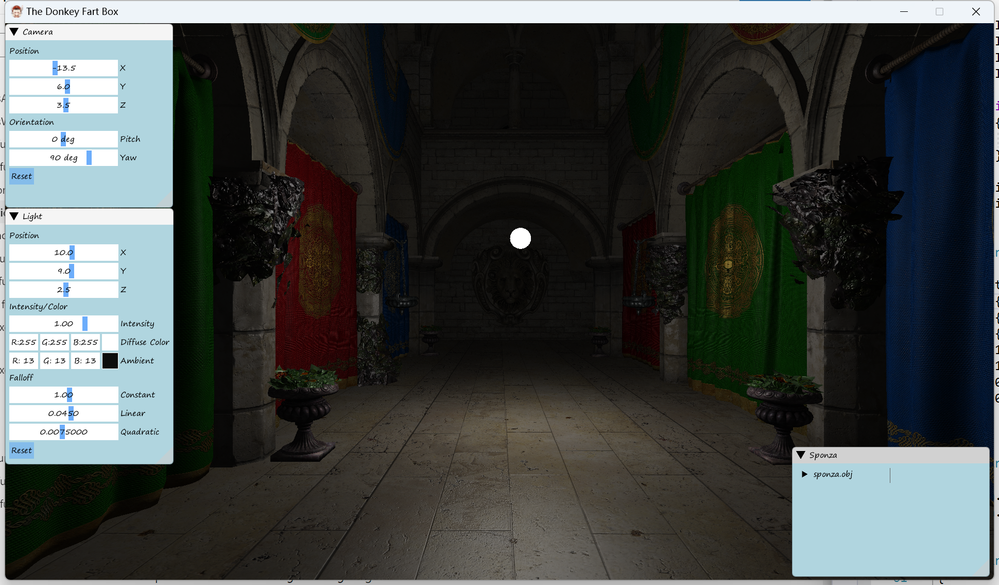

- 可以注意到，这个窗帘看上去会有很多奇怪的纹理，这是由降采样引起的的，当我们离得比较远时，采样点就会变稀疏，比如我们在看一个花丛，靠近时可以看到很多清晰的花，但是当我们远离时，可能就只能看到一团花草，颜色像混在一起了

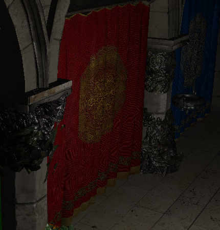

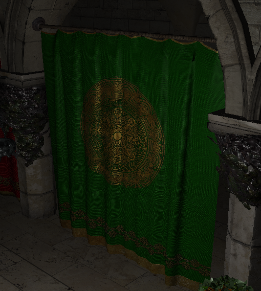

- 为了解决这个问题，需要用到 MipMapping，它通过将几块像素合并生成更小的采样图。使用 GenerateMips 生成 MipMap，同时 Sampler 也需要指定 LOD

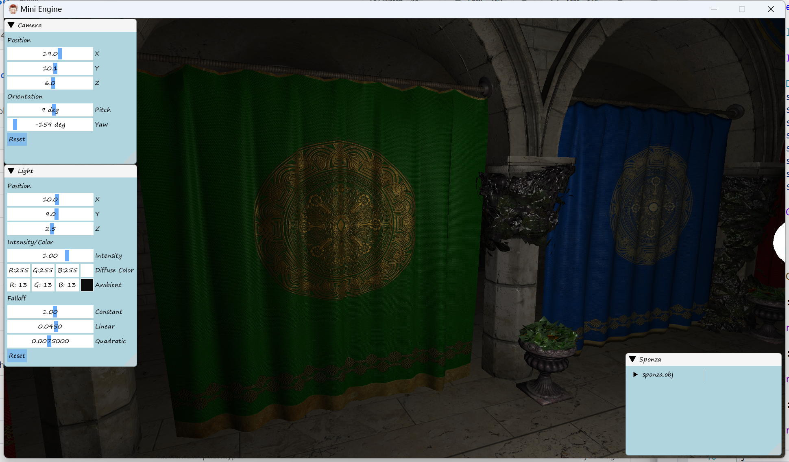

- 当我们的视角平行于地面时，我们会观察到地板好像变糊了，这也是由于采样造成的，在 y 轴，我们的 MipMap 可能已经采样到四级了，但是在 x 轴，我们其实应该按照一级采样，但是仍然采样的四级，所以就像被拉伸了一样有点糊，这个问题可以通过修改 Sampler 的 fliter 为 D3D11_FILTER_ANISOTROPIC 来解决

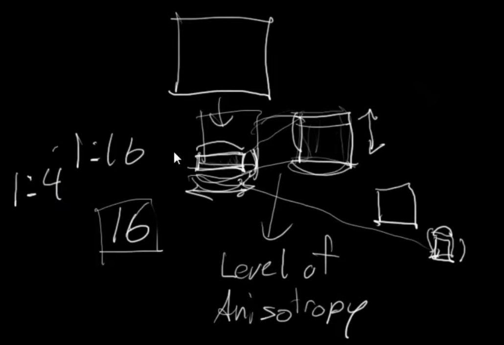

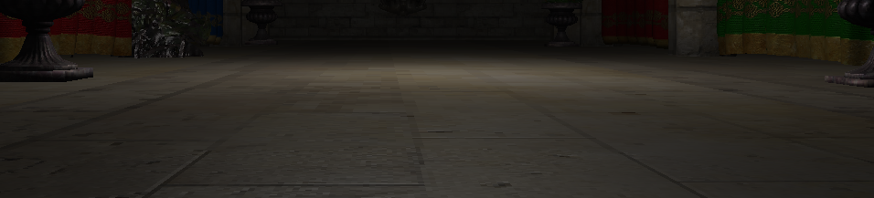

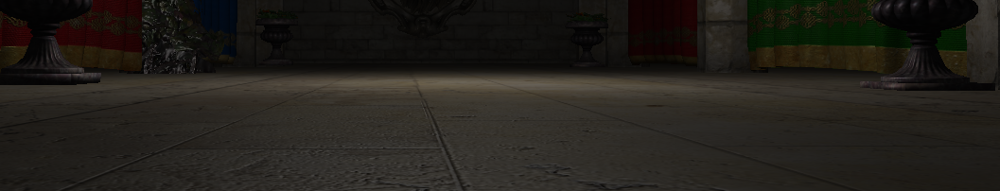

## Alpha Blending

- 添加一个 Bindable 类 Blender，保存一个 BlendState，使用 CreateBlendState 创建 BlendState，使用 OMSetBlendState 绑定
- 在绘制完全透明物体时需要做 alpha test，在 Pixel Shader 使用 clip 可以在值为负数时舍弃掉该片段的绘制，这里判断 alpha 小于 0.1 就舍弃掉，为什么不直接设为 1 呢，因为当相机较远时会有一些片段看不到了，这里猜测的原因是因为 MipMap 混合了，所以本来不透明的片段也变成透明的了

```GLSL
clip(dtex.a < 0.1f ? -1 : 1);
```

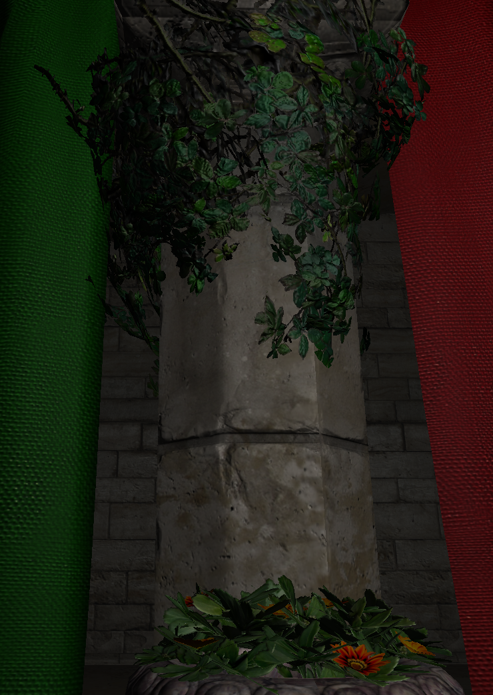

- 对于一些双面的物体，需要关掉 Backface Cull，这个阶段需要通过 Rasterizer 来控制，使用 CreateRasterizerState 创建一个 Rasterizer State，如果我们位于背面，那么视线方向和法线方向的 Dot 是大于 0 的，我们需要将 Normal 反向
- Shader 中也可以使用 #ifdef 
- 在做 Alpha 混合的时候需要注意绘制顺序，不然就会出现下面红色完全被蓝色遮盖的情况

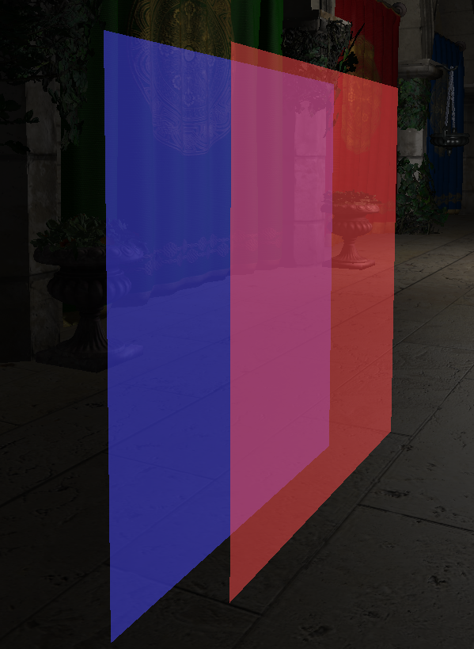

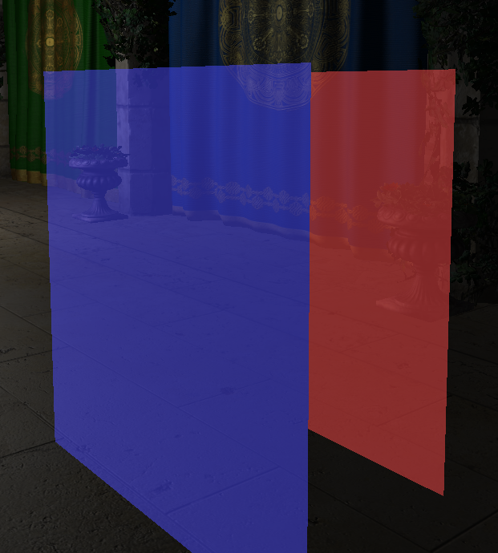

- 在之前的实现中，加载图片是很慢的，如果图片资源比较多，那么程序启动需要花费很长一段时间，这里可以用 DirectXTex 来加载纹理提升效率

## Dynamic Constant Buffer

- 作者构建了一个 Dynamic Constant Buffer，这样可以指定 Buffer 的类型和成员参数名，帮助灵活地构建 Buffer，Buffer 其实就是由两部分组成，一个是实际存储地 Bytes，可以有很多类型加上 padding，一个是数据的 layout，这个 layout 我们用一个树结构来表示，可以存储 struct 和 float、bool 等变量

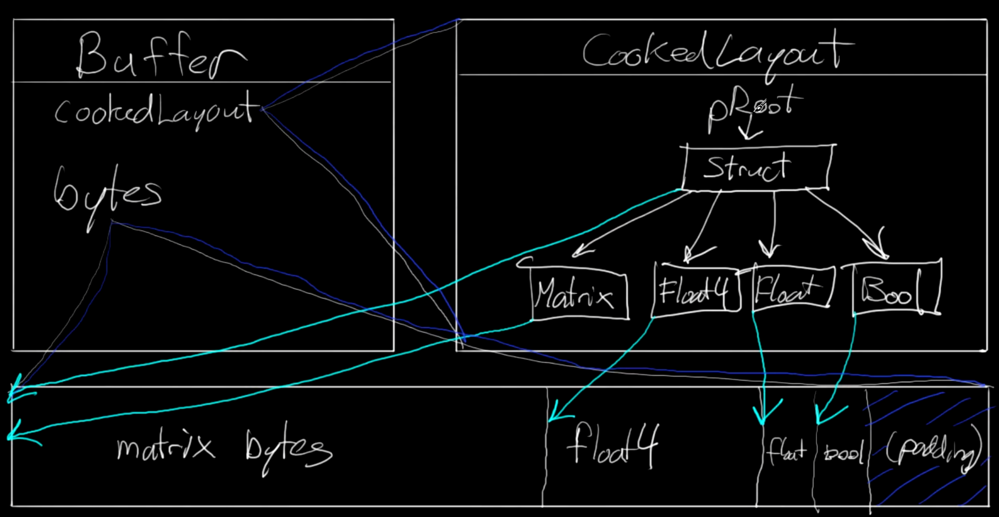

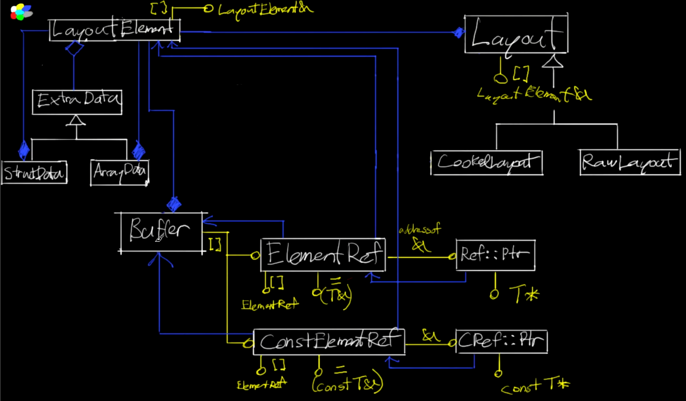

- static_assert 用来做编译期间的断言，因此叫做静态断言。如果第一个参数常量表达式的值为真(true 或者非零值)，那么 static_assert 不做任何事情，就像它不存在一样，否则会产生一条编译错误，错误位置就是该static_assert 语句所在行，错误提示就是第二个参数提示字符串。
- 这里学到了一种很巧妙的做法 XMacro List，如果有多种类型需要检验，可以先 define 一个 X(type)，但是这个时候 X 是没有定义的，在一些需要用的地方再 define X() 实现具体的功能

```C++
#define LEAF_ELEMENT_TYPES \
	X( Float ) \
	X( Float2 ) \
	X( Float3 ) \
	X( Float4 ) \
	X( Matrix ) \
	X( Bool )
#define X(el) static_assert(Map<el>::valid,"Missing map implementation for " #el);
LEAF_ELEMENT_TYPES
#undef X
```

## Stencil Buffer Outline Effect

- 描边的一个简单思路是先渲染基础物体，然后再渲染一个放大后的物体减去一个 Mask，这个 Mask 是基础物体

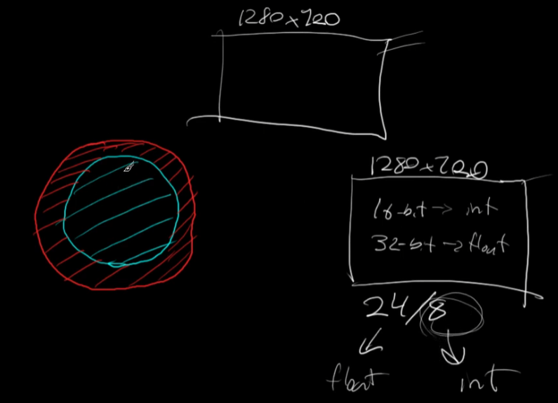

- 新建一个 Bindable 类，存储 DepthStencilState，有几种 Mode，当 Off 时就不管正常绘制，当 Write 时就将绘制的结果存起来，当 Mask 时就只绘制不等于 Write 的部分，因为这部分才是物体放大之后绘制的像素位置，这样就起到了 Mask 效果形成轮廓，主要就是通过设置 Depth Stencil State 的一些参数才决定对于一些像素的处理方法，不过这个方法会有一点 bug，当一些没有绘制边界的物体对 box 进行遮挡之后，因为 stencil buffer 还是原来的物体，但是这个时候绘制的像素已经不一样了，所以也会被处理成边界，这个问题需要用 RenderQueue 来解决

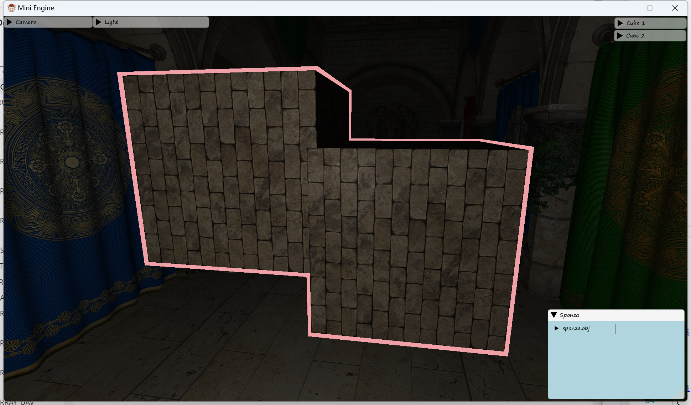

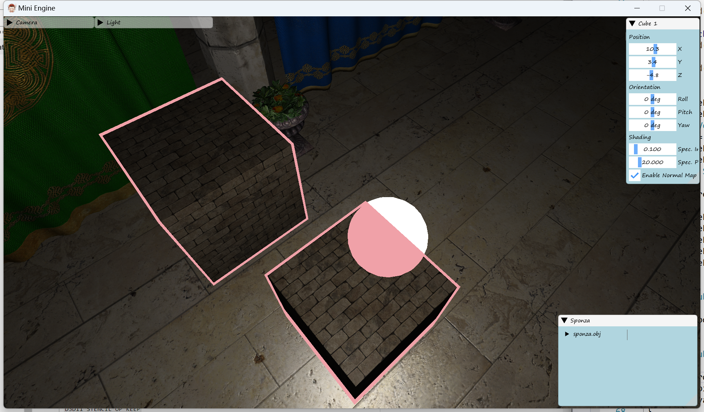

## Render Queue System

- 对于不同物体如果我们都要去写对应的一些效果，并且当前架构下会遍历整个场景树去一个一个调用渲染命令，那么会有大量冗余的工作，作者在这里提出了 Pass 的概念，对于不同的渲染目的，属于不同的 Pass，然后每个 Pass 有一系列 Job 需要完成，对于同一个 Mesh，顶点数据是一致的，不同的视觉效果可以看作多个 Tech，每个 Tech 下面有 Step，这些 Step 对应了一些 Job，这样我们执行渲染命令时就不需要遍历一遍场景了，直接执行 Pass 即可

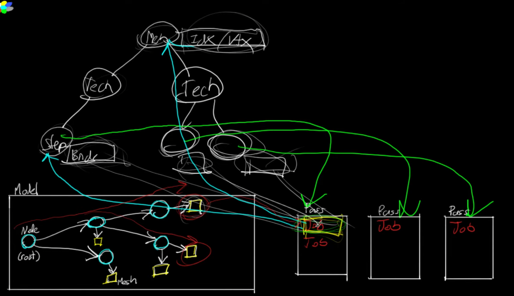

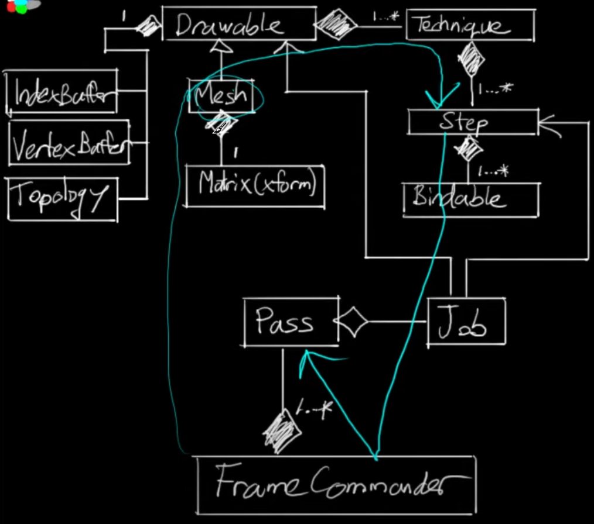

- 修改 Drawable，包含一组 Technique 列表，Submit 函数遍历所有 Technique
- Technique 包含一组 Step 和自身激活状态
- Step 包含一个对应的 Pass 编号和一组 Bindable
- FrameCommander 包含一组 Pass，可以 Accept 和 Execute
- Pass 包含一组 Job，可以 Accept 和 Execute
- Job 对应一个 Step 和 Drawable
- 同时为了让 UI 可以控制一个物体的 Tech，作者设计了一个 Visitor Probe / Static Bridge 机制，让 ImGui 的 Probe 对应到 Tech 上（太困了这部分我没太听懂，英语真的好烂 😴）这样就可以通过 UI 控制一个物体是否使用某个 Tech，以及调整 Tech 的参数

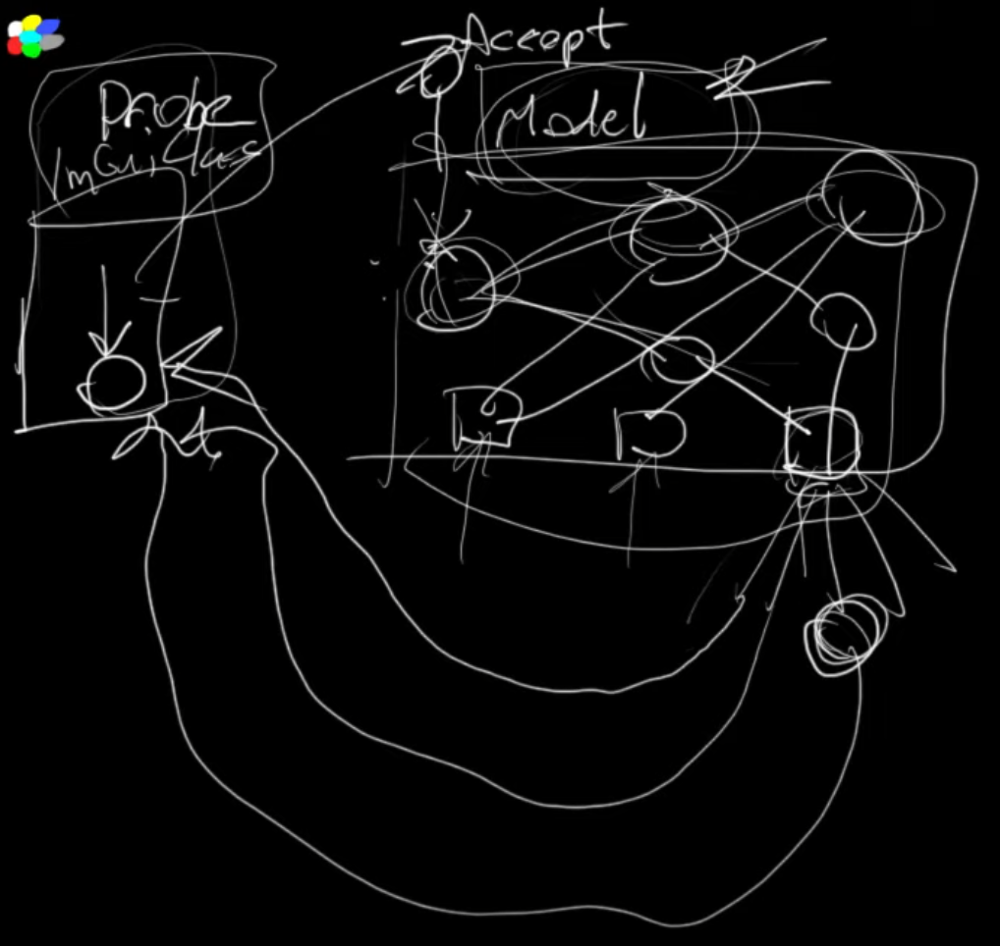

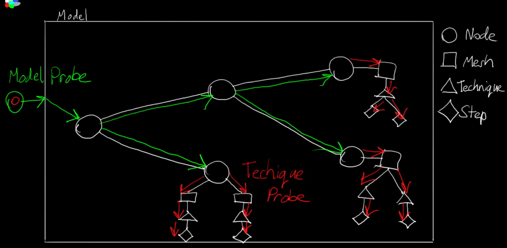

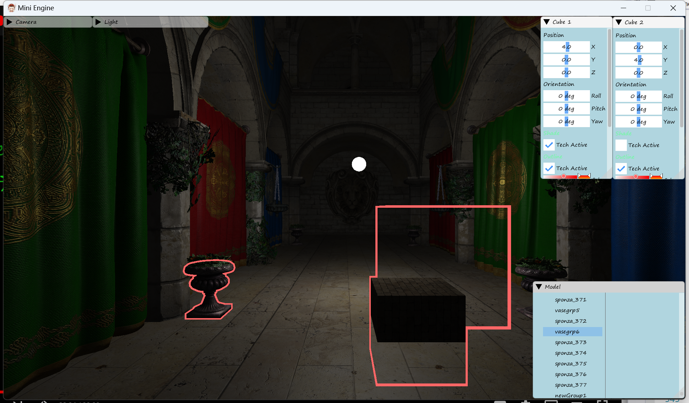

## 小结

利用 Assimp 加载模型，使用多种纹理可以带来视觉效果的提升，而且一个引擎的架构很重要，尤其是渲染特殊物体和效果，比如透明、描边等，设计一个 Pass Job 结构很巧妙。

## References

- [C++ 3D DirectX Tutorial [Cursor Hide / Cursor Confine]](https://www.youtube.com/watch?v=RQTBTfjs7GM&list=PLqCJpWy5Fohd3S7ICFXwUomYW0Wv67pDD&index=36)
