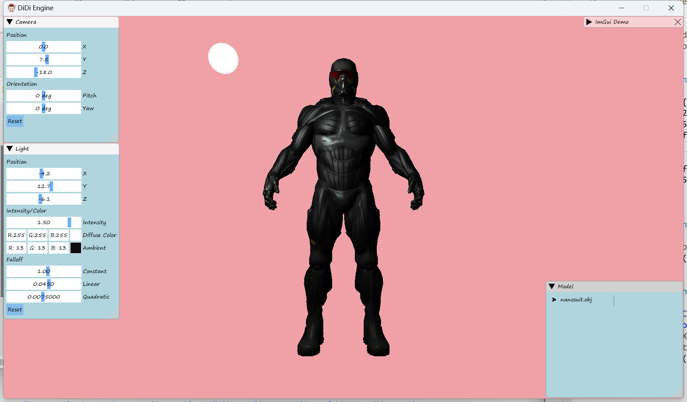
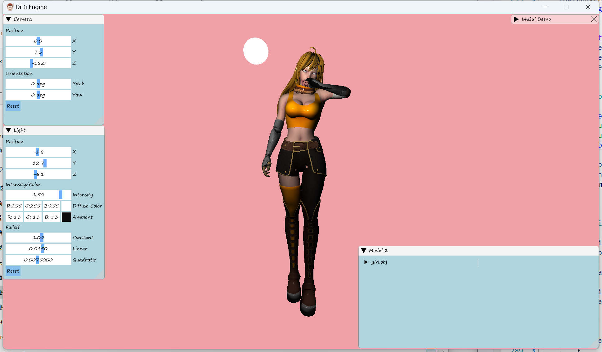
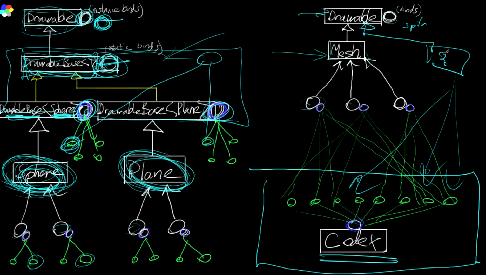

<!--more-->

## Cursor

- 使用 ::ShowCursor 显示或隐藏鼠标 维护了一个 count，当 count 大于等于 0 时会显示鼠标，小于 0 时隐藏鼠标
- 需要对 Imgui 的鼠标响应单独做处理，因为虽然窗口能看不到鼠标了，但是仍然能够和菜单交互，通过设置 ImGui::GetIO().ConfigFlags
- GetClientRect 获取窗口的坐标 rect
- MapWindowPoints 将 (映射) 一组相对于一个窗口的坐标空间的点转换为相对于另一个窗口的坐标空间
- ClipCursor 将鼠标限制在屏幕上的矩形区域内
- WM_ACTIVATE 当窗口切换到最上层会触发该信号
- 要接收鼠标点击事件，需要使用 RegisterRawInputDevices 将 mouse raw input device 进行注册
- 用 WM_INPUT 捕获鼠标点击事件，需要使用 GetRawInputData 获取一个 byte 数组数据

## Camera

- 提供移动、旋转操作，移动时需要朝着相机的正方向移动
- 使用 clamp 防止正上方正下方视角抖动
- 使用 XMMatrixLookAtLH 计算投影矩阵

## Material Loading

修改 Mesh 结构加载纹理，修改 Shader 显示纹理

- 在利用 Specular Map 计算高光时，计算公式为 specularPower = pow(2.0, 13.0 * shininessMap)

## Bindable Codex

在之前的架构中，相同类型的 Drawable 实例可能会公用一些 Bindable 对象，但是对于不同实例他们之间的 Bindable 是不共享的，所以我们添加上 CodeX 架构，让其存储 Bindable 对象，这样不管我们的绘制实例是什么，都可以去拿到一些自己需要的 Bindable

- 拥有一个 map 存储 bindable，每个 bindable 用唯一 string 标识，比较关键的点就是给 Bindable 对象生成唯一标识
- 单例，接口负责存取 bindable 对象
- 因为 Shader 是可以复用的，所以修改 VertexShader，将它的 typeid 和 name 作为唯一 id，添加 Resolve 方法，在 CodeX 中查找是否已经有该 Shader 对象，若无则加到 map 中
- std::static_pointer_cast 将 shared_ptr 指针进行静态指针类型转换，一般用在继承行为中，当子类想要获取父类中的一些属性时，将父类的 shared_ptr 转化为子类的 shared_ptr

## Normal Mapping

- 利用 Normal Mapping 可以在较低数量的面片模型上呈现更多细节

## 小结

## References

- [C++ 3D DirectX Tutorial [Cursor Hide / Cursor Confine]](https://www.youtube.com/watch?v=RQTBTfjs7GM&list=PLqCJpWy5Fohd3S7ICFXwUomYW0Wv67pDD&index=36)
