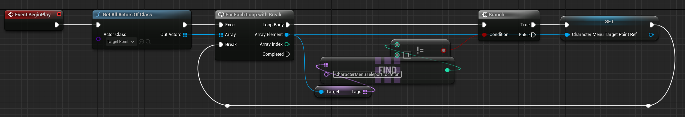
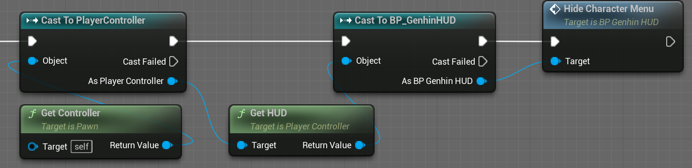
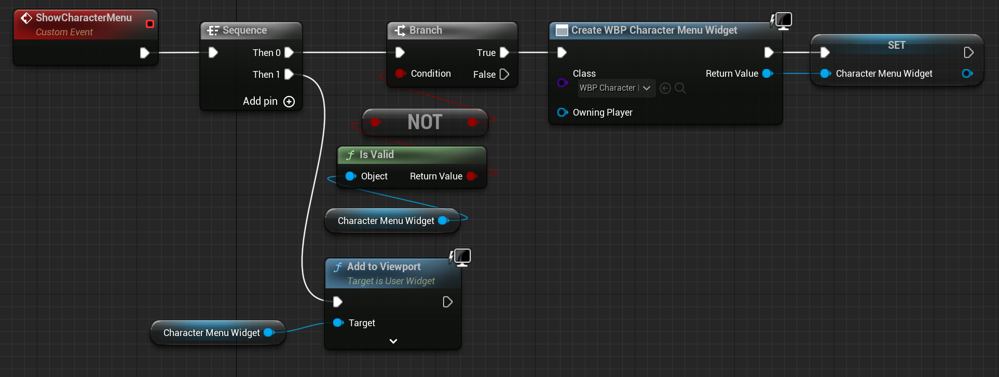
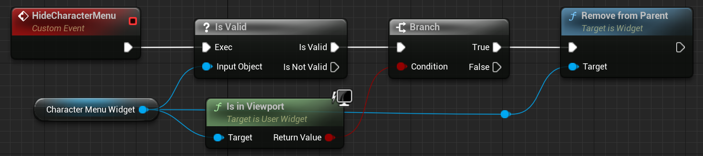
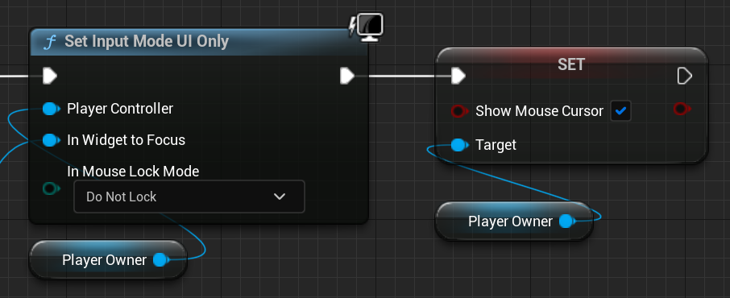
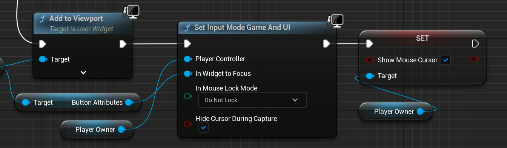
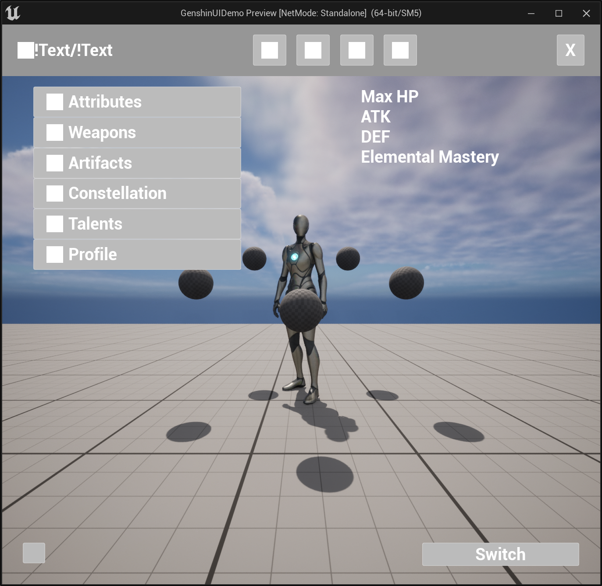
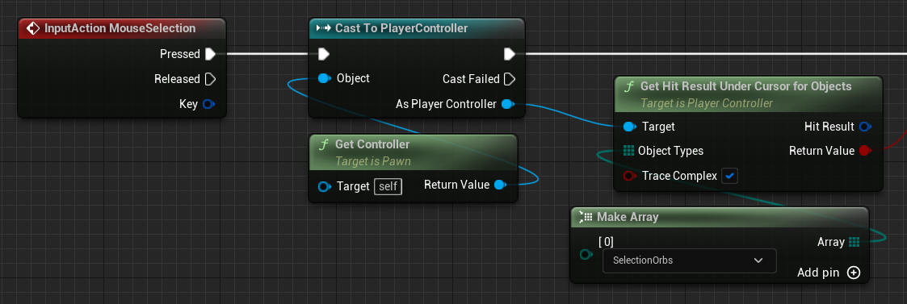

<!--more-->

## Project Setup

- 按住 Alt 移动是复制一份再移动，按住 Shift 移动是锁定相机到该物体移动
- 要获取场景中的特定物体，可以先设置 Tag，然后在 BeginPlay 的时候 GetAllActorsOfClass，然后 ForEachLoopWithBreak 遍历查找，使用 FindTag，如果返回的 index 不等于 -1，说明找到了一个，便可以将当前遍历到的值提升为变量存储该值

- 要获取当前的 GameMode，可以先使用 GetGameMode，然后 CastTo 自己的 GameMode 类，便可以获取该对象了
- Teleport 将当前角色传送到一个新的位置

- GetActorLocation GetActorRotation 获取 Actor 的位置和旋转
- 要启用禁用相机可以使用 SetActive
- 要修改角色的运动模式可以通过设置 CharacterMovement 的 MovementMode，如果设置为 None 则角色不用移动
- 设置菜单相机的逻辑：1. 设置按键触发和添加 Target Point 2. 在 GameMode 中根据 Class 和 Tag 获取目标位置 3. 在角色蓝图中如果按下or松开触发按键，利用 Teleport 设置角色位置、激活的相机、角色移动模式，保存上一时刻的位置等

## Classic UI

- 在 GameMode 中设置自定义的 HUD Class，Default Pawn Class 设置为自定义的角色控制蓝图
- 想要获取 HUD Class，首先 Get Controller，Cast To PlayerController，然后 Get HUD，Cast To 自定义的 HUD 蓝图即可，之后便可以调用 HUD 中的 Event

- 想要在窗口设置 UI，可以创建一个 Event，然后 Create Widget 选择创建的 User Widget，并将输出提升为变量，然后就可以使用该变量将其 Add to Viewport 进行显示，在创建前可以先判断一下该对象是否 isValid，避免重复生成

- 想要取消 UI，先判断 isValid，然后判断 is in viewport，最后 remove from parent

- 在菜单模式可以 Set Input Mode UI Only，在游戏模式可以设置 Set Input Mode Game Only，在 UI 模式还想要获取用户输入的话可以设置 Set Input Mode Game And UI，想要显示鼠标需要设置 Show Mouse Cursor，Get Owner Player 可以获得当前角色

- 可以将一些元素，比如按钮，单独做成一个 UserWidget，对于要变的量比如 TextBlock 可以勾选上 is variable，然后在 Event Pre Construct 进行设置 SetText
- 做这种 Classic UI 的主要逻辑就是创建 UserWidget，然后 Create 并 AddToViewport

## Special UI

- GetPlayerCharacter 获取当前角色
- 点击节点右键选择 CollapseToFunction，可以生成函数方便调用
- Vector 可以使用 Break Vector 拆分 x、y、z，节点的输入输出可以右键点击 Split 拆分
- Get PI 获取 Π
- SpawnActorFromClass 生成新的 Actor，AttachActorToActor 将 Actor 附加到 Parent Actor 上

- 创建物体时，如果需要赋值，需要将对应的 Variable 的 Expose on Spawn 和 Public 勾上，这样在 Spawn Actor 时可以传入参数
- 要想鼠标点击场景中的物体，首先添加 Action 使用鼠标左键，在蓝图中 GetController CastToPlayerController，然后 GetHitResultUnderCursorForObjects，就可以获取当前鼠标点击的物体了，对应碰撞物体，需要在 Project Settings 中添加碰撞通道，然后将物体的 Collision Channel 修改为对应的通道，在 GetHitResultUnderCursorForObjects 的 ObjectTypes 中，使用 MakeArray，传入对应的通道名称

- 在蓝图中添加的 Event Dispatchers，可以通过其他蓝图 Call 和 Bind Event to，这样每次 Call 的时候，Bind 的 Event 就会被调用

## 小结

## References

- [Developing an Interactive Menu in Unreal Engine 5](https://www.udemy.com/course/developing-an-interactive-menu-in-unreal-engine-5/)
- [[udemy] UE5中开发像原神一样的交互式菜单 | Developing an Interactive Menu in Unreal Engine 5](https://www.bilibili.com/video/BV1y24y1d7fZ/?p=1&vd_source=15731d796f21c97d03e9bebf33d05f55)