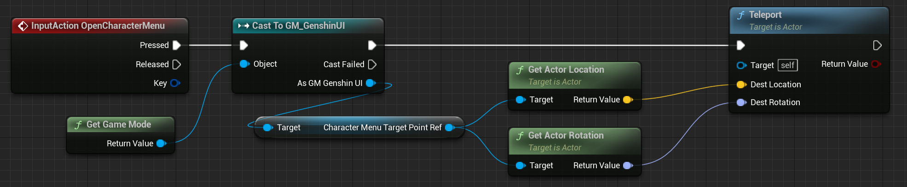
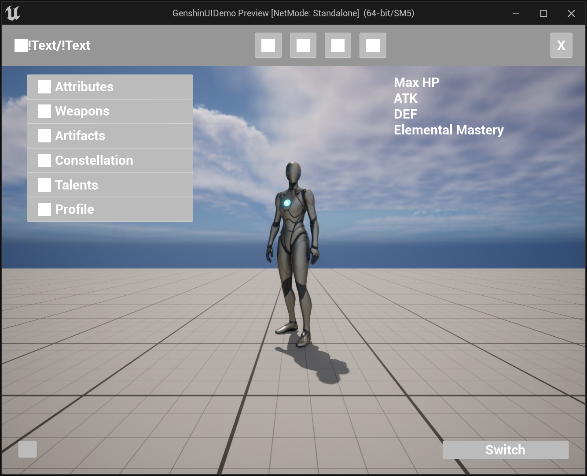
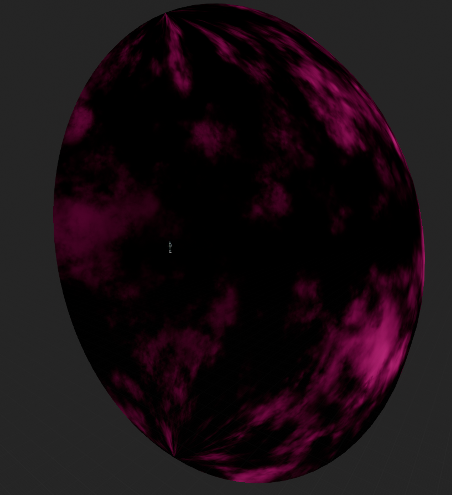
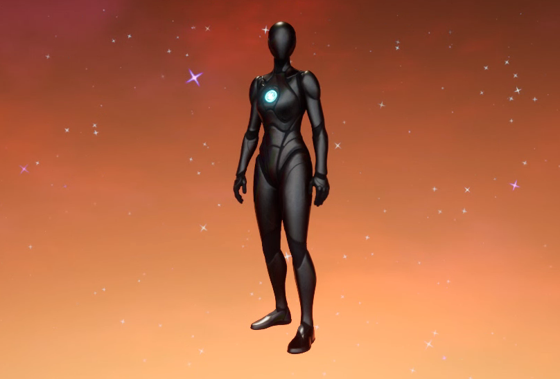

<!--more-->

## Project Setup

- 按住 Alt 移动是复制一份再移动，按住 Shift 移动是锁定相机到该物体移动
- 要获取场景中的特定物体，可以先设置 Tag，然后在 BeginPlay 的时候 GetAllActorsOfClass，然后 ForEachLoopWithBreak 遍历查找，使用 FindTag，如果返回的 index 不等于 -1，说明找到了一个，便可以将当前遍历到的值提升为变量存储该值

- 要获取当前的 GameMode，可以先使用 GetGameMode，然后 CastTo 自己的 GameMode 类，便可以获取该对象了
- Teleport 将当前角色传送到一个新的位置

- GetActorLocation GetActorRotation 获取 Actor 的位置和旋转
- 要启用禁用相机可以使用 SetActive
- 要修改角色的运动模式可以通过设置 CharacterMovement 的 MovementMode，如果设置为 None 则角色不用移动
- 设置菜单相机的逻辑：1. 设置按键触发和添加 Target Point 2. 在 GameMode 中根据 Class 和 Tag 获取目标位置 3. 在角色蓝图中如果按下or松开触发按键，利用 Teleport 设置角色位置、激活的相机、角色移动模式，保存上一时刻的位置等

## Classic UI

- 在 GameMode 中设置自定义的 HUD Class，Default Pawn Class 设置为自定义的角色控制蓝图
- 想要获取 HUD Class，首先 Get Controller，Cast To PlayerController，然后 Get HUD，Cast To 自定义的 HUD 蓝图即可，之后便可以调用 HUD 中的 Event

- 想要在窗口设置 UI，可以创建一个 Event，然后 Create Widget 选择创建的 User Widget，并将输出提升为变量，然后就可以使用该变量将其 Add to Viewport 进行显示，在创建前可以先判断一下该对象是否 isValid，避免重复生成

- 想要取消 UI，先判断 isValid，然后判断 is in viewport，最后 remove from parent

- 在菜单模式可以 Set Input Mode UI Only，在游戏模式可以设置 Set Input Mode Game Only，在 UI 模式还想要获取用户输入的话可以设置 Set Input Mode Game And UI，想要显示鼠标需要设置 Show Mouse Cursor，Get Owner Player 可以获得当前角色

- 可以将一些元素，比如按钮，单独做成一个 UserWidget，对于要变的量比如 TextBlock 可以勾选上 is variable，然后在 Event Pre Construct 进行设置 SetText
- 做这种 Classic UI 的主要逻辑就是创建 UserWidget，然后 Create 并 AddToViewport

## Special UI

- GetPlayerCharacter 获取当前角色
- 点击节点右键选择 CollapseToFunction，可以生成函数方便调用
- Vector 可以使用 Break Vector 拆分 x、y、z，节点的输入输出可以右键点击 Split 拆分
- Get PI 获取 Π
- SpawnActorFromClass 生成新的 Actor，AttachActorToActor 将 Actor 附加到 Parent Actor 上

- 创建物体时，如果需要赋值，需要将对应的 Variable 的 Expose on Spawn 和 Public 勾上，这样在 Spawn Actor 时可以传入参数
- 要想鼠标点击场景中的物体，首先添加 Action 使用鼠标左键，在蓝图中 GetController CastToPlayerController，然后 GetHitResultUnderCursorForObjects，就可以获取当前鼠标点击的物体了，对应碰撞物体，需要在 Project Settings 中添加碰撞通道，然后将物体的 Collision Channel 修改为对应的通道，在 GetHitResultUnderCursorForObjects 的 ObjectTypes 中，使用 MakeArray，传入对应的通道名称
- 创建这种三维的 UI 可以新建三维实体，然后利用 Spwan Actor 在设定的位置创建，鼠标点击使用 GetHitResultUnderCursor，需要提前设定好 Tag 和碰撞通道，然后添加响应时间，Dispatch 是一种很方便的通信方法

- 在蓝图中添加的 Event Dispatchers，可以通过其他蓝图 Call 和 Bind Event to，这样每次 Call 的时候，Bind 的 Event 就会被调用
- 给 UI 添加动画选择对应组件添加 Animation 即可，蓝图中使用 PlayAnimation，显示组件使用 Set Visibility，BindToAnimationFinished 在动画播完会触发
- Camera Lag 有过渡效果
- Set Actor Hidden In Game 隐藏对象

## VFX

- 要做天空带有随机云彩的效果，需要使用 Substance 创建一张 Noise 纹理，然后在 Maya 中新建一个半球作为角色面板的天空（我本来想在 Blender 中做一个类似的，但是不会上材质 /(ㄒoㄒ)/~~ 只好也下了个 Maya，Substance 也是节点工作流，好神奇哦）

- 注意到背景中越高处亮度约低越柔和，所以新建一个纹理从下往上由白变黑，然后需要将球体做成上下镜像的，这样就可以形成从中间往两边逐渐变暗的效果

- 为天空创建三种材质代表云彩的明亮、中等、阴暗的颜色，创建材质调整颜色

- 接下来为场景加上 Niagara 粒子系统，创建星星纹理，然后创建三个大、中、小的粒子发射器，在做粒子材质时添加 Dynamic Parameter 可以在粒子系统中修改

- Desaturation 节点用于去饱和度，将彩色图像转换为灰度图，VectorToRadialValue 函数将 Vector2 矢量转换为角度，或者将 UV 坐标数据转换为径向坐标。对于矢量，角度将在一个通道中输出，而矢量长度在另一通道中输出。
- 接下来做圣遗物容器的效果，首先是做一个外圈的纹理，有一点不规则的轮廓，其次在内部也有一些不规则的背景纹理。圣遗物的粒子系统主要由三部分构成，外圈、内圈背景、光晕，将做好的粒子系统拖到圣遗物蓝图中，注意如果要让粒子系统跟随物体一起运动，需要勾选上 Local Space。radial gradient exponential 节点返回径向梯度指数，可以用来淡化边界

- SpwanSystemAttached 可以生成粒子系统并附加到组件下，通过这个方法在选择某个圣遗物时生成点击粒子效果，点击的粒子效果由三部分构成：外圈、背景、小星星

## Styling the Widgets

- 接下来优化我们的菜单 UI，先看左边的菜单栏，主要有三种状态：Normal->Gray Text、Hovered->White、Click
- Ctrl + Backspace 在图层上填充背景色，按下 X 可以切换背景色和前景色，Ctrl + T 可以切换到位移模式，用于旋转等操作，Ctrl + J 可以复制图层，给按钮的背景换上我们在 PS 里面创建的背景

- Ctrl + Shift + Alt + E 为该图层添加上背景并新建一个图层，Ctrl + A 选中所有，Ctrl + Click 会创建 Mask，要设置按钮的不同的点击效果，只需要创建按钮的不同形态纹理，然后将其设置为按钮的 Appearance/Style 下的 Normal、Hover、Click 的材质即可

- 选择自己想要的字体，然后绑定按钮事件，设置字体的颜色，比如 OnHover 将颜色设置得更白，UnHovered 恢复灰色

- 然后来做上方的角色切换菜单，在 PS 中做一个背景圆和圆环框，然后做一些头像，如果要抠图需要先将图片栅格化，在 UE 中要使用多通道图片需要去掉勾选 sRGB，然后将头像框组合起来，主要是利用 Alpha 做 Lerp，然后分别取外圈、背景、角色头像组成头像框，将上方的按钮替换成新做的按钮

- ScaleUVsByCenter 可以缩放 UV，如果不想要平铺需要在纹理的 Tilling Method 选择 Clamp，这里学到的技巧是按钮在不同状态下有不同的纹理颜色等，那么就可以将这些纹理拆解开来，然后在材质中设置变量，控制不透明度和颜色等，就可以为按钮的不同状态设置不同材质了，只需要修改一下变量即可，按钮主要由四部分组成，外圈、背景、头像、横线，当选中某个角色时，就将背景和横线的不透明度设为 1，其他时候为 0

- Ctrl + E 合并两个 Layer

## 小结

## References

- [Developing an Interactive Menu in Unreal Engine 5](https://www.udemy.com/course/developing-an-interactive-menu-in-unreal-engine-5/)
- [udemy UE5中开发像原神一样的交互式菜单 | Developing an Interactive Menu in Unreal Engine 5](https://www.bilibili.com/video/BV1y24y1d7fZ/?p=1&vd_source=15731d796f21c97d03e9bebf33d05f55)