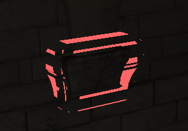
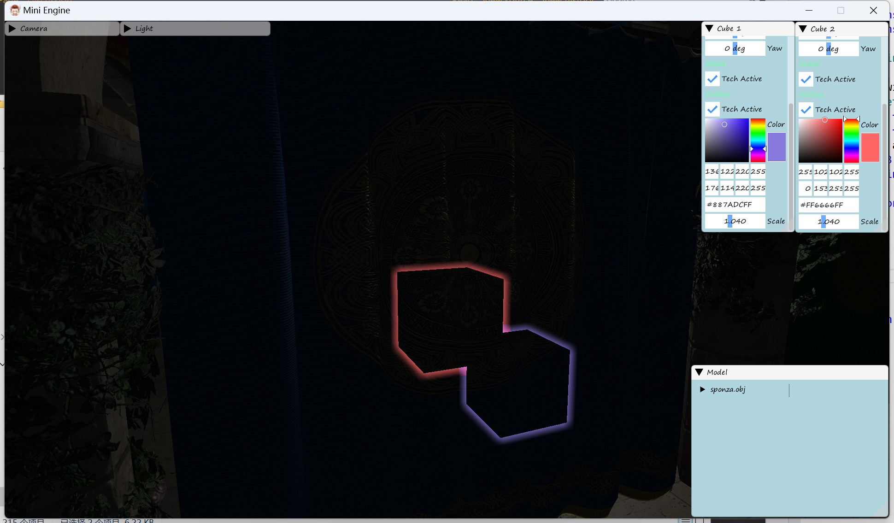
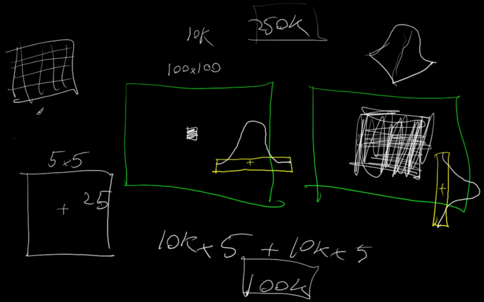
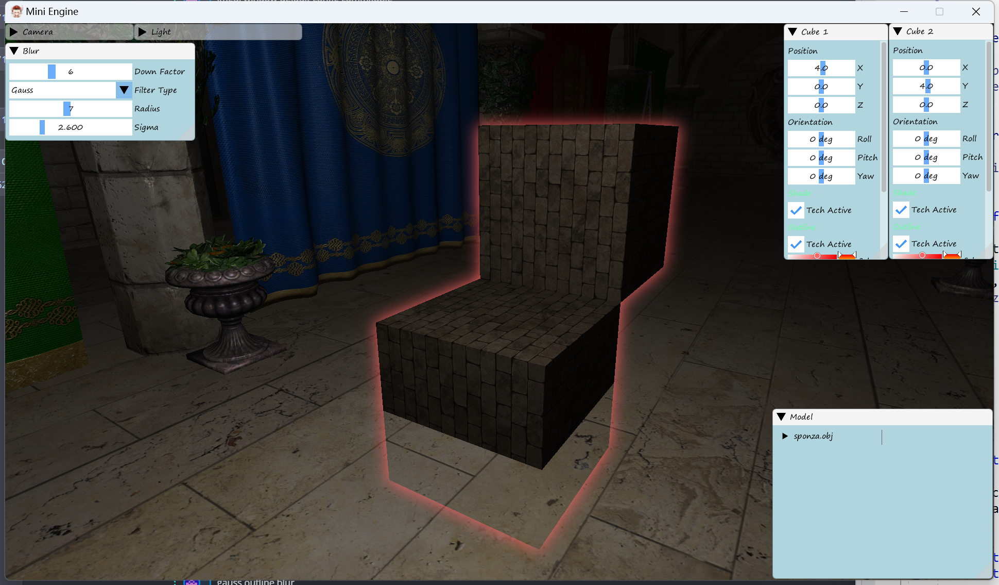
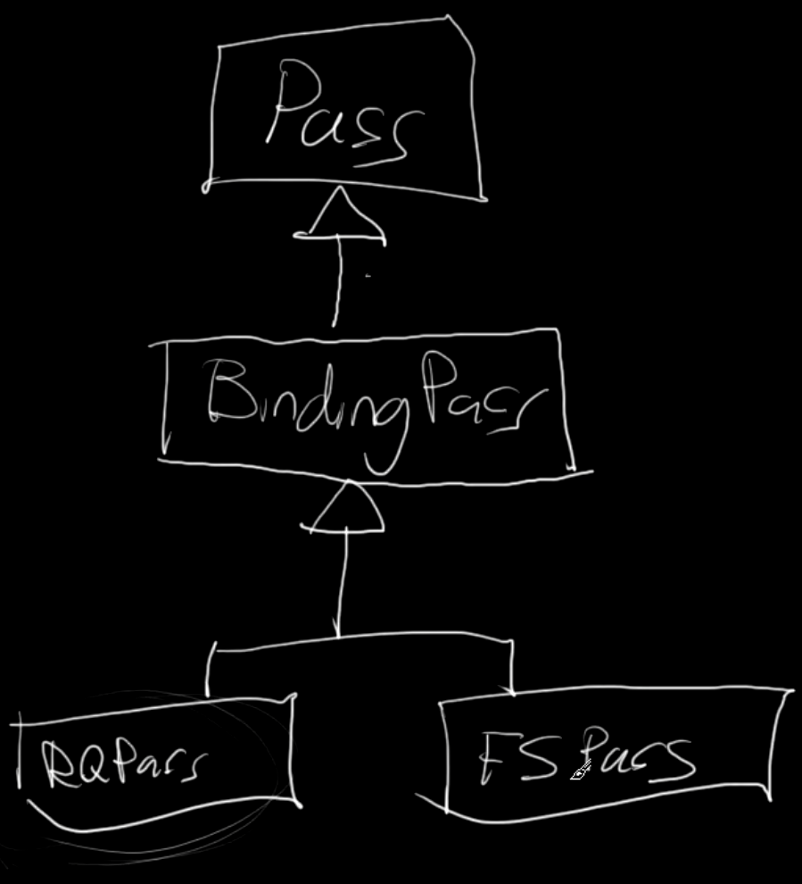
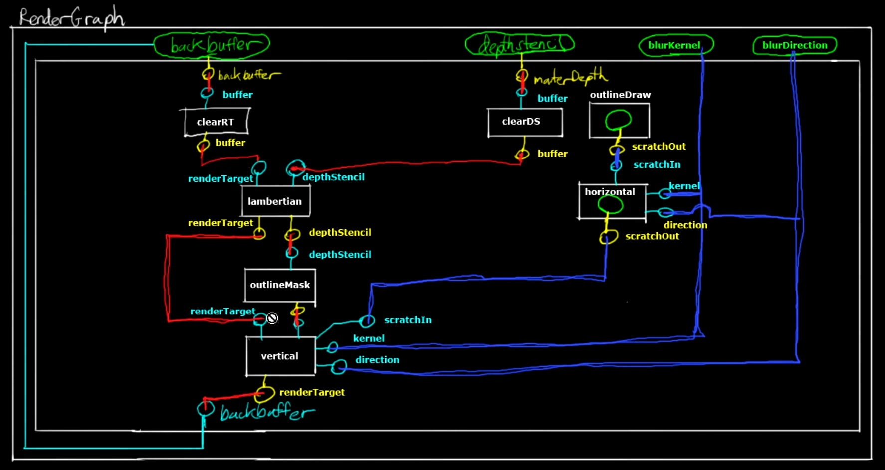

<!--more-->

## Fullscreen Filter Pass

- 在之前描边的实现中，通过将物体的顶点乘以一个 Scale 绘制，但是这样带来两个问题，一个是这要求顶点必须以物体中间为原点，这样放缩之后仍然沿着物体的轮廓，一个是对于一个边界菱角分明的顶点，放大之后顶点会错开形成错误的形状



- 滤波可以将一些尖锐的波、不平滑的波，过滤成更加平滑、连续的波，通过设置不同的 Kernel 达到不同的过滤效果
- 新建一个 RenderTarget 类，包含 ShaderResouceView 和 RenderTargetView
- GetDimensions shader 中获取图片的大小，简单的滤波算法就是将周围一个区域内的颜色求和取平均

```GLSL
for (int y = -r; y <= r; y++)
{
    for (int x = -r; x <= r; x++)
    {
        const float2 tc = uv + float2(dx * x, dy * y);
        acc += tex.Sample(splr, tc).rgba;
    }
}
return acc / divisor;
```


- 也可以调整 Pass 设置，将模糊效果应用到描边上



- 我们之前的滤波核是 box，但是照理来说不同距离的像素的贡献度是不同的，常用的能表现这种关系的是高斯滤波


- 我们可以将一个滤波核拆成水平和垂直方向分别做，这样可以大幅减少采样数量





## Render Graph

- Pass 含有唯一的名字，含有一组 sinks 和 sources，关键包含 execute、registersink、registersource
- BufferClearPass 含有一个 Buffer，execute 负责清除 buffer
- RenderQueuePass 含有一组 jobs，execute 分别调用所有 job 的 execute
- LambertianPass 生成资源 rendertarget 和 depthstencil
- BindingPass 含有一组 binds
- FullscreenPass 负责 full screen 效果的 pass
- OutlineDrawingPass 绘制轮廓线
- RenderGraph 结构含有所有 pass、source、sink，以及 rendertarget、depthstencil
- BlurOutlineRenderGraph 含有 blurkernel 和 direction






## 小结

## References

- [Fullscreen Filters (Blur Filter) [C++ 3D DirectX Tutorial]](https://www.youtube.com/watch?v=y2dJ28cq4Is&list=PLqCJpWy5Fohd3S7ICFXwUomYW0Wv67pDD&index=54)
- [Image Kernels](https://setosa.io/ev/image-kernels/)
