<!--more-->

## Water Shader

- 使用自带的 Single Layer Water，调整吸收的颜色

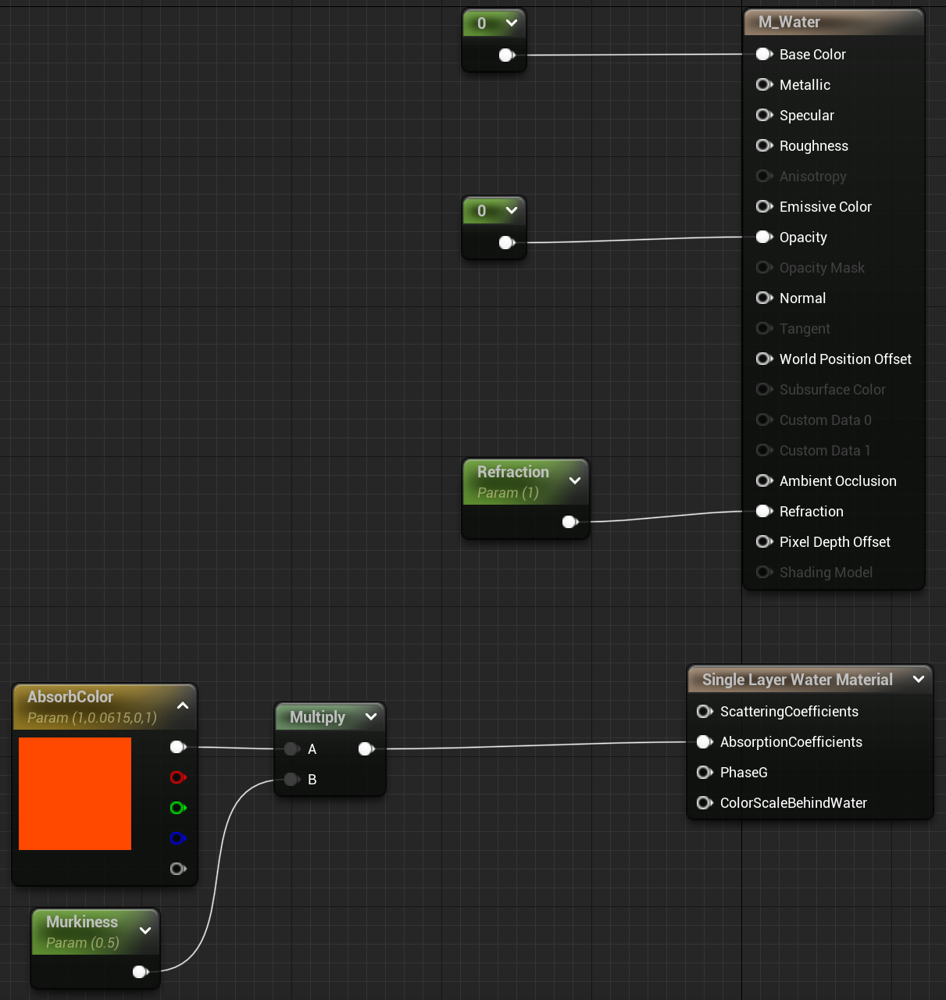

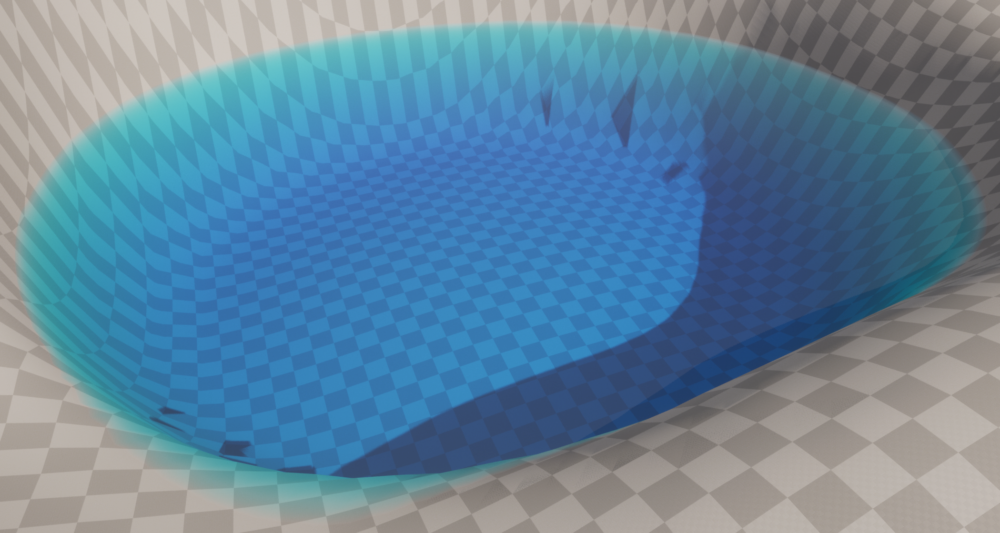

- 水的波动通过动态 Normal 实现，对 Water Normal Texture 进行采样，使用 Panner 调整 UV，法线贴图的混合叠加不能直接相乘Multiply，而应该使用 BlendAngleCorrectedNormals 节点

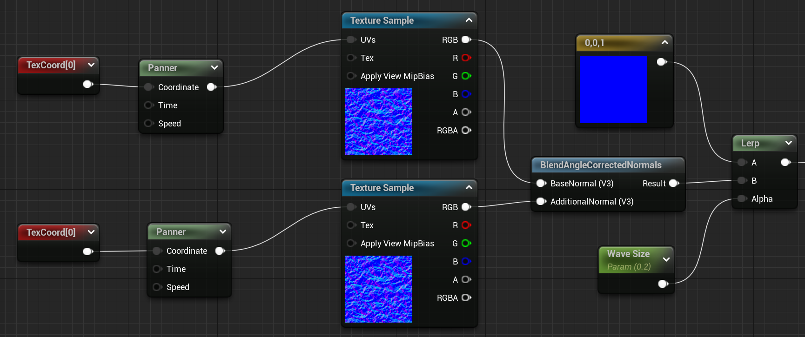

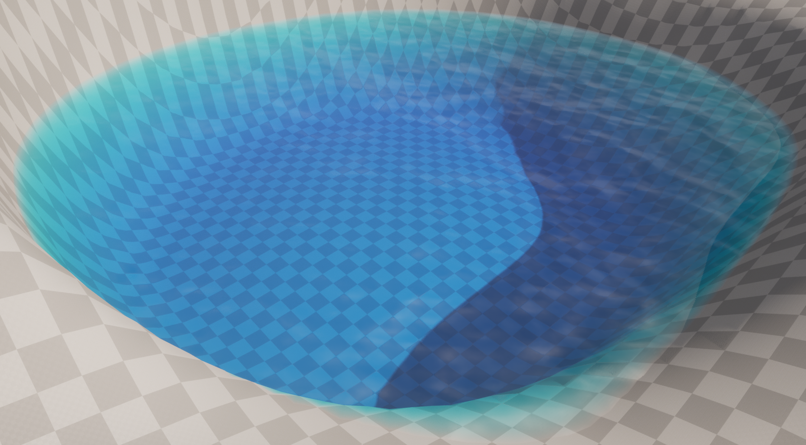

- 水有折射效果，通过调整 Refraction 来实现

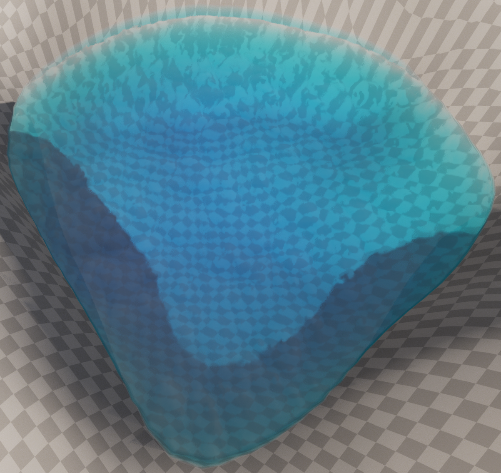

## Cel Shader

- 卡通材质的关键就是分色块，根据事先设定好的阈值决定输出的颜色，新建后处理材质，将 PostProcessInput0 和 DiffuseColor 做灰度并 divide，如果该值大于设定的阈值，那么输出 DiffuseColor，否则输出预先设定的系数乘以 DiffuseColor

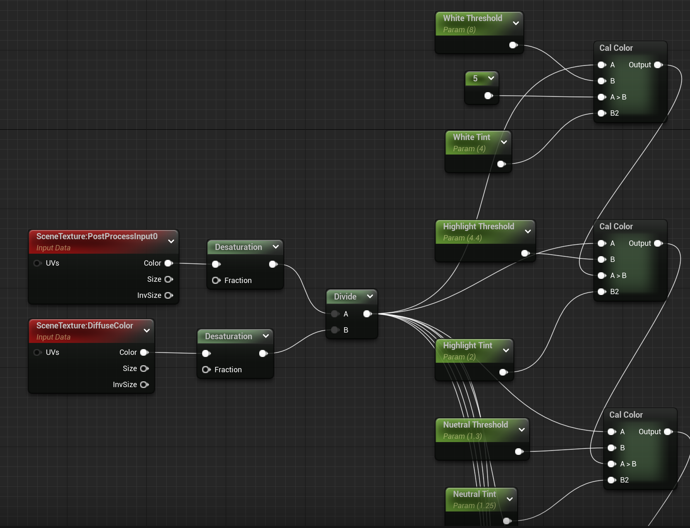

- 然后将计算出来的颜色进行灰度转换，作为系数乘以 PostProcessInput0，如果需要筛选出不使用 cel shader 的物体可以使用 custom depth 判断

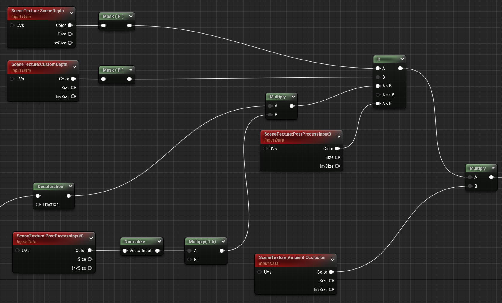

- 默认的 Shading 和 Cel Shading，在默认的光照渲染模式下，光照颜色是有渐变效果的，而开了 Cel Shading 之后色块会更加明显，边界更明显，这种方法适用于比较简单的物体，并且材质本身就要偏卡通才可以，不然看不出明显的效果

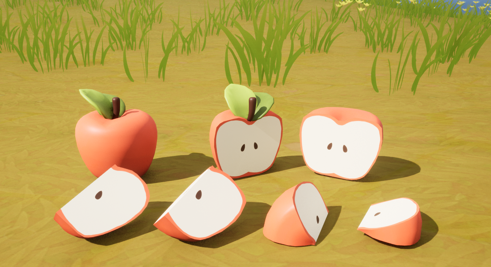

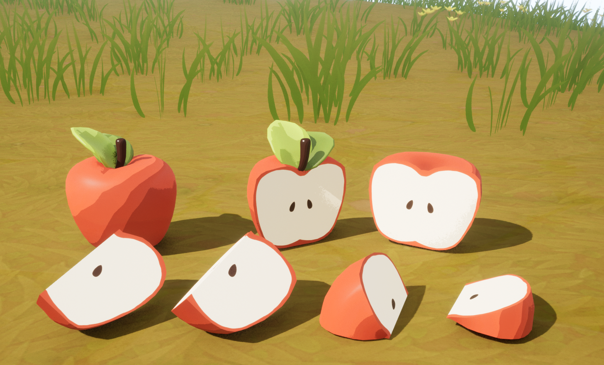

## Ink Painting

- 水墨材质最关键的是 Fresnel 节点，将突起的部分描边，其他地方按照纹理颜色作为 alpha 从预先设好的颜色中采样，FlattenNormal 用于调整法线强度，为了模拟笔刷的效果还可以加上 noise

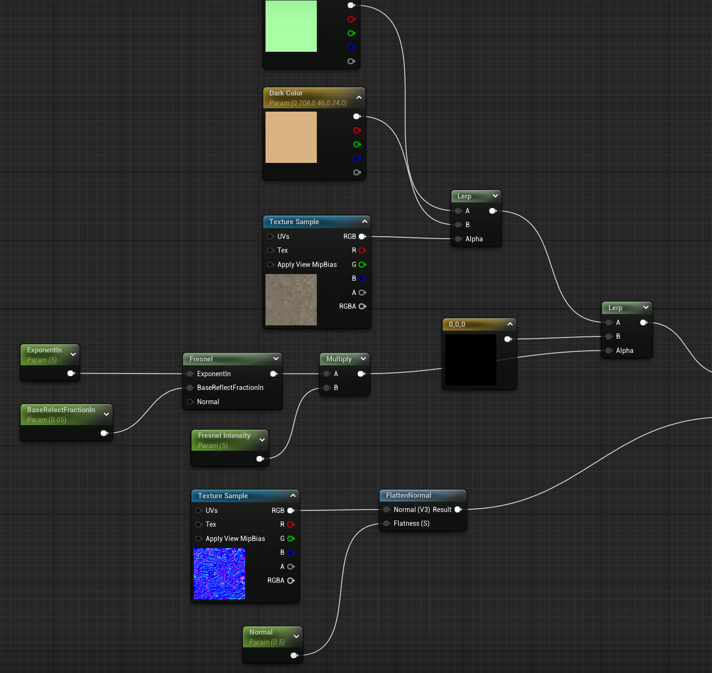

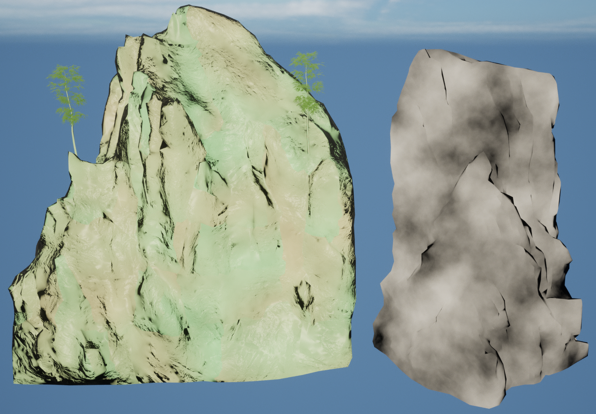

## Forest Landscape

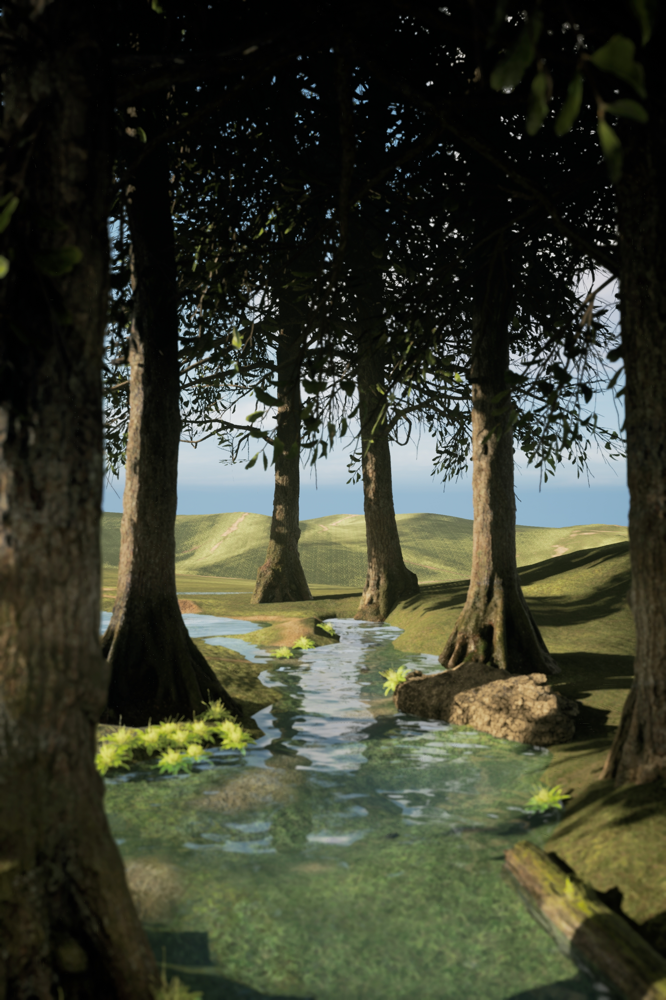

## Winter Landscape

- slopemask 常用来生成雪材质，根据传入的 Normal 生成 mask，然后作为 alpha 混合原材质和雪材质

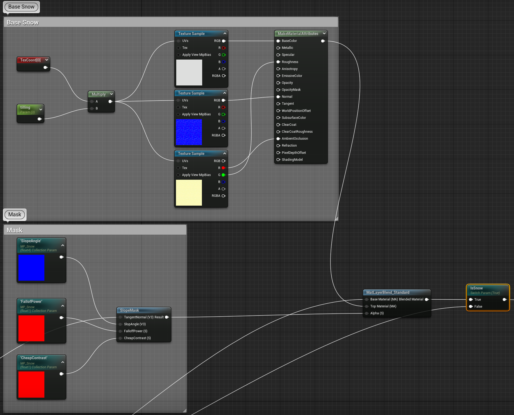

## 小结

## References

- [your first water shader](https://www.youtube.com/watch?v=kXH1-uY0wjY)
- [How to create forest in Unreal Engine 5 Lighting, landscape, foliage Exterior in Unreal Engine](https://www.youtube.com/watch?v=8KZh41yR1_Y)
- [Advanced Cel-Shader in UE4 & UE5 Prismati-Cel Part 1](https://www.youtube.com/watch?v=RkFwe7JI8R8&t=15s)
- [UE教程）萌新教你在UE4中制作一个风格化水墨场景](https://www.bilibili.com/video/BV1SP4y1b76D)
- [How to make winter landscape in Unreal Engine 5 Materials, light, snow weather Exterior in UE](https://www.youtube.com/watch?v=AMNbiXHI5E4)
- [Unreal Engine 5 Beginner Tutorial - UE5 Starter Course 2022](https://www.youtube.com/watch?v=k-zMkzmduqI&list=PLKPWwh_viQMGQkQfKKD5lF96efA3_RWt-)
- [Cinematic Winter Landscape In UNREAL ENGINE 5 Unreal Engine Tutorial](https://www.youtube.com/watch?v=X_c2bxqp8qg&t=2040s)