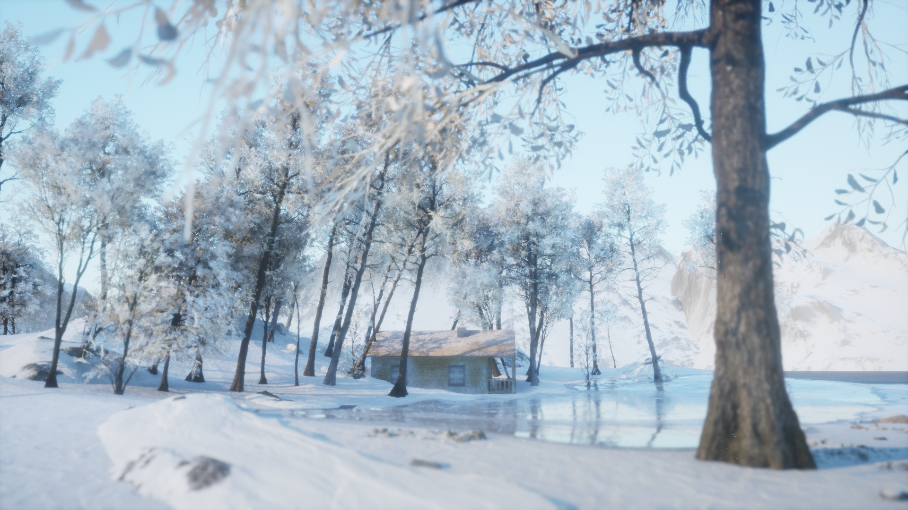

<!--more-->

## Water Shader

- 使用自带的 Single Layer Water，调整吸收的颜色

- 水的波动通过动态 Normal 实现，对 Water Normal Texture 进行采样，使用 Panner 调整 UV，法线贴图的混合叠加不能直接相乘Multiply，而应该使用 BlendAngleCorrectedNormals 节点

- 水有折射效果，通过调整 Refraction 来实现

## Cel Shader

- 卡通材质的关键就是分色块，根据事先设定好的阈值决定输出的颜色，新建后处理材质，将 PostProcessInput0 和 DiffuseColor 做灰度并 divide，如果该值大于设定的阈值，那么输出 DiffuseColor，否则输出预先设定的系数乘以 DiffuseColor

- 然后将计算出来的颜色进行灰度转换，作为系数乘以 PostProcessInput0，如果需要筛选出不使用 cel shader 的物体可以使用 custom depth 判断

- 默认的 Shading 和 Cel Shading，在默认的光照渲染模式下，光照颜色是有渐变效果的，而开了 Cel Shading 之后色块会更加明显，边界更明显，这种方法适用于比较简单的物体，并且材质本身就要偏卡通才可以，不然看不出明显的效果

## Ink Painting

- 水墨材质最关键的是 Fresnel 节点，将突起的部分描边，其他地方按照纹理颜色作为 alpha 从预先设好的颜色中采样，FlattenNormal 用于调整法线强度，为了模拟笔刷的效果还可以加上 noise

## Forest Landscape

## Winter Landscape

- slopemask 常用来生成雪材质，根据传入的 Normal 生成 mask，然后作为 alpha 混合原材质和雪材质

## Landscape Material

- 做一个基础的地形材质，首先就是定义好单独的一层材质，定义一个系数放缩 Landscapecoords，然后 makematerialattributes

- 然后将多种地形材质 blend 输出即可

## GIS Open World

- 从 https://earthexplorer.usgs.gov/ 选择区域下载高层图
- 将 .bil 文件导入 TerraSculptor，需要修改 Tools/Settings/Dimensions 为 UE，Modify/Resample 选择合适的尺寸，然后导出为 .png

- UE 中新建地形，导入生成的高度图，用了 OpenLand 的材质，看上去还可以

- 我觉得有一个问题需要考虑的是那边把导航数据发过来的时候我这边怎么对应到 UE 上面，而且那边还可能是发网格而不是发具体坐标，但是那么大一个地图他们要怎么编号呢？而且我这边还需要明确 UE 中怎么划分一个地形的网格，我觉得我这边需要跟他们明确的是：1）地图范围 2）网格坐标系 3）.bil 格式的高度图，以及其他 GIS 数据（能用 global mapper 打开的格式也行）
- 这种方式单纯做做草地、山脉啥的都可以，不过做城市不太合适，还是需要自动生成城市建筑等，不过应该也不会在那种地形上，所以我还需要那边多给我一个参数是地形类型，比如草地、沙地、水坑等
- 那么接下来需要实现的时候大地图位置的切换，类似于传送的方式，做好一些地形将我的车辆初始化到对应的地形区域
- 好懵逼呀这地形材质刚才还是正常的，现在变成了这样，啥也没改呢，有点纳闷，新建了一个项目用了同样的地形高度和材质就一切正常...感觉 OpenLand 里面隐藏着许多坑...接下来需要看看自动地形材质怎么弄好看，以及多个地形动态加载，要用到 Sublevel，还有天气也要看看怎么弄更好看

## 小结

这篇东西很杂，主要还是巩固了一下 UE 的材质系统和地形系统吧，接下来重点攻破地形的一些问题。

## References

- [your first water shader](https://www.youtube.com/watch?v=kXH1-uY0wjY)
- [How to create forest in Unreal Engine 5 Lighting, landscape, foliage Exterior in Unreal Engine](https://www.youtube.com/watch?v=8KZh41yR1_Y)
- [Advanced Cel-Shader in UE4 & UE5 Prismati-Cel Part 1](https://www.youtube.com/watch?v=RkFwe7JI8R8&t=15s)
- [UE教程）萌新教你在UE4中制作一个风格化水墨场景](https://www.bilibili.com/video/BV1SP4y1b76D)
- [How to make winter landscape in Unreal Engine 5 Materials, light, snow weather Exterior in UE](https://www.youtube.com/watch?v=AMNbiXHI5E4)
- [Unreal Engine 5 Beginner Tutorial - UE5 Starter Course 2022](https://www.youtube.com/watch?v=k-zMkzmduqI&list=PLKPWwh_viQMGQkQfKKD5lF96efA3_RWt-)
- [Cinematic Winter Landscape In UNREAL ENGINE 5 Unreal Engine Tutorial](https://www.youtube.com/watch?v=X_c2bxqp8qg&t=2040s)
- [1: Import Real Landscapes into Unreal in under 30 minutes using Houdini and real world DTM data](https://www.youtube.com/watch?v=9v_7OmgNzIA)
- [『UnrealEngine数字孪生』开发流程浅析(持续更新）](https://zhuanlan.zhihu.com/p/336501817)