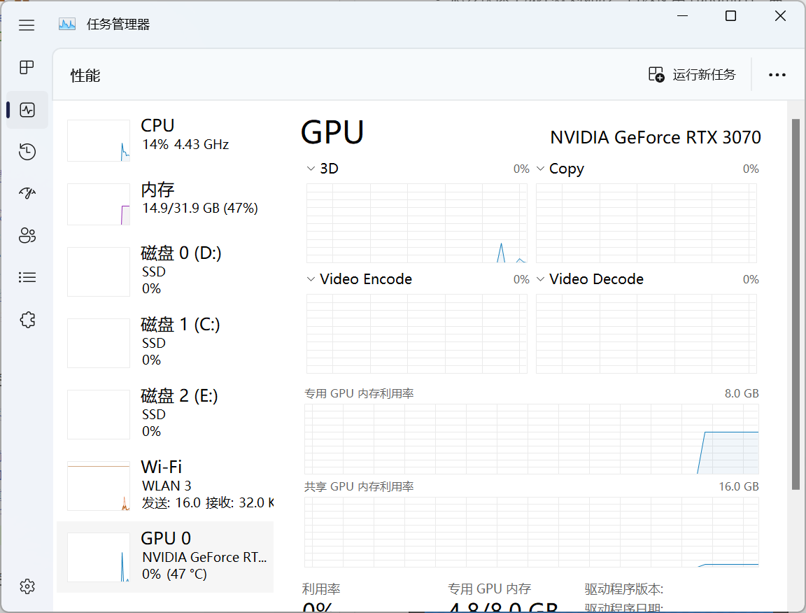

<!--more-->

## OpenLand

- Openland 提供了自动地形材质，看起来还不错，可以调整很多参数
- 想要快速生成不规则地形，可以使用 Landmass，需要首先开启 landscape 的 edit layer，然后在 sculptor 中选择 blueprint 添加，可以在 PaitLayer 中添加地形 Layer 混合，创建 Layer 时需要选择 non-weight
- 要想添加草地，只需要在 GT_Ground 中添加想要的草 mesh 即可，说实话好漂亮，这么好用的插件为什么才 100 star！Remove Grass Layer 可以取消绘制草地

- 地形材质贴图也是可以修改的，同时还提供了 Smart Mask 可供修改 Mask 范围以生成植被
- 我有一点好奇，我想打开一个看起来并不复杂的树木资源，但是这个 loading 始终卡在 100%，可能 10 分钟都没有动静，还重启过 UE 和电脑也不行，在 UE 下遇到这个问题很多次了，打开一个东西死活打不开，但是电脑明明处于负载很低的状态，有点好奇这是什么原因？

- 使用 Openland Blend 可以利用 RVT 做材质混合
- 开启 RVT 可以提升性能
- 创建道路需要新建 Layer 添加 Splines，按住 Ctrl + 鼠标左键添加路径点

- 新建自己的材质 Layer 需要新建 Material Function，然后添加 Layer Blend
- 不知道发生了什么草地变成了这样，像是开启了什么优化，但是不记得有开过这个设置，而且第一次打开 UE 时还是正常的，之后就不对了，没 run 的时候草地也是正常的，run 起来就不对了。好像是我开了 Hardware Ray Tracing，关掉就很正常，好奇怪。

- RunTime Virtual Output 可以拿来做 Layer Blend，新建 RVT Volume 写入 RVT Material 和 RVT Height，在需要混合的物体材质中添加 OpenLand RVT Blend With Attribute 节点即可和地形混合材质
- 其他材质要添加脚印效果需要将 Base Color、Normal、Roughness 写入 OpenLand RVT Prepare Output 和 Runtime Virtual Texture Output，Read Openland Deform Data 生成新的 Normal 和 Height
- OpenLand RVT Sample 输出的 ShowGrass 作为草材质的 Opacity Mask 可以隐藏一些不想要的草

## Ultra Dynamic Weather

- 利用这个插件可以添加晴天、下雨、雷雨、下雪、沙尘暴、雾天等天气，很强，还可以实时修改地形材质，以及为角色添加粒子效果
- 要添加天气支持，需要在 OpenLand 材质中添加 UDW Support 节点，以及添加 RVT Invalidator

- Change Weather 节点可供在蓝图中修改天气，也可以设置随机天气
- 雪地自带了 Trail 效果，但是我没有找到可以自定义 Trail 形状的，用了它的雪地就不能用 OpenLand 的脚印了，感觉可能会有问题

## 小结

## References

- [Open Land & Unreal Engine - Landscape Basics](https://www.youtube.com/watch?v=s9w_WapqTLg&t=211s)