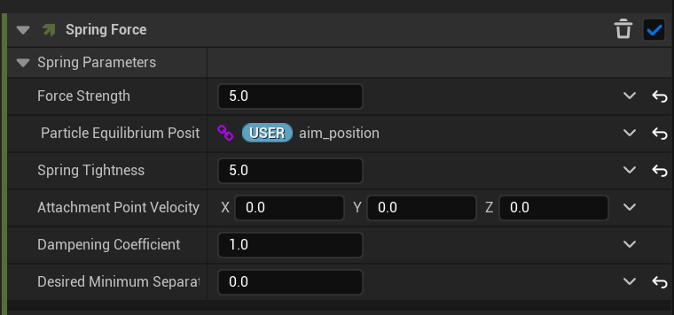
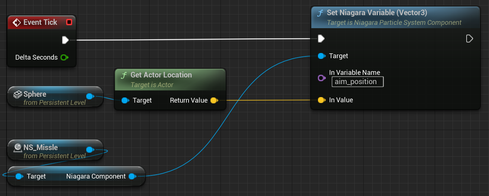
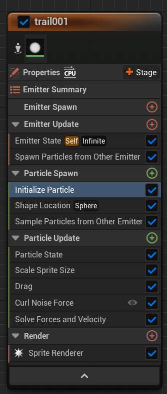
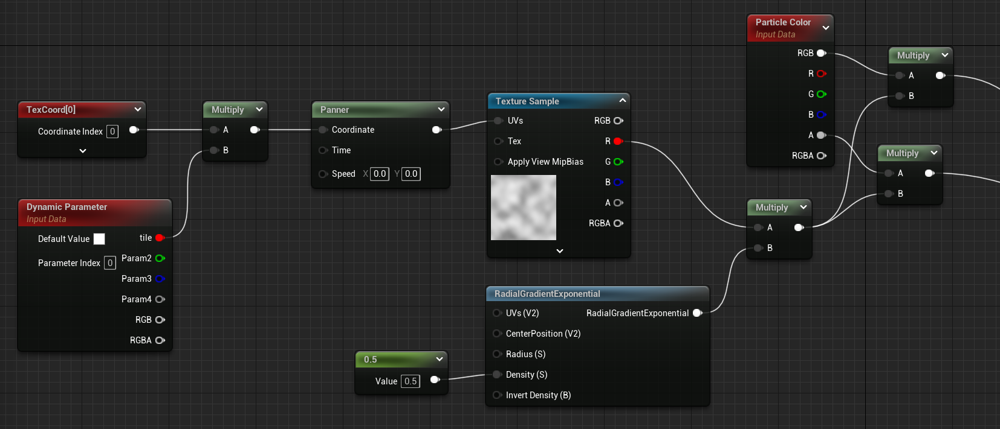
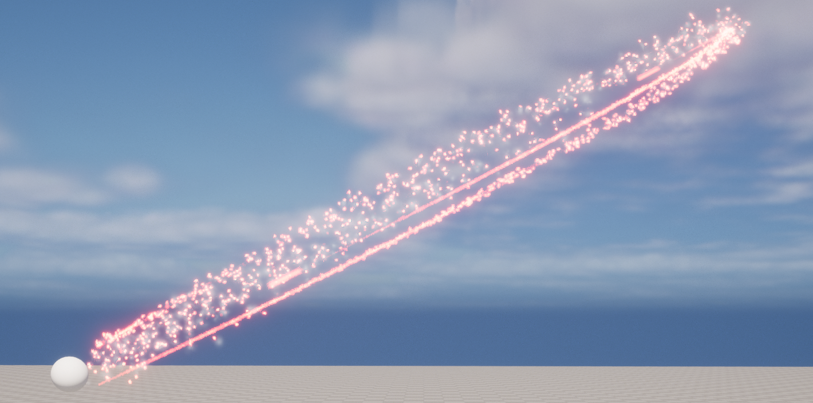
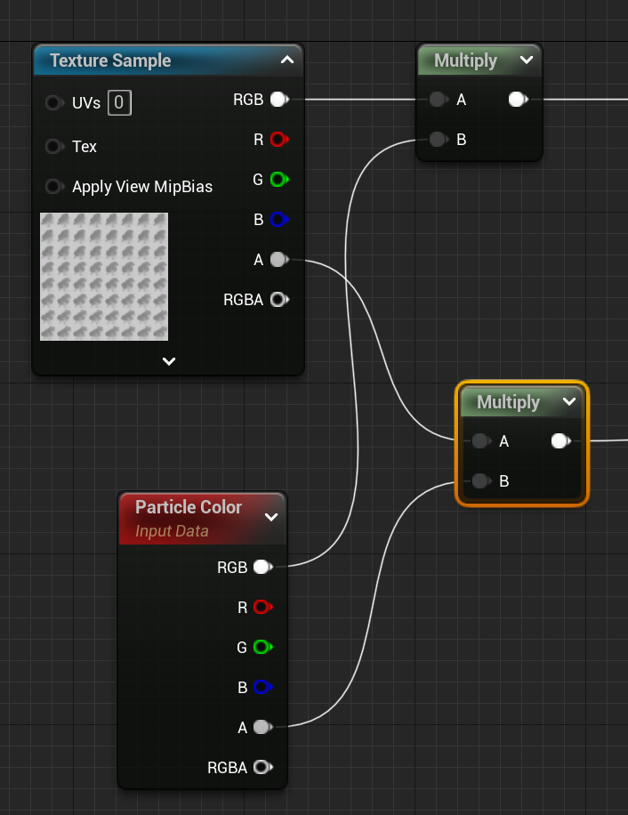
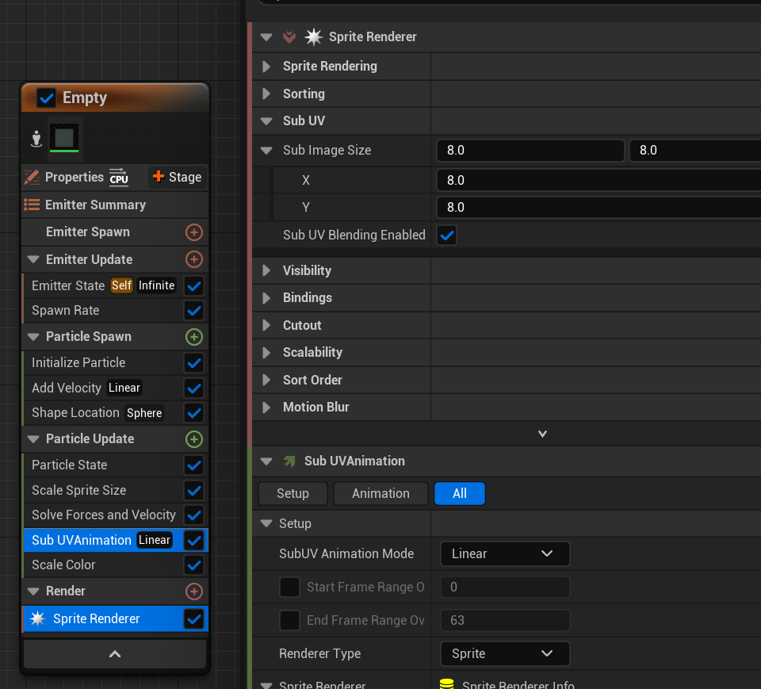
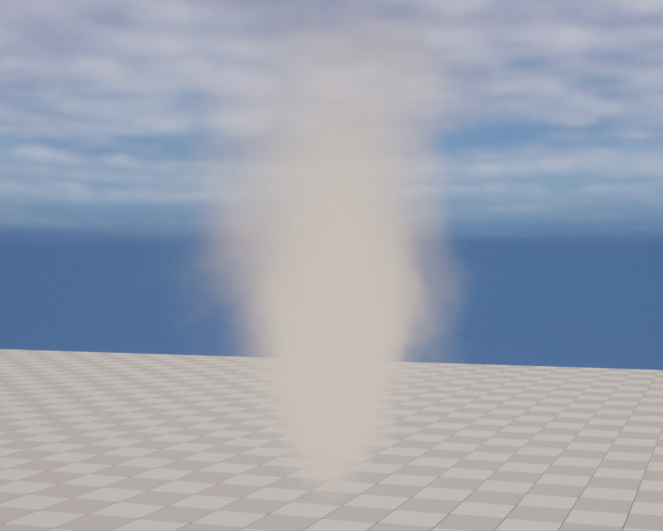

<!--more-->

## Missle

- 说实话我有点迷茫怎么弄这个干扰弹效果，没查到有效的参考教程，总感觉差了点意思，烟雾的飘动和体积渲染效果，都太死板了，以及不同类型干扰弹的特征不是很明确
- 还是先学习一下其他做的特效的思路吧，说不定对于干扰弹的效果能有一些启发
- 要做一个点吸引粒子的效果，可以在 Particle Update 中添加 Spring Force，Particle Equilibrium Position 就是吸引粒子的点，右键参数选择 user parameter 可以创建用户参数

- 要在蓝图中使用场景中某物体，可以直接 ctrl c 然后右键创建 reference
- 要修改 Niagara 中的 user parameter，只需要使用 set niagara variable，然后输入对应的变量名即可

- Spwan particles from other emitter 可以用来做拖尾效果，从其他的粒子发射器中采样生成新的粒子形成拖尾效果，kill particles in volume 用来在指定位置处消除粒子

- dynamic parameter 可以拿来在 niagara 调整 material 参数
- 要用材质做一个烟雾效果，可以是采样一个 noise 贴图

- 一个基于 Fountain 的粒子效果，粒子被 sphere 吸引，并且会在粒子处生成拖尾和烟雾，好像和预想的效果不太一样

## Smoke

- 导弹较亮处我觉得就用 Fountain 系统发射很亮的粒子应该就可以，关键的一个是烟雾怎么做的比较真实
- 做烟雾最关键的其实就是 smoke texture，这里新建一个材质，从一张存有很多烟雾动画序列的纹理中采样

- 然后在 sprite renderer 中设置 subuv 的数量，以及添加 Sub UVAnimation

## 小结

## References

- [Missile Shooting Aim in UE5 Niagara Tutorial | Download Files](https://www.youtube.com/watch?v=h2KqkygqPNU&t=617s)