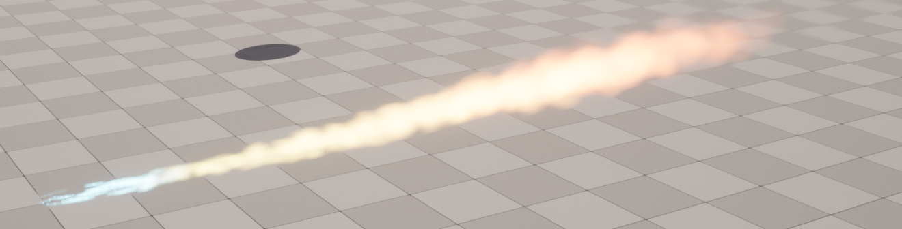

<!--more-->

## Missle

- 说实话我有点迷茫怎么弄这个干扰弹效果，没查到有效的参考教程，总感觉差了点意思，烟雾的飘动和体积渲染效果，都太死板了，以及不同类型干扰弹的特征不是很明确
- 还是先学习一下其他做的特效的思路吧，说不定对于干扰弹的效果能有一些启发
- 要做一个点吸引粒子的效果，可以在 Particle Update 中添加 Spring Force，Particle Equilibrium Position 就是吸引粒子的点，右键参数选择 user parameter 可以创建用户参数

- 要在蓝图中使用场景中某物体，可以直接 ctrl c 然后右键创建 reference
- 要修改 Niagara 中的 user parameter，只需要使用 set niagara variable，然后输入对应的变量名即可

- Spwan particles from other emitter 可以用来做拖尾效果，从其他的粒子发射器中采样生成新的粒子形成拖尾效果，kill particles in volume 用来在指定位置处消除粒子

- dynamic parameter 可以拿来在 niagara 调整 material 参数
- 要用材质做一个烟雾效果，可以是采样一个 noise 贴图

- 一个基于 Fountain 的粒子效果，粒子被 sphere 吸引，并且会在粒子处生成拖尾和烟雾，好像和预想的效果不太一样

## Smoke

- 导弹较亮处我觉得就用 Fountain 系统发射很亮的粒子应该就可以，关键的一个是烟雾怎么做的比较真实
- 做烟雾最关键的其实就是 smoke texture，这里新建一个材质，从一张存有很多烟雾动画序列的纹理中采样

- 然后在 sprite renderer 中设置 subuv 的数量，以及添加 Sub UVAnimation

- 体积烟雾可以使用 Volume Additive 材质，然后用比较常规的粒子生成即可，不过我做出来效果很丑，完全不是教程的效果...

## Fire Flame

- 用默认的 Fountain 粒子做出类似这样的效果，调整了颜色和大小

- 白烟看上去还是缺少质感

- 用了商城里的 demo，看上去其实也都差不多，做特效有点费眼睛啊闪得我眼睛疼

- 经过一些尝试我决定暂时不弄烟雾了，体积烟雾可能需要上 raymarching，看起来有点麻烦，不然就学一下 houdini 做贴图，然后还要考虑其他干扰弹效果，放到空中爆炸的效果，同时还要看一下可装配干扰弹投射点，这个应该可以参考一下换装系统绑定 socket

## Firework

- 烟花主要是在结束时会爆开，所以用到了 Event Handler，在前面的粒子死亡时开始生成新的粒子

## Stylized Wind Effect

- 学累了，玩点好玩的，来做一个风格化风的粒子效果。首先新建材质，在 x 方向更改透明度，然后赋给风 mesh，用贝塞尔曲线创建的风

- 这个材质最关键的就是两个 parameter，通过控制 x 的位移和缩放，从左到右控制透明度，在粒子系统中形成风的动效

- 接下来做叶子，对于给了给了一个 Mask 的贴图，可以使用 Mask 材质，将 r 通道作为 Mask 输出，然后就在 box 中生成叶子即可

## 国风技能粒子特效

- 首先制作山脉贴图，在 PS 中沿着参考图用钢笔勾勒形状，并设置渐变色，以及描边

- 在材质中将山的背景与描边结合起来，流光效果使用 Panner + Noise 制作，这样就做出来了一个国风山脉（只能说特效师不愧是特效师，这种好看的效果真的只有经验丰富的特效师才可以很简明地做出来）。DepthFade（深度消退）表达式用来隐藏半透明对象与不透明对象相交时出现的不美观接缝。

- 粒子系统就比较简单了，直接做一个 burst 然后上山脉缓缓上移，并变化山脉的大小和颜色

## 小结

粒子系统基本上玩明白了，重点就是材质和粒子参数的设置，但是如果做体积感很强的烟还是不会...

## References

- [Missile Shooting Aim in UE5 Niagara Tutorial Download Files](https://www.youtube.com/watch?v=h2KqkygqPNU&t=617s)
- [Volume Smoke Unreal Engine Niagara Tutorials UE4 Niagara Volume Smoke Download from Patreon](https://www.youtube.com/watch?v=K_cu_eRKsb8)
- [How to Create Niagara Smoke Effect in Unreal Engine 5](https://www.youtube.com/watch?v=CdXt7Qov3wI)
- [Niagara : How to Create a Stylized Wind Effect with Leaves - UE4 tutorials Gradient - Static Mesh](https://www.youtube.com/watch?v=5s22gzA5yV0&t=781s)
- [虚幻5国风技能设计全流程 - 材质和Niagara的使用技巧](https://www.bilibili.com/video/BV1BP4y1X7we)