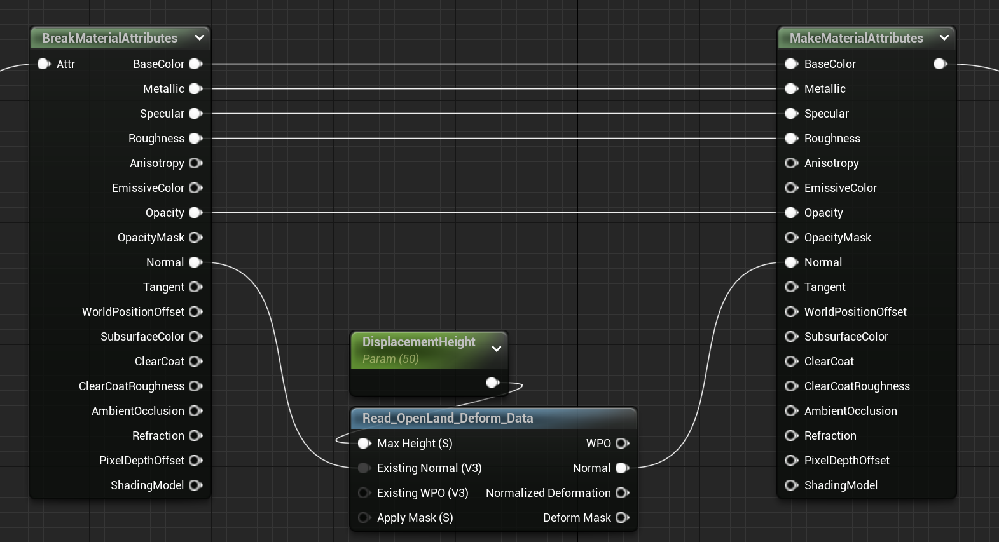

<!--more-->

## LandScape

- 找一个沙漠材质，新建地形，将材质赋给地形，调整材质、光照、后处理效果等，形成一个基础沙漠场景

- 使用 Landmass 的 Noise 笔刷，给地形刷上材质，这个材质的作用是根据 Noise 生成高低起伏的地形，可以调整参数控制起伏的程度等（不得不说 UE 的默认渲染管线真的不错，逐渐真香）

## Car

- 这里遇到了一个坑，我想用一个商城中的 Car 包，这个资源需要创建工程，按照常规操作创建工程直接直接 migrate 到我的沙地项目就行了对吧，但是，只要迁移过来蓝图立马不能正常 work，看原因，parent 为 null，但是看原来的工程，parent 正常的，为 WheeledVehicle，我这就纳了大闷了，为啥没有呢？我搜这个文件，能搜到，但是迁移过来就是不行，而且还不能直接改 parent，为此我还怀疑是 UE5 的问题，专门下了个 UE4 测试，结果还是不行🙄 后来才发现这是用到了插件 PhysXVehicles，但是我的项目 UE 没打开，所以就没有这个组件，但是我新建的工程也没开这个组件，却能正常运行，好纳闷。尽管如此，就算开启了这个插件，还是不能正常迁移，只能自己在自己的项目新建蓝图把参数复制过去。。

## Footprint

- 看到的这个教程用了一个 Surface Trail 的插件，找了半天这个插件的免费下载，结果只能在 UE4 上用，UE5 不行，我推测可能是 UE5 的地形系统的 Displacement 有所变化，导致原来的材质使用位移贴图可以改变地形但是现在不行？
- 换一个插件 OpenLand，记得开启 Landscape 的 Use Dynamic Material，然后在地形材质中，我们通过更改 Normal 来实现 fake displacement，即地形顶点并没有发生真正的偏移，而是通过改变法向来实现凹凸的效果，这里利用 OpenLand Deform Data 来生成新的法线方向，注意到轨迹都是比较规则的圆形，推测是通过检测碰撞实现的

- 为了生成更精细的脚印效果，需要在蓝图的 Mesh 下添加 OpenLand Deform，并为其绑定对应的关节 Socket，还可以在 OpenLand 中开启 Fade 效果

- 要想实现真正的 displacement，需要首先开启 virtual texture 并开启 Virtual Heightfield 插件，Virtual Texture 是一种对大尺寸纹理优化的技术。利用 OpenLand 提供的 RVT Widget 生成 Height 和 Material RVT，然后修改地形材质，将材质属性写入 Runtime Virutal Texture Output，再从 Runtime Virtual Texture Sample 中读出材质属性并输出。但是本来之前还能看到地形颜色，我啥也没改颜色就变成了纯黑色，没懂为什么...但是我直接把颜色输出是能看到颜色的，可能是 RVT 出了一点问题，就算我新建材质也不能解决这个问题...早知道就备份一下了，我没有 commit 😒，我可能要新建一个场景试试了
- Ctrl + L 可以调整太阳的位置

## 小结

## References

- [Sand Rendering in Journey](https://www.youtube.com/watch?v=wt2yYnBRD3U)
- [UE4: Desert Driving 1/12 - Create a desert landscape procedurally using Landmass](https://www.youtube.com/watch?v=wPhWL1xyN2o)
- [Demo - Landscape Deformation (Foot Trails) on UE5 with OpenLand](https://www.youtube.com/watch?v=d3ecsGPXdl0)