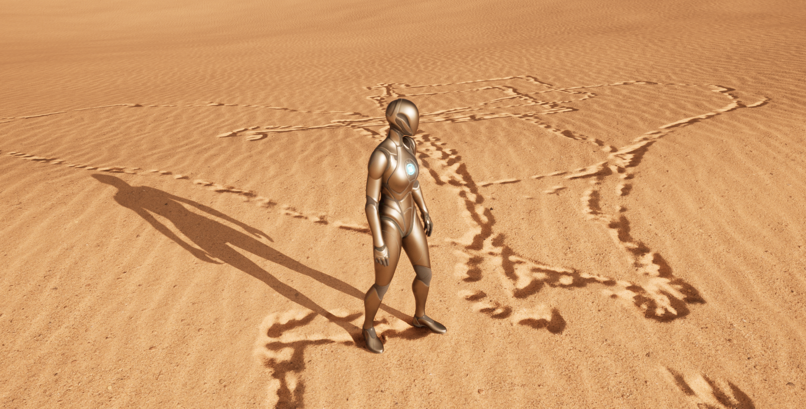
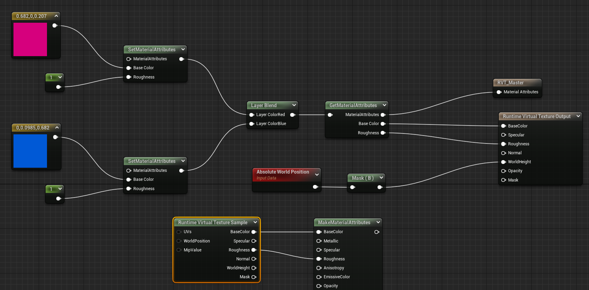
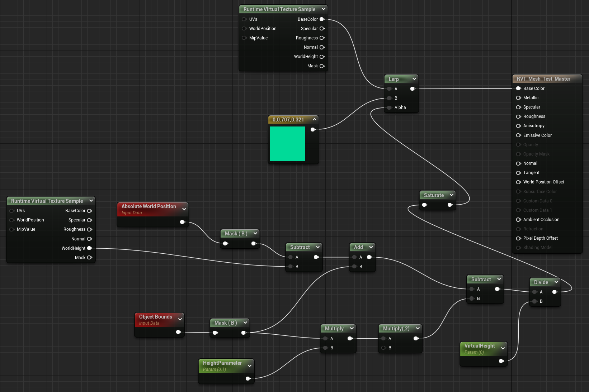
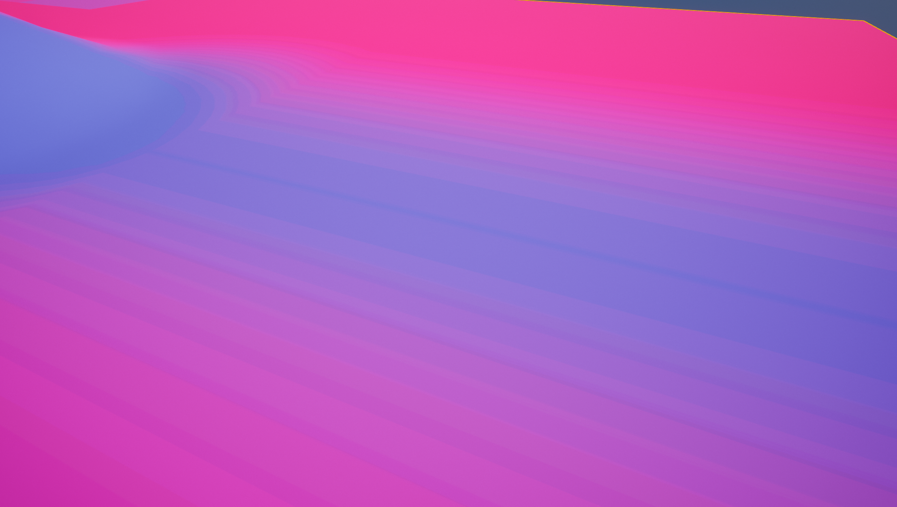
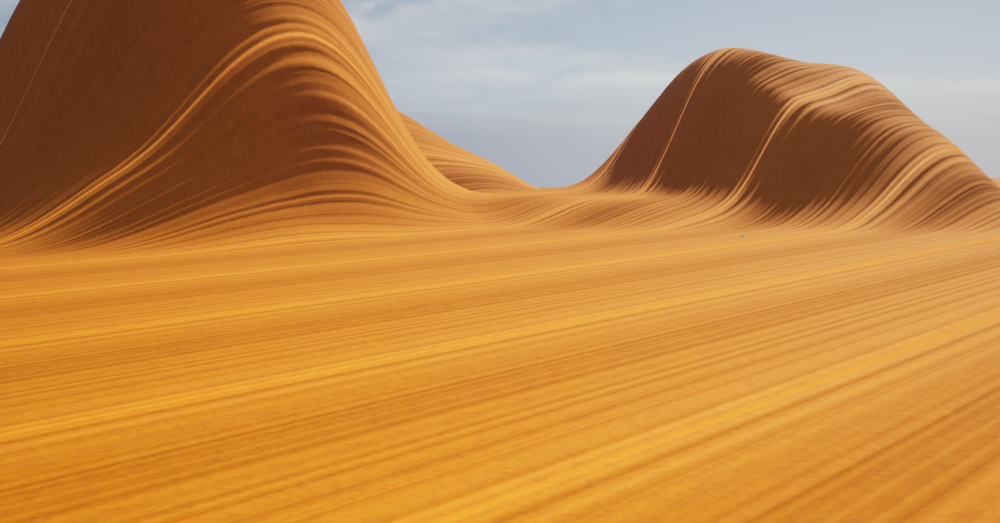
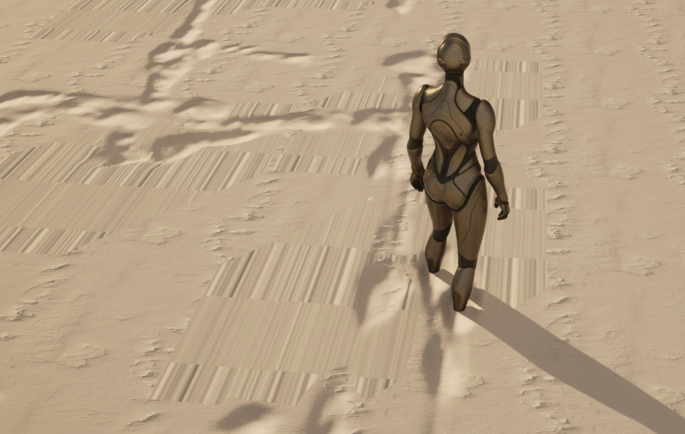
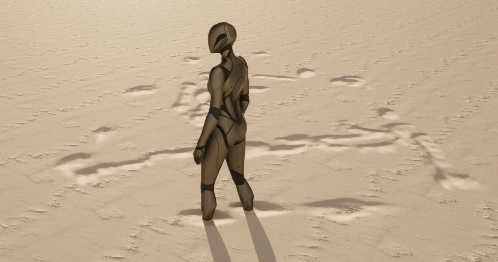

<!--more-->

## 需求整理

屏幕上有两个窗体，一个是精细三维地貌，一个缩略图显示范围更大，覆盖起始、终止区域

### FreeXGIS

1. 绘制可通行区域（绿色）、不可通行区域（红色）
2. 别人的包告诉我们起始点、终止点，利用这个引擎绘制导航轨迹
3. 需要导入车辆模型，数量有多个
4. 天气，刮风下雨下雪
   
### UE

1. 绘制车辙印，比如下雪天，多种天气也要显示
2. 视角范围在车附近
3. UE 中预设几种地形，沙场草地等
   
### 两个引擎的交互过程

1. FreeXGIS 绘制通行区域和起始点，缩略图上绘制车辆行驶轨迹，将导航数据发到 UE 端
2. 点击按钮（或其他触发方式）打开 UE 界面，根据接收到的车辆行驶数据更新车辆位置、姿态，显示车辆附近详细的三维地貌和车辙印等效果

## LandScape

- 找一个沙漠材质，新建地形，将材质赋给地形，调整材质、光照、后处理效果等，形成一个基础沙漠场景

- 使用 Landmass 的 Noise 笔刷，给地形刷上材质，这个材质的作用是根据 Noise 生成高低起伏的地形，可以调整参数控制起伏的程度等（不得不说 UE 的默认渲染管线真的不错，逐渐真香）

## Car

- 这里遇到了一个坑，我想用一个商城中的 Car 包，这个资源需要创建工程，按照常规操作创建工程直接直接 migrate 到我的沙地项目就行了对吧，但是，只要迁移过来蓝图立马不能正常 work，看原因，parent 为 null，但是看原来的工程，parent 正常的，为 WheeledVehicle，我这就纳了大闷了，为啥没有呢？我搜这个文件，能搜到，但是迁移过来就是不行，而且还不能直接改 parent，为此我还怀疑是 UE5 的问题，专门下了个 UE4 测试，结果还是不行🙄 后来才发现这是用到了插件 PhysXVehicles，但是我的项目 UE 没打开，所以就没有这个组件，但是我新建的工程也没开这个组件，却能正常运行，好纳闷。尽管如此，就算开启了这个插件，还是不能正常迁移，只能自己在自己的项目新建蓝图把参数复制过去。。

## Footprint

- 看到的这个教程用了一个 Surface Trail 的插件，找了半天这个插件的免费下载，结果只能在 UE4 上用，UE5 不行，我推测可能是 UE5 的地形系统的 Displacement 有所变化，导致原来的材质使用位移贴图可以改变地形但是现在不行？
- 换一个插件 OpenLand，在场景中添加 OpenLand_DeformManager，记得开启 Landscape 的 Use Dynamic Material，然后在地形材质中，我们通过更改 Normal 来实现 fake displacement，即地形顶点并没有发生真正的偏移，而是通过改变法向来实现凹凸的效果，这里利用 OpenLand Deform Data 来生成新的法线方向，注意到轨迹都是比较规则的圆形，推测是通过检测碰撞实现的

- 为了生成更精细的脚印效果，需要在蓝图的 Mesh 下添加 OpenLand Deform，并为其绑定对应的关节 Socket，还可以在 OpenLand 中开启 Fade 效果

- 要想实现真正的 displacement，需要首先开启 virtual texture 并开启 Virtual Heightfield 插件，Virtual Texture 是一种对大尺寸纹理优化的技术。利用 OpenLand 提供的 RVT Widget 生成 Height 和 Material RVT，然后修改地形材质，将材质属性写入 Runtime Virutal Texture Output，再从 Runtime Virtual Texture Sample 中读出材质属性并输出。但是本来之前还能看到地形颜色，我啥也没改颜色就变成了纯黑色，没懂为什么...但是我直接把颜色输出是能看到颜色的，可能是 RVT 出了一点问题，就算我新建材质也不能解决这个问题...早知道就备份一下了，我没有 commit 😒，我可能要新建一个场景试试了
- Ctrl + L 可以调整太阳的位置，新建了一个场景并使用 Fake Displacement 的效果

- Run OpenLand_RVT_Widget 生成两张 RVT 分别存储 Height 和 Material，然后将地形材质写入 RVT Material（我去好像破案了，在做 RVT Sample 的时候要选择我的 Material，但是不知道为啥之前那个材质为空，好吧还是不行还是黑的，我感觉就是写入的 RVT 和采样的 RVT 不是同一个，所以采样的 RVT 啥也采不到，为什么😥）
- Run OpenLand_HF_Mesh_Widget，在 Landscape 的 Draw in Main Pass 选择 Never，但是效果更不对了，还是感觉 RVT 设置的有问题，就算我新建了一个场景也不行，搞不定了
- 跟了一个基础的 RVT 示例教程，预期结果与教程不一样，难道是因为 UE5 有什么特殊的设置吗，我又用 UE4 做了一遍也不行，我漏掉什么步骤了吗，我哭了
- 哦我发现最终得到的 RVT 与 RunTime Virtual Texture Volume 关系很大，虽然我记得我已经点过 Set Bounds 了，但是刚才检查出来发现 Bounds 不对，所以采样出来的颜色是不对的，当点击 Set Bounds 后，Volume 会扩展成和地形一样大，这个时候就能得到教程的效果了，但是有一点值得注意，当地形是平的时候采样出来是黑色的，感觉可能是因为地形刚好贴到边界了所以没有采样到？不过按照这个方法是能够得到一个混合的纹理效果

- 只不过如果我立马在地形中 Sample 得出的地形混合颜色会很奇怪，难道不应该这样用吗，可是官方文档在同一个材质 Output Sample 好像也没有问题。可是尽管如此，原来的地形 Sample 到的材质还是黑色的，我检查了 Bounds 是将地形包裹着的，甚至 Height 都能看到一些形状，但是 Material 不行，看起来像是没写入这个 RVT，为什么啊= =

- 看了一下 OpenLand 的教学视频，在自建的材质上是可以正常的，但是 Bridge 的地形材质不太正常，添加上 RVT 之后材质会被异常拉伸，感觉和 LOD 可能有点关系，可能是它自带的材质有什么特殊的设置，但是其实这个拉伸效果和上图很像，不知道二者是否有关系，上图是因为在同一个材质中 Sample RVT，这个只要是加上 RVT 相关的处理就是这样，不知道是否有什么关联，我发现好像跟 Draw in Main Pass 选择 Always 和 Never 也有关系

- 确实找不出解决方法了，先用这种没有 RVT 的方法吧

## Tank

## GIS Landscape

- 通过修改地形材质来改变地形的凹凸效果，那么对于 GIS 数据生成的地形，还能够这样修改吗？接下来会重点熟悉 UE 的地形系统，然后看看 UE 中使用 GIS 的正确姿势

## 小结

## References

- [Sand Rendering in Journey](https://www.youtube.com/watch?v=wt2yYnBRD3U)
- [UE4: Desert Driving 1/12 - Create a desert landscape procedurally using Landmass](https://www.youtube.com/watch?v=wPhWL1xyN2o)
- [Demo - Landscape Deformation (Foot Trails) on UE5 with OpenLand](https://www.youtube.com/watch?v=d3ecsGPXdl0)
- [Unreal Engine 5 - Footprints In the Sand (Landscape Displacement)](https://www.youtube.com/watch?v=GhtZK8J2LcM&t=941s)
- [Unreal Engine 4: Ultimate Beginner's Guide to Runtime Virtual Texture Blending (RVT)](https://www.youtube.com/watch?v=_u-HdkJ3woE)
- [OpenLand Deform Toolkit for Unreal Engine HeightField Mesh Based Trails, Foot Paths, FX (UE5 Ready)](https://www.youtube.com/watch?v=FW4twCpIL6w)
- [Demo - Landscape Deformation (Foot Trails) on UE5 with OpenLand](https://www.youtube.com/watch?v=d3ecsGPXdl0)
- [UE5 Tutorial - Chaos Tank Blueprint](https://www.youtube.com/watch?v=i8RR5kNouwI)