<!--more-->

## Anti Missle

- 基于 Fountain Emitter 创建干扰弹基本效果，我觉得看起来还行，没有那么死板。但这里存在一个问题，现实中打出去的烟雾会逐渐变小并消散，但是这里没有很好的方法表示这个逻辑，这里设置的是粒子随着时间逐渐变大形成烟雾扩散的效果，但是还需要添加逻辑让已经生成的粒子变小，逻辑上有一些矛盾。我觉得可能可以在蓝图控制之后生成的粒子大小，计算炮弹打出的时间，然后作为 user parameter 传给粒子系统生成后面较小的粒子

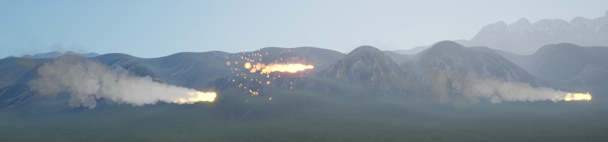

## Inventory

- 先来做一个选择装备的页面，然后用蓝图创建，来复习一下创建 UI 的逻辑：按键 FlipFlop 触发 -> Is Valid? -> Yes Set Visibility or No Create Widget & Add to Viewport -> 设置鼠标。必要时可以用一个 bool 变量标识现在是否在 UI 状态

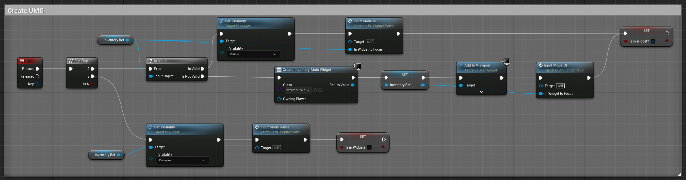

- 设置鼠标主要有两步：设置可见性 & 设置输入模式，需要 Get Player Controller

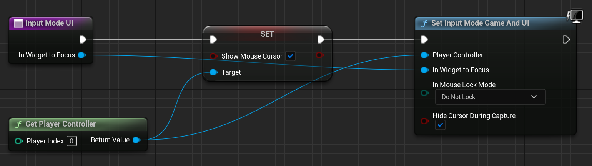

- 为了做背包系统，需要创建一些描述背包元素的数据，新建一个 Structure 表示背包数据结构，再新建一个 Enum 表示有哪些类型的背包数据

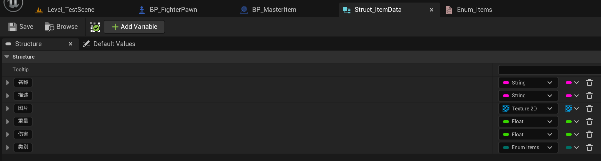

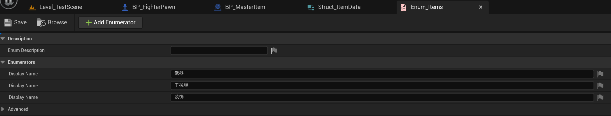

- 新建一个 Actor BP，表示一个 Item 数据，然后创建 Child BP 存储不同的 Item 数据，比如我新建了一个“干扰弹1号”物品。

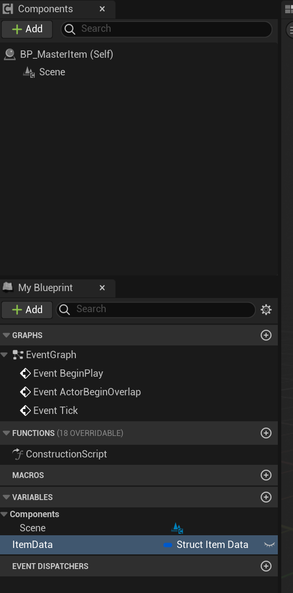

- 然后添加收集函数，虽然当前项目用不到。利用 Sphere Trace By Channel，利用 Camera 传入 Start 和 End，然后根据检测结果返回碰撞到的物体并将其加到背包数据中

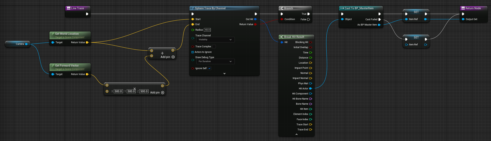

- 在 UI 这边，要显示背包列表，可以用一个滚动条，然后在 UI 创建时获取角色身上的背包数据，并遍历背包中的数据将其添加到滚动条下。滚动条中的数据子项也可以做成一个单独的 UI 组件。

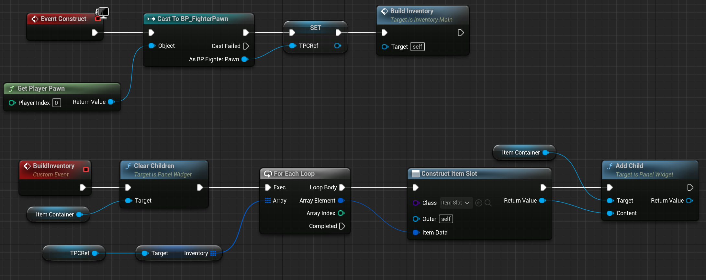

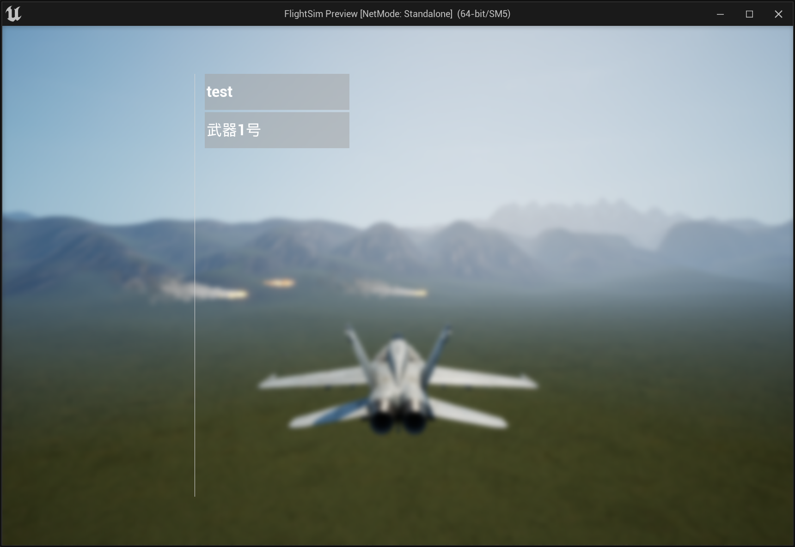

- 遇到一个 null 的 bug，是因为把多个分支的节点用到的一些数据共用了，然后就出了问题，这点用蓝图确实有点问题
- 然后做一个 hover 窗口显示装备的具体属性，当鼠标 enter 时显示，leave 时销毁，这里遇到一个问题是我给 hover 窗口设置了动画，但是无法播放

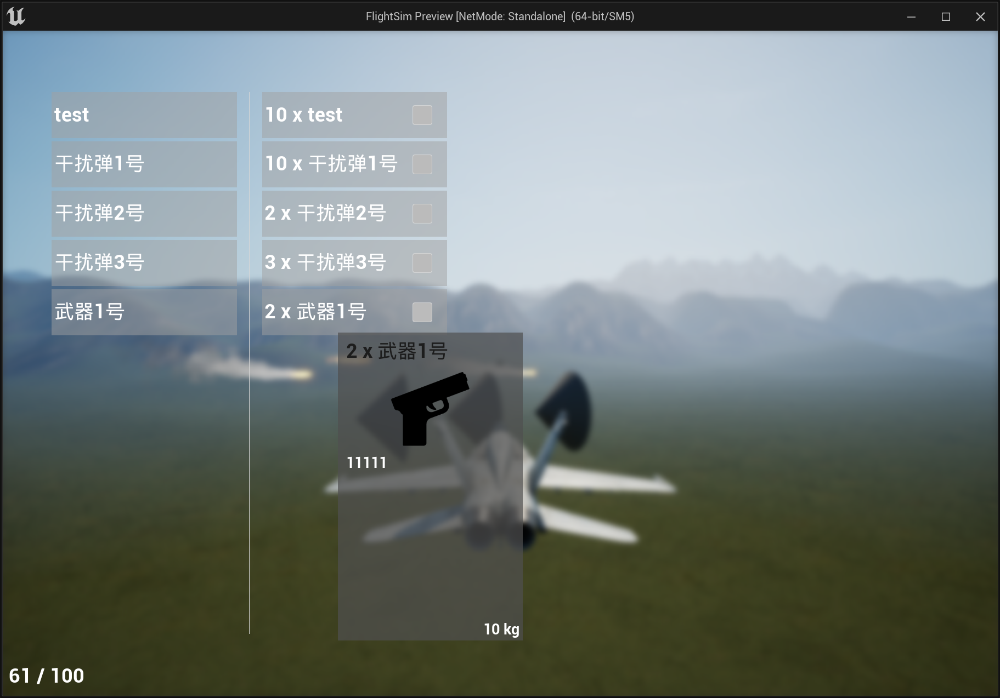

- 将 SceneCaptureComponent2D 挂载在 camera 下可以获取相机的 render target，并制作一个 rendertarget 的材质，然后传入 UI 的 Image 

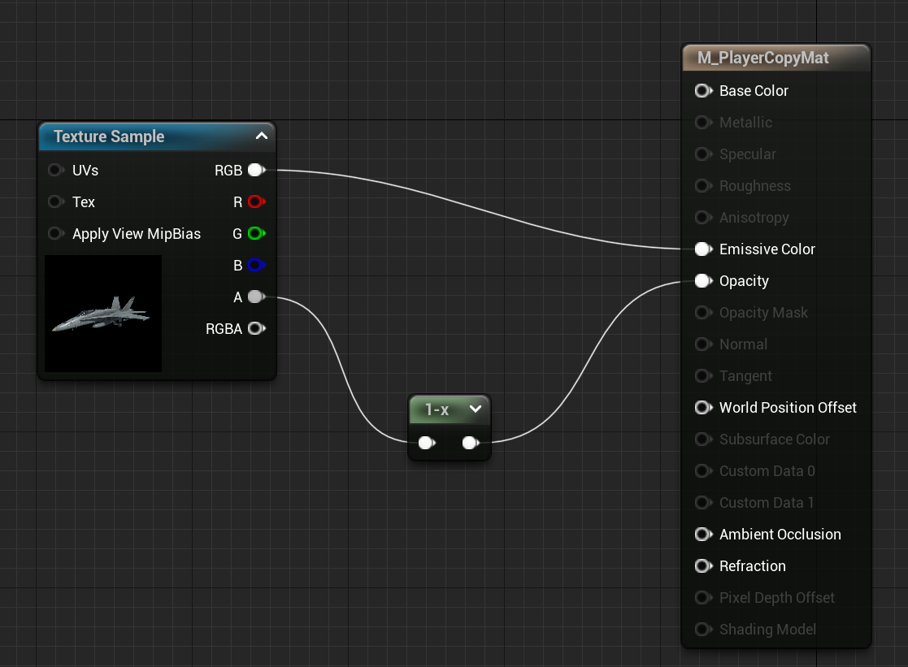

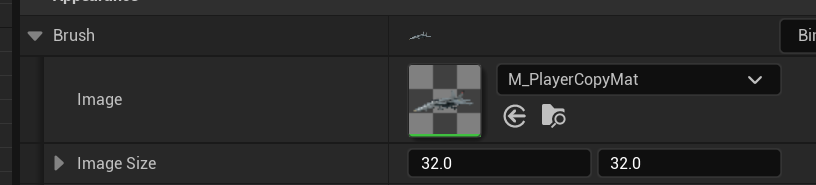

- 要控制模型旋转，首先在 actor 蓝图中添加相应的旋转逻辑，然后在 UI 处调用鼠标事件触发相应的旋转逻辑

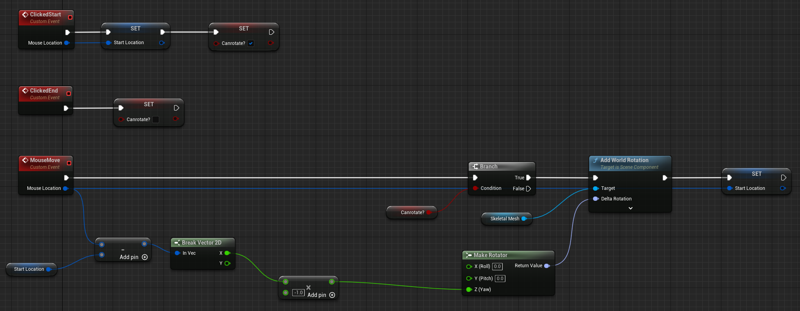

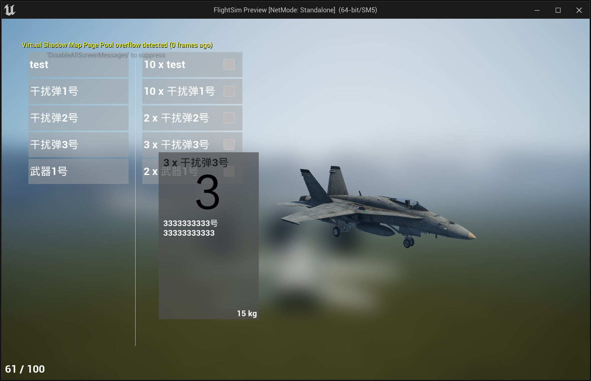

## 小节

## References

- [【UE4】Unreal Engine 4 - PUBG styled Compass](https://www.bilibili.com/video/BV1Xs411w7zo)