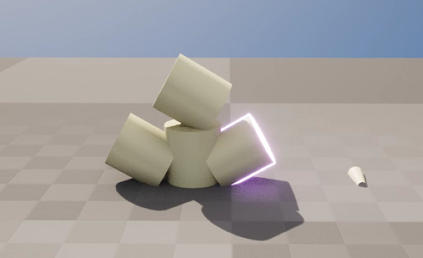

<!--more-->

## Clickable 3D Model Button

- 做三维的按钮其实原理很简单，利用 Mesh 的 OnMouse 相关的触发器，设定相应的行为（但这个项目的难点是没有任何三维素材，一切都要你自己找，自己找个相似的倒也容易，但是他给你几张完全不清晰的草图让你生成三维模型，三维建模的活我是真的干不了......）
- 按钮的话先做一个基类，按钮主要有一些状态，然后根据状态改变行为，由不同种类的按钮派生类去重写改变状态的方法
- 比如二位置开关，行为主要就是旋转，根据当前所处的状态添加 LocalRotation

## 小结

## References

- [ue4 可点击座舱实现 Clickable cockpit](https://www.cnblogs.com/LynnVon/p/13453938.html)