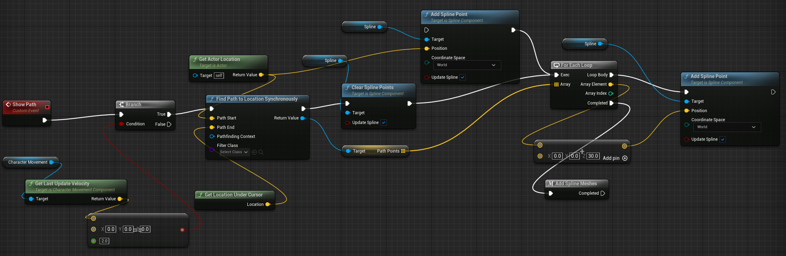
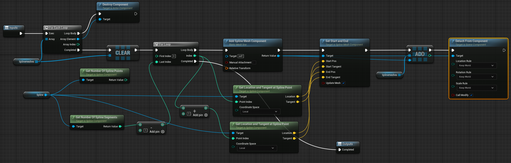
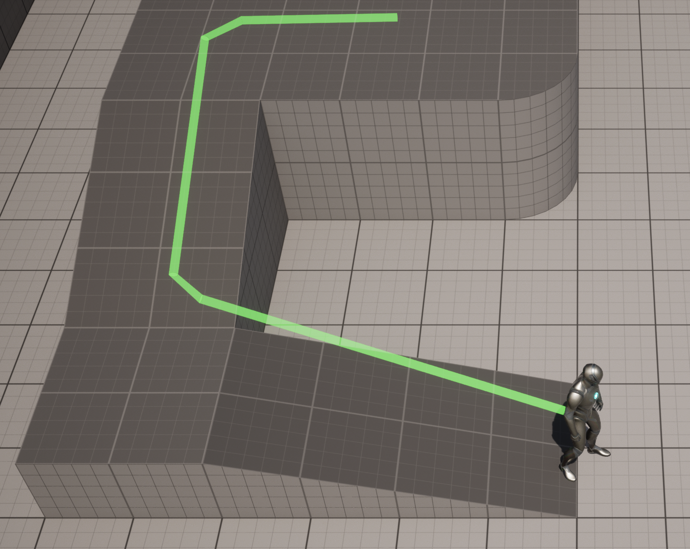
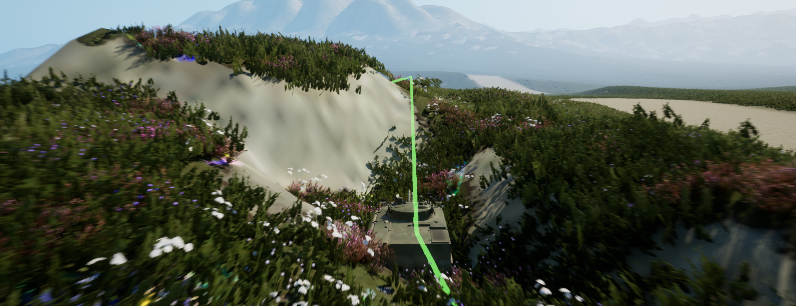
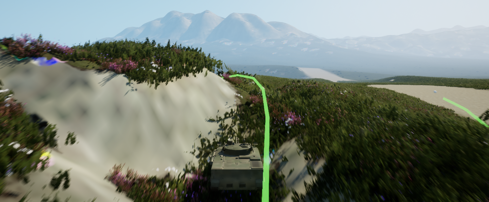

<!--more-->

## 绘制导航线

- 利用 Spline 绘制导航线，使用 Find Path 获取路径点，然后将点加入到 Splines Point 中，因为 splines 在运行时不显示，所以需要基于 spline 的点生成 spline mesh（我感觉拐角处比较生硬，应该是 mesh 的原因 -> 解决方案：添加一些 loop cut，边角处会柔和很多）







- 用到大地形中效果也还不错。但目前面临的几个问题是：1）如何将别人的导航数据映射到 UE 的坐标系 2）大地形材质太容易崩了 3）丝滑地切换相机 4）优化导航线外观表现 5）大地形的 Nav Mesh 解决方案 6）大地形的流推送 7）选择一个合适的 Game Mode





- 测试发现使用 spline 不能直接应用球体，会被拉伸沿着 spline，可能需要两种方案：Add Static Mesh or 创建一些合适的材质

## 浏览器打开本地 exe

- 编辑注册表

```bash
Windows Registry Editor Version 5.00
[HKEY_CLASSES_ROOT\myWebshell]
@="URL:myWebshell Protocol Handler"
"URL Protocol"=""
[HKEY_CLASSES_ROOT\myWebshell\DefaultIcon]
@="D:\\Unreal\\Projects\\OpenLand\\Build\\Windows\\OpenLand.exe"
[HKEY_CLASSES_ROOT\myWebshell\shell]
[HKEY_CLASSES_ROOT\myWebshell\shell\open]
[HKEY_CLASSES_ROOT\myWebshell\shell\open\command]
@="\"D:\\Unreal\\Projects\\OpenLand\\Build\\Windows\\OpenLand.exe\" \"%1\""
```
- 在 html 中添加 ref

```html
<!DOCTYPE html>
<html lang="en">
    <head>
        <meta charset="utf-8">
        <meta name="author" content="name">
        <title></title>
        <style>
            
        </style>
    </head>
    <body>
        <a href="myWebshell://hello">打开 UE 导航</a>
        <script></script>
    </body>
</html>
```


## 小结

## References

- [Unreal Preview Navigation Path](https://www.bilibili.com/video/BV1SA411379a)
