<!--more-->

## 需求

- 将 Flightgear 中的仪表盘贴图应用到 UE 中

## 方案

### 工作流

  将 .ac 仪表文件导出成模型 -> 将模型导入 UE 进行装配，添加行为逻辑

### 步骤

  1. 使用 AC3D 打开 .ac 文件

     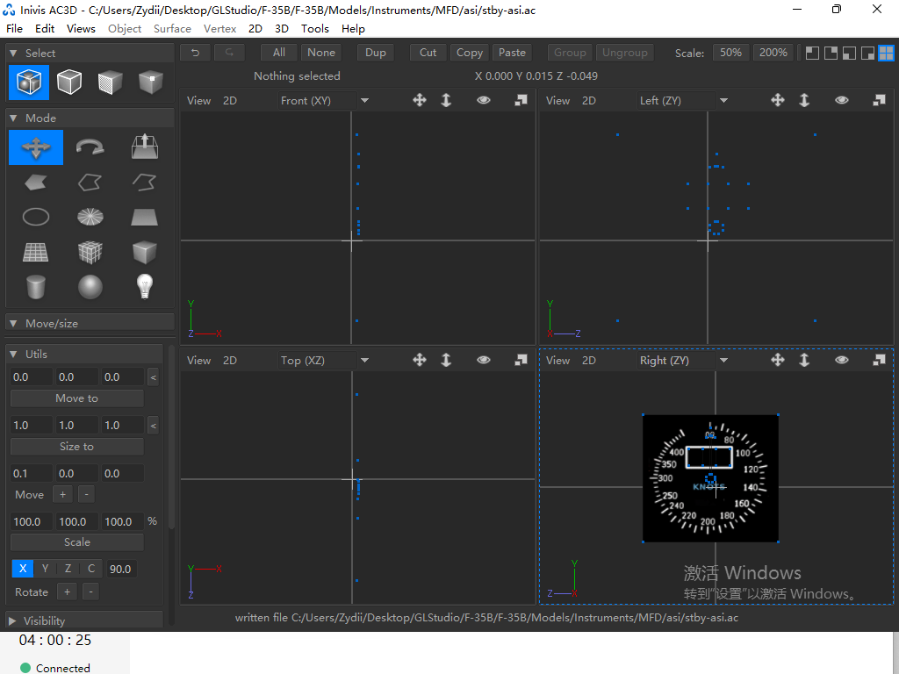

  2. 因为 AC3D 中的尺寸较小，UE 不能识别，需要将原模型的 Scale 放大 10 倍或以上

     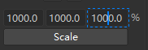

  3. 导出成 .obj 文件

     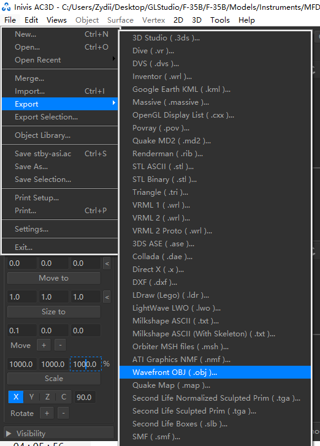

  4. 打开 Blender（也可以使用其他任意三维建模工具），新建一个 General 项目，按键盘 a 选中所有物体，然后按下 Delete 进行删除

     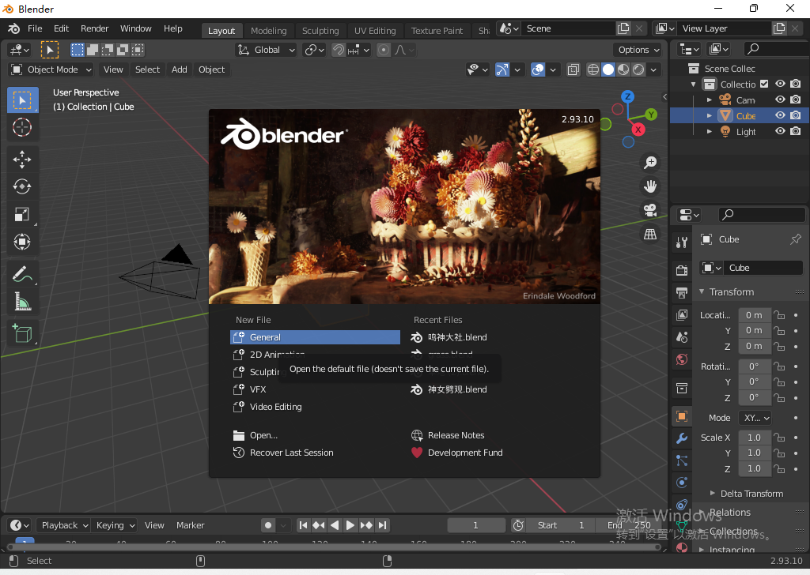

  5. 导入刚才生成的 .obj 文件

     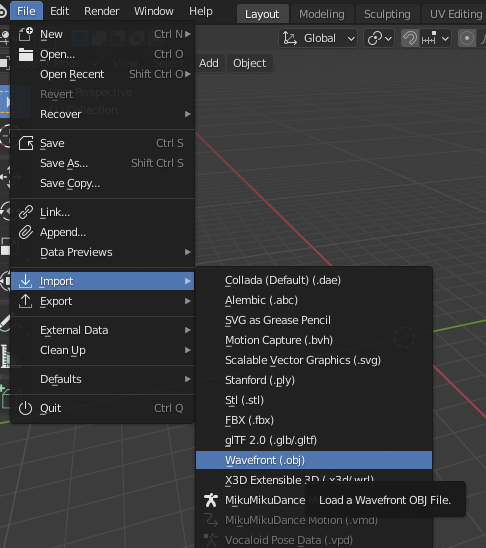

  6. 导出模型为 .fbx 格式（因为此格式方便 UE 将仪表中的指针、表盘等分开）

     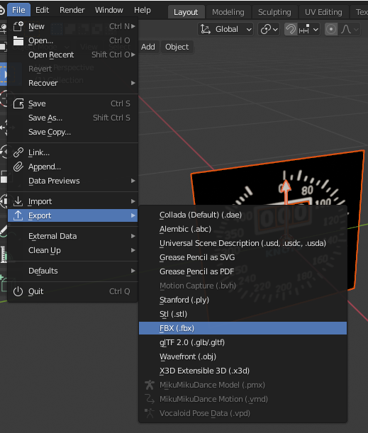

  7. 在 UE 中选择 Import Into Level，选择刚才导出的 .fbx 文件，需要勾选 Import as Dynamic

     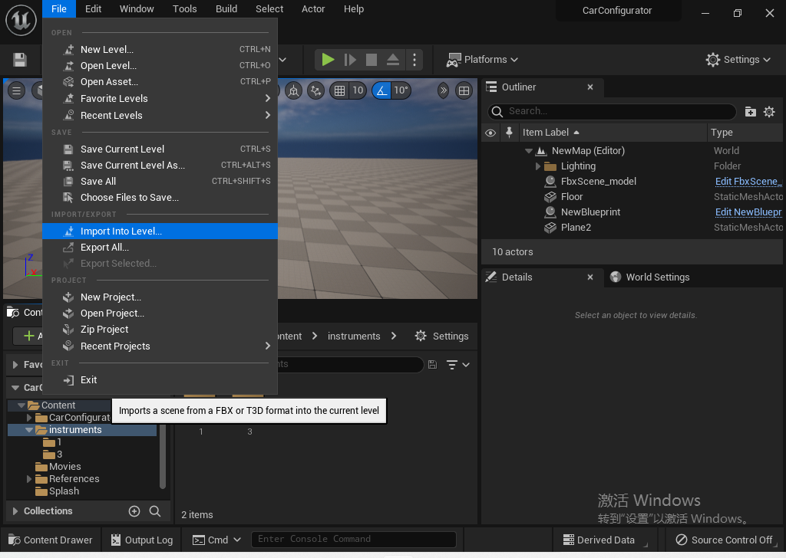

     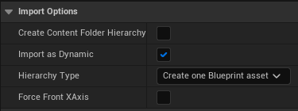

  8. 添加控制逻辑，这里测试了每帧控制指针旋转

     

     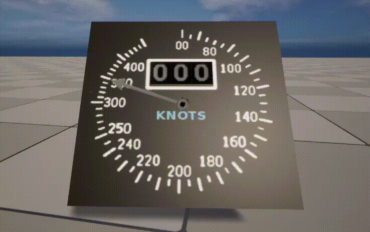

### 可行性分析
  
  该方法将 Flightgear 中的仪表文件导出成三维模型，导入 UE 中可以为每个组件添加行为逻辑，根据仪表自身的工作原理可以用代码实现各种仪表的行为，并且方便放置于飞机的三维模型上，可以实现预期需求。

## 可参考方案

Unreal 商城中有一些包含仪表盘的资产，如有需要可以购买使用。

1. [Flight Instrument Pack](https://www.unrealengine.com/marketplace/en-US/product/9f8811bfbcda40c0b99318463f800604)
   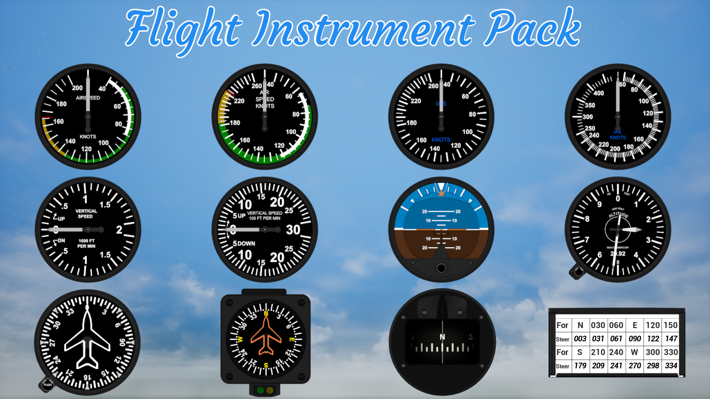
2. [Airplane Controller & Instruments](https://www.unrealengine.com/marketplace/en-US/product/ee779172dae04a919c52ef6f595c8dc8)
   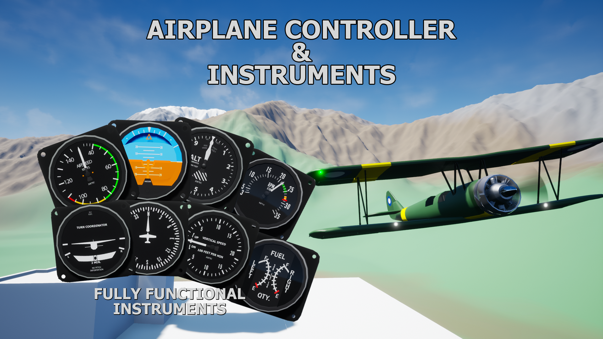
3. [ADF Navigation](https://www.unrealengine.com/marketplace/en-US/product/36510f4165434e8e9ac4994920fbcb39)
   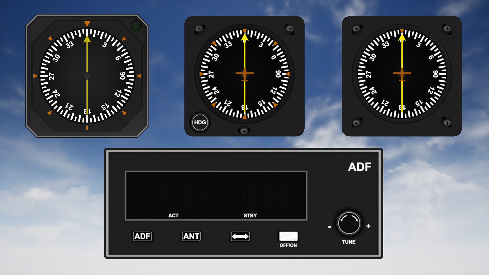
4. [Turn Coordinator](https://www.unrealengine.com/marketplace/en-US/product/d7a70429ee1942b2837b551bdf033d65)
   
5. [Car Configurator](https://www.unrealengine.com/marketplace/en-US/product/automotive-configurator)
   

