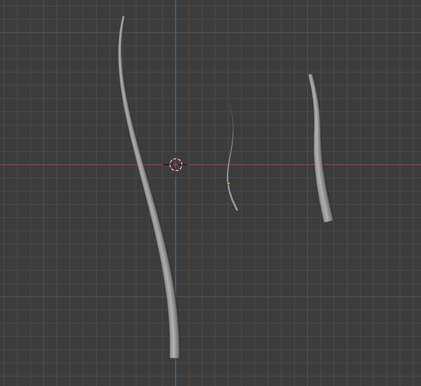
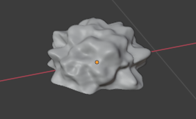
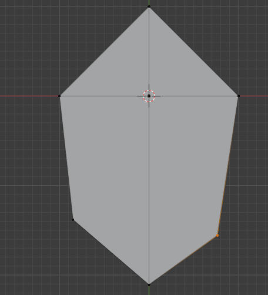
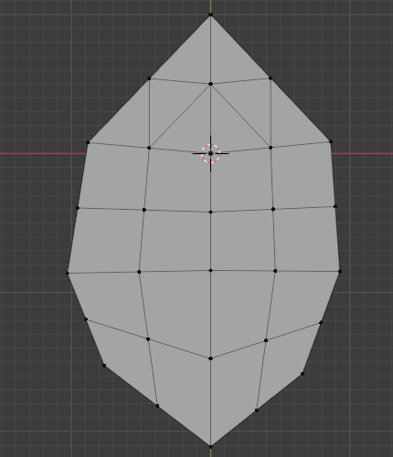
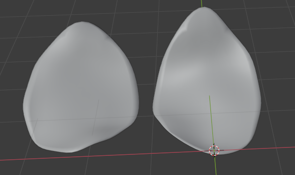

<!--more-->

## 花瓣建模

好久没用过 Blender 建模了，因为 UE 中花瓣的模型要订阅会员才能下载，所以干脆重温一下学着自己建一个简单的（老白嫖怪了......）

1. Shift + A 添加一条贝塞尔曲线，数字键 1 切换到正视图，旋转至 (-90, 90, 0)，按下 TAB 切换编辑模式，使用 G 移动、R 旋转，调整曲线至合适的位置，在曲线工具栏中将 Depth 设置为 0.04、Resolution 为 8 以及开启 Fill Caps，设置 Resolution Preview 为 36，按下 Alt + S 缩小顶部，这样就把花的茎做好了，用同样的方法可以多做几个
   
   

2. 新建一个 Ico Sphere，Subdivide 为 4，Shade Smooth，TAB 切换为编辑模式，按下 Z 选择 Wireframe 模式，选中下半部顶点并删除，然后回到对象模式和 Solid 模式，添加一个 Modifier Displace，然后 New 一个 Texture 并选择 Clouds，Size 设置为 0.07，Coordinates 设置为 Global ，然后再添加一个 Modifier Subdivision，将 Levels Viewport 设置为 2，然后将整体在 Z 方向上缩小一点，并将整体缩小一点
   
   

3. 新建一个 Plane，进入编辑模式，Subdivide，数字键 7 进入顶视图，选中上方左右两个角的顶点，按下 Ctrl + X 合并顶点，然后移动下方的顶点

   

4. 按下 Ctrl + R 新建一个 Loop Cut，然后按下 S + Y + 0 让 Cut 变成直线，然后调整顶点位置让其更像叶子，然后再做一次 Subdivide

   

5. 打开 Propotional Edit，分别移动顶部顶点和中心顶点，形成叶片的弧度，并将叶片底部位置调整至原点方便旋转，添加 Subdivision，Levels Viewport 设为 2，Render 设为 3，添加 Displace，选择 Clouds，Size 设为 2，Depth 设为 1，Coordinates 设为 Global，Strength 设为 1，Shade Smooth，添加 Solidify Modifier，Thickness 设为 0.01，Shift + D 可以再创建一个花瓣

   

6. 进入 Shading 模式来做材质，以及进行一点渲染设置，因为这是节点材质，而且我也不太懂这些节点的含义，只能体会个大概，所以实在不好描述，直接展示一下效果吧hhh

   

7. Geometry Node 的部分我也不知道咋写，相机往后调可以按住 G + Y，最后渲染出来的结果实在太漂亮了，已经拿来当壁纸了！

   

   

## 小结

## References

- [Blender Flower Modelling and Textures [For Geometry Nodes Flower]](https://www.youtube.com/watch?v=zkRbdTwH-q8)
- [Blender 2.93 Geometry Nodes Easy Flowers [Beginner tutorial]](https://www.youtube.com/watch?v=evKozTsl3W8&t=0s)
- [Flower FX in UE4 Niagara Tutorial | Download Files](https://www.youtube.com/watch?v=NICBcWXzm8I)