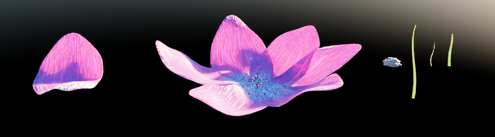

<!--more-->

## 花瓣建模

好久没用过 Blender 建模了，因为 UE 中花瓣的模型要订阅会员才能下载，所以干脆重温一下学着自己建一个简单的（老白嫖怪了......）

1. Shift + A 添加一条贝塞尔曲线，数字键 1 切换到正视图，旋转至 (-90, 90, 0)，按下 TAB 切换编辑模式，使用 G 移动、R 旋转，调整曲线至合适的位置，在曲线工具栏中将 Depth 设置为 0.04、Resolution 为 8 以及开启 Fill Caps，设置 Resolution Preview 为 36，按下 Alt + S 缩小顶部，这样就把花的茎做好了，用同样的方法可以多做几个
   
   

2. 新建一个 Ico Sphere，Subdivide 为 4，Shade Smooth，TAB 切换为编辑模式，按下 Z 选择 Wireframe 模式，选中下半部顶点并删除，然后回到对象模式和 Solid 模式，添加一个 Modifier Displace，然后 New 一个 Texture 并选择 Clouds，Size 设置为 0.07，Coordinates 设置为 Global ，然后再添加一个 Modifier Subdivision，将 Levels Viewport 设置为 2，然后将整体在 Z 方向上缩小一点，并将整体缩小一点
   
   

3. 新建一个 Plane，进入编辑模式，Subdivide，数字键 7 进入顶视图，选中上方左右两个角的顶点，按下 Ctrl + X 合并顶点，然后移动下方的顶点

   

4. 按下 Ctrl + R 新建一个 Loop Cut，然后按下 S + Y + 0 让 Cut 变成直线，然后调整顶点位置让其更像叶子，然后再做一次 Subdivide

   

5. 打开 Propotional Edit，分别移动顶部顶点和中心顶点，形成叶片的弧度，并将叶片底部位置调整至原点方便旋转，添加 Subdivision，Levels Viewport 设为 2，Render 设为 3，添加 Displace，选择 Clouds，Size 设为 2，Depth 设为 1，Coordinates 设为 Global，Strength 设为 1，Shade Smooth，添加 Solidify Modifier，Thickness 设为 0.01，Shift + D 可以再创建一个花瓣

   

6. 进入 Shading 模式来做材质，以及进行一点渲染设置，因为这是节点材质，而且我也不太懂这些节点的含义，只能体会个大概，所以实在不好描述，直接展示一下效果吧hhh

   

7. Geometry Node 的部分我也不知道怎么描述，直接上效果图吧，最后渲染出来的结果实在太漂亮了，已经拿来当壁纸了！(其实我明明只需要学一下花瓣的建模，跑题了)

   

   

   

## 粒子效果

1. 先来做材质，设置花瓣的自发光为随机的，所以采样一个 noise 贴图乘以粒子颜色传入 emissive color，添加 TexCoord 调整 UV 缩放，为了不让颜色全黑，可以做一个 clamp

   

2. 粒子系统的 Render 改为 Mesh Renderer，设置对应的 Mesh 和 Material，添加 Spawn Burst Instantaneous，数量为 6，设置生命周期，然后最关键的部分，利用 Torus 生成花朵，添加 Torus Location，调整半径，然后 Distribution 的部分设为 Dirct，调整 UV，然后添加 Initial Mesh Orientation，就是在设置花瓣的朝向，我们想要的是花瓣沿着 z 轴旋转一定的角度，这样就可以形成花朵的样子了，选择 Orientation Vector 为 ShapeBitangent（不是很能理解这个 ShapeBitangent，应该是与切线空间有关，Tangent 可以理解为切线，Normal 为法线，那么 Bitangent 应该是第三个轴，在这个场景下 Bitangent 就是朝向 z 轴的）

   

3. 接下来需要对花朵进行旋转，首先是修改 Shape Location 将其进行一点旋转，然后使用 Update Mesh Orientation 对花朵进行旋转，Scale Mesh Size 和 Scale Color 也要加上

   

4. 再做一个材质形成中心的流光效果，这里利用 Panner 对 UV 进行移动，使用 Dynamic Parameter 添加一些随机效果。在远处流光透明度会逐渐减小，所以根据 TexCoords 的 V 调整材质的透明度

   

5. 然后复制粘贴一个粒子发射器，将 Mesh 的材质修改为刚才制作的，并调整一下大小和偏移，但是我没有合适的纹理，而且我建模的花瓣也不是很好，做出来好丑。在 Update 处可以添加 Dynamic Material Parameters，设置材质中的系数（丑哭了，需要尽快把学习 PS 提上日程）可以将流光材质的 Mesh Render 的 sort order 设为 1，这样会比较明显

   

6. 下面来做外圈的粒子效果，用 Sprite Renderer，选择 SubUV 的烟雾材质，然后添加 SubUV Animation，设置初速度和颜色，添加 Drag，有那么一点烟雾的效果，但是我贴图是网上乱找的一个，效果不是很好

   

7. 再在外圈一些发光的小粒子，调整一下大小和速度，这里材质选的一个自发光比较亮的材质，然后加上 Curl Noise Force 和 gravity noise，这样周围就有 blingbling 的效果啦

   

8. 参照上面的方法再来加一点小花花，最终得到的效果如下：

   

（哈哈好丑）

## 小结

花朵的生成主要利用 Torus Location，然后根据 Bitangent 设置花瓣的朝向，然后添加一些缩放、变色等效果，然后可以添加一些烟雾和发光粒子，流光效果主要通过 Noise 材质的 UV 变化来实现。

## References

- [Blender Flower Modelling and Textures [For Geometry Nodes Flower]](https://www.youtube.com/watch?v=zkRbdTwH-q8)
- [Blender 2.93 Geometry Nodes Easy Flowers [Beginner tutorial]](https://www.youtube.com/watch?v=evKozTsl3W8&t=0s)
- [Flower FX in UE4 Niagara Tutorial](https://www.youtube.com/watch?v=NICBcWXzm8I)