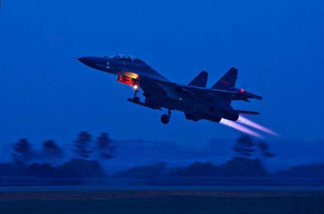
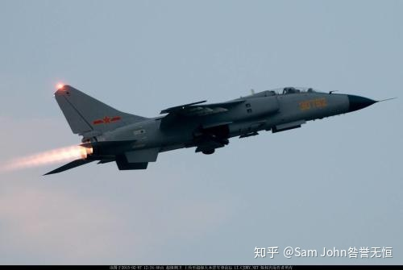
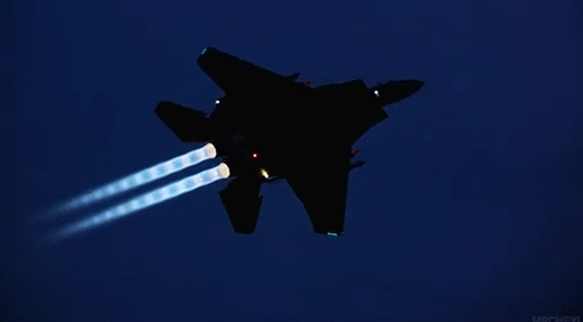
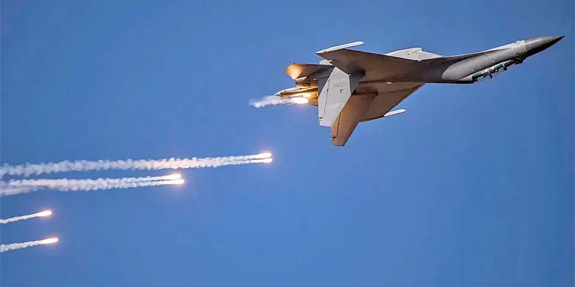
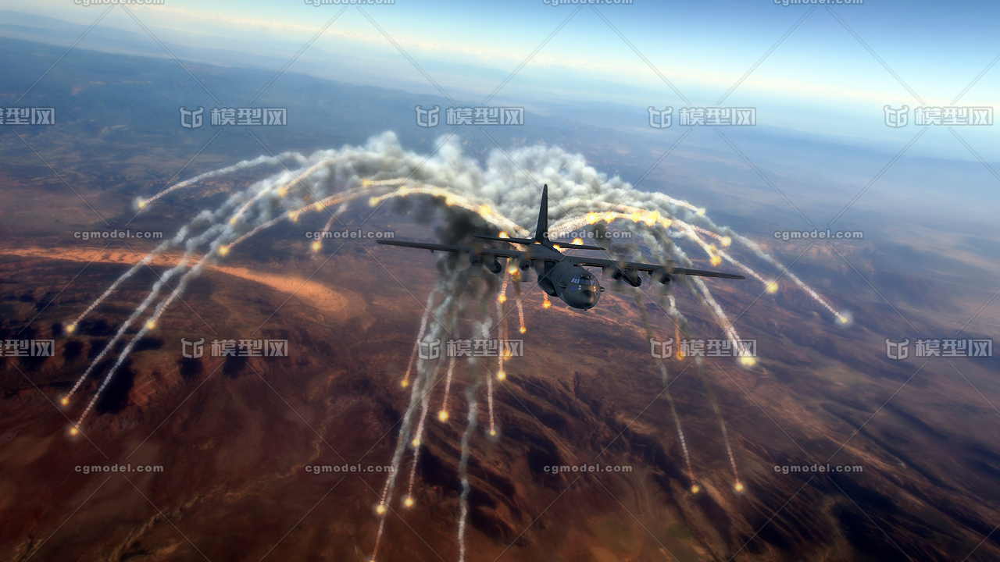
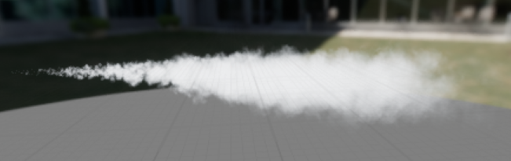
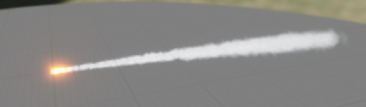
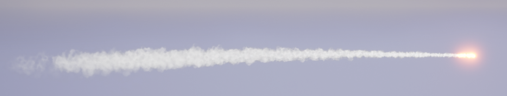
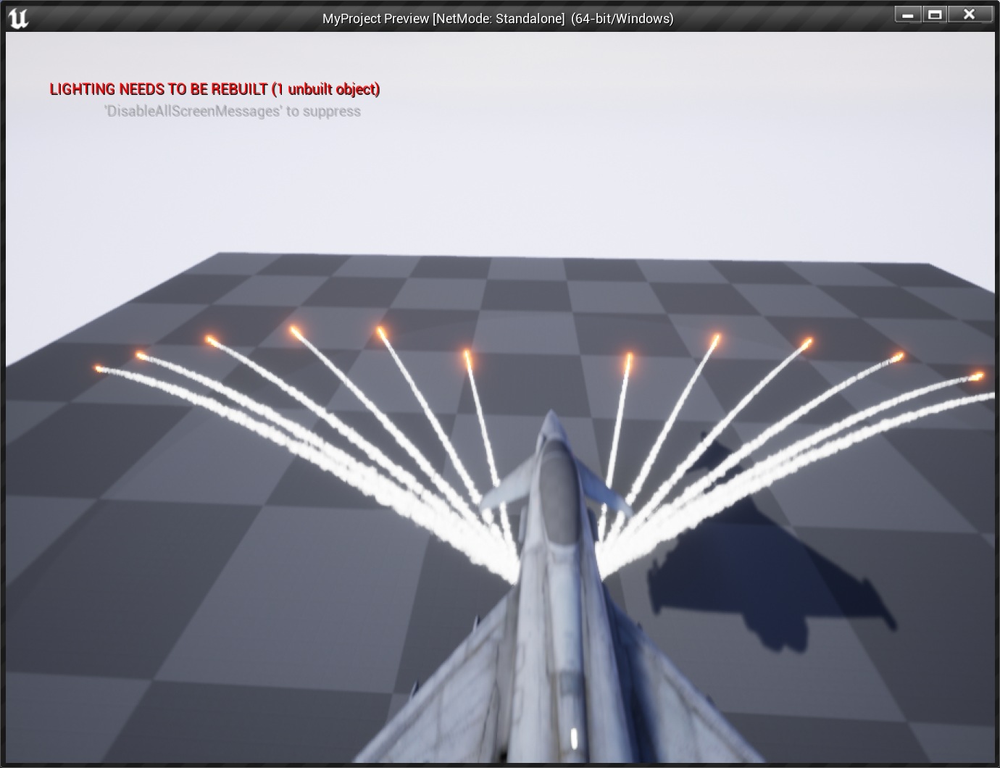

<!--more-->

## 尾焰

### 特点解析

  

  

  

飞机的尾焰呈现圆锥状，开始处较明亮，亮度和大小逐渐减小，中心较亮，有内焰和外焰，并且会有光圈的效果。

### Rings

1. 用一些平面来做光圈，导入 UE
   
   

2. 半透明材质，利用贴图形成光圈效果

   

3. 设置光圈朝向，添加初速度，设置颜色

   

### Flame Body

1. 火焰 Mesh 呈现子弹状，模拟尾焰逐渐变小的效果

   

2. 火焰材质需要呈现头部较浓，尾部较稀疏的效果，边界也要更浓，中心较散，并且为了形成火焰烧动的视觉效果，需要用到 Panner 偏移材质（可是这个材质节点看起来好复杂，孩子看不懂）
   
   - 首先自发光方面，先利用 Panner 采样贴图形成沿着 y 飘动的感觉，再和粒子颜色相乘

       

   - 然后是透明度方面 ，首先对采样到的透明度做一个线性平滑的操作，用了一个材质函数 LinearGradient，但是我没找到他怎么输入的

       

    - 根据顶点位置对透明度做消退处理，这部分确实没太看懂，但是大体思路是利用一张贴图，然后将 x、y 映射到 UV 上得到透明度，同时添加一点扰动

       
      
    - 利用做好的火焰 Mesh 做一个粒子效果，和光圈的生成方式类似，只不过 SpawnRate 会更多一点

       

    - 再做一个亮度很弱的

       

### Distortion

1. 这个粒子我没看出来什么效果？但是它应该是想要模拟火焰燃烧后形成的扭曲视效，材质上使用了折射接口，应该是通过这个物体看过去后面会形成折射效果
   
    

2. 然后加上扭曲粒子效果
   
    

## 炮弹

1. 观察真实的照片和需求方发来的图片效果，可以看到干扰弹的几个特点，1）头部较圆较亮 2）火焰从头到尾逐渐扩散，大小变大 3）亮度和浓度逐渐衰减

    

    

2. 新建一个 Fountain 系统，将初速度设为 x 轴负方向，减弱重力，然后是生成烟雾的老方法，利用 SubUV，修改 Sprite 的材质为 SubUV 材质，然后将 Sub Image Size 修改为 Sub 的数量，调整初速度和 scale size

    

3. 为头部添加闪光效果，加上 Color 组件，设置一条 Curve for Colors 即可

    

    

4. 新建导弹蓝图，为其添加 Niagara System 和 ProjectileMovement，设置初速度和最大速度，让球体作为根组件。然后找到飞机的蓝图，在飞机的关节中找到发射炮弹的关节，并添加 Socket。在蓝图中添加 Scene 组件，绑定对应的关节。然后绑定键盘事件，当按下 F 后 Spwan 导弹 Actor 即可，并且调整导弹的方位。 

    

## 小结

战机尾焰主要由四个部分构成，光圈、外焰、内焰、折射粒子组成，这里比较关键的点是材质的制作，利用纹理的移动、折射视效模拟火焰燃烧的效果，以及修改尾焰的透明度，让远处和内部的透明度降低。

## References

- [【UE5】战斗机尾焰起落架教程-军事迷福音](https://www.bilibili.com/video/BV15S4y1g7oM/?vd_source=b3a7866ea03eaa7c70c1f24f0895715f)
- [Missile Trajectory - Unreal Engine 4 Tutorial](https://www.youtube.com/watch?v=ok4MIUbXc3I)