<!--more-->

## Rings

1. 用一些平面来做光圈，导入 UE
   
   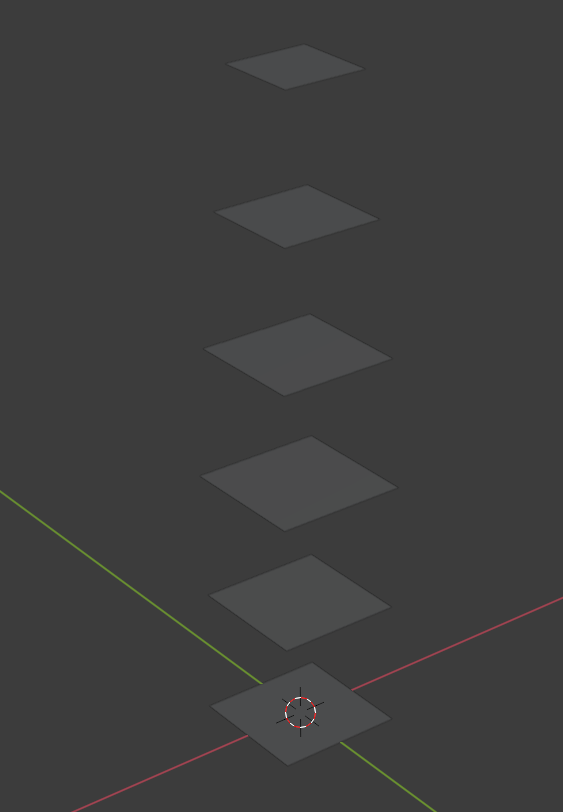

2. 半透明材质，利用贴图形成光圈效果

   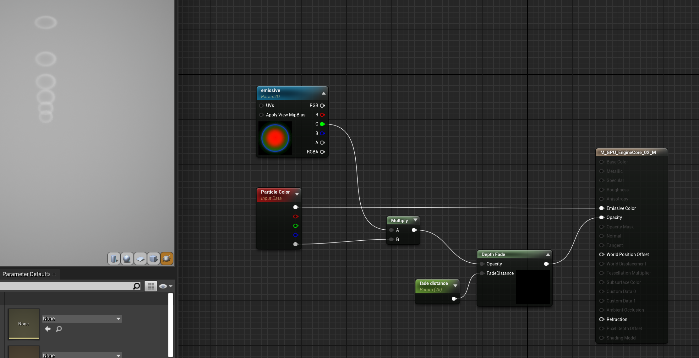

3. 设置光圈朝向，添加初速度，设置颜色

   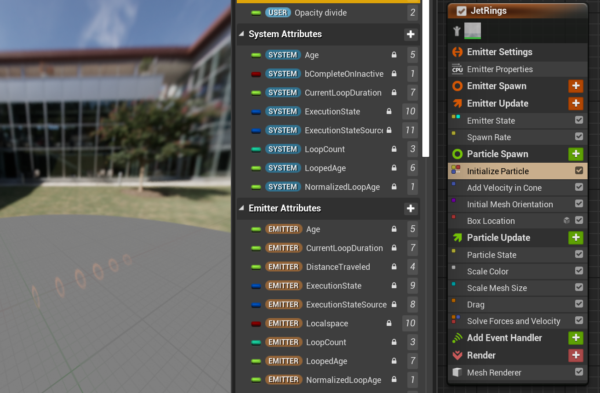

## Flame Body

1. 火焰 Mesh 呈现子弹状，模拟尾焰逐渐变小的效果

   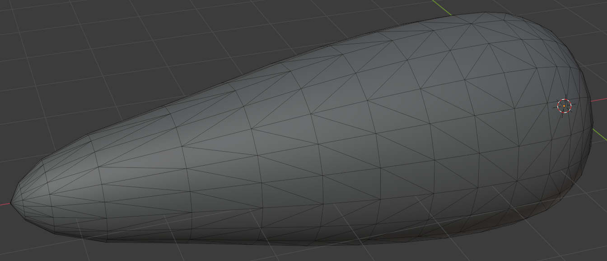

2. 火焰材质需要呈现头部较浓，尾部较稀疏的效果，边界也要更浓，中心较散，并且为了形成火焰烧动的视觉效果，需要用到 Panner 偏移材质（可是这个材质节点看起来好复杂，孩子看不懂）
   
   - 首先自发光方面，先利用 Panner 采样贴图形成沿着 y 飘动的感觉，再和粒子颜色相乘

       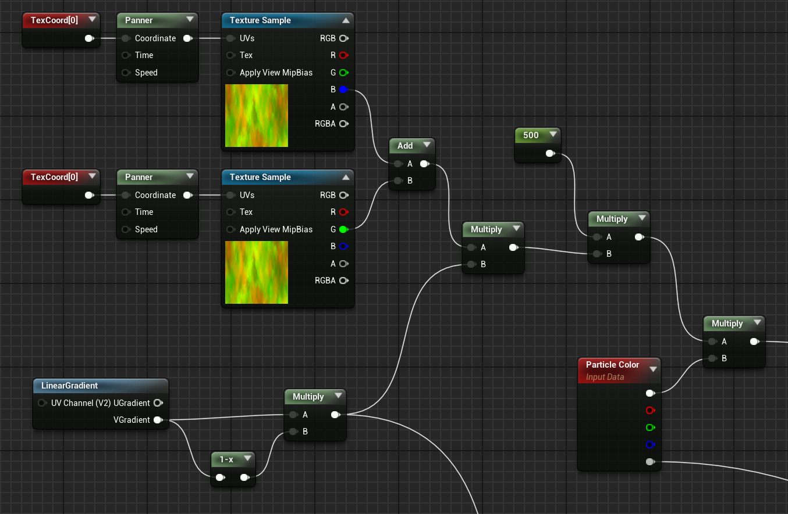

   - 然后是透明度方面 ，首先对采样到的透明度做一个线性平滑的操作，用了一个材质函数 LinearGradient，但是我没找到他怎么输入的

       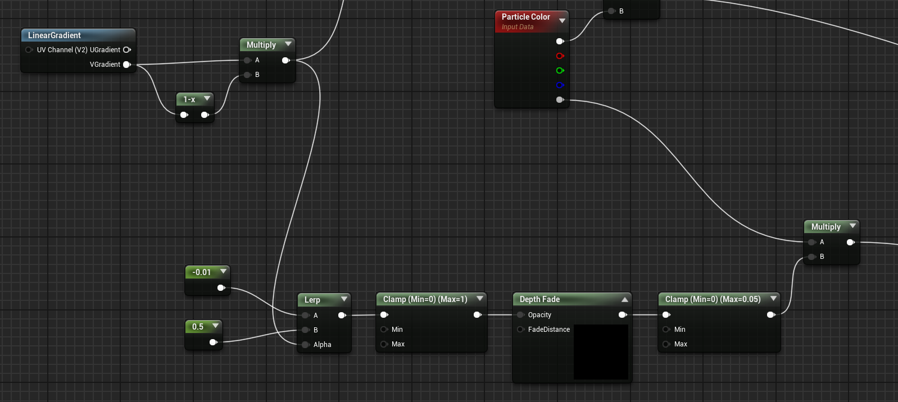

    - 根据顶点位置对透明度做消退处理，这部分确实没太看懂，但是大体思路是利用一张贴图，然后将 x、y 映射到 UV 上得到透明度，同时添加一点扰动

       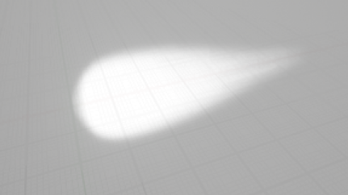
      
    - 利用做好的火焰 Mesh 做一个粒子效果，和光圈的生成方式类似，只不过 SpawnRate 会更多一点

       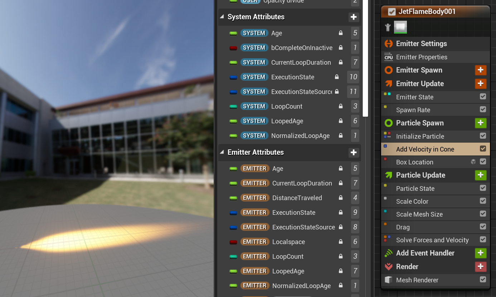

    - 再做一个亮度很弱的

       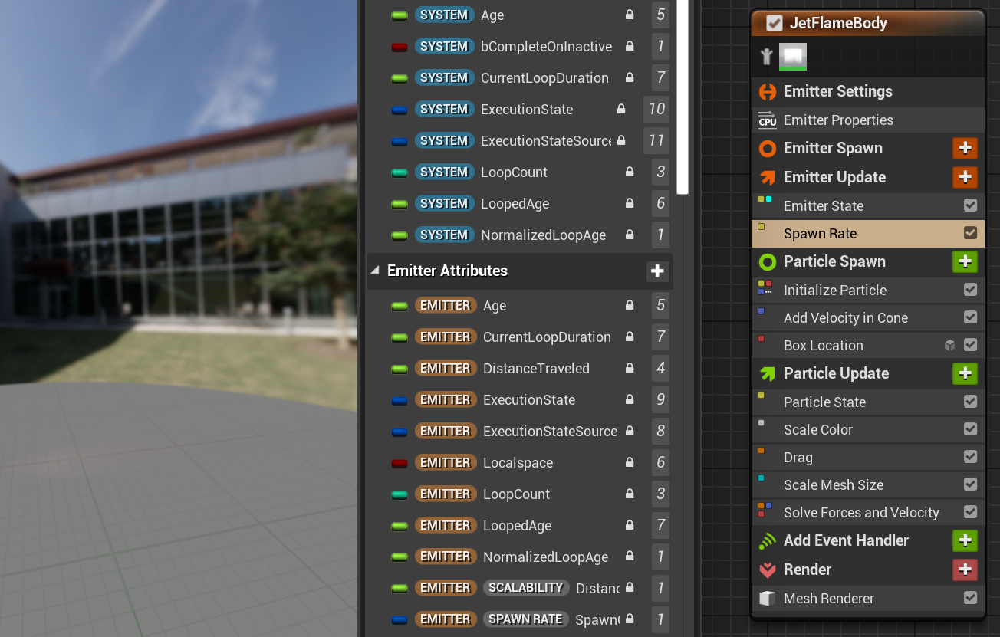

## Distortion

1. 这个粒子我没看出来什么效果？但是它应该是想要模拟火焰燃烧后形成的扭曲视效，材质上使用了折射接口，应该是通过这个物体看过去后面会形成折射效果
   
    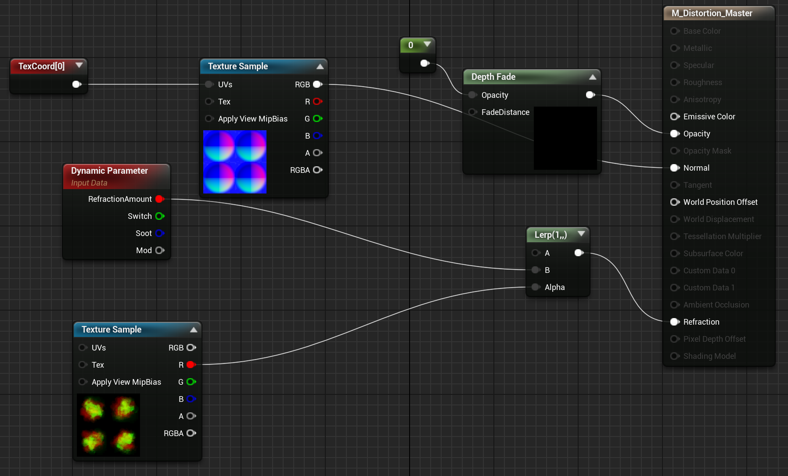

2. 然后加上扭曲粒子效果
   
    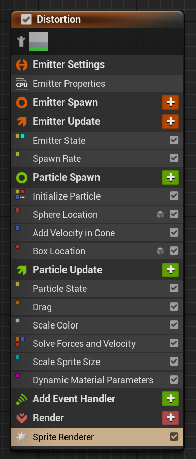

## 最终效果

## 小结

## References
