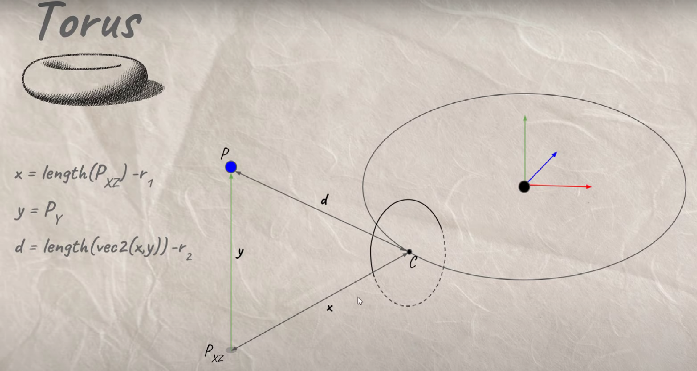

离上次更新已经过去快一周了，周一的时候和老师去了贵阳参观一家创业公司，也算是增长了一点见识，好羡慕他们可以全身心投入创业，最近我的老师、父母都在劝我去研究所、银行、当老师 or 读博，我说我想去大公司大企业，他们说男生可以去闯闯，女生还是需要找个安稳的工作，加上最近互联网行业也不景气，真是很迷茫我未来到底应该从事什么行业什么岗位，想去做游戏开发但是现实因素太多，而且留在上海的话房价又太贵，还要考虑生孩子的问题，真是太麻烦了 = =

但是不管怎样，学习图形学的过程是很快乐的，无论最终能否进入这个行业，当作一个兴趣爱好也是极好的？

<!--more-->

## Capsule

在上一篇我们知道了如何求点到球形的距离：


类似地，我们可以很方便地求出点到圆柱的距离，好像没有什么好说的，就是基础的向量运算，对 t 作 clamp 是一个小技巧，可以在两端形成半球形：


```GLSL
float sdCapsule(vec3 p, vec3 a, vec3 b, float r)
{
    vec3 ab = b - a;
    vec3 ap = p - a;
    
    float t = dot(ab, ap) / dot(ab, ab);
    t = clamp(t, 0., 1.);
    
    vec3 c = a + t * ab;
    
    return length(p - c) - r;
}
```


## Torus

圆环可以分解为两个圆形，一个是平面的圆，一个是竖直的圆，要求点到圆环表面的距离，x 是点投影在平面到圆心的距离减去半径，y 就是点在 y 轴方向的坐标，根据 x、y 求得 d，并减去竖直的圆的半径极为点到圆环表面的距离：



```GLSL
float sdTorus(vec3 p, vec2 r)
{
    float x = length(p.xz) - r.x;
    return length(vec2(x, p.y)) - r.y;
}
```


## Box

立方体需要一个 size 定义其长、宽、高，求点到立方体表面的距离只需要在立方体的三个方向的轴上进行投影然后减去 size，并且不考虑内部点，如果相减的结果为负数，则取 0：


```GLSL
float sdBox(vec3 p, vec3 size)
{
    return length(max(abs(p)-size, 0.));
}
```


## Cylinder

圆柱的计算方法与胶囊体类似，只不过需要考虑在上下两个面截断，所以在求距离的时候需要多考虑一些情况，x 就是 d，y 是以圆柱中心为对称点，然后向两端增加，在 A、B 点处都为 0，再往外逐渐增加，同时也需要考虑点在圆柱内部的情况：


```GLSL
float sdCylinder(vec3 p, vec3 a, vec3 b, float r)
{
    vec3 ab = b - a;
    vec3 ap = p - a;
    
    float t = dot(ab, ap) / dot(ab, ab);
    
    vec3 c = a + t * ab;
    
    float x = length(p - c) - r;
    float y = (abs(t - .5) - .5) * length(ab);
    float e = length(max(vec2(x, y), 0.));
    float i = min(max(x, y), 0.);
    
    return e+i;
}
```


完整代码如下：

```GLSL
#define MAX_STEPS 100
#define MAX_DIST 100.
#define SURF_DIST .01

float sdCapsule(vec3 p, vec3 a, vec3 b, float r)
{
    vec3 ab = b - a;
    vec3 ap = p - a;
    
    float t = dot(ab, ap) / dot(ab, ab);
    t = clamp(t, 0., 1.);
    
    vec3 c = a + t * ab;
    
    return length(p - c) - r;
}

float sdTorus(vec3 p, vec2 r)
{
    float x = length(p.xz) - r.x;
    return length(vec2(x, p.y)) - r.y;
}

float sdBox(vec3 p, vec3 size)
{
    return length(max(abs(p)-size, 0.));
}

float sdCylinder(vec3 p, vec3 a, vec3 b, float r)
{
    vec3 ab = b - a;
    vec3 ap = p - a;
    
    float t = dot(ab, ap) / dot(ab, ab);
    
    vec3 c = a + t * ab;
    
    float x = length(p - c) - r;
    float y = (abs(t - .5) - .5) * length(ab);
    float e = length(max(vec2(x, y), 0.));
    float i = min(max(x, y), 0.);
    
    return e+i;
}

float GetDist(vec3 p)
{
    vec4 s = vec4(0, 1, 6, 1);
    
    float sphereDist = length(p - s.xyz) - s.w;
    float planeDist = p.y;
    
    float cd = sdCapsule(p, vec3(0., 1., 6.), vec3(1., 2., 6.), .2);
    float td = sdTorus(p-vec3(0., .5, 6), vec2(1.5, .3));
    float bd = sdBox(p-vec3(-3., .75, 6), vec3(.75));
    float cyld = sdCylinder(p, vec3(0., .3, 3.), vec3(3., .3, 5), .3);

    
    float d = min(cd, planeDist);
    d = min(d, td);
    d = min(d, bd);
    d = min(d, cyld);

    return d;
}

float RayMarch(vec3 ro, vec3 rd)
{
    float d = 0.;
    
    for(int i = 0; i < MAX_STEPS; i++)
    {
        vec3 p = ro + rd * d;
        float ds = GetDist(p);
        d += ds;
        if(d > MAX_DIST || ds < SURF_DIST)
            break;
    }
    
    return d;
}

vec3 GetNormal(vec3 p)
{
    float d = GetDist(p);
    vec2 e = vec2(.01, 0.);
    
    vec3 n = d - vec3(
                 GetDist(p - e.xyy),
                 GetDist(p - e.yxy),
                 GetDist(p - e.yyx));
                 
    return normalize(n);
}

float GetLight(vec3 p)
{
    vec3 lightPos = vec3(0., 5., 6.);
    lightPos.xz += vec2(sin(iTime), cos(iTime))*2.;
    vec3 l = normalize(lightPos - p);
    vec3 n = GetNormal(p);
    
    float dif = clamp(dot(n, l), 0., 1.);
    float d = RayMarch(p + n * SURF_DIST * 2., l);
    if(d < length(lightPos-p))
        dif *= .1;
    return dif;
}

void mainImage( out vec4 fragColor, in vec2 fragCoord )
{
    vec2 uv = (fragCoord - .5*iResolution.xy) / iResolution.y;

    vec3 col = vec3(0.);
    
    vec3 ro = vec3(0, 2, 0);
    vec3 rd = normalize(vec3(uv.x, uv.y-.2, 1));
    
    float d = RayMarch(ro, rd);
    
    vec3 p = ro + rd * d;
    
    float dif = GetLight(p);
    
    col = vec3(dif);
    
    fragColor = vec4(col,1.0);
}
```

## 小结

Ray Marching 方法关键的点在于设计距离函数，本篇学习了几种简单的形状：球形、胶囊体、立方体、圆柱、圆环，原理上都不难，但是也有精巧之处。

## References

- [Ray Marching Simple Shapes](https://www.youtube.com/watch?v=Ff0jJyyiVyw&list=PLGmrMu-IwbguU_nY2egTFmlg691DN7uE5&index=24)