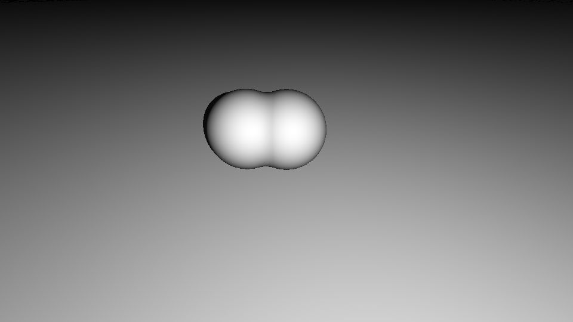

这一篇来学习一些几何操作。

<!--more-->

## 平移、旋转与缩放

要实现坐标变化，我们可以不用修改距离函数，而是对要计算的点作变化。平移只需要将顶点坐标减去要偏移的距离；旋转需要用到旋转矩阵，将坐标与旋转矩阵进行矩阵乘法；需要注意的是平移在旋转之前则是绕着自己的中心旋转的，平移在旋转之后则是绕着坐标原点旋转的；缩放则是将坐标乘以缩放系数，需要注意的是，当缩放后的形状过小，需要适量地减小 Ray Marching 的步长，否则容易出现穿过物体的现象，形成不正确的视觉效果。

```GLSL
mat2 Rot(float a)
{
    float s = sin(a);
    float c = cos(a);
    return mat2(c, -s, s, c);
}
float GetDist(vec3 p)
{
    // plane
    float pd = p.y;
    
    // box
    vec3 bp = p;
    bp -= vec3(0, .75, 3); // Translation
    bp.xz *= Rot(iTime); // Rotation
    float bd = sdBox(bp, vec3(.75));
    
    // sphere
    vec3 sp = p;
    sp -= vec3(0, 1, 1);
    sp *= vec3(1, 3, 5);
    float sd = length(sp) - 1.;
    
    float d = min(sd/5., pd);
    
    return d;
}
```


## Boolean Subtraction

减操作公式如下，好像没什么好解释的，但是设计挺巧妙的：


```GLSL
float GetDist(vec3 p)
{
    // plane
    float pd = p.y;
    
    // box
    vec3 bp = p;
    bp -= vec3(0, .75, 3); // Translation
    bp.xz *= Rot(iTime); // Rotation
    float bd = sdBox(bp, vec3(.75));
    
    // sphere
    vec3 sp = p;
    float sdA = length(sp-vec3(0, 1, 0)) - 1.;
    float sdB = length(sp-vec3(1, 1, 0)) - 1.;
    float sd = max(-sdA, sdB);
    
    float d = min(sd, pd);
    
    return d;
}
```


## Boolean Intersection

交操作取最大距离：


```GLSL
float GetDist(vec3 p)
{
    // plane
    float pd = p.y;
    
    // box
    vec3 bp = p;
    bp -= vec3(0, .75, 3); // Translation
    bp.xz *= Rot(iTime); // Rotation
    float bd = sdBox(bp, vec3(.75));
    
    // sphere
    vec3 sp = p;
    float sdA = length(sp-vec3(0, 1, 0)) - 1.;
    float sdB = length(sp-vec3(1, 1, 0)) - 1.;
    float sd = max(sdA, sdB);
    
    float d = min(sd, pd);
    
    return d;
}
```


## Boolean Union

并操作取最小距离：


```GLSL
float GetDist(vec3 p)
{
    // plane
    float pd = p.y;
    
    // box
    vec3 bp = p;
    bp -= vec3(0, .75, 3); // Translation
    bp.xz *= Rot(iTime); // Rotation
    float bd = sdBox(bp, vec3(.75));
    
    // sphere
    vec3 sp = p;
    float sdA = length(sp-vec3(0, 1, 0)) - 1.;
    float sdB = length(sp-vec3(1, 1, 0)) - 1.;
    float sd = min(sdA, sdB);
    
    float d = min(sd, pd);
    
    return d;
}
```


为了让相交的区域更加柔和，这里还可以添加一个函数 `smin` 按照比例混合二者的距离函数：

```GLSL
float smin( float a, float b, float k ) {
    float h = clamp( 0.5+0.5*(b-a)/k, 0., 1. );
    return mix( b, a, h ) - k*h*(1.0-h);
}
float GetDist(vec3 p)
{
    // plane
    float pd = p.y;
    
    // box
    vec3 bp = p;
    bp -= vec3(0, .75, 3); // Translation
    bp.xz *= Rot(iTime); // Rotation
    float bd = sdBox(bp, vec3(.75));
    
    // sphere
    vec3 sp = p;
    float sdA = length(sp-vec3(0, 1, 0)) - 1.;
    float sdB = length(sp-vec3(1, 1, 0)) - 1.;
    float sd = smin(sdA, sdB);
    
    float d = min(sd, pd);
    
    return d;
}
```



## Blend

要混合两种形状，可以按照一定比例 `mix` 二者的距离函数：

```GLSL
float GetDist(vec3 p)
{
    // plane
    float pd = p.y;
    
    // box
    vec3 bp = p;
    bp -= vec3(0, 1, 0); // Translation
    bp.xz *= Rot(iTime); // Rotation
    float bd = sdBox(bp, vec3(1));
    
    // sphere
    float sdA = length(p-vec3(0, 1, 0)) - 1.;
    float sdB = length(p-vec3(1, 1, 0)) - 1.;
    
    float sd = mix(sdA, bd, sin(iTime)*.5+.5);
    
    float d = min(sd, pd);

    return d;
}
```


## Demo

Copy 了一下大佬的 Demo，圆环很有意思，对 y 轴坐标进行缩放，形成弹跳的效果，同时这里用到了 gamma 矫正，形成的颜色更舒适。

```GLSL
#define MAX_STEPS 100
#define MAX_DIST 100.
#define SURF_DIST .01

mat2 Rot(float a) {
    float s = sin(a);
    float c = cos(a);
    return mat2(c, -s, s, c);
}

float smin( float a, float b, float k ) {
    float h = clamp( 0.5+0.5*(b-a)/k, 0., 1. );
    return mix( b, a, h ) - k*h*(1.0-h);
}

float sdCapsule(vec3 p, vec3 a, vec3 b, float r){
    vec3 ab = b - a;
    vec3 ap = p - a;
    
    float t = dot(ab, ap) / dot(ab, ab);
    t = clamp(t, 0., 1.);
    
    vec3 c = a + t * ab;
    
    return length(p - c) - r;
}

float sdTorus(vec3 p, vec2 r){
    float x = length(p.xz) - r.x;
    return length(vec2(x, p.y)) - r.y;
}

float sdBox(vec3 p, vec3 s) {
    p = abs(p)-s;
	return length(max(p, 0.))+min(max(p.x, max(p.y, p.z)), 0.);
}

float sdCylinder(vec3 p, vec3 a, vec3 b, float r){
    vec3 ab = b - a;
    vec3 ap = p - a;
    
    float t = dot(ab, ap) / dot(ab, ab);
    
    vec3 c = a + t * ab;
    
    float x = length(p - c) - r;
    float y = (abs(t - .5) - .5) * length(ab);
    float e = length(max(vec2(x, y), 0.));
    float i = min(max(x, y), 0.);
    
    return e+i;
}

float GetDist(vec3 p)
{
    float t = iTime;
    
    // ground plane
    float pd = p.y;
    
    // rotating box
    vec3 bp = p;
    bp -= vec3(0,.75,3);		// translation
    bp.xz *= Rot(iTime);		// rotation
    float rotate = sdBox(bp, vec3(.75));
    
    // jumping torus
    float y = -fract(t)*(fract(t)-1.);			// repeating parabola
    vec3 tp = p;
    tp -= vec3(-2, .8+3.*y, -2);				// translate
    float squash = 1.+smoothstep(.15, .0, y)*.5;// scale
    tp.y *= squash;
    tp = tp.xzy;								// flip torus on its side
    float scale = sdTorus(tp, vec2(1, .25))/squash;
    
    float morph = mix(
        length(p-vec3(4,1,2))-1., 
        sdBox(p-vec3(4,1,2), vec3(1,1,1)), 
        sin(t)*.5+.5
    );
    
    float subtract = max(
        -sdBox(p-vec3(1.+sin(t)*.5,1,0), vec3(1,.5,2)), 
        length(p-vec3(0,1,0))-1.
    );
    
    float intersect = max(
        sdBox(p-vec3(sin(iTime)*.5-3.,1,0), vec3(1,.5,2)), 
        length(p-vec3(-4,1,0))-1.
    );
    
    float blend = smin(
        length(p-vec3(3,1,-3))-.75,
        length(p-vec3(3.+sin(t),1.5,-3))-.5,
        .2
    );
    
    float d = min(morph, pd);
    d = min(d, subtract);
    d = min(d, intersect);
    d = min(d, rotate);
    d = min(d, scale);
    d = min(d, blend);
    
    return d;
}

float RayMarch(vec3 ro, vec3 rd) {
    float d = 0.;
    
    for(int i = 0; i < MAX_STEPS; i++)
    {
        vec3 p = ro + rd * d;
        float ds = GetDist(p);
        d += ds;
        if(d > MAX_DIST || ds < SURF_DIST)
            break;
    }
    
    return d;
}

vec3 GetNormal(vec3 p)
{
    float d = GetDist(p);
    vec2 e = vec2(.01, 0.);
    
    vec3 n = d - vec3(
                 GetDist(p - e.xyy),
                 GetDist(p - e.yxy),
                 GetDist(p - e.yyx));
                 
    return normalize(n);
}

float GetLight(vec3 p)
{
    vec3 lightPos = vec3(0., 5., 6.);
    vec3 l = normalize(lightPos - p);
    vec3 n = GetNormal(p);
    
    float dif = clamp(dot(n, l)*.5+.5, 0., 1.);
    float d = RayMarch(p + n * SURF_DIST * 2., l);
    if(p.y<.01 && d < length(lightPos-p))
        dif *= .5;
        
    return dif;
}

vec3 R(vec2 uv, vec3 p, vec3 l, float z) {
    vec3 f = normalize(l-p),
        r = normalize(cross(vec3(0,1,0), f)),
        u = cross(f,r),
        c = p+f*z,
        i = c + uv.x*r + uv.y*u,
        d = normalize(i-p);
    return d;
}

void mainImage( out vec4 fragColor, in vec2 fragCoord )
{
    vec2 uv = (fragCoord - .5*iResolution.xy) / iResolution.y;

    vec3 col = vec3(0.);
    
    vec2 m = iMouse.xy / iResolution.xy;
    
    vec3 ro = vec3(0, 4, -5);
    ro.yz *= Rot(-m.y+.4);
    ro.xz *= Rot(iTime*.2-m.x*6.2831);

    vec3 rd = R(uv, ro, vec3(0,0,0), .7);
    
    float d = RayMarch(ro, rd);
    
    vec3 p = ro + rd * d;
    
    if(d<MAX_DIST) {
    	vec3 p = ro + rd * d;
    
    	float dif = GetLight(p);
    	col = vec3(dif);
    }
    
    col = pow(col, vec3(.4545));	// gamma correction
    
    fragColor = vec4(col,1.0);
}
```


## 小结

本篇学习了一些基础操作，在不改变距离函数的情况下，通过调整点的位置，从而实现平移、旋转、缩放、差、交、并、混合等操作，可以通过这些技巧实现有趣的效果！

## References

- [RayMarching: Basic Operators](https://www.youtube.com/watch?v=AfKGMUDWfuE&list=PLGmrMu-IwbguU_nY2egTFmlg691DN7uE5&index=25)