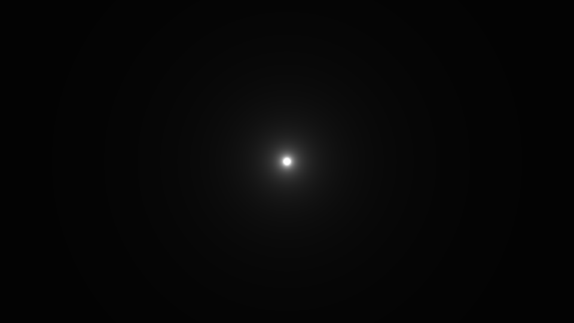
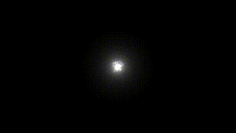
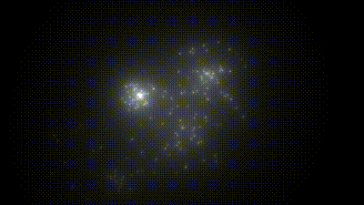

<!--more-->

## 模拟光源

如何模拟一个光源呢？仍然可以用到我们之前所学的知识：画圆。我们将一个小区域内的像素点设置得较亮即可模拟光源的效果：

```GLSL
void mainImage( out vec4 fragColor, in vec2 fragCoord )
{
    vec2 uv = (fragCoord-.5*iResolution.xy)/iResolution.y;

    vec3 col = vec3(0.);
    
    col += .01/length(uv);

    fragColor = vec4(col,1.0);
}
```



## 模拟烟花

可以将烟花视为很多小光源构成，每个小光源进行随机偏移，这里用一个简易的 Hash 模拟随机数，`Hash12()` 是方形区域内的随机点，`Hash12_Polar()` 是圆形区域内的随机点：

```GLSL
vec2 Hash12(float t) {
    float x = fract(sin(t*4.3)*43.2);
    float y = fract(sin((t+x)*1.3)*63.2);
    
    return vec2(x, y);
}

vec2 Hash12_Polar(float t){
    float a = fract(sin(t*4.3)*43.2)*6.2;
    float d = fract(sin((t+a)*1.3)*3.9);
    
    return vec2(sin(a), cos(a))*d;
}
```

设置烟花粒子的数量，将 uv 随时间进行随机偏移，便可以模拟类似烟花的效果了：

```GLSL
void mainImage( out vec4 fragColor, in vec2 fragCoord )
{
    vec2 uv = (fragCoord-.5*iResolution.xy)/iResolution.y;

    vec3 col = vec3(0.);
    float t = fract(iTime);

    
    for(float i = 0.; i < NUM_PARTICLES; i++){
        vec2 dir = Hash12_Polar(i+1.)*.5;
        float d = length(uv-dir*t);

        float brightness = mix(.0005, .002, smoothstep(.05, 0., t));
        
        brightness *= sin(t*20.+i)*.5+.5;
        brightness *= smoothstep(1., .5, t);
        col += brightness/d;
    }

    fragColor = vec4(col,1.0);
}
```



同时我们可以模拟多簇烟花，设置烟花的数量，每簇烟花的中心位置也进行随机偏移，还可以设置烟花的颜色：

```GLSL
#define NUM_EXPLOSIONS 5.
#define NUM_PARTICLES 75.

vec2 Hash12(float t) {
    float x = fract(sin(t*4.3)*43.2);
    float y = fract(sin((t+x)*1.3)*63.2);
    
    return vec2(x, y);
}

vec2 Hash12_Polar(float t){
    float a = fract(sin(t*4.3)*43.2)*6.2;
    float d = fract(sin((t+a)*1.3)*3.9);
    
    return vec2(sin(a), cos(a))*d;
}

float Explosion(vec2 uv, float t){
    float sparks = 0.;
    for(float i = 0.; i < NUM_PARTICLES; i++){
        vec2 dir = Hash12_Polar(i+1.)*.5;
        float d = length(uv-dir*t);

        float brightness = mix(.0005, .002, smoothstep(.05, 0., t));
        
        brightness *= sin(t*20.+i)*.5+.5;
        brightness *= smoothstep(1., .5, t);
        sparks += brightness/d;
    }
    return sparks;
}

void mainImage( out vec4 fragColor, in vec2 fragCoord )
{
    vec2 uv = (fragCoord-.5*iResolution.xy)/iResolution.y;
    
    vec3 col = vec3(0);
    
    for(float i = 0.; i < NUM_EXPLOSIONS; i++){
        float t = iTime+i/NUM_EXPLOSIONS;
        float ft = floor(t);
        vec3 color = sin(4. * vec3(.34, .54, .43)*ft)*.25+.75;
        vec2 offs = Hash12(i+1.+ft*NUM_EXPLOSIONS)-.5;
        col += Explosion(uv-offs, fract(t)) * color;
    } 
    
    col *= 1.5;
    fragColor = vec4(col,1.0);
}
```



## 小结

本篇内容比较简单，但是效果还挺好看的，学习了模拟烟花的方法，以及设计 Hash 函数模拟随机数，`floor()` 和 `fract()` 是很有用的工具，同时可以利用 uv 和 iTime 形成动态的效果。

## References

- [Coding a fireworks effect](https://www.youtube.com/watch?v=xDxAnguEOn8&list=PLGmrMu-IwbguU_nY2egTFmlg691DN7uE5&index=42)