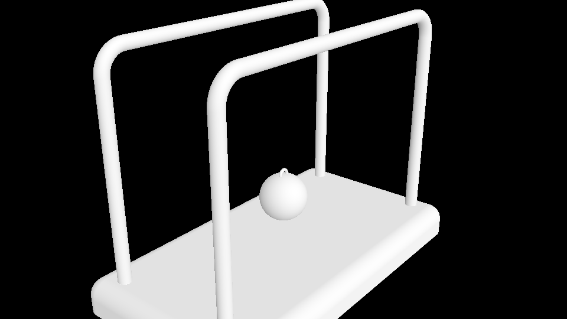

<!--more-->

## 底座

底座的基础形是立方体，我们利用之前学习的画立方体的方法，绘制一个扁平的立方体：

```GLSL
#define MAX_STEPS 100
#define MAX_DIST 100.
#define SURF_DIST .001
#define TAU 6.283185
#define PI 3.141592
#define S smoothstep
#define T iTime

mat2 Rot(float a) {
    float s=sin(a), c=cos(a);
    return mat2(c, -s, s, c);
}

float sdBox(vec3 p, vec3 s) {
    p = abs(p)-s;
	return length(max(p, 0.))+min(max(p.x, max(p.y, p.z)), 0.);
}

float GetDist(vec3 p) {
    float d = sdBox(p, vec3(1, .1, .5));
    
    return d;
}

float RayMarch(vec3 ro, vec3 rd) {
	float dO=0.;
    
    for(int i=0; i<MAX_STEPS; i++) {
    	vec3 p = ro + rd*dO;
        float dS = GetDist(p);
        dO += dS;
        if(dO>MAX_DIST || abs(dS)<SURF_DIST) break;
    }
    
    return dO;
}

vec3 GetNormal(vec3 p) {
    vec2 e = vec2(.001, 0);
    vec3 n = GetDist(p) - 
        vec3(GetDist(p-e.xyy), GetDist(p-e.yxy),GetDist(p-e.yyx));
    
    return normalize(n);
}

vec3 GetRayDir(vec2 uv, vec3 p, vec3 l, float z) {
    vec3 
        f = normalize(l-p),
        r = normalize(cross(vec3(0,1,0), f)),
        u = cross(f,r),
        c = f*z,
        i = c + uv.x*r + uv.y*u;
    return normalize(i);
}

void mainImage( out vec4 fragColor, in vec2 fragCoord )
{
    vec2 uv = (fragCoord-.5*iResolution.xy)/iResolution.y;
	vec2 m = iMouse.xy/iResolution.xy;

    vec3 ro = vec3(0, 3, -3);
    ro.yz *= Rot(-m.y*PI+1.);
    ro.xz *= Rot(-m.x*TAU);
    
    vec3 rd = GetRayDir(uv, ro, vec3(0,0.75,0), 2.);
    vec3 col = vec3(0);
   
    float d = RayMarch(ro, rd);

    if(d<MAX_DIST) {
        vec3 p = ro + rd * d;
        vec3 n = GetNormal(p);
        vec3 r = reflect(rd, n);

        float dif = dot(n, normalize(vec3(1,2,3)))*.5+.5;
        col = vec3(dif);
    }
    
    col = pow(col, vec3(.4545));	// gamma correction
    
    fragColor = vec4(col,1.0);
}
```


为了让周边形成平滑的圆角，可以将计算得到的距离减去一个较小值：

```GLSL
float GetDist(vec3 p) {
    float d = sdBox(p, vec3(1, .1, .5))-.1;
    
    return d;
}
```


然后利用布尔操作——Subtraction，将下半的底座裁掉：

```GLSL
float GetDist(vec3 p) {
    float d = sdBox(p, vec3(1, .1, .5))-.1;
    
    d = max(d, -p.y); // cut off the bottom
    
    return d;
}
```


## 柱子

画柱子的思路可以从二维 box 出发，然后将 box 边界加粗，改写一下 `sdBox` 用以绘制二维矩形：

```GLSL
float sdBox(vec2 p, vec2 s) {
    p = abs(p)-s;
	return length(max(p, 0.))+min(max(p.x, p.y), 0.);
}
float GetDist(vec3 p) {
    float d = length(vec2(sdBox(p.xy, vec2(.8, 1.4)), p.z));
    
    return d;
}

```


将距离函数减去一个较小值用于将边界加粗，并且将矩形边角变得圆滑，同时利用 `abs` 绘制两个对称的柱子：

```GLSL
float GetDist(vec3 p) {
    float d = length(vec2(sdBox(p.xy, vec2(.8, 1.4))-.15, abs(p.z)-.4))-.04;
    
    return d;
}
```


使用布尔操作——Union将柱子与底座组合起来：

```GLSL
float GetDist(vec3 p) {
    float d = sdBox(p, vec3(1, .1, .5))-.1;
    
    float bar = length(vec2(sdBox(p.xy, vec2(.8, 1.4))-.15, abs(p.z)-.4))-.04;
    
    d = min(d, bar);
    d = max(d, -p.y); // cut off the bottom
    
    return d;
}
```


## 球

中间的球由一个主要的球形和上方的圆环构成：

```GLSL
float sdBall(vec3 p){
    float d = length(p)-.15;
    float ring = length(vec2(length(p.xy-vec2(0., .15))-.03, p.z))-.01;
    
    d = min(d, ring);
    
    return d;
}

float GetDist(vec3 p) {
    float base = sdBox(p, vec3(1, .1, .5))-.1;
    float bar = length(vec2(sdBox(p.xy, vec2(.8, 1.4))-.15, abs(p.z)-.4))-.04;
    
    float balls = sdBall(p-vec3(0., .5, 0.));
    
    float d = min(base, bar);
    d = min(d, balls);
    
    d = max(d, -p.y); // cut off the bottom
    
    return d;
}
```



然后添加两端旋转球的绳子，这里可以用之前学到的胶囊体代替细绳：

```GLSL
float sdLineSeg(vec3 p, vec3 a, vec3 b){
    vec3 ap = p - a, ab = b - a;
    float t = clamp(0., 1., dot(ap, ab) / dot(ab, ab));
    vec3 c = a + ab*t;
    return length(p - c); // distanace(p, c)
}

float sdBall(vec3 p){
    float d = length(p)-.15;
    float ring = length(vec2(length(p.xy-vec2(0., .15))-.03, p.z))-.01;
    
    p.z = abs(p.z);
    float line = sdLineSeg(p, vec3(0, .15, 0), vec3(0, 1.01, .4))-.005;
    
    d = min(d, ring);
    d = min(d, line);
    
    return d;
}

float GetDist(vec3 p) {
    float base = sdBox(p, vec3(1, .1, .5))-.1;
    float bar = length(vec2(sdBox(p.xy, vec2(.8, 1.4))-.15, abs(p.z)-.4))-.04;
    
    float balls = sdBall(p-vec3(0., .5, 0.));
    
    float d = min(base, bar);
    d = min(d, balls);
    
    d = max(d, -p.y); // cut off the bottom
    
    return d;
}
```


利用旋转矩阵，可以模拟小球左右摆动的效果，这里需要注意的是 `Rot` 是以物体中心为旋转中心，而这里我们需要以绳子顶部为旋转中心，所以在旋转之前，我们需要将 p 进行一个偏移，在旋转之后再将 p 恢复，以 `sin(iTime)` 为旋转角度使小球左右摆动：

```GLSL
float sdBall(vec3 p, float a){
    p.y -= 1.01;
    p.xy *= Rot(a);
    p.y += 1.01;


    float d = length(p)-.15;
    float ring = length(vec2(length(p.xy-vec2(0., .15))-.03, p.z))-.01;
    
    p.z = abs(p.z);
    float line = sdLineSeg(p, vec3(0, .15, 0), vec3(0, 1.01, .4))-.005;
    
    d = min(d, ring);
    d = min(d, line);
    
    return d;
}

float GetDist(vec3 p) {
    float base = sdBox(p, vec3(1, .1, .5))-.1;
    float bar = length(vec2(sdBox(p.xy, vec2(.8, 1.4))-.15, abs(p.z)-.4))-.04;
    
    float a = sin(iTime);
    float balls = sdBall(p-vec3(0., .5, 0.), a);
    
    float d = min(base, bar);
    d = min(d, balls);
    
    d = max(d, -p.y); // cut off the bottom
    
    return d;
}
```


接下来就可以添加多个球了！为了模拟牛顿摆的物理效果，我们让最右边的小球只能向右摆，最左边的小球只能向左摆，怎样巧妙地实现呢？因为我们地摆动角度取自 `sin(iTime)`，它的取值范围是 -1~1，向左的范围是 -1~0，向右的范围是 0~1，那么我们就可以使用 `min` 和 `max` 来截断旋转范围。

然后中间的三个球只进行一个轻微的摆动即可，并且与两端的球挨着的球的旋转角度可以综合两端的球的摆动角度：

```GLSL
float GetDist(vec3 p) {
    float base = sdBox(p, vec3(1, .1, .5))-.1;
    float bar = length(vec2(sdBox(p.xy, vec2(.8, 1.4))-.15, abs(p.z)-.4))-.04;
    
    float a = sin(iTime*3.),
          a1 = min(0., a),
          a5 = max(0., a);
          
    float b1 = sdBall(p-vec3(.6, .5, 0.), a1),
          b2 = sdBall(p-vec3(.3, .5, 0.), (a+a1)*.05),
          b3 = sdBall(p-vec3(0, .5, 0.), a*.05),
          b4 = sdBall(p-vec3(-.3, .5, 0.), (a+a5)*.05),
          b5 = sdBall(p-vec3(-.6, .5, 0.), a5);
    
    float balls = min(b1, min(b2, min(b3, min(b4, b5))));
    
    float d = min(base, bar);
    d = min(d, balls);
    
    d = max(d, -p.y); // cut off the bottom
    
    return d;
}
```


## 小结

## References

- [Newton's Cradle: Modeling & Animation](https://www.youtube.com/watch?v=nd7Auhb9YN8&list=PLGmrMu-IwbguU_nY2egTFmlg691DN7uE5&index=45)