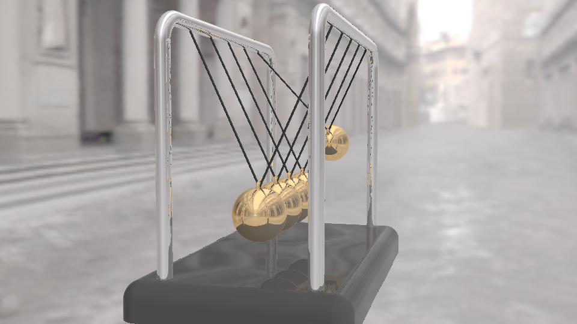

<!--more-->

## 设置材质

如何给特定物体设置我们想要的材质呢？我们可以判断当前这个点是否为我们想要绘制的某个物体，思路就是判断我们最终求得的距离与哪个物体表面的距离是相等的。

Copy 一份 `GetDist` 改写为 `GetMat`，首先定义几种材质序号，然后在 `GetMat` 中判断最终的 d 属于哪个物体，返回对应的材质。需要注意的是，因为我们绘制球和细绳是在统一个函数中，所以光是一个距离并不能判断到底是小球还是细绳，因此我们还需要改写一下 `sdBall`，将其返回值增加一个维度，用于记录是小球还是细绳材质。

因为返回值改变了，对应地需要修改一下调用函数的地方，取出适合的值，最终根据得到的材质为像素点赋予不同的颜色：

```GLSL
const int MAT_BASE = 1;
const int MAT_BAR = 2;
const int MAT_BALL = 3;
const int MAT_LINE = 4;

vec2 sdBall(vec3 p, float a){
    p.y -= 1.01;
    p.xy *= Rot(a);
    p.y += 1.01;


    float ball = length(p)-.15;
    float ring = length(vec2(length(p.xy-vec2(0., .15))-.03, p.z))-.01;
    ball = min(ball, ring);
    
    p.z = abs(p.z);
    float line = sdLineSeg(p, vec3(0, .15, 0), vec3(0, 1.01, .4))-.005;
    
    float d = min(ball, line);
    
    return vec2(d, d == ball ? MAT_BALL : MAT_LINE);
}

float GetDist(vec3 p) {
    float base = sdBox(p, vec3(1, .1, .5))-.1;
    float bar = length(vec2(sdBox(p.xy, vec2(.8, 1.4))-.15, abs(p.z)-.4))-.04;
    
    float a = sin(iTime*3.),
          a1 = min(0., a),
          a5 = max(0., a);
          
    float b1 = sdBall(p-vec3(.6, .5, 0.), a1).x,
          b2 = sdBall(p-vec3(.3, .5, 0.), (a+a1)*.05).x,
          b3 = sdBall(p-vec3(0, .5, 0.), a*.05).x,
          b4 = sdBall(p-vec3(-.3, .5, 0.), (a+a5)*.05).x,
          b5 = sdBall(p-vec3(-.6, .5, 0.), a5).x;
    
    float balls = min(b1, min(b2, min(b3, min(b4, b5))));
    
    float d = min(base, bar);
    d = min(d, balls);
    
    d = max(d, -p.y); // cut off the bottom
    
    return d;
}

vec2 Min(vec2 a, vec2 b){
    return a.x < b.x ? a : b;
}

int GetMat(vec3 p) {
    float base = sdBox(p, vec3(1, .1, .5))-.1;
    float bar = length(vec2(sdBox(p.xy, vec2(.8, 1.4))-.15, abs(p.z)-.4))-.04;
    
    float a = sin(iTime*3.),
          a1 = min(0., a),
          a5 = max(0., a);
          
    vec2 b1 = sdBall(p-vec3(.6, .5, 0.), a1),
          b2 = sdBall(p-vec3(.3, .5, 0.), (a+a1)*.05),
          b3 = sdBall(p-vec3(0, .5, 0.), a*.05),
          b4 = sdBall(p-vec3(-.3, .5, 0.), (a+a5)*.05),
          b5 = sdBall(p-vec3(-.6, .5, 0.), a5);
    
    vec2 balls = Min(b1, Min(b2, Min(b3, Min(b4, b5))));
    
    float d = min(base, bar);
    d = min(d, balls.x);
    
    base = max(base, -p.y);
    
    d = max(d, -p.y); // cut off the bottom
    
    int mat = 0;
    
    if(d == base)
        mat = MAT_BASE;
    else if(d == bar)
        mat = MAT_BAR;
    else if(d == balls.x)
        mat = int(balls.y);
    
    return mat;
}

void mainImage( out vec4 fragColor, in vec2 fragCoord )
{
    vec2 uv = (fragCoord-.5*iResolution.xy)/iResolution.y;
	vec2 m = iMouse.xy/iResolution.xy;

    vec3 ro = vec3(0, 3, -3);
    ro.yz *= Rot(-m.y*PI+1.);
    ro.xz *= Rot(-m.x*TAU);
    
    vec3 rd = GetRayDir(uv, ro, vec3(0,0.75,0), 2.);
    vec3 col = vec3(0);
   
    float d = RayMarch(ro, rd);

    if(d<MAX_DIST) {
        vec3 p = ro + rd * d;
        vec3 n = GetNormal(p);
        vec3 r = reflect(rd, n);

        float dif = dot(n, normalize(vec3(1,2,3)))*.5+.5;
        col = vec3(dif);
        
        int mat = GetMat(p);
        
        if(mat == MAT_BASE)
            col *= .1;
        else if(mat == MAT_BAR)
            col *= vec3(0, 0, 1);
        else if(mat == MAT_BALL)
            col *= vec3(1, 0, 0);
        else if(mat == MAT_LINE)
            col *= vec3(0, 1, 0);
        
    }
    
    col = pow(col, vec3(.4545));	// gamma correction
    
    fragColor = vec4(col,1.0);
}
```


## 环境贴图

在下方点击 iChannel0，选择一个 Cubemap，Cubemap 就是由一个正方体构成的，每一个面有一张环境贴图，这些贴图可以无缝衔接：


我们可以使用 `texture(iChannel, direction)` 直接获取这根光线对应的环境贴图像素颜色：

```GLSL
void mainImage( out vec4 fragColor, in vec2 fragCoord )
{
    vec2 uv = (fragCoord-.5*iResolution.xy)/iResolution.y;
	vec2 m = iMouse.xy/iResolution.xy;

    vec3 ro = vec3(0, 3, -3);
    ro.yz *= Rot(-m.y*PI+1.);
    ro.xz *= Rot(-m.x*TAU);
    
    vec3 rd = GetRayDir(uv, ro, vec3(0,0.75,0), 2.);
    vec3 col = texture(iChannel0, rd).rgb;
   
    float d = RayMarch(ro, rd);

    if(d<MAX_DIST) {
        vec3 p = ro + rd * d;
        vec3 n = GetNormal(p);
        vec3 r = reflect(rd, n);

        float dif = dot(n, normalize(vec3(1,2,3)))*.5+.5;
        col = vec3(dif);
        
        int mat = GetMat(p);
        
        if(mat == MAT_BASE)
            col *= .1;
        else if(mat == MAT_BAR)
            col *= vec3(0, 0, 1);
        else if(mat == MAT_BALL)
            col *= vec3(1, 0, 0);
        else if(mat == MAT_LINE)
            col *= vec3(0, 1, 0);
        
    }
    
    col = pow(col, vec3(.4545));	// gamma correction
    
    fragColor = vec4(col,1.0);
}
```


当光线打到物体上后会发生反射折射，这里我们考虑光线的镜面反射，使用 `reflect(raydir, normal)` 得到反射后的光线，然后再对环境贴图做一次采样即可，并将最终得到的颜色赋给对应像素：

```GLSL
void mainImage( out vec4 fragColor, in vec2 fragCoord )
{
    vec2 uv = (fragCoord-.5*iResolution.xy)/iResolution.y;
	vec2 m = iMouse.xy/iResolution.xy;

    vec3 ro = vec3(0, 3, -3);
    ro.yz *= Rot(-m.y*PI+1.);
    ro.xz *= Rot(-m.x*TAU);
    
    vec3 rd = GetRayDir(uv, ro, vec3(0,0.75,0), 2.);
    vec3 col = texture(iChannel0, rd).rgb;
   
    float d = RayMarch(ro, rd);

    if(d<MAX_DIST) {
        vec3 p = ro + rd * d;
        vec3 n = GetNormal(p);
        vec3 r = reflect(rd, n);
        vec3 ref = texture(iChannel0, r).rgb;

        float dif = dot(n, normalize(vec3(1,2,3)))*.5+.5;
        col = vec3(dif);
        
        int mat = GetMat(p);
        
        if(mat == MAT_BASE)
            col = .1*ref;
        else if(mat == MAT_BAR)
            col = ref;
        else if(mat == MAT_BALL)
            col = ref;
        else if(mat == MAT_LINE)
            col *= .05;
    }
    
    col = pow(col, vec3(.4545));	// gamma correction
    
    fragColor = vec4(col,1.0);
}
```


整理一下所有代码，将计算距离和获取材质的方法合在一起，封装一下计算颜色的方法，使代码更简洁，完整代码如下：

```GLSL
#define MAX_STEPS 100
#define MAX_DIST 100.
#define SURF_DIST .001
#define TAU 6.283185
#define PI 3.141592

#define S smoothstep
#define T iTime

const int MAT_BASE = 1;
const int MAT_BAR = 2;
const int MAT_BALL = 3;
const int MAT_LINE = 4;

mat2 Rot(float a) {
    float s=sin(a), c=cos(a);
    return mat2(c, -s, s, c);
}

float sdBox(vec3 p, vec3 s) {
    p = abs(p)-s;
	return length(max(p, 0.))+min(max(p.x, max(p.y, p.z)), 0.);
}

float sdBox(vec2 p, vec2 s) {
    p = abs(p)-s;
	return length(max(p, 0.))+min(max(p.x, p.y), 0.);
}

float sdLineSeg(vec3 p, vec3 a, vec3 b){
    vec3 ap = p - a, ab = b - a;
    float t = clamp(0., 1., dot(ap, ab) / dot(ab, ab));
    vec3 c = a + ab*t;
    return length(p - c); // distanace(p, c)
}

vec2 sdBall(vec3 p, float a){
    p.y -= 1.01;
    p.xy *= Rot(a);
    p.y += 1.01;


    float ball = length(p)-.15;
    float ring = length(vec2(length(p.xy-vec2(0., .15))-.03, p.z))-.01;
    ball = min(ball, ring);
    
    p.z = abs(p.z);
    float line = sdLineSeg(p, vec3(0, .15, 0), vec3(0, 1.01, .4))-.005;
    
    float d = min(ball, line);
    
    return vec2(d, d == ball ? MAT_BALL : MAT_LINE);
}

vec2 Min(vec2 a, vec2 b){
    return a.x < b.x ? a : b;
}

vec2 GetDist(vec3 p) {
    float base = sdBox(p, vec3(1, .1, .5))-.1;
    float bar = length(vec2(sdBox(p.xy, vec2(.8, 1.4))-.15, abs(p.z)-.4))-.04;
    
    float a = sin(iTime*3.),
          a1 = min(0., a),
          a5 = max(0., a);
          
    vec2 b1 = sdBall(p-vec3(.6, .5, 0.), a1),
          b2 = sdBall(p-vec3(.3, .5, 0.), (a+a1)*.05),
          b3 = sdBall(p-vec3(0, .5, 0.), a*.05),
          b4 = sdBall(p-vec3(-.3, .5, 0.), (a+a5)*.05),
          b5 = sdBall(p-vec3(-.6, .5, 0.), a5);
    
    vec2 balls = Min(b1, Min(b2, Min(b3, Min(b4, b5))));
    
    float d = min(base, bar);
    d = min(d, balls.x);
    
    base = max(base, -p.y);
    
    d = max(d, -p.y); // cut off the bottom
    
    int mat = 0;
    
    if(d == base)
        mat = MAT_BASE;
    else if(d == bar)
        mat = MAT_BAR;
    else if(d == balls.x)
        mat = int(balls.y);
    
    return vec2(d, mat);
}

vec2 RayMarch(vec3 ro, vec3 rd) {
	float dO=0.;
    vec2 dsMat = vec2(0);
    
    for(int i=0; i<MAX_STEPS; i++) {
    	vec3 p = ro + rd*dO;
        dsMat = GetDist(p);
        
        dO += dsMat.x;
        if(dO>MAX_DIST || abs(dsMat.x)<SURF_DIST) break;
    }
    
    return vec2(dO, dsMat.y);
}

vec3 GetNormal(vec3 p) {
    vec2 e = vec2(.001, 0);
    vec3 n = GetDist(p).x - 
        vec3(GetDist(p-e.xyy).x, GetDist(p-e.yxy).x,GetDist(p-e.yyx).x);
    
    return normalize(n);
}

vec3 GetRayDir(vec2 uv, vec3 p, vec3 l, float z) {
    vec3 
        f = normalize(l-p),
        r = normalize(cross(vec3(0,1,0), f)),
        u = cross(f,r),
        c = f*z,
        i = c + uv.x*r + uv.y*u;
    return normalize(i);
}

vec3 Render(vec3 ro, vec3 rd){
    vec3 col = texture(iChannel0, rd).rgb;
    vec2 dMat = RayMarch(ro, rd);

    if(dMat.x<MAX_DIST) {
        vec3 p = ro + rd * dMat.x;
        vec3 n = GetNormal(p);
        vec3 r = reflect(rd, n);
        vec3 ref = texture(iChannel0, r).rgb;

        float dif = dot(n, normalize(vec3(1,2,3)))*.5+.5;
        col = vec3(dif);
        
        int mat = int(dMat.y);
        
        if(mat == MAT_BASE)
            col = .1*ref;
        else if(mat == MAT_BAR)
            col = ref;
        else if(mat == MAT_BALL)
            col = ref;
        else if(mat == MAT_LINE)
            col *= .05;
    }
    return col;
}

void mainImage( out vec4 fragColor, in vec2 fragCoord )
{
    vec2 uv = (fragCoord-.5*iResolution.xy)/iResolution.y;
	vec2 m = iMouse.xy/iResolution.xy;

    vec3 ro = vec3(0, 3, -3);
    ro.yz *= Rot(-m.y*PI+1.);
    ro.xz *= Rot(-m.x*TAU);
    
    vec3 rd = GetRayDir(uv, ro, vec3(0,0.75,0), 2.);
    
    vec3 col = Render(ro, rd);
    
    col = pow(col, vec3(.4545));	// gamma correction
    
    fragColor = vec4(col,1.0);
}
```

## 光线多次弹射

在光线追踪中我们学过光线打到物体上后会通过反射折射又会打到别的物体上，经过多次弹射后收敛，这是一种递归的方法，但是，在 GLSL 中我们并不能使用递归，所以一种简单的做法是我们在外部显式地调用两次 `Render`，每次更新光线原点和方向，并将每次计算得到的颜色累加起来。同时根据不同材质设置反射系数，反射能力较差的物体应该加上较弱的反射颜色，这里利用 `inout` 可以很方便的进行函数中数据的输入和输出：

```GLSL
vec3 Render(inout vec3 ro, inout vec3 rd, inout float ref){
    vec3 col = texture(iChannel0, rd).rgb;
    vec2 dMat = RayMarch(ro, rd);

    if(dMat.x<MAX_DIST) {
        vec3 p = ro + rd * dMat.x;
        vec3 n = GetNormal(p);
        vec3 r = reflect(rd, n);
        vec3 refTex = texture(iChannel0, r).rgb;

        float dif = dot(n, normalize(vec3(1,2,3)))*.5+.5;
        col = vec3(dif);
        
        int mat = int(dMat.y);
        
        if(mat == MAT_BASE){
            col = vec3(.1*dif);
            ref = .1;
        }else if(mat == MAT_BAR){
            col = vec3(.1*dif);
            ref = .9;
        }else if(mat == MAT_BALL){
            col = vec3(.1*dif); // background
            ref = .9;
        }
        else if(mat == MAT_LINE){
            col = vec3(.05*dif);
            ref = .0;
        }
        
         ro = p+n*SURF_DIST*3.;
         rd = r;
    }
    return col;
}

void mainImage( out vec4 fragColor, in vec2 fragCoord )
{
    vec2 uv = (fragCoord-.5*iResolution.xy)/iResolution.y;
	vec2 m = iMouse.xy/iResolution.xy;

    vec3 ro = vec3(0, 3, -3);
    ro.yz *= Rot(-m.y*PI+1.);
    ro.xz *= Rot(-m.x*TAU);
    
    vec3 rd = GetRayDir(uv, ro, vec3(0,0.75,0), 2.);
    
    float ref = 0.;
    vec3 col = Render(ro, rd, ref);
    
    vec3 bounce = ref*Render(ro, rd, ref);
    
    col += bounce;
    
    col = pow(col, vec3(.4545));	// gamma correction
    
    fragColor = vec4(col,1.0);
}
```


## Fresnel

Fresnel 视效是说当我们越垂直看一个物体时，反射效果越差，当我们越平行看一个物体时，反射能力越强，因此我们定义一个系数用于评估法线与视线的夹角，并将其作为底座的反射系数：

```GLSL
vec3 Render(inout vec3 ro, inout vec3 rd, inout vec3 ref){
    vec3 col = texture(iChannel0, rd).rgb;
    vec2 dMat = RayMarch(ro, rd);

    if(dMat.x<MAX_DIST) {
        vec3 p = ro + rd * dMat.x;
        vec3 n = GetNormal(p);
        vec3 r = reflect(rd, n);
        vec3 refTex = texture(iChannel0, r).rgb;
        float fresnel = pow(clamp(0., 1., 1.-dot(n, -rd)), 5.);

        float dif = dot(n, normalize(vec3(1,2,3)))*.5+.5;
        col = vec3(dif);
        
        int mat = int(dMat.y);
        
        if(mat == MAT_BASE){
            col = vec3(.1*dif);
            ref = vec3(mix(.01, .5, fresnel));
        }else if(mat == MAT_BAR){
            col = vec3(.1*dif);
            ref = vec3(.9);
        }else if(mat == MAT_BALL){
            col = vec3(.1*dif); // background
            ref = vec3(.9);
        }
        else if(mat == MAT_LINE){
            col = vec3(.05*dif);
            ref = vec3(.0);
        }
        
         ro = p+n*SURF_DIST*3.;
         rd = r;
    }
    return col;
}
```

可以看到在两种视角下，平行视角观察底座的反射效果更明显，垂直视角观察底座的反射效果比较弱：


## 更多次弹射

我们可以用一个循环来模拟光线多次弹射的效果，并且随着次数的增加适当地衰减反射系数，并为小球添加颜色：

```GLSL
vec3 Render(inout vec3 ro, inout vec3 rd, inout vec3 ref){
    vec3 col = texture(iChannel0, rd).rgb;
    vec2 dMat = RayMarch(ro, rd);

    ref = vec3(0.);
    
    if(dMat.x<MAX_DIST) {
        vec3 p = ro + rd * dMat.x;
        vec3 n = GetNormal(p);
        vec3 r = reflect(rd, n);
        vec3 refTex = texture(iChannel0, r).rgb;
        float fresnel = pow(clamp(0., 1., 1.-dot(n, -rd)), 5.);

        float dif = dot(n, normalize(vec3(1,2,3)))*.5+.5;
        col = vec3(dif);
        
        int mat = int(dMat.y);
        
        if(mat == MAT_BASE){
            col = vec3(.1*dif);
            ref = vec3(mix(.01, .5, fresnel));
        }else if(mat == MAT_BAR){
            col = vec3(.1*dif);
            ref = vec3(.9);
        }else if(mat == MAT_BALL){
            col = vec3(.1*dif); // background
            ref = vec3(1., .7, .3);
        }
        else if(mat == MAT_LINE){
            col = vec3(.05*dif);
            ref = vec3(.0);
        }
        
         ro = p+n*SURF_DIST*3.;
         rd = r;
    }
    return col;
}

void mainImage( out vec4 fragColor, in vec2 fragCoord )
{
    vec2 uv = (fragCoord-.5*iResolution.xy)/iResolution.y;
	vec2 m = iMouse.xy/iResolution.xy;

    vec3 ro = vec3(0, 3, -3);
    ro.yz *= Rot(-m.y*PI+1.);
    ro.xz *= Rot(-m.x*TAU);
    
    vec3 rd = GetRayDir(uv, ro, vec3(0,0.75,0), 2.);
    
    vec3 ref = vec3(0.),
         fil = vec3(1.),
         col = Render(ro, rd, ref);
    
    for(int i = 0; i < NUM_BOUNCES; i++){
        fil *= ref;
        vec3 bounce = fil*Render(ro, rd, ref);
        col += bounce;
    }
    
    
    col = pow(col, vec3(.4545));	// gamma correction
    
    fragColor = vec4(col,1.0);
}
```


## 不平整的表面

通常我们的底座不是完全光滑平整的，因此我们将底座的距离加上一点扰动，形成不平整表面的效果：

```GLSL
vec2 GetDist(vec3 p) {
    float base = sdBox(p, vec3(1, .1, .5))-.1;
    base += sin(p.x*6.)*.002;
    
    float bar = length(vec2(sdBox(p.xy, vec2(.8, 1.4))-.15, abs(p.z)-.4))-.04;
    
    float a = sin(iTime*3.),
          a1 = min(0., a),
          a5 = max(0., a);
          
    vec2 b1 = sdBall(p-vec3(.6, .5, 0.), a1),
          b2 = sdBall(p-vec3(.3, .5, 0.), (a+a1)*.05),
          b3 = sdBall(p-vec3(0, .5, 0.), a*.05),
          b4 = sdBall(p-vec3(-.3, .5, 0.), (a+a5)*.05),
          b5 = sdBall(p-vec3(-.6, .5, 0.), a5);
    
    vec2 balls = Min(b1, Min(b2, Min(b3, Min(b4, b5))));
    
    float d = min(base, bar);
    d = min(d, balls.x);
    
    base = max(base, -p.y);
    
    d = max(d, -p.y); // cut off the bottom
    
    int mat = 0;
    
    if(d == base)
        mat = MAT_BASE;
    else if(d == bar)
        mat = MAT_BAR;
    else if(d == balls.x)
        mat = int(balls.y);
    
    return vec2(d, mat);
}
```



## 修复小球反射

因为小球挨得比较近，所以在碰撞处反射并不是处理得很好，这里对 `Render` 做一个简单的修改，当最后一次弹射时将颜色加上环境值：

```GLSL
vec3 Render(inout vec3 ro, inout vec3 rd, inout vec3 ref, bool last){
    vec3 col = texture(iChannel0, rd).rgb;
    vec2 dMat = RayMarch(ro, rd);

    ref = vec3(0.);
    
    if(dMat.x<MAX_DIST) {
        vec3 p = ro + rd * dMat.x;
        vec3 n = GetNormal(p);
        vec3 r = reflect(rd, n);
        float fresnel = pow(clamp(0., 1., 1.-dot(n, -rd)), 5.);

        float dif = dot(n, normalize(vec3(1,2,3)))*.5+.5;
        col = vec3(dif);
        
        int mat = int(dMat.y);
        
        if(mat == MAT_BASE){
            col = vec3(.1*dif);
            ref = vec3(mix(.01, .5, fresnel));
        }else if(mat == MAT_BAR){
            col = vec3(.1*dif);
            ref = vec3(.9);
        }else if(mat == MAT_BALL){
            col = vec3(.1*dif); // background
            ref = vec3(1., .7, .3);
            if(last)
                col += ref*texture(iChannel0, r).rgb;
        }
        else if(mat == MAT_LINE){
            col = vec3(.05*dif);
            ref = vec3(.0);
        }
        
         ro = p+n*SURF_DIST*3.;
         rd = r;
    }
    return col;
}
```


## 小结

本篇学习了如何使用非递归的方式计算光线的多次弹射，通过判断光线打到物体的种类设置材质和反射系数，环境光照可以使用 ShaderToy 提供的 iChannel，使用 `texture` 采样。

## References

- [Newton's Cradle: Setting up Materials](https://www.youtube.com/watch?v=Agf188Q8EAc&list=PLGmrMu-IwbguU_nY2egTFmlg691DN7uE5&index=44)