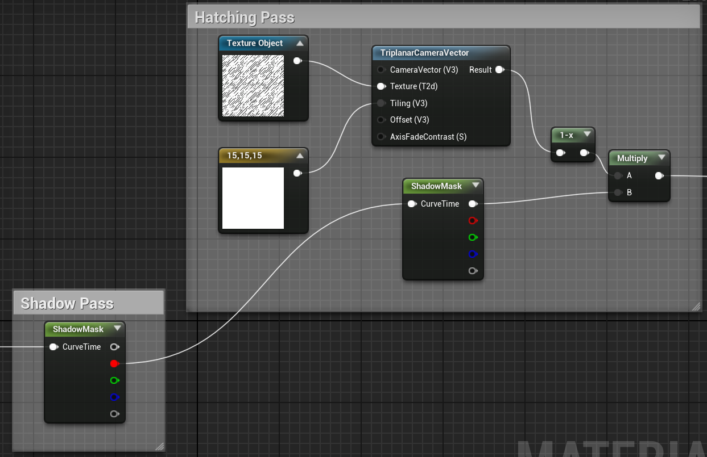

<!--more-->

## 素描特征

素描是一种绘画手法，在较亮的部位比如眼睛里的高光处，留白较多，在稍微暗一点的地方，可能会绘制一些平行的线条，在更暗一点的地方，可能会绘制一些交叉的线条，总结来说就是越暗的地方绘制的线条越密集，交叉程度更复杂，越亮的区域线条更少，白色的区域更多。同时，更复杂的一些素描还会体现物体的几何特征，绘制的线条会随着物体表面发生一定程度的弯曲。

## 光照设置

给场景加上几个基础光照：平行光（intensity 2）、天空光（intensity 1）、后处理（设置 Exposure，勾选 Infinite Extent）、天空球蓝图(设置 Directional Light)：

## 材质设置

### Lighting Pass

1. 新建一个材质，设置 Domain 为 Post Process，设置 Blendable Location 为 Before Tonemapping
2. 将后处理节点的 Rendering Features 中添加上新建的材质
3. 添加一个 Scene Texture 节点并设置 Scene Texture id 为 GBuffer，再添加一个 Scene Texture 节点并设置为 WorldNormal
4. 添加一个 Custom 节点，设置 Code 为 `return SceneTextureLookup(GetDefaultSceneTextureUV(Parameters, 0), 0, false);` 以及 input，这样通过 Custom 节点我们可以获取 SceneColor（至于为什么，我不懂，不过大概的意思是利用代码获取 id 为 0 的Scene Color，因为直接获取会报错）
5. 然后加上一个 Divide 节点和 Desaturation 节点（不太理解有什么作用，Desaturation 节点让颜色只有白色和黑色）

  

  

综上我们得到了一个只有光照作用的材质效果，我们可以称其为 Lighting Pass，他没有包含物体材质本身的颜色。

## AO Pass

1. 添加一个 SceneTexture 选择 AO，只取 R 值，并将其做一个 Power(0.3) 和 oneminus，这样在阴影处较黑的地方值减出来较大，较亮的地方值较小
2. 然后将 Lighting Pass 的输出减去 AO Pass 的输出（我好想吐槽 UE 用蓝图好难截图分享啊 (╯▔皿▔)╯）

  

  

（感觉有点奇怪的是这个椅子的阴影只要重新构建光照之后就没了，一移动就有了，但是移动之后又显示光照需求重新 build。）

### Shadow Pass

1. 新建 Curve 和 Curve Atlas，将 Curve Atlas 设置为对应的 Curve
2. 在材质中新建 CurveAtlasParameters 节点并设置对应 Curve 和 Atlas

  

3. 因为我们是要获取 Shadow，所以在 Curve 中我们需要将亮度重新进行 map，将 0~1 调转过来，这样将较亮的区域映射为黑色，将暗的区域即阴影区映射为白色，就得到了我们的 Shadow Pass 想要的结果了
    
  
  
## Hatching Pass

1. 新建一个 Texture Object 节点，选中一张素描纹理
2. 新建一个 TriplanarCameraVector 节点（不知道这个节点干嘛用的，不过和摄像机有关），并与 Texture Object 连接，将输出与 ShadowPass 的输出相乘
   
  

  

3. 新建一个 Curve 并将其加入 Atlas，再加上一个 AtlasParams 节点并设置为新加的 Curve，将输出值传入上面的 Multiply
4. 调整 Curve（没太懂...不过应该是在设置最暗的区域）

  
  
  

5. 类似的方法添加多种亮度的 Hatching Pass，更改 Curve 值和对应的纹理，并将所有输出相加

  

  但是不知道为什么这个椅子和立方体表面就是全白的，不是很好看，因为作者没有考虑很亮的表面如何上色，换了个模型看起来又还不错...

  

  

## Bending Normals

1. 添加一个 Normal Pass 作为 TriplanarCamera 的 Offset 形成根据表面曲率线条弯曲的效果，不过我没太看出来有什么大的变化！可能因为我的纹理都是从网上乱找的，质量不是很好

  

  

## Background Material

1. 新建一个后处理材质用于表示纸张，读取白色纹理，并将在材质添加到后处理节点中
   
  

2. 修改之前的素描材质，从 PostProcessInput0 中获取颜色，即上面我们新建的纸张纹理生成的效果，作为最亮的部分的颜色

  

## Offset by Camera Translation

1. 获取相机的位置，根据长度生成 TriplanarCamera 的 Tilling 值
  
  

2. 然后再把 Camera Position 与 Normal Pass 的输出相加传入 Offset

  

## Demo

虽然这个 Shader 不是很完美（主要是因为我的纹理不太好），但是看起来也还算不错！

## 小结

素描风格的特征是越暗处线条越多，因此我们需要先通过 Lighting Pass 把光照提取出来，同时加上 AO Pass 的效果，然后 Shadow Pass 利用 Curve 将亮与暗反一下，得到阴影处的值更大。

利用不同的 Curve 筛选不同的阴影强度，并搭配上不同密度的素描纹理进行混合上色，并通过 Normal 和 Camera Position 设置纹理的 Tilling 和 Offset。

在需要添加背景色时，可以再新建一个后处理材质赋予其背景色，并将其输出作为第一个材质的输入进行一定程度的混合，这里就是将最后采样出来的纹理值作为 alpha 混合背景色和黑色。

但是其实有好多节点并不是很能理解，英语我又听不太懂！可是中文的 UE 材质教程又没找到几个优质的......

## References

- [Hatching shader tutorial](https://www.youtube.com/watch?v=18U50KPdD2A)