<!--more-->

## Style Breakdown

线条的粗细由近及远逐渐从粗变细，并且总是绘制在物体的边缘处：

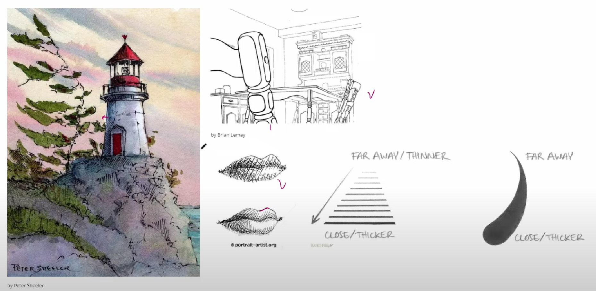

## Edge Detection

如果我们将一张图片向右偏移 1 个像素，然后再用原图减去偏移后的图像，就可以得到类似边界的效果，因此在这里的基本做法就是将 GBuffer 中的 DBuffer 分别进行上下左右的偏移再用原图减去，则可以得到边缘。

1. 新建一个材质，首先需要将像素在 y 方向上偏移一个像素，那么通过 InvSize 我们可以得到一个像素的大小，然后将 TexCoord 进行偏移

    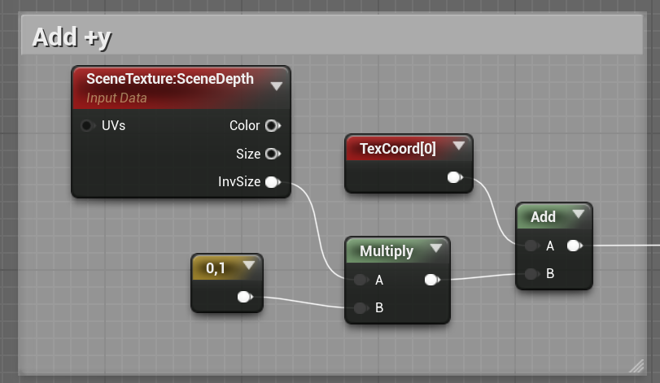

2. 获取 DBuffer，并将原始图片的深度减去偏移后图片的深度

    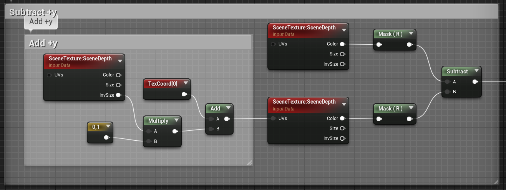
    
    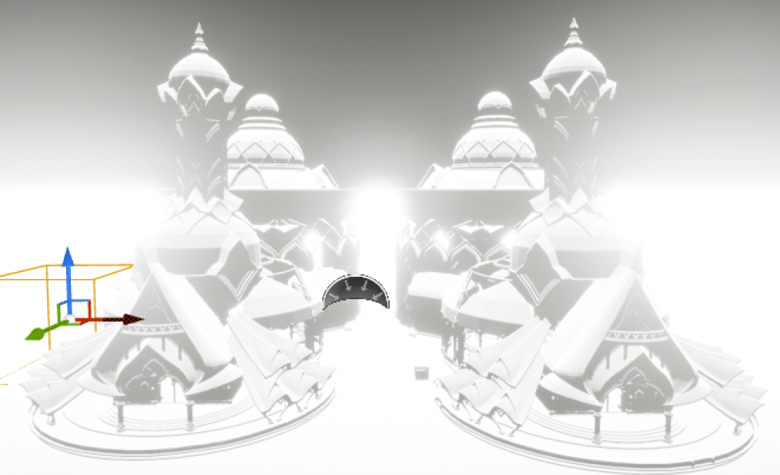

3. 相同的方法，对 +x、-x、+y、-y 进行偏移后相减，将结果加起来，就可以看到边界了！不得不说这个边界检测的方法还挺方便的

    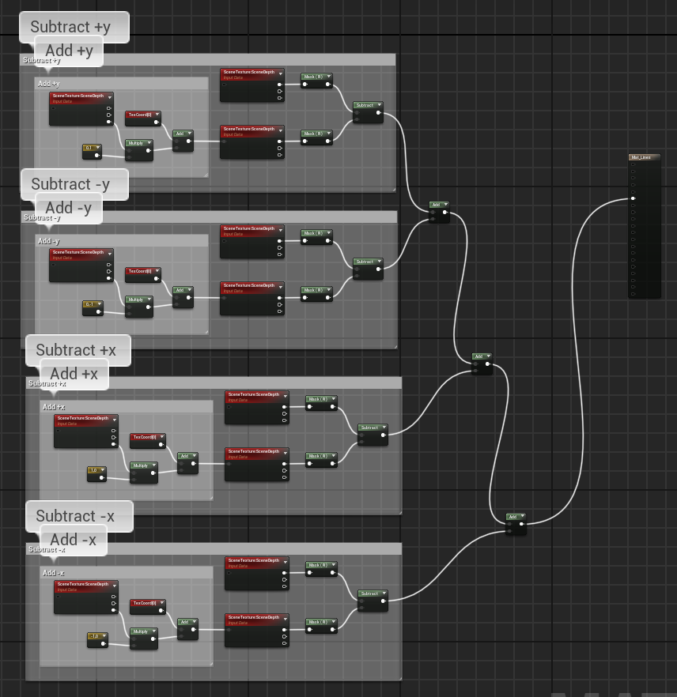
    
    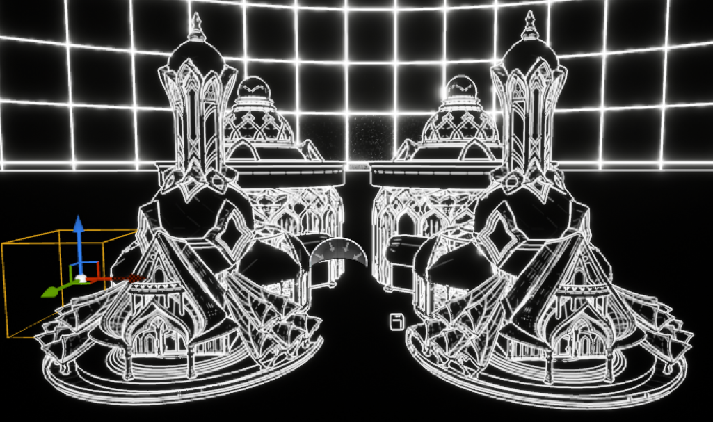
    
4. 接下来设置线条的粗细，我们需要通过距离的远近判断线条的粗细，那么仍然可以用到 DBuffer，DBuffer 的值越小，说明越近，值越大说明越远，那么我们就可以对 DBuffer 进行 Clamp，然后将其 Remap 到我们想要的粗细，并将粗细乘以之前的偏移量，即按照粗细进行像素的偏移

    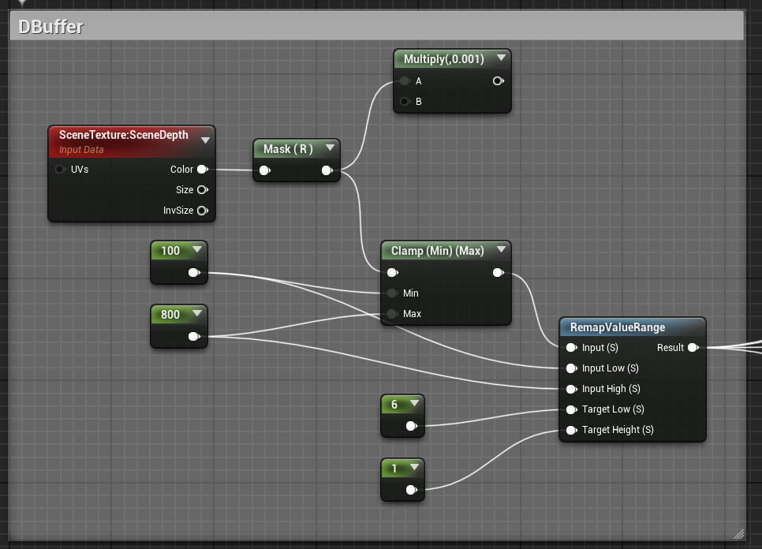

    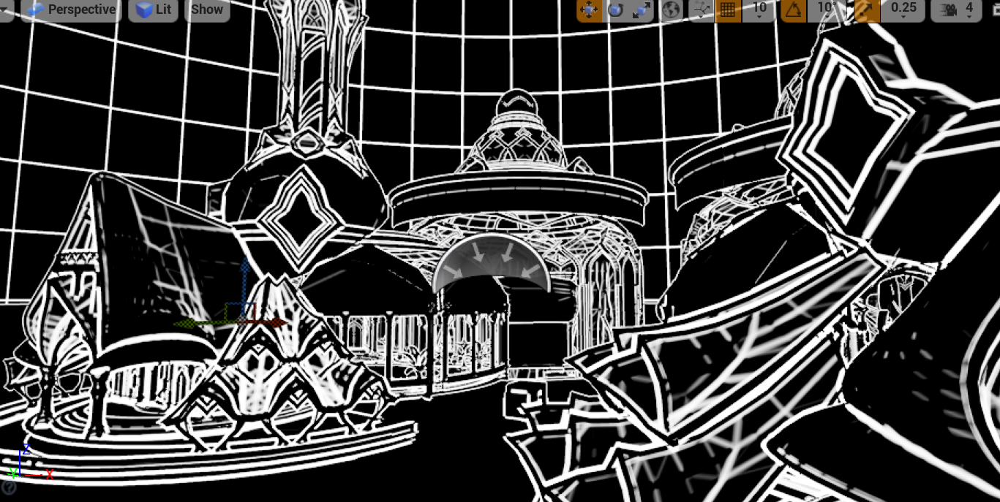

5. 但是上面的方法只能检测外轮廓，对于物体表面本身的边界线并不能体现，如下面的立方体，物体表面应该仍然有边界线的，但是 DBuffer 检测不出来，因为深度是差不多的，因此我们需要考虑表面法线

    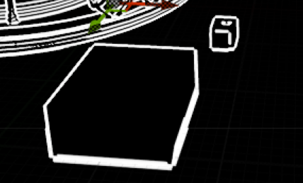

6. 类似于 Depth 的处理，我们可以直接复用这些节点然后改为 WorldNormal，这样我们就可以获得之前得不到的边界线了

    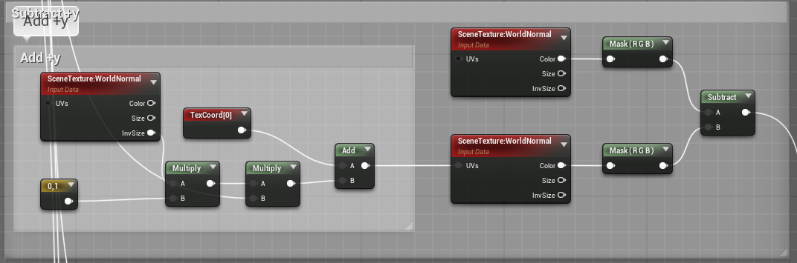
    
    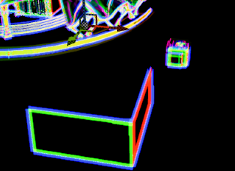

7. 将两种边界混合起来就可以得到比较好的边界效果了

    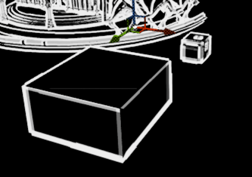
    
## Deform the Lines

上面的线条都比较规则，接下来我们给边界线添加一些扰动，这里就用 Perlin Noise 对上一个 Post Process 结果进行微小偏移。

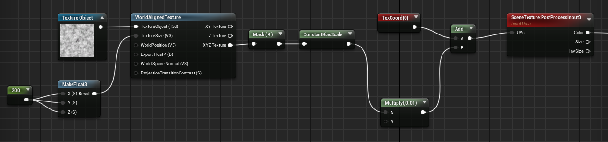

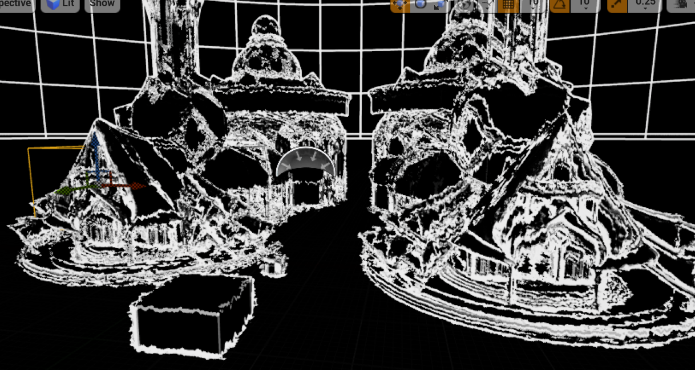

接下来就是把天空盒的描边去掉，这里用一个简单的判断方法，因为天空盒的距离很远，所以我们只需要设定一个阈值，当距离很远时将描边宽度设为 0 即可。

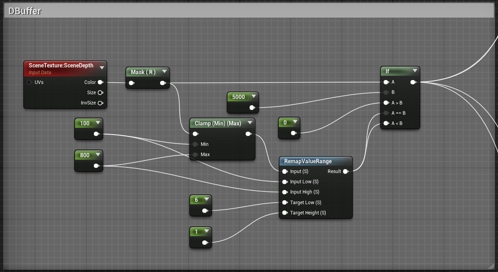

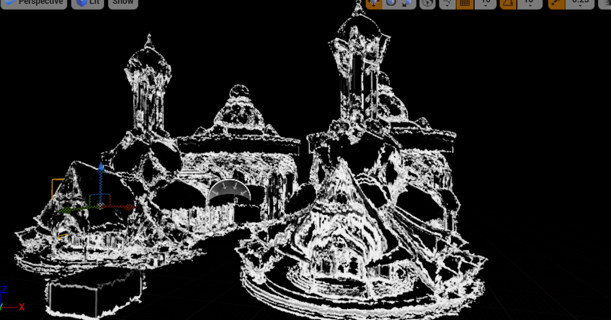

最后我们将四个后处理材质混合起来，需要设置各自的优先级。

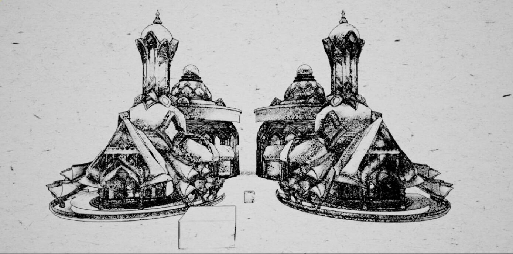

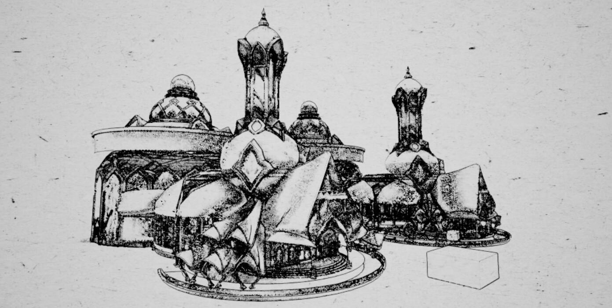

## Mix Texture Color With Hatching

在 Paper 后处理材质中，将 SceneColor 以 Hatching 的结果为 alpha 与黑色混合，感觉没有纯素描好看hhh

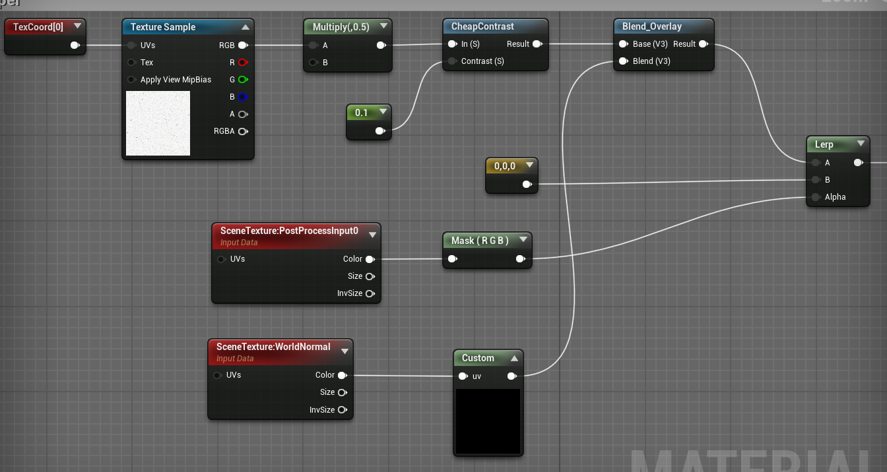

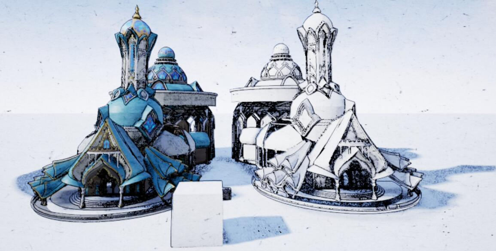

## 小结

本节主要学习了利用 DBuffer 和 WorldNormal 进行微小像素偏移以得到描边效果，同时可以通过 DBuffer 判断相机距离的远近以设置线条的粗细，利用 Perlin 噪声可以是描边进行随机扰动，看起来更有特点。

## References

- [Stylized lines and outlines - Unreal Material](https://www.youtube.com/watch?v=pJ42ylVyDpc)
- [Mix hatching with textures - Unreal material](https://www.youtube.com/watch?v=_V7DFLe11sI)