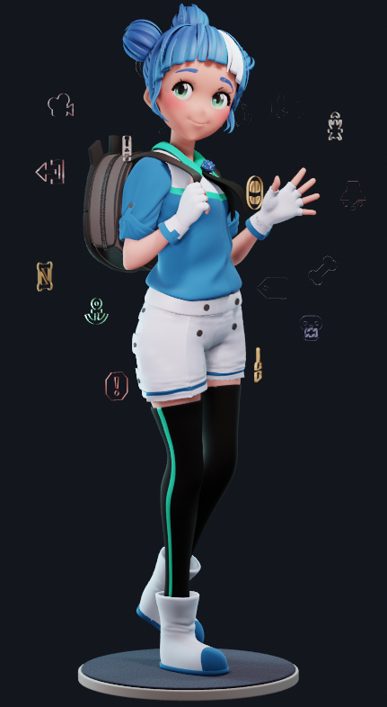
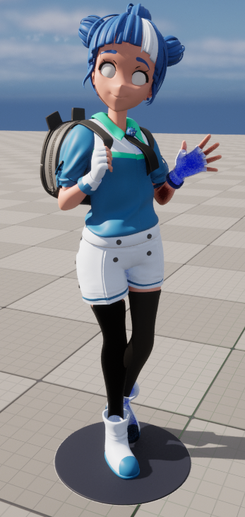

想来玩一下这个事情，把 blender 中的部分 shader 移植到 UE 中，但由于我 blender 材质系统完全不熟悉，UE 的材质也只会一点皮毛，所以这中间需要很多技术填补才能实现，暂且留个坑吧。

<!--more-->

## Blender To UE

- 首先下了一个 Blender 文件，里面的材质效果如下，很可爱的小妹妹：

- 试用了一下 UE 新出的插件 blende2ue，将 模型传到 UE 中，发现他不会对材质做特殊处理，就是默认的材质，所以皮肤没有次表面散射，眼球的渲染也是不对，其他部分的材质也没有 blender 中有质感

- 那么首先来看看 blender 中的皮肤材质

## 小结

## References