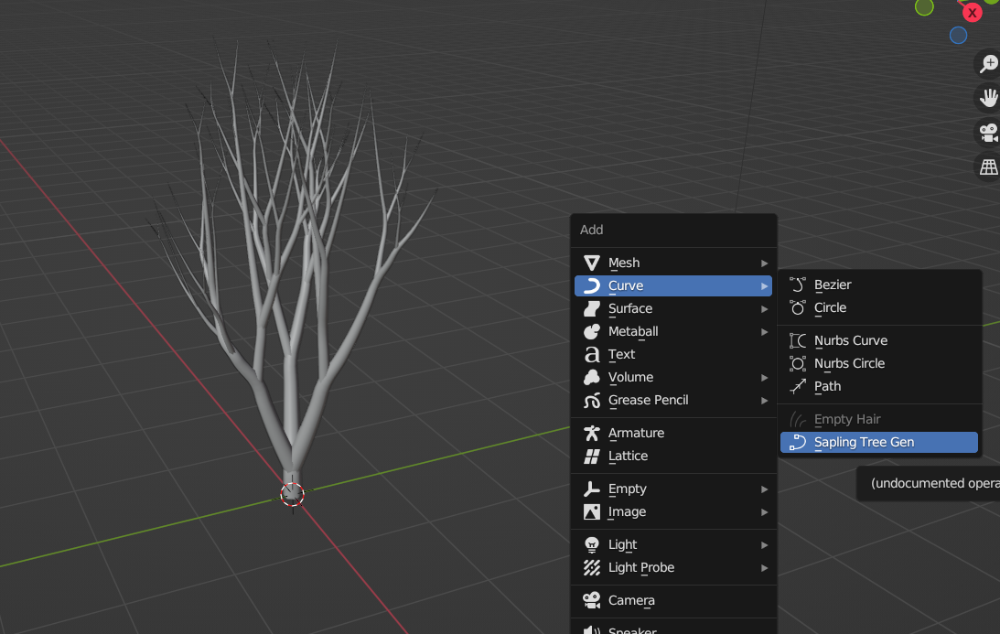
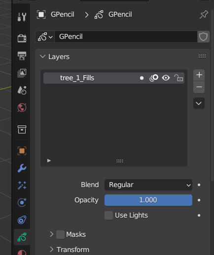
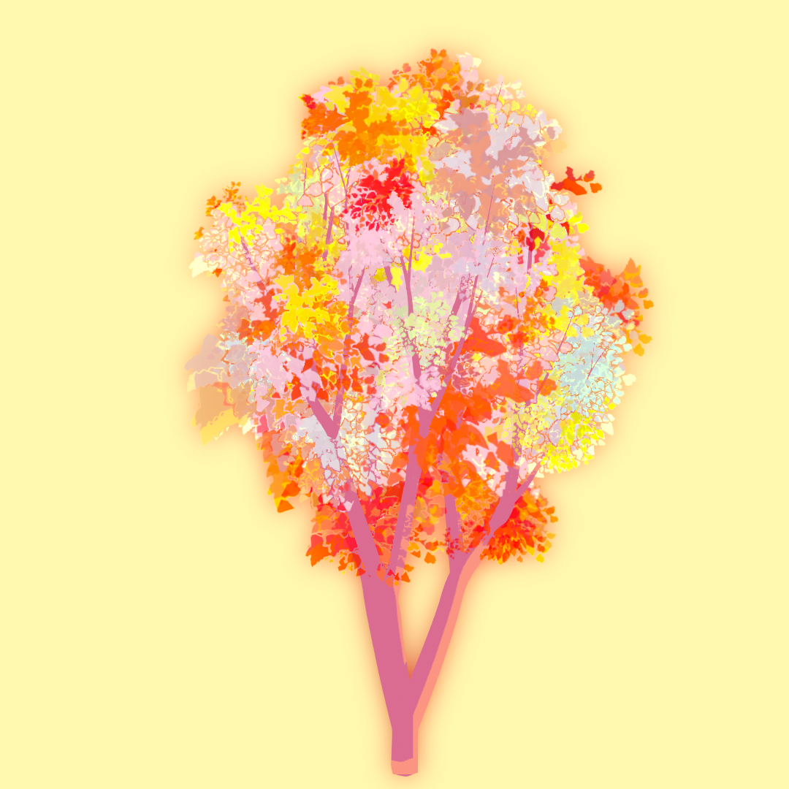
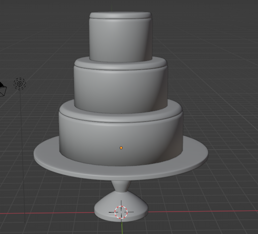
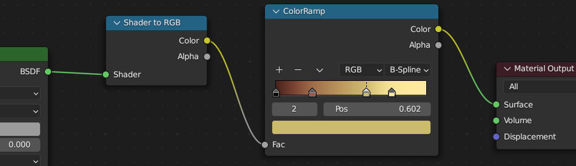
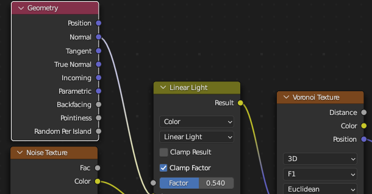
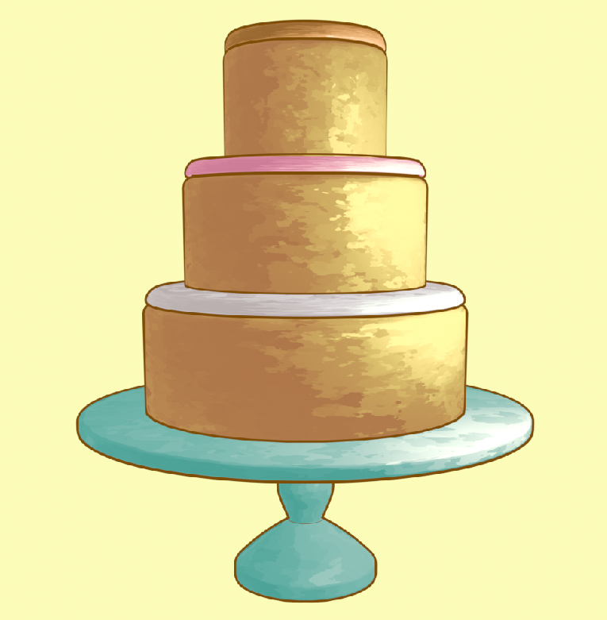

想来玩一下这个事情，把 blender 中的部分 shader 移植到 UE 中，但由于我 blender 材质系统完全不熟悉，所以这中间需要很多技术填补才能实现，但我相信 Shading 原理肯定都有共通性的，所以不妨先从 Blender 的 Shading 学起。

<!--more-->

## Grease Pencil Tree

- 使用 Sapling Tree Gen 生成树，然后 Conver To Mesh and Grease Pencil

- 删掉 Lines Layer，uncheck Use Lights，在材质面板设置 Fill 的颜色并调整背景颜色 

- 选择笔刷、设置颜色，选择模式为 Stroke 和 View，就可以绘制了，在材质中将 Alignment 设置为 Fixed，随便画一画就可以得到手绘的效果啦（但这个好像没办法直接移植到 UE 中）

## Grease Pencil Cake

- Alt + Click 可以进行 Loop Select，Ctrl + B 进行 Bevel 切分，S + Shift + Z 可以锁定 Z 轴进行缩放
- 在 Modifier 处 Ctrl + A 应用修改，Shift + D 复制
- 新建的 Circle 可以在 Edit Mode 下按下 F 填充 Mesh，E 推出面，Ctrl + R Loop Cut
- 从圆柱和圆形出发就可以构建一个简单的蛋糕模型了

- 对于蛋糕的 Shading，首先是标准的 Toon Shading 做法，采用 ColorRamp 映射输出的 RGB，然后利用 Texture 扰动模型的 Normal 形成手绘的效果，Ctrl + L link material，M 移动 Collection

- 添加 Outline 可以开启 FreeStyle，或者 Grease Pencil 的 Scene Line Art，或者 Inverted Hull，这里就是用的 Inverted Hull 的方案，新建一个 Emissive 材质，沿着法线向外膨胀一圈形成外轮廓，Alt + N 反转法线，如果形状比例不对需要 Ctrl + A scale

- 然后新建一些材质进行简单的绘制

## Blender To UE

- 首先下了一个 Blender 文件，里面的材质效果如下，很可爱的小妹妹：

- 试用了一下 UE 新出的插件 blende2ue，将 模型传到 UE 中，发现他不会对材质做特殊处理，就是默认的材质，所以皮肤没有次表面散射，眼球的渲染也是不对，其他部分的材质也没有 blender 中有质感

## 小结

## References

- [Grease Pencil Tree Tutorial in Blender 3D](https://www.youtube.com/watch?v=XrJctA2_Ixc)
- [Blender 3.0 Grease Pencil Tutorial - Cake](https://www.youtube.com/watch?v=XKM43KkyWeY)