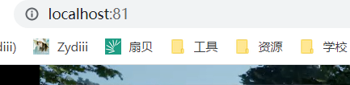

<!--more-->

## Patching

- 在 Project Settings 中开启 ChunkDownloader 相关支持，并将其添加到 PrivateDependencyModuleNames 中
- UE 能够以 .pak 文件的形式交付应用程序主可执行文件之外的资产。为此，需要将资产整理成文件块，即烘焙过程可以识别的资产文件组
- 将内容从内部格式转换为特定于平台的格式的过程称为烘焙，烘焙项目时，UE 将游戏资产分成单独的数据块（chunk），这些数据块可以单独发布，例如以 DLC 和补丁形式发布。数据块是由引擎的资产管理系统识别的带编号资产集，当烘焙项目时，每个数据块都会生成 .pak 文件，然后可以通过内容分发系统进行发布
- 主资产是可以由资产管理器直接操作的资产，而次资产是当主要资产引用它们时自动加载的资产。主资产是在烘焙和数据块划分过程中引用的类型
- 在打补丁的过程中，引擎会将所有后期烘焙内容与最初发布的已烘培内容进行比较，并据此确定补丁中包含的内容。最小的内容块是单个包（如.ulevel或.uasset），因此如果包中有任何更改，那么整个包都将被包含在补丁中。补丁文件具有更高的优先级，因此首先加载其中的任何内容
- 我尝试了打补丁的构建方法，但是生成出来需要将原来的 .pak 都删掉，然后复制所有补丁文件，感觉这和换了个 exe 也没啥太大的区别...
- 使用 UnrealPak.exe 打包 `.\UnrealPak.exe Test_Enc.Pak -Create=C:\Users\didi\Desktop\Unreal\EffectsDemo\Saved\Cooked\Windows\EffectsDemo\Content\DLC\（需要打包的文件地址） -compress -encrypt -encryptindex -aes=88888888888888888888888888888888（32 位密钥）` 查看 .pak 内容 `.\UnrealPak.exe Test.pak -list`
- WidgetReflector 控件反射器

## Pak

- 通过 FPakPlatformFile 来读取 .pak 文件，创建 FPakFile 指针，指向文件平台和 pak 文件路径，并将文件系统挂载到 pak 下，然后就可以读取 pak 下的文件。通过这种方式我可以在编辑器中打开本项目打包的 .pak，但是 build 出来的 exe 不行，以及无法读取其他项目生成的 .pak

```C++
//第一步
    IPlatformFile& InnerPlatform = FPlatformFileManager::Get().GetPlatformFile();
 
    PakPlatformFile = new FPakPlatformFile();
    PakPlatformFile->Initialize(&InnerPlatform, TEXT(""));
 
    FPlatformFileManager::Get().SetPlatformFile(*PakPlatformFile);
 
    const FString PakFileFullName = TEXT("C:\\TestDLCTestProject-Windows.pak");
    FString MountPoint(FPaths::EngineContentDir());
 
    FPakFile* Pak = new FPakFile(&InnerPlatform, *PakFileFullName, false);
    if (Pak->IsValid())
    {
        PakPlatformFile->Mount(*PakFileFullName,1000,*MountPoint);
 
        TArray<FString> Files;
        Pak->FindPrunedFilesAtPath(Files, *(Pak->GetMountPoint()), true, false, true);

    	for (FString& Filename : Files)
    	{
    		if (Filename.EndsWith(TEXT(".umap")))
			{
    			FString NewFileName = Filename;
    			NewFileName.RemoveFromEnd(TEXT(".umap"));
    			int32 Pos_ = NewFileName.Find("/Content/");
    			NewFileName = NewFileName.RightChop(Pos_ + 9);
    			NewFileName = "/Game" + NewFileName;
        		
    			FName mapName = FName(NewFileName);
    			UGameplayStatics::OpenLevel(GetWorld(), mapName);
    			break;
			}
    	}
    }
```

- 我尝试使用了插件 Pak Loader，能够打开 Plugins 下制作的关卡，但是来自 /Engine/ 和 /Game/ 目录下的材质、Mesh 等，有的无法被正确读取，同时我还很担心 Plugin 下的 GameMode 不能被正确加载应该怎么办，以及该插件没有测试非 Windows 平台，我担心其他平台无法正确打包与解析
- 最终还是用了做 DLC 的方案，需要在 Project Launcher 中配置 MainGame 和 DLC，DLC 的名字要和 Plugin 的名字相同，然后 DLC 会生成一个 .pak，将它复制到 MainGame 的 Paks 文件夹下就能打开了，UE 应该是进行了自动挂载，需要记得在 .build.cs 文件中 Include 上该插件，以及如果已经 Build 的 exe 加上新加的插件是无法被正确挂载的，但在旧的插件下放新的地图是可以的，但还是会出现 /Engine/ 材质无法加载的问题
- 在生成 pak 时，需要取消勾选 Project Settings 下的 Share Material，因为这种机制压缩了材质，会让挂载的 pak 里一些纹理找不到正确的位置，Use Io Store 不知道有啥用，但是最好也取消勾选，这样 DLC 的材质就能正确加载啦，但我不知道为什么 Pak Loader 不行，道理来说应该是一样的
- 可以看到我这个项目下 Mount point 是 ../../../，引擎下的资源是 Engine/Content/，项目资源是 ProjectName/Content/，插件的资源是 ProjectName/Plugins/PluginName/Content/


- 我之前测试 PakLoader 打包的资源文件结构如下，是一致的，也就是说问题不在 pak 这里，也对，毕竟都是用 Project Launcher 打包的，应该还是引擎本身对 pak 的加载方式有特殊的处理，直接读 pak 导致一些文件索引目录不一致


- 这倒是提醒我了，我没有用同一个项目打包加载测试 Pak Loader，也许我在同一个项目下 Pak Loader 是可行的？但感觉这样的话和用引擎直接做 DLC 也没有区别了，需要在同一个项目下提前设好 Plugin 才能正确加载，暂时没空细看了，有空了可以去看看源码，在 LaunchEngineLoop.cpp

## Pixel Streaming

- 虚幻引擎包含了一个称为像素流送（Pixel Streaming）的系统，通过该系统，来自远程虚幻引擎实例的音频和视觉图像被流式传输到 WebRTC 对端（通常是网络浏览器），而键盘、鼠标和触屏输入则可以从 WebRTC 对端传回，以促进与此 Pixel Streaming Unreal Engine 实例的交互
- Unreal Engine 的 Pixel Streaming 系统是建立在 WebRTC 之上的，现代 Web 浏览器很好地支持它。3 WebRTC 专门设计为通过公共互联网进行双向、低延迟实时通信的整体解决方案。然而，有许多流媒体场景要么是单向的、非实时的，要么在不受数据包丢失或公共互联网变化的网络条件影响的受控网络环境中运行。此类流式传输场景的示例包括：直播、模拟软件、遗留硬件，或在完全受控的专用网络中运行的简单流式传输场景。这些场景不一定需要也不支持 WebRTC 的技术组合
- 要运行带有像素流插件的虚幻引擎应用程序，计算机必须具有以下类型的图形硬件之一：支持硬件加速视频编码（NVENC）的NVIDIA GPU硬件。请参阅NVIDIA的支持设备对照表。支持高级媒体框架（AMF）的AMD GPU硬件
- 首先运行 C:\Program Files\Epic Games\UE_5.0\Samples\PixelStreaming\WebServers\SignallingWebServer\platform_scripts\cmd 下的 setup.bat，由于网络问题很可能下载不下来


- 那么需要查看脚本，看到下载地址，根据 node -v 的版本去下载对应的 node.zip，比如我现在的版本需要下载 https://nodejs.org/dist/v18.13.0/node-v18.13.0-win-x64.zip，然后删掉要下载的部分脚本内容

```Bash
@Rem Copyright Epic Games, Inc. All Rights Reserved.

@echo off

@Rem Set script location as working directory for commands.
pushd "%~dp0"

@Rem Name and version of node that we are downloading
SET NodeVersion=v18.13.0
SET NodeName=node-%NodeVersion%-win-x64

@Rem Unarchive the .zip
tar -xf node.zip

@Rem Rename the extracted, versioned, directory that contains the NodeJS binaries to simply "node".
ren "%NodeName%\" "node"

@Rem Print node version
echo Node version: & node\node.exe -v

@Rem Pop working directory
popd
```

- 然后再恢复原来的脚本内容，防止之后要用

```Bash
@Rem Copyright Epic Games, Inc. All Rights Reserved.

@echo off

@Rem Set script location as working directory for commands.
pushd "%~dp0"

@Rem Name and version of node that we are downloading
SET NodeVersion=v18.13.0
SET NodeName=node-%NodeVersion%-win-x64

@Rem Look for a node directory next to this script
if exist node\ (
  echo Node directory found...skipping install.
) else (
  echo Node directory not found...beginning NodeJS download for Windows.

  @Rem Download nodejs and follow redirects.
  curl -L -o ./node.zip "https://nodejs.org/dist/%NodeVersion%/%NodeName%.zip"

  @Rem Unarchive the .zip
  tar -xf node.zip

  @Rem Rename the extracted, versioned, directory that contains the NodeJS binaries to simply "node".
  ren "%NodeName%\" "node"

  @Rem Delete the downloaded node.zip
  del node.zip
)

@Rem Print node version
echo Node version: & node\node.exe -v

@Rem Pop working directory
popd
```

- CoTURN 下载没问题，所以直接走一遍 setup.bat
- 然后来到 SignalWebServer 文件夹，我不知道为什么文档说直接运行 setup.ps1，但文件夹里根本没有，看别的博主说 UE5 删掉了，可以直接从 UE4 中复制,咱就是说能不能同时更新一下文档。自己新建一个 run.bat

```Bash
:: Copyright Epic Games, Inc. All Rights Reserved.
@echo off
 
pushd %~dp0
 
call setup.bat
 
title Cirrus
 
::Run node server
::If running with frontend web server and accessing outside of localhost pass in --publicIp=<ip_of_machine>
node cirrus %*
 
popd
pause
```

- 运行即可启动信令服务器，需要注意的是，打包之后这些服务会被复制到 Engine 文件夹下，到时候应该直接从 Build 后的 Engine 下面运行


- 给生成的 exe 创建快捷方式并且添加命令参数 C:\Users\didi\Desktop\Unreal\TankSim\TankNavSystem\Saved\StagedBuilds\Windows\TankNavSystem.exe -AudioMixer -PixelStreamingIP=localhost -PixelStreamingPort=8888 -log -RenderOffScreen ，然后双击启动，可以看到服务器那边已经连接上了


- 也可以不用快捷方式，直接写个脚本 launch.bat

```Bash
@echo off
start C:\Users\didi\Desktop\Unreal\TankSim\TankNavSystem\Build\Windows\TankNavSystem.exe -AudioMixer -PixelStreamingIP=localhost -PixelStreamingPort=8888 -log -RenderOffScreen
```

- 如果遇到点击 click to start 没反应的情况，可以在游戏运行的命令行中按下 Ctrl C 之后就可以了，不知道什么原理。


- 总之已经可以通过访问 localhost 查看流传输的效果啦，但是很卡，本地访问都这么卡，今后应该如何解决


- 要想改变服务端口，需要修改 config.json，HttpPort 为玩家连接的端口，StreamerPort 为像素流的端口
  


- Matchmaker 可以用来做负载均衡，在 MatchMaker 下的 config.js 中确认 HttpPort，这里为 80，设置 UseMatchmaker 为 true，并修改端口。然后修改 launch.bat 中的 PixelStreamingPort 分别对应信令服务器的 StreamerPort。然后分别启动 MatchMaker 服务、信令服务器、游戏实例，之后访问 MatchMaker 服务即可，就可以看到服务已经被正确转发

```json
{
	"UseFrontend": false,
	"UseMatchmaker": true,
	"UseHTTPS": false,
	"UseAuthentication": false,
	"LogToFile": true,
	"LogVerbose": true,
	"HomepageFile": "/Public/player.html",
	"AdditionalRoutes": {},
	"EnableWebserver": true,
	"MatchmakerAddress": "",
	"MatchmakerPort": "9999",
	"PublicIp": "localhost",
	"HttpPort": 81, //
	"HttpsPort": 443,
	"StreamerPort": 881, //
	"SFUPort": 8881 //
}
```




- 但这样的话一个实例只够一个用户使用，好像不是很合适这个应用场景，这个项目应该所有用户共用一个场景就行了


- 在实际部署的时候，本地 localhost 是能访问的，但是外部机器访问就没有画面了，全是黑屏，就很奇怪，本地链接的时候 state 都是 complete，外网链接的时候，state 直接 close 了


- 查询无果，在 npy 的帮助下测试发现，流推送的逻辑是：他会打开网页，然后访问网页的服务端，拿到那个播放器，然后网页的服务端会告诉客户端有人要链接了，然后告诉网页的播放器客户端地址在哪，然后网页上的播放器和客户端直接建立连接。所以其实跑客户端的那台机器需要把相关的 UDP 端口放通，但链接的端口每次都不一样，50000+ 的端口随机生成的，需要看一下相关的逻辑才行。至少把机器的所有端口放通确实有画面。
- 但 UE 的文档写了这样一段话“另外，可使用TURN服务器在UE4应用和浏览器之间中继媒体流。启动TURN协议后，TURN服务器一方面与UE4应用连接，另一方面则与浏览器连接。UE4应用将自身所有流送的数据发送给TURN服务器，后者又将数据传送至浏览器。在此情况下，UE4应用和浏览器间并无直接连接。（如要在无线运营商网络中支持移动设备，只能使用TURN服务器。移动网络通常不支持客户端通过WebRTC协议进行连接。）” 那么说明是可以有个服务器来做中转的，因为到时候不可能把所有端口都放通
- 好的破案了，TURN服务器的端口 19303 需要放开 TCP 和 UDP 才能让流推送走 TURN 服务转发（可恶，折腾我一天）

## ChunkDownloader


## 小结

## References

- [Unreal流送方案](https://zhuanlan.zhihu.com/p/480097075)
- [UE5像素流送局域网部署纯小白教程](https://www.bilibili.com/video/BV1Be41157KH/)
- [Where's my stream? TURN Server debugging for Pixel Streaming](https://dev.epicgames.com/community/learning/tutorials/VY4X/unreal-engine-where-s-my-stream-turn-server-debugging-for-pixel-streaming)