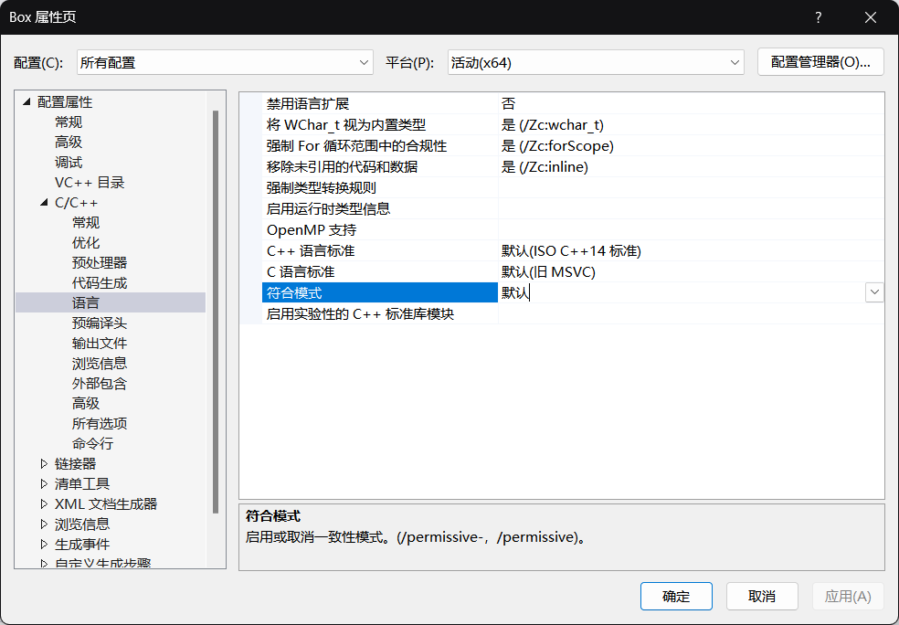
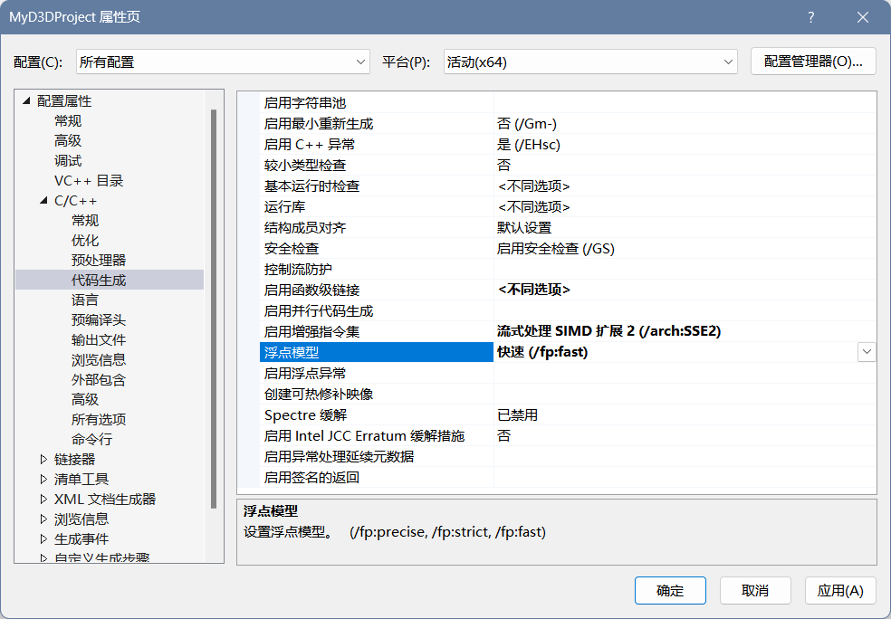

<!--more-->

## 环境配置

- 在配置环境时，因为示例代码对临时变量取了左值，这种行为在 VS2022 是非法的，需要将符合模式改成默认



- 然后需要将系统改为窗口模式，否则会报无法解析的外部符号


## DirectXMath

- 首先需要开启 SSE2 并设置快速浮点模型 /fp:fast，SSE2 利用了单指令多数据（SIMD）寄存器，利用一条 SIMD 指令即可同时对 4 个 32 位浮点数或整数进行运算，这对于向量运算带来了巨大的遍历，不然对于一个 4维向量的加法，我们需要对每个分量逐个相加，而通过 SIMD，我们可以仅用一条 SIMD 加法指令来取代 4 条普通的标量指令，直接计算出 4D 向量的加法结果



- DirectXMath 的核心向量类型是 XMVECTOR，它会被映射到 SIMD 硬件寄存器，由于其需要 16 位对齐，所以局部变量和全局变量是可以用的，至于类中的数据成员，建议使用 XMFLOAT2、XMFLOAT3、XMFLOAT4 类型来替代，加载函数会在运算之前将其转换位 XMVECTOR 以使用 SIMD 运算，之后通过存储函数将 XMVECTOR 转换位 XMFLOATn
- XMLoadFloatn、XMStoreFloatn、XMVectorSet、XMVectorGet
- 参数的传递这里需要注意，在调用的函数前面需要加上 XM_CALLCONV，它会根据编译器的版本确定出对应的调用约定属性，传递 XMVECTOR 参数需要注意以下规则：前 3 个用 FXMVECTOR，第 4 个用 GXMVECTOR，第 5、6 个用 HXMVECTOR，其余的用 CXMVECTOR，构造函数则是前 3 个用 FXMVECTOR，其余参数用 CXMVECTOR，同时对构造函数不适用 XM_CALLCONV 注解。这些规则是对于输入参数而言的，输出不会占用 SSE/SSE2 寄存器
- 常量向量表示为 XMVECTORF32、XMVECTORU32
- XM_PI、XM_1DIVPI、XMConvertToRadians、XMConvertToDegrees、XMMin、XMMax
- XMVectornLength、XMVectornDot、XMVectornCross、XMVectornNormalize、XMVectornOrthogonal、XMVectornAngleBetweenVectors、XMVectornComponentsFromNarmal、XMVectornEqual、XMVectornNotEqual
- 在比较浮点数的时候，一定要注意误差，数值误差是可以积累的，通常可以定义一个 Epsilon 常量作为容差，使用近似相等函数比较 XMVectornNearEqual
- cout.setf() 的作用是通过设置格式标志来控制输出形式，如 boolalpha 可以使用单词true 和 false 进行输入/输出的布尔值
- XMVerifyCPUSupport 如果 DirectXMath 库支持给定的平台，则返回 true;如果不是，则为 false
- XMVectorSet 使用 4 个浮点值创建 vector
- XMVector3ComponentsFromNormal 使用引用法向量，将三维向量拆分为并行和垂直于正态的组件
- XMVectorSwizzle 重排向量各分量，XMVectorSplatZ 将向量的 z 组件复制到所有组件
- 变换矩阵一定意义上也可以解释为坐标变换矩阵

## DirectX3D 基础知识

- DX 层和硬件驱动层会协作将 DX 命令转换为系统中 GPU 可以执行的本地机器指令
- 组件对象模型（COM）可以被视为一种接口，COM 对象会统计引用次数，COM 接口的所有功能都是从 IUnknown 这个 COM 接口继承而来的
- Windows 运行时库（WRL）提供了 Microsoft::WRL::ComPtr 类，用来表示 COM 对象的智能指针，Get 返回一个指向此底层 COM 接口的指针，GetAddressOf 返回指向此底层 COM 接口指针的地址，Reset 将此 ComPtr 实例设置为 nullptr
- COM 接口都以大写字母 I 开头
- 2D texture 是一种由数据元素构成的矩阵，可以存储 DXGI_FORMAT 枚举类型中描述的特定格式的数据元素，也有 TYPELESS 格式，用来预留内存，待纹理被绑定到渲染流水线之后再具体解释它的数据类型
- 深度缓冲区也是一种纹理，格式包括 DXGI_FORMAT_D32_FLOAT_S8X24_UINT 等，一个应用程序不一定要用到模板缓冲区，但一经使用，深度缓冲区将总是与模板缓冲区如影随形
- 资源需要被绑定到渲染流水线上，需要通过描述符的对象来对它间接引用，描述符为 GPU 解释资源，还可以绑定资源中的局部数据
- 描述符堆中存有一系列描述符，每一种类型的描述符都需要创建单独的描述符堆，一个资源可能绑定到渲染流水线的不同阶段，对于每个阶段都需要设置独立的描述符，一般在初始化时创建描述符
- 超级采样 SSAA 多重采样 MSAA
- DXGI_SAMPLE_DESC D3D12_FEATURE_DATA_MULTISAMPLE_QUALITY_LEVELS ID3D12Device::CheckFeatureSupport
- 在创建交换链缓冲区和深度缓冲区时都需要填写 DXGI_SAMPLE_DESC 结构体，并且在创建后台缓冲区和深度缓冲区时，多重采样的有关设置一定要相同
- DXGI 图形基础结构，设计 DXGI 的基本理念是使多种图形 API 中所共有的底层任务能借助一组通用 API 来进行处理，支持一些常用的图形功能如切换全屏模式、枚举显示适配器等，还定义了 Direct3D 支持的各种表面格式信息
- IDXGIFactory 主要用来创建 IDXGISwapChain 以及枚举显示适配器，显示适配器是一种硬件设备如独立显卡，也有软件显示适配器 IDXGIAdapter
- 显示输出 IDXGIOutput，每个适配器都与一组显示输出相关联，每种显示设备都有一系列它所支持的显示模式 DXGI_MODE_DESC，可以获得某个显示输出对此格式所支持的全部显示模式 IDXGIOutput->GetDisplayModeList，所指定的显示模式要与显示器支持的显示模式匹配
- ID3D12Device::CheckFeatureSupport 检测当前图形驱动对功能的支持
- 应用程序通过控制资源在显存中的去留，主动管理资源的驻留情况
- 每个 GPU 至少维护着一个命令队列 ID3D12CommandQueue，CPU 通过命令列表 ID3D12CommandLis 将命令提交到命令队列中，但不一定会被立即执行，DX12 采用延迟渲染 “命令列表->命令队列” 模型，ID3D12CommandQueue::ExecuteCommandLists 将命令列表里的命令添加到命令队列之中，提交之前一定要将命令列表关闭 ->Close()
- ID3D12CommandAllocator 内存管理类接口，记录在命令列表内的命令，实际上是存储在与之关联的命令分配器上，提交之后命令队列会引用分配器里的命令，可以创建出多个关联于同一命令分配器的命令列表，但是不能同时用它们来记录命令，因为需要保证命令的添加顺序。当创建或重置一个命令列表的时候，它会处于一种打开的状态，所以为同一个命令分配器连续创建两个命令列表时会报错
- 提交之后使用 Reset 可以安全复用命令列表占用的相关底层内存来记录新的命令集，恢复为刚创建时的初始状态。也可以用 Reset 复用命令分配器中的内存，由于命令队列可能引用命令分配器中的数据，在不确定 GPU 执行完命令之前不要重置命令分配器
- 为了使 CPU 和 GPU 之间达成同步，需要设置围栏 ID3D12Fence，每个围栏维护着一个 UINT64 类型的值，ID3D12CommandQueue::Signal 从 GPU 端设置围栏值，ID3D12Fence::Signal 方法从 CPU 端设置围栏值
- 为了防止读写同一资源发生冲突，这种现象称为资源冒险，为资源添加状态，不同的行为将改变资源的状态，如渲染目标状态、着色器资源状态，通过命令列表设置转换资源屏障D3D12_RESOURCE_BARRIER，资源屏障转换可以看作是一条告知 GPU 某资源状态正在进行转换的命令，CD3D12_RESOURCE_BARRIER::Transition
- CD3DX12 作为前缀表示一些 DX12 中结构的扩展辅助结构变体，定义在 d3dx12.h
- 每个线程通常只使用各自的命令列表，仅使用属于自己的命令分配器，多线程可以同时访问同一命令队列，也能够同时调用它的方法，可以同时向命令队列提交它们自己所生成的命令列表

## 初始化 Direct3D

- 创建设备 ID3D12Device
- 创建围栏并获取描述符大小
- 检测对 MSAA 质量级别的支持
- 创建命令队列和命令列表
- 描述并创建交换链
- 创建描述符堆，RVT、DSV
- 创建渲染目标视图并将其绑定到流水线阶段，例如后台缓冲区绑定到流水线的输出合并阶段
- 创建深度/模板缓冲区及其视图，创建资源和堆，并将该资源提交到堆中
- 设置视口，相对于后台缓冲区的绘制范围，将场景绘至整个后台缓冲区
- 设置裁剪矩形，在此矩形外的像素都将被剔除

## 计时与动画

- 帧率 每秒刷新的帧数，性能计时器 <windows.h> QueryPerformanceCounter 获取性能计时器测量的当前时刻值，QueryPerformanceFrequency 获取性能计时器的频率，通过相对差值获得代码执行期间的时间
- 在不同处理器上计时可能得到不同的结果，可以通过 SetThreadAffinityMask 防止应用程序的主线程切换到其他的处理器上去执行
- 游戏计时器类 Tick() 用于更新 mDeltaTime、mPrevTime，Reset() 需要重新设置 mBaseTime、mPrevTime、mStopTime、mStopped
- 总时间需要记录 mBaseTime、mPausedTime、mStopTime、mCurrTime，需要减去中间暂停的时间

## 框架

- D3DApp 负责创建应用程序主窗口、运行程序消息循环、处理窗口消息、初始化 Direct3D，同时将部分初始化、消息处理、创建描述符堆、修改大小、更新、绘制等作为虚函数可供改写自定义
- 消息处理 WM_ACTIVATE、WM_SIZE、WM_EXITSIZEMOVE、WM_DESTROY、WM_MENUCHAR、WM_GETMINMAXINFO、WMLBUTTONDOWN 等
- 宏定义中 # 表示字符串化操作符，将宏定义中的传入参数名转换成用一对双引号括起来参数名字符串。其只能用于有传入参数的宏定义中，且必须置于宏定义体中的参数名前。__FILE__、__LINE__ 会定位到出错函数的文件与行

## 渲染流水线

- 渲染流水线是种模型，将 3D 场景变换至 2D 场景的处理流程抽象分离为不同的流水线阶段，供用户使用，本质即指令从 CPU 端的应用程序层发送至 Direct3D 运行时、驱动层及至 GPU 端，资源数据在内存与显存间游走，最后是 GPU 内部各种引擎、缓存、命令队列等根据指令配合运作将数据转化为显示器可视信号
- XMVECTOR 可以描述颜色 XMCOLOR 有 32 位颜色，也有 128 位颜色
- 渲染流水线是以摄像机为观察视角而生成 2D 图像的一系列完整步骤
- 1）输入装配阶段 IA 从显存中读取几何数据，再将它们装配为几何图元，通过索引定义如何将顶点装配在一起构成图元 2）顶点着色器阶段 VS 输入输出都是单个顶点，涉及局部空间到世界空间到观察空间，然后投影和齐次裁剪，规格化设备坐标、归一化深度值 3）曲面细分阶段 可以实现 LOD 4）几何着色器阶段 GS 输入是完整的图元，可以创建或销毁几何体 5）裁剪 6）光栅化阶段 RS 视口变换、背面剔除、顶点属性插值 7）像素着色器阶段 PS 根据顶点的插值属性作为输入来计算出对应的像素颜色 8）输出合并阶段 OM 一些像素可能会被丢弃，剩下的像素片段将会被写入后台缓冲区，也可以进行混合操作

## 利用 Direct3D 绘制几何体

- 顶点与输入布局 首先构建自定义的顶点格式，然后通过输入布局描述提供该顶点结构体的描述 D3D12_INPUT_LAYOUT_DESC D3D12_INPUT_ELEMENT_DESC
- 顶点缓冲区 缓冲区是一种 GPU 资源，存储顶点的缓冲区叫顶点缓冲区，先使用 D3D12_RESOURCE_DESC 描述缓冲区资源，然后使用 ID3D12Device::CreateCommittedResouce 创建 ID3D12Resource 对象，对于静态几何体我们将顶点缓冲区置于默认堆 D3D12_HEAP_TYPE_DEFAULT，但 CPU 不能直接向默认堆写数据，需要创建上传缓冲区 D3D12_HEAP_TYPE_UPLOAD，通过把资源提交到上传堆，才得以将数据从 CPU 复制到 GPU 显存中，先从系统内存复制到上传缓冲区，再把顶点数据从上传缓冲区复制到真正的顶点缓冲区。为了将顶点缓冲区绑定到渲染流水线上，需要创建顶点缓冲区视图，无需创建描述符堆。IASetVertexBuffers
- ID3D12GraphicsCommandList::DrawInstanced 绘制顶点，需要先利用 IASetPrimitiveTopology 设置拓扑
- 索引和索引缓冲区 创建索引缓冲区、索引缓冲区视图 IASetIndexBuffer DrawIndexedInstanced 对于一个缓冲区存储了多种对象的数据时，需要指明基准顶点地址
- 顶点着色器 输入签名 SV_POSITION SV 表明是系统值 连接输入布局描述符与输入签名
- 像素着色器 接收插值数据，针对每一个像素片段运行 像素片段可能会在像素着色器中被裁掉，使用 clip 可以使指定的像素片段在后续的处理流程中被忽略掉。在确定后台缓冲区某一像素的过程中，可能会存在多个候选的像素片段。SV_TARGET 表示该返回值的类型应当与渲染目标格式匹配，该输出值会被存于渲染目标之中
- 常量缓冲区 常量缓冲区也是一种 GPU 资源 cbuffer 常量缓冲区通常由 CPU 每帧更新一次，创建到上传堆，大小必须为硬件最小分配 256B 的整数倍。常量缓冲区视图绑定到存有物体响应常量数据的缓冲区子区域。CPU 更新数据要先获得指向欲更新资源数据的指针 Map Unmap 常量缓冲区描述符 D3D12_DESCRIPTOR_HEAP_TYPE_CBV_SRV_UAV 这种堆可以混合存储常量缓冲区描述符、着色器资源描述符和无序访问描述符。在创建供着色器程序访问资源的描述符时，要把标志指定为 DESCRIPTOR_HEAP_FLAG_SHADER_VISIBLE 先填写 D3D12_CONSTANT_BUFFER_VIEW_DESC，再调用 CreateConstantBufferView 便可创建常量缓冲区 根签名和描述符表 根签名：在执行绘制命令之前，资源会被映射到着色器的对应输入寄存器 ID3D12RootSignature 根参数可以是根常量、根描述符、描述符表，描述符表指定的是描述符堆中存有描述符的一块连续区域。SetGraphicsRootDescriptorTable 令描述符表与渲染流水线相绑定
- 编译着色器 着色器程序必须先被编译为一种可移植的字节码，图形驱动程序将获取这些字节码，并将其重新编译为针对当前系统 GPU 所优化的本地指令 D3DCompileFromFile 也可以离线编译，提前生成 .cso，然后使用 LoadBinary 加载字节码
- 光栅器状态 可以设置绘制模式、剔除操作等
- 流水线状态对象 输入布局描述、着色器、光栅器状态等控制图形流水线状态的对象被统称为流水线状态对象 ID3D12PipelineState D3D12_GRAPHICS_PIPELINE_STATE_DESC 集合大量流水线状态信息，应在初始化期间就生成 PSO
- Direct3D 实质上就是一种状态机，里面的事物会保持它们各自的状态，直到我们将其改变。可以定义几何图形辅助结构体，存储顶点缓冲区、索引缓冲区、几何体数据等结构方便使用

## Draw Box Demo

### D3DApp::InitMainWindow() 初始化并绘制窗口

- HINSTANCE 是一个实例句柄，本质就是个无符号长整型，HWND 是一个窗口句柄，是唯一的标识，当窗口被创建的时候会分配一个句柄，这个句柄是唯一的，可以通过这个句柄找到窗口的各种属性，所以我们新建的类 D3DApp 的成员变量中需要包含这两个句柄

```C++
HINSTANCE mhAppInst = nullptr; // application instance handle
HWND      mhMainWnd = nullptr; // main window handle
```

- 对于 HINSTANCE hInstance 来说，它来自 WinMain() 的默认输入，D3DApp 进行记录，用处有两点，一个是创建 WNDCLASS 时需要设置实例句柄，一个是创建窗口句柄 HWND 时需要传入实例句柄
- WNDCLASS 定义了窗口的类型，包括样式、背景、图标、消息处理、实例句柄、类别名称等，定义好之后需要 RegisterClass() 对当前的窗口类进行注册，之后在能在 CreateWindow 中通过名称调用该类型

```C++
typedef struct tagWNDCLASSEXW  {
    UINT        cbSize;                // 窗口类结构体的内存大小(new)    
    UINT        style;                 // 类风格
    WNDPROC     lpfnWndProc;           // 窗口的处理过程
    int         cbClsExtra;            // 指定紧随在 WNDCLASS 数据结构后分配的字节数
    int         cbWndExtra;            // 指定紧随在窗口实例之后分配的字节数            
    HINSTANCE   hInstance;             // 窗口类所在模块的实例句柄
    HICON       hIcon;                 // 窗口类的图标
    HCURSOR     hCursor;               // 窗口类的光标
    HBRUSH      hbrBackground;         // 窗口类的背景画刷
    LPCWSTR     lpszMenuName;          // 窗口类的菜单资源名
    LPCWSTR     lpszClassName;         // 窗口类的名称
    HICON       hIconSm;               // 窗口类的任务栏图标(new)    
} WNDCLASSW
WNDCLASS wc;
wc.style         = CS_HREDRAW | CS_VREDRAW;
wc.lpfnWndProc   = MainWndProc; 
wc.cbClsExtra    = 0;
wc.cbWndExtra    = 0;
wc.hInstance     = mhAppInst;
wc.hIcon         = LoadIcon(0, IDI_APPLICATION);
wc.hCursor       = LoadCursor(0, IDC_ARROW);
wc.hbrBackground = (HBRUSH)GetStockObject(NULL_BRUSH);
wc.lpszMenuName  = 0;
wc.lpszClassName = L"MainWnd";
if( !RegisterClass(&wc) )
{
	MessageBox(0, L"RegisterClass Failed.", 0, 0);
	return false;
}
```

- 创建窗口句柄需要用 CreateWindow()，它需要设置窗口类的名称，需要是提前注册好的 WNDCLASS 的名称，设置标题名称、大小、位置、实例句柄等，在设置窗口大小时，用到了 AdjustWindowRect()，根据所需的客户端矩形大小计算窗口矩形的所需大小，然后，窗口矩形可以传递给 CreateWindow 函数，以创建其工作区为所需大小的窗口

```C++
RECT R = { 0, 0, mClientWidth, mClientHeight };
AdjustWindowRect(&R, WS_OVERLAPPEDWINDOW, false);
int width  = R.right - R.left;
int height = R.bottom - R.top;
mhMainWnd = CreateWindow(L"MainWnd", mMainWndCaption.c_str(), WS_OVERLAPPEDWINDOW, CW_USEDEFAULT, CW_USEDEFAULT, width, height, 0, 0, mhAppInst, 0); 
```

- 创建好窗口句柄之后窗口还没有显示出来，需要是用 ShowWindow() 设定窗口的显示状态，并且用 UpdateWindow() 刷新一下窗口（不过我注释掉这句话窗口仍然会显示）

```C++
ShowWindow(mhMainWnd, SW_SHOW);
UpdateWindow(mhMainWnd);
```

- 那么总体来说，创建一个窗口主要就涉及了三个步骤，第一步创建并注册窗口类，第二步创建窗口句柄，第三步设置窗口显示状态并刷新

## 小结

## References

- [Introduction to 3D Game Programming with Direct3D 12.0](https://www.d3dcoder.net/)
- [Win32-HINSTANCE和HWND理解](https://www.cnblogs.com/autopwn/p/15493308.html)
- [CreateWindow函数详解](https://www.cnblogs.com/jjmcu/p/3881441.html?utm_source=tuicool&utm_medium=referral)
- [Win32 程序开发：窗口类结构体 WNDCLASS 和 WNDCLASSEX](https://www.cnblogs.com/linuxAndMcu/p/12075288.html)
- [Windows窗体之ShowWindow函数分析](https://blog.csdn.net/weixin_39768541/article/details/85490980)
- [ShowWindow 函数 (winuser.h)](https://learn.microsoft.com/zh-cn/windows/win32/api/winuser/nf-winuser-showwindow)
- [updateWindow 函数 (winuser.h)](https://learn.microsoft.com/zh-cn/windows/win32/api/winuser/nf-winuser-updatewindow)
- [UpdateWindow(hwnd)的意义?](https://bbs.csdn.net/topics/310148021)
- [adjustWindowRect 函数 (winuser.h)](https://learn.microsoft.com/zh-CN/windows/win32/api/winuser/nf-winuser-adjustwindowrect)