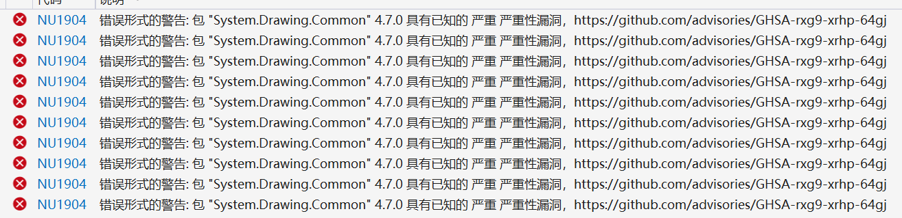
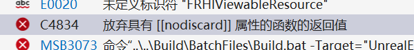

<!--more-->

## Version Fix

- 更新了 VS 之后遇到一些版本兼容性上的问题，记得这一版之后就不要再随便更新了，防止毕设突然出现问题
- 双击至对应的文件，修改至取消报错 `<PackageReference Include="System.Drawing.Common" Version="4.7.0" NoWarn="NU1904"/>`



- 添加 `#pragma warning(disable : 4834)` 取消报错



## ConsoleVariables.ini（可选）

- 开启一些设置方便调试，记得调试完成之后把 .ini 恢复，防止影响性能，目前我这版没有开启

```shell
r.ForceDebugViewModes=2
r.Shaders.Optimize=0
r.ShaderDevelopmentMode=1
r.DumpShaderDebugInfo=1
```

## Recompile shader 

- 运行时可以实时编译修改的 shader `RecompileShaders changed`

## GBuffer

### C++ side

#### Creating a GBuffer texture

- **SceneTexturesConfig.h** 声明 shader parameter rdg texture `SHADER_PARAMETER_RDG_TEXTURE(Texture2D, GBufferInfraredTexture)`
- **SceneTexturesConfig.cpp** 初始化 `BindingCache.Bindings[Layout].GBufferInfrared = FindGBufferBindingByName(GBufferInfo, TEXT("GBufferInfrared"));` `IncludeBindingIfValid(Bindings.GBufferInfrared);`
- **SceneTextures.cpp** 初始化 `SceneTextureParameters.GBufferInfraredTexture = SystemTextures.Black;`

```C++
if (EnumHasAnyFlags(SetupMode, ESceneTextureSetupMode::GBufferInfrared) && HasBeenProduced(SceneTextures->GBufferInfrared))
{
	SceneTextureParameters.GBufferInfraredTexture = SceneTextures->GBufferInfrared;
}
```

- **SceneTextureParameters.h** 添加 pass paramter struct `SHADER_PARAMETER_RDG_TEXTURE(Texture2D, GBufferInfraredTexture)`
- **PlanarReflectionRendering.cpp** 显式添加要引用的地方 `PassParameters->SceneTextures.GBufferInfraredTexture = SceneTextures.GBufferInfraredTexture;` 
- **PostProcessBufferInspector.cpp** 显式添加要引用的地方 `PassParameters->GBufferInfared = SceneTextures.GBufferInfraredTexture;`
- **SceneTextureParameters.cpp** Get 和 Set 都添加对应的 texture `Parameters.GBufferInfraredTexture = GetIfProduced(SceneTextures.GBufferInfrared);` `Parameters.GBufferInfraredTexture = (*SceneTextureUniformBuffer)->GBufferInfraredTexture;` 

#### Creating and initializing the GBufferInfrared

- **SceneTextures.h** 声明 SceneTexture `FRDGTextureRef GBufferInfrared{};`
- **SceneRenderTargetParameters.h** 声明 mode

```C++
enum class ESceneTextureSetupMode : uint32
{
	None			= 0,
	SceneColor		= 1 << 0,
	SceneDepth		= 1 << 1,
	SceneVelocity	= 1 << 2,
	GBufferA		= 1 << 3,
	GBufferB		= 1 << 4,
	GBufferC		= 1 << 5,
	GBufferD		= 1 << 6,
	GBufferE		= 1 << 7,
	GBufferF		= 1 << 8,
	GBufferInfrared = 1 << 9,
	SSAO			= 1 << 10,
	CustomDepth		= 1 << 11,
	GBuffers		= GBufferA | GBufferB | GBufferC | GBufferD | GBufferE | GBufferF | GBufferInfrared,
	All				= SceneColor | SceneDepth | SceneVelocity | GBuffers | SSAO | CustomDepth
};
```

- **SceneRendering.h** 标识 VRAM `ETextureCreateFlags GBufferInfrared;`
- **SceneRendering.cpp** 添加 CVAR `FASTVRAM_CVAR(GBufferInfrared, 0);`
- **TextureShareSceneViewExtension.cpp** 添加标识 `AddShareTexturePass(TextureShareStrings::SceneTextures::GBufferInfrared, SceneTextures.GBufferInfrared);`
- **TextureShareStrings.h** 添加标识 `static constexpr auto GBufferInfrared = TEXT("GBufferInfrared");`
- **PostProcessBufferInspector.cpp** 添加 member `RDG_TEXTURE_ACCESS(GBufferInfrared, ERHIAccess::CopySrc)` 并设置

```C++
if (Parameters.GBufferInfrared)
{
	FRHITexture* SourceBufferInfrared = Parameters.GBufferInfrared->GetRHI();
	if (DestinationBufferBCDEF->GetFormat() == SourceBufferInfrared->GetFormat())
	{
		FRHICopyTextureInfo CopyInfo;
		CopyInfo.SourcePosition = SourcePoint;
		CopyInfo.DestPosition = FIntVector(4, 0, 0);
		CopyInfo.Size = FIntVector(1, 1, 1);
		RHICmdList.CopyTexture(SourceBufferInfrared, DestinationBufferBCDEF, CopyInfo);
	}
}
```

#### Modifying the GBuffer generation

- **GBufferInfo.h** 添加 GBufferBinding `FGBufferBinding GBufferInfrared;`
- **SceneTextures.cpp** 添加 binding 至 get，并创建具体的 RDG texture `{ TEXT("Infrared"), GBufferInfrared, Bindings.GBufferInfrared.Index }`

```C++
if (Bindings.GBufferInfrared.Index >= 0)
{
	const FRDGTextureDesc Desc(FRDGTextureDesc::Create2D(Config.Extent, Bindings.GBufferInfrared.Format, FClearValueBinding::Transparent, Bindings.GBufferInfrared.Flags | FlagsToAdd | GFastVRamConfig.GBufferInfrared));
	SceneTextures.GBufferInfrared = GraphBuilder.CreateTexture(Desc, TEXT("GBufferInfrared"));
}
```

- **GBufferInfo.h** 添加 GBufferSlot `GBS_Infrared, // RGBA16, no compression`
- **ShaderGenerationUtil.cpp** 设置 slot name `case GBS_Infrared: return TEXT("Infrared");`，这个 name 对应了 GBufferData 中 name
- **GBufferInfo.cpp** 初始化 index -1 `int32 TargetInfrared = -1;`，检查数量，然后设置正确的 index 和 parameter，然后设置 bits packing

```C++
if (Params.bHasVelocity == 0 && Params.bHasTangent == 0)
{
	Info.NumTargets = Params.bHasPrecShadowFactor ? 7 : 6;
}
else
{
	Info.NumTargets = Params.bHasPrecShadowFactor ? 8 : 7;
}

===
	// This code should match TBasePassPS
	if (Params.bHasVelocity == 0 && Params.bHasTangent == 0)
	{
		TargetGBufferD = 4;
		TargetInfrared = 5;
		Info.Targets[4].Init(GBT_Unorm_8_8_8_8, TEXT("GBufferD"), false, true, true, true);
		Info.Targets[5].Init(GBT_Float_16_16_16_16,  TEXT("GBufferInfrared"), false,  true,  true,  true);
		TargetSeparatedMainDirLight = 6;

		if (Params.bHasPrecShadowFactor)
		{
			TargetGBufferE = 6;
			Info.Targets[6].Init(GBT_Unorm_8_8_8_8, TEXT("GBufferE"), false, true, true, true);
			TargetSeparatedMainDirLight = 7;
		}
	}
	else if (Params.bHasVelocity)
	{
		TargetVelocity = 4;
		TargetGBufferD = 5;
		TargetInfrared = 6;

		// note the false for use extra flags for velocity, not quite sure of all the ramifications, but this keeps it consistent with previous usage
		Info.Targets[4].Init(Params.bUsesVelocityDepth ? GBT_Unorm_16_16_16_16 : (IsAndroidOpenGLESPlatform(Params.ShaderPlatform) ? GBT_Float_16_16 : GBT_Unorm_16_16), TEXT("Velocity"), false, true, true, false);
		Info.Targets[5].Init(GBT_Unorm_8_8_8_8, TEXT("GBufferD"), false, true, true, true);
		Info.Targets[6].Init(GBT_Float_16_16_16_16, TEXT("GBufferInfrared"), false, true, true, true);
		TargetSeparatedMainDirLight = 7;

		if (Params.bHasPrecShadowFactor)
		{
			TargetGBufferE = 7;
			Info.Targets[7].Init(GBT_Unorm_8_8_8_8, TEXT("GBufferE"), false, true, true, false);
			TargetSeparatedMainDirLight = 8;
		}
	}
	else if (Params.bHasTangent)
	{
		TargetGBufferF = 4;
		TargetGBufferD = 5;
		TargetInfrared = 6;

		Info.Targets[4].Init(GBT_Unorm_8_8_8_8,  TEXT("GBufferF"), false,  true,  true,  true);
		Info.Targets[5].Init(GBT_Unorm_8_8_8_8, TEXT("GBufferD"), false, true, true, true);
		Info.Targets[6].Init(GBT_Float_16_16_16_16, TEXT("GBufferInfrared"), false, true, true, true);
		TargetSeparatedMainDirLight = 7;

		if (Params.bHasPrecShadowFactor)
		{
			TargetGBufferE = 7;
			Info.Targets[7].Init(GBT_Unorm_8_8_8_8, TEXT("GBufferE"), false, true, true, true);
			TargetSeparatedMainDirLight = 8;
		}
	}
	else
	{
		// should never hit this path
		check(0);
	}

===
Info.Slots[GBS_Infrared] = FGBufferItem(GBS_Infrared, GBC_Raw_Float_16_16_16_16, GBCH_Both);
Info.Slots[GBS_Infrared].Packing[0] = FGBufferPacking(TargetInfrared, 0, 0);
Info.Slots[GBS_Infrared].Packing[1] = FGBufferPacking(TargetInfrared, 1, 1);
Info.Slots[GBS_Infrared].Packing[2] = FGBufferPacking(TargetInfrared, 2, 2);
Info.Slots[GBS_Infrared].Packing[3] = FGBufferPacking(TargetInfrared, 3, 3);
```

- **GBufferInfo.h** `MaxTargets` 可以根据需要设置

### HLSL side

- **DeferredShadingCommon.ush** 添加对应的 texture 和 sampler，`Texture2D GBufferInfraredTexture;` `#define GBufferInfraredTextureSampler GlobalPointClampedSampler`

```GLSL
// all values that are output by the forward rendering pass
struct FGBufferData
{	
	float4 Infrared;
};
```

- **SceneTexturesCommon.ush** 添加 sampler `#define SceneTexturesStruct_GBufferInfraredTextureSampler SceneTexturesStruct.PointClampSampler`
- **DeferredDecal.usf** 设置初始值 `GBufferData.Infrared = 0;`
- **Common.ush** MRT 的数量根据情况可以修改
- **ShaderOutputCommon.ush PixelShaderOutputCommon.ush** 根据情况可以添加 `PIXELSHADEROUTPUT_MRT`
- 注意以上修改不适用与 RayTracing，解决方法可以参考 references

## Shading models

### C++ Side

#### Creating the models

- **EngineTypes.h** 添加类型，这个顺序需要和 HLSL 中的匹配

```C++
MSM_Infrared_Default		UMETA(DisplayName = "Infrared Default"),
MSM_Infrared_Subsurface		UMETA(DisplayName = "Infrared Subsurface"),
MSM_Infrared_Skin			UMETA(DisplayName = "Infrared Skin"),
```

- **MaterialShader.cpp** 设置 name 和 compiling stat

```C++
case MSM_Infrared_Default:	ShadingModelName = TEXT("MSM_Infrared_Default"); break;
case MSM_Infrared_Subsurface:	ShadingModelName = TEXT("MSM_Infrared_Subsurface"); break;
case MSM_Infrared_Skin:		ShadingModelName = TEXT("MSM_Infrared_Skin"); break;

===
else if (ShadingModels.HasAnyShadingModel({ MSM_DefaultLit, MSM_Subsurface, MSM_PreintegratedSkin, MSM_ClearCoat, MSM_Cloth, MSM_SubsurfaceProfile, MSM_TwoSidedFoliage, MSM_SingleLayerWater, MSM_ThinTranslucent, MSM_Infrared_Default, MSM_Infrared_Subsurface, MSM_Infrared_Skin }))
{
	INC_DWORD_STAT_BY(STAT_ShaderCompiling_NumLitMaterialShaders, 1);
}
```

- **ShaderMaterial.h** 添加 shadingmodel define

```C++
uint8 MATERIAL_SHADINGMODEL_INFRARED_DEFAULT : 1;
uint8 MATERIAL_SHADINGMODEL_INFRARED_SUBSURFACE : 1;
uint8 MATERIAL_SHADINGMODEL_INFRARED_SKIN : 1;
```

- **MaterialExpressionShadingModel.h** 添加 shading model 以使用 `MakeMaterialAttribute` 选择

```C++
UPROPERTY(EditAnywhere, Category=ShadingModel,  meta=(ValidEnumValues="MSM_DefaultLit, MSM_Subsurface, MSM_PreintegratedSkin, MSM_ClearCoat, MSM_SubsurfaceProfile, MSM_TwoSidedFoliage, MSM_Hair, MSM_Cloth, MSM_Eye, MSM_Infrared_Default, MSM_Infrared_Subsurface, MSM_Infrared_Skin", ShowAsInputPin = "Primary"))
TEnumAsByte<enum EMaterialShadingModel> ShadingModel = MSM_DefaultLit;
```

- **HLSLMaterialTranslator.cpp MaterialHLSLEmitter.cpp** 添加 shading model 的环境变量以在 HLSL 中能够使用

```C++
if (ShadingModels.HasShadingModel(MSM_Infrared_Default))
{
	OutEnvironment.SetDefine(TEXT("MATERIAL_SHADINGMODEL_INFRARED_DEFAULT"), TEXT("1"));
	NumSetMaterials++;
}
if (ShadingModels.HasShadingModel(MSM_Infrared_Subsurface))
{
	OutEnvironment.SetDefine(TEXT("MATERIAL_SHADINGMODEL_INFRARED_SUBSURFACE"), TEXT("1"));
	NumSetMaterials++;
}
if (ShadingModels.HasShadingModel(MSM_Infrared_Skin))
{
	OutEnvironment.SetDefine(TEXT("MATERIAL_SHADINGMODEL_INFRARED_SKIN"), TEXT("1"));
	NumSetMaterials++;
}
```

- **ShaderGenerationUtil.cpp** 添加 HLSL defines，添加 shading model 的 slot 标识

```C++
FETCH_COMPILE_BOOL(MATERIAL_SHADINGMODEL_INFRARED_DEFAULT);
FETCH_COMPILE_BOOL(MATERIAL_SHADINGMODEL_INFRARED_SUBSURFACE);
FETCH_COMPILE_BOOL(MATERIAL_SHADINGMODEL_INFRARED_SKIN);

===

if (Mat.MATERIAL_SHADINGMODEL_INFRARED_DEFAULT)
{
	SetStandardGBufferSlots(Slots, bWriteEmissive, bHasTangent, bHasVelocity, bHasStaticLighting, bIsStrataMaterial);
	Slots[GBS_Infrared] = true;
	Slots[GBS_CustomData] = bUseCustomData;
}

if (Mat.MATERIAL_SHADINGMODEL_INFRARED_SUBSURFACE)
{
	SetStandardGBufferSlots(Slots, bWriteEmissive, bHasTangent, bHasVelocity, bHasStaticLighting, bIsStrataMaterial);
	Slots[GBS_Infrared] = true;
	Slots[GBS_CustomData] = bUseCustomData;
}

if (Mat.MATERIAL_SHADINGMODEL_INFRARED_SKIN)
{
	SetStandardGBufferSlots(Slots, bWriteEmissive, bHasTangent, bHasVelocity, bHasStaticLighting, bIsStrataMaterial);
	Slots[GBS_CustomData] = bUseCustomData;
	Slots[GBS_Infrared] = true;
}

===

case MSM_Infrared_Default:
	SetSharedGBufferSlots(Slots);
	Slots[GBS_Infrared] = true;
	Slots[GBS_CustomData] = true;
	break;
case MSM_Infrared_Subsurface:
	SetSharedGBufferSlots(Slots);
	Slots[GBS_Infrared] = true;
	if (bMergeCustom)
	{
		Slots[GBS_CustomData] = true;
	}
	else
	{
		Slots[GBS_SubsurfaceColor] = true;
		Slots[GBS_Opacity] = true;
	}
	break;
case MSM_Infrared_Skin:
	SetSharedGBufferSlots(Slots);
	Slots[GBS_Infrared] = true;
	if (bMergeCustom)
	{
		Slots[GBS_CustomData] = true;
	}
	else
	{
		Slots[GBS_SubsurfaceColor] = true;
		Slots[GBS_Opacity] = true;
	}
	break;
```

#### Creating a new material custom output node

- **MaterialExpressionInfraredCustomOutput.h** 设置 HLSL 中的 function name

```C++
#pragma once
 
#include "CoreMinimal.h"
#include "UObject/ObjectMacros.h"
#include "MaterialExpressionIO.h"
#include "Materials/MaterialExpressionCustomOutput.h"
#include "MaterialExpressionInfraredCustomOutput.generated.h"
 
UCLASS()
class UMaterialExpressionInfraredOutput : public UMaterialExpressionCustomOutput
{
	GENERATED_UCLASS_BODY()
 
	UPROPERTY(meta = (RequiredInput = "true"))
	FExpressionInput Input;
 
#if WITH_EDITOR
	virtual int32 Compile(class FMaterialCompiler* Compiler, int32 OutputIndex) override;
	virtual void GetCaption(TArray<FString>& OutCaptions) const override;
	virtual uint32 GetInputType(int32 InputIndex) override { return MCT_Float1; }
	virtual FExpressionInput* GetInput(int32 InputIndex) override;
#endif
	virtual int32 GetNumOutputs() const override { return 1; }
	virtual FString GetFunctionName() const override { return TEXT("GetInfraredCustomData"); }
	virtual FString GetDisplayName() const override { return TEXT("Infrared custom data"); }
};
```

- **MaterialExpressions.cpp** `#include "Materials/MaterialExpressionInfraredCustomOutput.h"` 检查 pin 是否连接，设置 node 的名称，获取 node 的 pin 输入

```C++
UMaterialExpressionInfraredOutput::UMaterialExpressionInfraredOutput(const FObjectInitializer& ObjectInitializer)
	: Super(ObjectInitializer)
{
#if WITH_EDITORONLY_DATA
	// Structure to hold one-time initialization
	struct FConstructorStatics
	{
		FText NAME_Utility;
		FConstructorStatics(const FString& DisplayName, const FString& FunctionName)
			: NAME_Utility(LOCTEXT("Utility", "Utility"))
		{
		}
	};
	static FConstructorStatics ConstructorStatics(GetDisplayName(), GetFunctionName());

	MenuCategories.Add(ConstructorStatics.NAME_Utility);

	bCollapsed = true;

	// No outputs
	Outputs.Reset();
#endif
}

#if WITH_EDITOR
int32  UMaterialExpressionInfraredOutput::Compile(class FMaterialCompiler* Compiler, int32 OutputIndex)
{
	if (Input.GetTracedInput().Expression)
	{
		return Compiler->CustomOutput(this, OutputIndex, Input.Compile(Compiler));
	}
	else
	{
		return CompilerError(Compiler, TEXT("Infrared custom data is missing"));
	}
	return INDEX_NONE;
}


void UMaterialExpressionInfraredOutput::GetCaption(TArray<FString>& OutCaptions) const
{
	OutCaptions.Add(FString(TEXT("InfraredCustomData")));
}

FExpressionInput* UMaterialExpressionInfraredOutput::GetInput(int32 InputIndex)
{
	return &Input;
}
```

- 新加了文件记得 regenerate vs project

#### Activate pins

-  **Material.cpp** 开启 `MakeMaterialAttribute` 中的 pin，并改名 customdata

```C++
case MP_SubsurfaceColor:
	Active = ShadingModels.HasAnyShadingModel({ MSM_Subsurface, MSM_PreintegratedSkin, MSM_TwoSidedFoliage, MSM_Cloth, MSM_Infrared_Subsurface, MSM_Infrared_Skin });
	break;
case MP_CustomData0:
	Active = ShadingModels.HasAnyShadingModel({ MSM_ClearCoat, MSM_Hair, MSM_Cloth, MSM_Eye, MSM_SubsurfaceProfile, MSM_Infrared_Default, MSM_Infrared_Subsurface, MSM_Infrared_Skin });
	break;
case MP_CustomData1:
	Active = ShadingModels.HasAnyShadingModel({ MSM_ClearCoat, MSM_Eye, MSM_Infrared_Default, MSM_Infrared_Subsurface, MSM_Infrared_Skin });
	break;

===

case MP_CustomData0:	
	CustomPinNames.Add({ MSM_ClearCoat, "Clear Coat" });
	CustomPinNames.Add({ MSM_Hair, "Backlit"});
	CustomPinNames.Add({ MSM_Cloth, "Cloth"});
	CustomPinNames.Add({ MSM_Eye, "Iris Mask"});
	CustomPinNames.Add({ MSM_SubsurfaceProfile, "Curvature" });
	CustomPinNames.Add({ MSM_Infrared_Default, "Temperature" });
	CustomPinNames.Add({ MSM_Infrared_Subsurface, "Temperature" });
	CustomPinNames.Add({ MSM_Infrared_Skin, "Temperature" });
	return FText::FromString(GetPinNameFromShadingModelField(Material->GetShadingModels(), CustomPinNames, "Custom Data 0"));
case MP_CustomData1:
	CustomPinNames.Add({ MSM_ClearCoat, "Clear Coat Roughness" });
	CustomPinNames.Add({MSM_Eye, "Iris Distance"});
	CustomPinNames.Add({ MSM_Infrared_Default, "Emissivity" });
	CustomPinNames.Add({ MSM_Infrared_Subsurface, "Emissivity" });
	CustomPinNames.Add({ MSM_Infrared_Skin, "Emissivity" });
	return FText::FromString(GetPinNameFromShadingModelField(Material->GetShadingModels(), CustomPinNames, "Custom Data 1"));

```

- **MaterialShared.h** 设置 `IsSubsurfaceShadingModel` 以开启 Opacity

```C++
inline bool IsSubsurfaceShadingModel(FMaterialShadingModelField ShadingModel)
{
	return ShadingModel.HasShadingModel(MSM_Subsurface) || ShadingModel.HasShadingModel(MSM_PreintegratedSkin) ||
		ShadingModel.HasShadingModel(MSM_SubsurfaceProfile) || ShadingModel.HasShadingModel(MSM_TwoSidedFoliage) ||
		ShadingModel.HasShadingModel(MSM_Cloth) || ShadingModel.HasShadingModel(MSM_Eye) || ShadingModel.HasShadingModel(MSM_Infrared_Subsurface) || ShadingModel.HasShadingModel(MSM_Infrared_Skin);
}
```

#### HLSL size

- **ShadingCommon.ush** 添加 shadingmodelid define，修改对应的 shading model 颜色

```HLSL
#define SHADINGMODELID_INFRARED_DEFAULT     13
#define SHADINGMODELID_INFRARED_SUBSURFACE  14
#define SHADINGMODELID_INFRARED_SKIN		15

===

// for debugging and to visualize
float3 GetShadingModelColor(uint ShadingModelID)
{
	// TODO: PS4 doesn't optimize out correctly the switch(), so it thinks it needs all the Samplers even if they get compiled out
	//	This will get fixed after launch per Sony...
#if PS4_PROFILE
		 if (ShadingModelID == SHADINGMODELID_UNLIT) return float3(0.1f, 0.1f, 0.2f); // Dark Blue
	else if (ShadingModelID == SHADINGMODELID_DEFAULT_LIT) return float3(0.1f, 1.0f, 0.1f); // Green
	else if (ShadingModelID == SHADINGMODELID_SUBSURFACE) return float3(1.0f, 0.1f, 0.1f); // Red
	else if (ShadingModelID == SHADINGMODELID_PREINTEGRATED_SKIN) return float3(0.6f, 0.4f, 0.1f); // Brown
	else if (ShadingModelID == SHADINGMODELID_CLEAR_COAT) return float3(0.1f, 0.4f, 0.4f); 
	else if (ShadingModelID == SHADINGMODELID_SUBSURFACE_PROFILE) return float3(0.2f, 0.6f, 0.5f); // Cyan
	else if (ShadingModelID == SHADINGMODELID_TWOSIDED_FOLIAGE) return float3(0.2f, 0.2f, 0.8f); // Blue
	else if (ShadingModelID == SHADINGMODELID_HAIR) return float3(0.6f, 0.1f, 0.5f);
	else if (ShadingModelID == SHADINGMODELID_CLOTH) return float3(0.7f, 1.0f, 1.0f); 
	else if (ShadingModelID == SHADINGMODELID_EYE) return float3(0.3f, 1.0f, 1.0f); 
	else if (ShadingModelID == SHADINGMODELID_SINGLELAYERWATER) return float3(0.5f, 0.5f, 1.0f);
	else if (ShadingModelID == SHADINGMODELID_THIN_TRANSLUCENT) return float3(1.0f, 0.8f, 0.3f);
	else if (ShadingModelID == SHADINGMODELID_STRATA) return float3(1.0f, 1.0f, 0.0f);
	else if (ShadingModelID == SHADINGMODELID_INFRARED_DEFAULT) return float3(0.32f, 0.11f, 0.14f); // dark red
	else if (ShadingModelID == SHADINGMODELID_INFRARED_SUBSURFACE) return float3(0.50f, 0.23f, 0.52f); // purple
	else if (ShadingModelID == SHADINGMODELID_INFRARED_SKIN) return float3(0.33f, 0.59f, 0.76f); // blue
	else return float3(1.0f, 1.0f, 1.0f); // White
#else
	switch(ShadingModelID)
	{
		case SHADINGMODELID_UNLIT: return float3(0.1f, 0.1f, 0.2f); // Dark Blue
		case SHADINGMODELID_DEFAULT_LIT: return float3(0.1f, 1.0f, 0.1f); // Green
		case SHADINGMODELID_SUBSURFACE: return float3(1.0f, 0.1f, 0.1f); // Red
		case SHADINGMODELID_PREINTEGRATED_SKIN: return float3(0.6f, 0.4f, 0.1f); // Brown
		case SHADINGMODELID_CLEAR_COAT: return float3(0.1f, 0.4f, 0.4f); // Brown
		case SHADINGMODELID_SUBSURFACE_PROFILE: return float3(0.2f, 0.6f, 0.5f); // Cyan
		case SHADINGMODELID_TWOSIDED_FOLIAGE: return float3(0.2f, 0.2f, 0.8f); // Cyan
		case SHADINGMODELID_HAIR: return float3(0.6f, 0.1f, 0.5f);
		case SHADINGMODELID_CLOTH: return float3(0.7f, 1.0f, 1.0f);
		case SHADINGMODELID_EYE: return float3(0.3f, 1.0f, 1.0f);
		case SHADINGMODELID_SINGLELAYERWATER: return float3(0.5f, 0.5f, 1.0f);
		case SHADINGMODELID_THIN_TRANSLUCENT: return float3(1.0f, 0.8f, 0.3f);
		case SHADINGMODELID_STRATA: return float3(1.0f, 1.0f, 0.0f);
		case SHADINGMODELID_INFRARED_DEFAULT: return float3(0.32f, 0.11f, 0.14f); // dark red 
		case SHADINGMODELID_INFRARED_SUBSURFACE: return float3(0.50f, 0.23f, 0.52f); // purple
		case SHADINGMODELID_INFRARED_SKIN: return float3(0.33f, 0.59f, 0.76f); // blue
		default: return float3(1.0f, 1.0f, 1.0f); // White
	}
#endif
}
```

- **Definitions.usf** 添加 shading model 的 defines

```C++
#ifndef MATERIAL_SHADINGMODEL_INFRARED_DEFAULT
#define MATERIAL_SHADINGMODEL_INFRARED_DEFAULT				0
#endif
 
#ifndef MATERIAL_SHADINGMODEL_INFRARED_SUBSURFACE
#define MATERIAL_SHADINGMODEL_INFRARED_SUBSURFACE			0
#endif
 
#ifndef MATERIAL_SHADINGMODEL_INFRARED_SKIN
#define MATERIAL_SHADINGMODEL_INFRARED_SKIN					0
#endif
```

- **ShadingModelsMaterial.ush** 设置对应的 GBuffer

```HLSL
#if MATERIAL_SHADINGMODEL_INFRARED_DEFAULT
	else if (ShadingModel == SHADINGMODELID_INFRARED_DEFAULT)
	{
		GBuffer.Infrared.r = GetMaterialCustomData0(MaterialParameters) / 5000.f;
		GBuffer.Infrared.g = GetMaterialCustomData1(MaterialParameters);
		GBuffer.Infrared.b = GetInfraredCustomData0(MaterialParameters);
		GBuffer.Infrared.a = Opacity;

		GBuffer.CustomData.r = GetMaterialCustomData0(MaterialParameters) / 5000.f;
		GBuffer.CustomData.g = GetMaterialCustomData1(MaterialParameters);
		GBuffer.CustomData.b = GetInfraredCustomData0(MaterialParameters);
		GBuffer.CustomData.a = Opacity;
	}
#endif
#if MATERIAL_SHADINGMODEL_INFRARED_SUBSURFACE
	else if (ShadingModel == SHADINGMODELID_INFRARED_SUBSURFACE)
	{
		GBuffer.Infrared.r = GetMaterialCustomData0(MaterialParameters) / 5000.f;
		GBuffer.Infrared.g = GetMaterialCustomData1(MaterialParameters);
		GBuffer.Infrared.b = GetInfraredCustomData0(MaterialParameters);
		GBuffer.Infrared.a = Opacity;

		GBuffer.CustomData.rgb = EncodeSubsurfaceColor(SubsurfaceColor);
		GBuffer.CustomData.a = Opacity;
	}
#endif
#if MATERIAL_SHADINGMODEL_INFRARED_SKIN
	else if (ShadingModel == SHADINGMODELID_INFRARED_SKIN)
	{
		GBuffer.Infrared.r = GetMaterialCustomData0(MaterialParameters) / 5000.f;
		GBuffer.Infrared.g = GetMaterialCustomData1(MaterialParameters);
		GBuffer.Infrared.b = GetInfraredCustomData0(MaterialParameters);
		GBuffer.Infrared.a = Opacity;

		GBuffer.CustomData.rgb = EncodeSubsurfaceColor(SubsurfaceColor);
		GBuffer.CustomData.a = Opacity;
	}
#endif
```

- **DeferredShadingCommon.ush** 修改 IsSubsurfaceModel、HasCustomGBufferData

```HLSL
bool IsSubsurfaceModel(int ShadingModel)
{
	return ShadingModel == SHADINGMODELID_SUBSURFACE 
		|| ShadingModel == SHADINGMODELID_PREINTEGRATED_SKIN 
		|| ShadingModel == SHADINGMODELID_SUBSURFACE_PROFILE
		|| ShadingModel == SHADINGMODELID_TWOSIDED_FOLIAGE
		|| ShadingModel == SHADINGMODELID_HAIR
		|| ShadingModel == SHADINGMODELID_EYE
		|| ShadingModel == SHADINGMODELID_INFRARED_SUBSURFACE
		|| ShadingModel == SHADINGMODELID_INFRARED_SKIN;
}

bool HasCustomGBufferData(int ShadingModelID)
{
	return ShadingModelID == SHADINGMODELID_SUBSURFACE
		|| ShadingModelID == SHADINGMODELID_PREINTEGRATED_SKIN
		|| ShadingModelID == SHADINGMODELID_CLEAR_COAT
		|| ShadingModelID == SHADINGMODELID_SUBSURFACE_PROFILE
		|| ShadingModelID == SHADINGMODELID_TWOSIDED_FOLIAGE
		|| ShadingModelID == SHADINGMODELID_HAIR
		|| ShadingModelID == SHADINGMODELID_CLOTH
		|| ShadingModelID == SHADINGMODELID_EYE
		|| ShadingModelID == SHADINGMODELID_INFRARED_DEFAULT
		|| ShadingModelID == SHADINGMODELID_INFRARED_SUBSURFACE
		|| ShadingModelID == SHADINGMODELID_INFRARED_SKIN;;
}

bool IsInfrared(int ShadingModel)
{
	return ShadingModel == SHADINGMODELID_INFRARED_DEFAULT || ShadingModel == SHADINGMODELID_INFRARED_SUBSURFACE || ShadingModel == SHADINGMODELID_INFRARED_SKIN;
}
```

- **ShadingModels.ush** 这里我们并不改本身的可见光光照模型，所有直接用的现成的

```HLSL
case SHADINGMODELID_INFRARED_DEFAULT:
	return DefaultLitBxDF( GBuffer, N, V, L, Falloff, NoL, AreaLight, Shadow );
case SHADINGMODELID_INFRARED_SUBSURFACE:
	 return SubsurfaceBxDF( GBuffer, N, V, L, Falloff, NoL, AreaLight, Shadow );
case SHADINGMODELID_INFRARED_SKIN:
	return PreintegratedSkinBxDF( GBuffer, N, V, L, Falloff, NoL, AreaLight, Shadow );
```

## Add custom pass

- 由于上述对于 GBuffer 的写入改动都只是针对 BasePass 的，半透明物体需要额外加 pass
- **MeshPassProcessor.h** 添加枚举、name和修改相应的数量

```C++
namespace EMeshPass
{
	enum Type : uint8
	{
		InfraredTranslucencyPass,

		Num,
		NumBits = 6,
	};
}

case EMeshPass::InfraredTranslucencyPass: return TEXT("InfraredTranslucencyPass");

#if WITH_EDITOR
	static_assert(EMeshPass::Num == 29 + 4, "Need to update switch(MeshPass) after changing EMeshPass");
#else
	static_assert(EMeshPass::Num == 29, "Need to update switch(MeshPass) after changing EMeshPass");
#endif

class FMeshPassMask
{
public:
	FMeshPassMask()
		: Data(0)
	{
	}

	void Set(EMeshPass::Type Pass)
	{
		Data |= ((uint64)1 << Pass);
	}

	bool Get(EMeshPass::Type Pass) const
	{
		return !!(Data & ((uint64)1 << Pass));
	}

	EMeshPass::Type SkipEmpty(EMeshPass::Type Pass) const
	{
		uint64 Mask = 0xFFffFFffFFffFFff << Pass;
		return EMeshPass::Type(FMath::Min<uint32>(EMeshPass::Num, FMath::CountTrailingZerosTmp(Data & Mask)));
	}

	int GetNum()
	{
		return FMath::CountBits(Data);
	}

	void AppendTo(FMeshPassMask& Mask) const
	{
		Mask.Data |= Data;
	}

	void Reset()
	{
		Data = 0;
	}

	bool IsEmpty() const
	{
		return Data == 0;
	}

	uint64 Data;
};
```

- **MicrosoftPlatformMath.h** 添加一个辅助函数

```C++
static FORCEINLINE uint32 CountTrailingZerosTmp(uint64 Value)
{
	// return 32 if value was 0
	unsigned long BitIndex;	// 0-based, where the LSB is 0 and MSB is 31
	return _BitScanForward64(&BitIndex, Value) ? BitIndex : 33;
}
```

- **PSOPrecache.h** `MaxPSOCollectorCount = 33`
- **InfraredShader.usf** VS 计算 Position，PS 获取 MaterialData

```HLSL

/*=============================================================================
	InfraredShader.hlsl: Write Infrared Custom Data to GBuffer.
=============================================================================*/

#include "Common.ush"
#include "/Engine/Generated/Material.ush"
#include "/Engine/Generated/VertexFactory.ush"

struct FMeshPassVSToPS
{
    FVertexFactoryInterpolantsVSToPS FactoryInterpolants;
    float4 Position : SV_POSITION;
};

#if VERTEXSHADER
void MainVS(
    FVertexFactoryInput Input,
    out FMeshPassVSToPS Output)
{
    ResolvedView = ResolveView();

    FVertexFactoryIntermediates VFIntermediates = GetVertexFactoryIntermediates(Input);

    float4 WorldPos = VertexFactoryGetWorldPosition(Input, VFIntermediates);
    float3 WorldNormal = VertexFactoryGetWorldNormal(Input, VFIntermediates);

    float3x3 TangentToLocal = VertexFactoryGetTangentToLocal(Input, VFIntermediates);

    FMaterialVertexParameters VertexParameters = GetMaterialVertexParameters(Input, VFIntermediates, WorldPos.xyz, TangentToLocal);
    WorldPos.xyz += GetMaterialWorldPositionOffset(VertexParameters);

    float4 RasterizedWorldPosition = VertexFactoryGetRasterizedWorldPosition(Input, VFIntermediates, WorldPos);

    Output.FactoryInterpolants = VertexFactoryGetInterpolantsVSToPS(Input, VFIntermediates, VertexParameters);
    Output.Position = mul(RasterizedWorldPosition, ResolvedView.TranslatedWorldToClip);
}
#endif // VERTEXSHADER

void MainPS(
	//in INPUT_POSITION_QUALIFIERS float4 SvPosition : SV_Position,
	FMeshPassVSToPS Input
	OPTIONAL_IsFrontFace
	OPTIONAL_OutDepthConservative
	,out ENCODED_VELOCITY_TYPE OutColor : SV_Target0
#if MATERIALBLENDING_MASKED_USING_COVERAGE
	, out uint OutCoverage : SV_Coverage
#endif
	)
{
#if INSTANCED_STEREO
	ResolvedView = ResolveView(Input.FactoryInterpolants.EyeIndex);
#else
	ResolvedView = ResolveView();
#endif

	// Manual clipping here (alpha-test, etc)
	FMaterialPixelParameters MaterialParameters = GetMaterialPixelParameters(Input.FactoryInterpolants, Input.Position);
	FPixelMaterialInputs PixelMaterialInputs;
	CalcMaterialParameters(MaterialParameters, PixelMaterialInputs, Input.Position, bIsFrontFace);

#if OUTPUT_PIXEL_DEPTH_OFFSET
	ApplyPixelDepthOffsetToMaterialParameters(MaterialParameters, PixelMaterialInputs, OutDepth);
#endif

	//#if MATERIALBLENDING_TRANSLUCENT
		//clip(GetMaterialOpacity(PixelMaterialInputs) - GetMaterialOpacityMaskClipValue());
	//#elif MATERIALBLENDING_MASKED_USING_COVERAGE
		//OutCoverage = DiscardMaterialWithPixelCoverage(MaterialParameters, PivxelMaterialInputs);
	//#else
		//GetMaterialCoverageAndClipping(MaterialParameters, PixelMaterialInputs);
	//#endif

#if MATERIAL_SHADINGMODEL_INFRARED_DEFAULT || NUM_MATERIAL_OUTPUTS_GETINFRAREDCUSTOMDATA > 0
	OutColor = float4(GetMaterialCustomData0(MaterialParameters), GetMaterialCustomData1(MaterialParameters), GetInfraredCustomData0(MaterialParameters), GetMaterialOpacity(PixelMaterialInputs));
#else
	OutColor = float4(GetMaterialCustomData0(MaterialParameters), GetMaterialCustomData1(MaterialParameters), 0.1f, GetMaterialOpacity(PixelMaterialInputs));
#endif
}
```

- **InfraredRendering.h** 定义 VS、PS、MeshProcessor

```C++
#pragma once

#include "CoreMinimal.h"
#include "RHI.h"
#include "HitProxies.h"
#include "ShaderBaseClasses.h"
#include "MeshPassProcessor.h"

class FPrimitiveSceneProxy;
class FScene;
class FStaticMeshBatch;
class FViewInfo;

class FInfraredPassVS : public FMeshMaterialShader
{
	DECLARE_SHADER_TYPE(FInfraredPassVS,MeshMaterial);
protected:

	FInfraredPassVS() {}

	FInfraredPassVS(const FMeshMaterialShaderType::CompiledShaderInitializerType& Initializer) :
		FMeshMaterialShader(Initializer)
	{}

public:

	static bool ShouldCompilePermutation(const FMeshMaterialShaderPermutationParameters& Parameters)
	{
		return (
			Parameters.MaterialParameters.bIsSpecialEngineMaterial
			// && Parameters.VertexFactoryType->SupportsPositionOnly()
			);
	}
	
	void GetShaderBindings(
		const FScene* Scene,
		ERHIFeatureLevel::Type FeatureLevel,
		const FPrimitiveSceneProxy* PrimitiveSceneProxy,
		const FMaterialRenderProxy& MaterialRenderProxy,
		const FMaterial& Material,
		const FMeshPassProcessorRenderState& DrawRenderState,
		const FMeshMaterialShaderElementData& ShaderElementData,
		FMeshDrawSingleShaderBindings& ShaderBindings) const
	{
		FMeshMaterialShader::GetShaderBindings(Scene, FeatureLevel, PrimitiveSceneProxy, MaterialRenderProxy, Material, DrawRenderState, ShaderElementData, ShaderBindings);
	}
};

/**
* A pixel shader.
*/
class FInfraredPassPS : public FMeshMaterialShader
{
	DECLARE_SHADER_TYPE(FInfraredPassPS,MeshMaterial);
public:
	static bool ShouldCompilePermutation(const FMeshMaterialShaderPermutationParameters& Parameters)
	{
		return true;

		if (IsTranslucentBlendMode(Parameters.MaterialParameters.BlendMode))
		{
			return Parameters.MaterialParameters.bIsTranslucencyWritingCustomDepth;
		}

		return
			// Compile for materials that are masked
			(!Parameters.MaterialParameters.bWritesEveryPixel || Parameters.MaterialParameters.bHasPixelDepthOffsetConnected);
	}

	FInfraredPassPS(const ShaderMetaType::CompiledShaderInitializerType& Initializer):
		FMeshMaterialShader(Initializer)
	{
	}

	static void ModifyCompilationEnvironment(const FMaterialShaderPermutationParameters& Parameters, FShaderCompilerEnvironment& OutEnvironment)
	{
		FMeshMaterialShader::ModifyCompilationEnvironment(Parameters, OutEnvironment);
		
		//OutEnvironment.SetDefine(TEXT("ALLOW_DEBUG_VIEW_MODES"), AllowDebugViewmodes(Parameters.Platform));
		//OutEnvironment.SetDefine(TEXT("SCENE_TEXTURES_DISABLED"), 1u);
	}

	FInfraredPassPS() {}

	void GetShaderBindings(
		const FScene* Scene,
		ERHIFeatureLevel::Type FeatureLevel,
		const FPrimitiveSceneProxy* PrimitiveSceneProxy,
		const FMaterialRenderProxy& MaterialRenderProxy,
		const FMaterial& Material,
		const FMeshPassProcessorRenderState& DrawRenderState,
		const FMeshMaterialShaderElementData& ShaderElementData,
		FMeshDrawSingleShaderBindings& ShaderBindings) const
	{
		FMeshMaterialShader::GetShaderBindings(Scene, FeatureLevel, PrimitiveSceneProxy, MaterialRenderProxy, Material, DrawRenderState, ShaderElementData, ShaderBindings);
	}
};

class FInfraredPassMeshProcessor : public FSceneRenderingAllocatorObject<FInfraredPassMeshProcessor>, public FMeshPassProcessor
{
public:

	FInfraredPassMeshProcessor(
		const FScene* Scene, 
		ERHIFeatureLevel::Type FeatureLevel, 
		const FSceneView* InViewIfDynamicMeshCommand, 
		const FMeshPassProcessorRenderState& InPassDrawRenderState, 
		const bool InbRespectUseAsOccluderFlag,
		const bool InbEarlyZPassMovable,
		FMeshPassDrawListContext* InDrawListContext);

	//FInfraredPassMeshProcessor(const FScene* Scene, ERHIFeatureLevel::Type FeatureLevel, const FSceneView* InViewIfDynamicMeshCommand, FMeshPassDrawListContext* InDrawListContext);

	virtual void AddMeshBatch(const FMeshBatch& RESTRICT MeshBatch, uint64 BatchElementMask, const FPrimitiveSceneProxy* RESTRICT PrimitiveSceneProxy, int32 StaticMeshId = -1) override final;

	bool TryAddMeshBatch(
		const FMeshBatch& RESTRICT MeshBatch,
		uint64 BatchElementMask,
		const FPrimitiveSceneProxy* RESTRICT PrimitiveSceneProxy,
		int32 StaticMeshId,
		const FMaterialRenderProxy& MaterialRenderProxy,
		const FMaterial& Material,
		const FMaterial& Material1);

private:

	bool Process(
			const FMeshBatch& MeshBatch,
			uint64 BatchElementMask,
			int32 StaticMeshId,
			const FPrimitiveSceneProxy* RESTRICT PrimitiveSceneProxy,
			const FMaterialRenderProxy& RESTRICT MaterialRenderProxy,
			const FMaterial& RESTRICT MaterialResource,
			ERasterizerFillMode MeshFillMode,
			ERasterizerCullMode MeshCullMode);

	FMeshPassProcessorRenderState PassDrawRenderState;

	const bool bRespectUseAsOccluderFlag = false;
	const bool bEarlyZPassMovable = false;
	const bool bDitheredLODFadingOutMaskPass = false;
	const bool bShadowProjection = false;
};

IMPLEMENT_MATERIAL_SHADER_TYPE(, FInfraredPassVS, TEXT("/Engine/Private/InfraredShader.usf"), TEXT("MainVS"), SF_Vertex);
IMPLEMENT_MATERIAL_SHADER_TYPE(, FInfraredPassPS, TEXT("/Engine/Private/InfraredShader.usf"), TEXT("MainPS"), SF_Pixel);
//IMPLEMENT_MATERIAL_SHADER_TYPE(, FInfraredPassPS, TEXT("/Engine/Private/DepthOnlyPixelShader.usf"), TEXT("Main"), SF_Pixel);
//IMPLEMENT_SHADERPIPELINE_TYPE_VS(CustomShaderPipeline, FInfraredPassVS, true);
IMPLEMENT_SHADERPIPELINE_TYPE_VSPS(CustomShaderPipeline, FInfraredPassVS, FInfraredPassPS, true);
```

- **InfraredRendering.cpp** 实现具体的 MeshProcessor 的 AddMeshBatch、Process 等，注册 pass

```C++
#include "InfraredRendering.h"
#include "RendererInterface.h"
#include "StaticBoundShaderState.h"
#include "SceneUtils.h"
#include "EngineGlobals.h"
#include "Materials/Material.h"
#include "PostProcess/SceneRenderTargets.h"
#include "GlobalShader.h"
#include "MaterialShaderType.h"
#include "MeshMaterialShaderType.h"
#include "MeshMaterialShader.h"
#include "SceneRendering.h"
#include "DeferredShadingRenderer.h"
#include "ScenePrivate.h"
#include "OneColorShader.h"
#include "IHeadMountedDisplay.h"
#include "IXRTrackingSystem.h"
#include "ScreenRendering.h"
#include "PostProcess/SceneFilterRendering.h"
#include "DynamicPrimitiveDrawing.h"
#include "PipelineStateCache.h"
#include "ClearQuad.h"
#include "MeshPassProcessor.inl"
#include "PixelShaderUtils.h"
#include "RenderGraphUtils.h"
#include "SceneRenderingUtils.h"
#include "DebugProbeRendering.h"

FInfraredPassMeshProcessor::FInfraredPassMeshProcessor(
	EMeshPass::Type InMeshPassType,
	const FScene* Scene,
	ERHIFeatureLevel::Type FeatureLevel,
	const FSceneView* InViewIfDynamicMeshCommand,
	const FMeshPassProcessorRenderState& InPassDrawRenderState,
	const bool InbRespectUseAsOccluderFlag,
	const EDepthDrawingMode InEarlyZPassMode,
	const bool InbEarlyZPassMovable,
	const bool bDitheredLODFadingOutMaskPass,
	FMeshPassDrawListContext* InDrawListContext,
	const bool bInShadowProjection)
	: FMeshPassProcessor(InMeshPassType, Scene, FeatureLevel, InViewIfDynamicMeshCommand, InDrawListContext)
	, bRespectUseAsOccluderFlag(InbRespectUseAsOccluderFlag)
	, EarlyZPassMode(InEarlyZPassMode)
	, bEarlyZPassMovable(InbEarlyZPassMovable)
	, bDitheredLODFadingOutMaskPass(bDitheredLODFadingOutMaskPass)
	, bShadowProjection(bInShadowProjection)
{
	PassDrawRenderState = InPassDrawRenderState;
}

void FInfraredPassMeshProcessor::AddMeshBatch(const FMeshBatch& RESTRICT MeshBatch, uint64 BatchElementMask, const FPrimitiveSceneProxy* RESTRICT PrimitiveSceneProxy, int32 StaticMeshId)
{
	const FMaterialRenderProxy* MaterialRenderProxy = MeshBatch.MaterialRenderProxy;
	while (MaterialRenderProxy)
	{
		const FMaterial* Material1 = MaterialRenderProxy->GetMaterialNoFallback(FeatureLevel);

		if (Material1)
		{
			if (TryAddMeshBatch(MeshBatch, BatchElementMask, PrimitiveSceneProxy, StaticMeshId, *MaterialRenderProxy, *Material1))
			{
				break;
			}
		}
		 
		MaterialRenderProxy = MaterialRenderProxy->GetFallback(FeatureLevel);
	}

}

bool FInfraredPassMeshProcessor::TryAddMeshBatch(
	const FMeshBatch& RESTRICT MeshBatch,
	uint64 BatchElementMask,
	const FPrimitiveSceneProxy* RESTRICT PrimitiveSceneProxy,
	int32 StaticMeshId,
	const FMaterialRenderProxy& MaterialRenderProxy,
	const FMaterial& Material)
{
	// Determine the mesh's material and blend mode.
	const EBlendMode BlendMode = Material.GetBlendMode();
	const FMaterialShadingModelField ShadingModels = Material.GetShadingModels();
	const bool bIsTranslucent = IsTranslucentBlendMode(BlendMode);
	const FMeshDrawingPolicyOverrideSettings OverrideSettings = ComputeMeshOverrideSettings(MeshBatch);
	const ERasterizerFillMode MeshFillMode = ComputeMeshFillMode(Material, OverrideSettings);
	const ERasterizerCullMode MeshCullMode = ComputeMeshCullMode(Material, OverrideSettings);

	return Process(MeshBatch, BatchElementMask, StaticMeshId, PrimitiveSceneProxy, MaterialRenderProxy, Material, MeshFillMode, MeshCullMode);
}

bool GetInfraredPassShaders(
	const FMaterial& Material,
	FVertexFactoryType* VertexFactoryType,
	ERHIFeatureLevel::Type FeatureLevel,
	TShaderRef<FInfraredPassVS>& VertexShader,
	TShaderRef<FInfraredPassPS>& PixelShader,
	FShaderPipelineRef& ShaderPipeline)
{
	FMaterialShaderTypes ShaderTypes;
	ShaderTypes.AddShaderType<FInfraredPassVS>();
	ShaderTypes.AddShaderType<FInfraredPassPS>();
	ShaderTypes.PipelineType = &InfraredShaderPipeline;

	FMaterialShaders Shaders;
	if (!Material.TryGetShaders(ShaderTypes, VertexFactoryType, Shaders))
	{
		return false;
	}

	Shaders.TryGetPipeline(ShaderPipeline);
	Shaders.TryGetVertexShader(VertexShader);
	Shaders.TryGetPixelShader(PixelShader);
	return true;
}

bool FInfraredPassMeshProcessor::Process(
	const FMeshBatch& MeshBatch,
	uint64 BatchElementMask,
	int32 StaticMeshID,
	const FPrimitiveSceneProxy* RESTRICT PrimitiveSceneProxy,
	const FMaterialRenderProxy& RESTRICT MaterialRenderProxy,
	const FMaterial& RESTRICT MaterialResource,
	ERasterizerFillMode MeshFillMode,
	ERasterizerCullMode MeshCullMode
)
{
	const FVertexFactory* VertexFactory = MeshBatch.VertexFactory;

	TMeshProcessorShaders<
		FInfraredPassVS,
		FInfraredPassPS> InfraredPassShaders;

	FShaderPipelineRef ShaderPipeline;

	if (!GetInfraredPassShaders(
		MaterialResource,
		VertexFactory->GetType(),
		FeatureLevel,
		InfraredPassShaders.VertexShader,
		InfraredPassShaders.PixelShader,
		ShaderPipeline))
	{
		return false;
	}
	

	FMeshMaterialShaderElementData ShaderElementData;
	ShaderElementData.InitializeMeshMaterialData(ViewIfDynamicMeshCommand, PrimitiveSceneProxy, MeshBatch, StaticMeshID, true);

	//const FMeshDrawCommandSortKey SortKey = CalculateMeshStaticSortKey(InfraredPassShaders.VertexShader.GetShader(), InfraredPassShaders.PixelShader.GetShader());
	const FMeshDrawCommandSortKey SortKey = CalculateTranslucentMeshStaticSortKey(PrimitiveSceneProxy, MeshBatch.MeshIdInPrimitive);

	BuildMeshDrawCommands(
		MeshBatch,
		BatchElementMask,
		PrimitiveSceneProxy,
		MaterialRenderProxy,
		MaterialResource,
		PassDrawRenderState,
		InfraredPassShaders,
		MeshFillMode,
		MeshCullMode,
		SortKey,
		EMeshPassFeatures::Default,
		ShaderElementData);
	return true;
}

void SetupInfraredPassState(FMeshPassProcessorRenderState& DrawRenderState)
{
	DrawRenderState.SetBlendState(TStaticBlendState<>::GetRHI());
	//DrawRenderState.SetBlendState(TStaticBlendState<CW_RGB, BO_Add, BF_One, BF_SourceAlpha>::GetRHI()); // 是否混合？需要考虑一下半透明物体怎么算
	//DrawRenderState.SetBlendState(TStaticBlendState<CW_RGBA, BO_Add, BF_One, BF_Source1Color, BO_Add, BF_One, BF_Source1Alpha>::GetRHI()); // 没效果
	//DrawRenderState.SetBlendState(TStaticBlendState<CW_RGBA, BO_Add, BF_One, BF_InverseSourceAlpha, BO_Add, BF_Zero, BF_InverseSourceAlpha>::GetRHI()); 
	DrawRenderState.SetBlendState(TStaticBlendState<CW_RGBA, BO_Add, BF_SourceAlpha, BF_InverseSourceAlpha, BO_Add, BF_One, BF_Zero>::GetRHI());
	DrawRenderState.SetDepthStencilState(TStaticDepthStencilState<false, CF_DepthNearOrEqual>::GetRHI()); // 不写入深度
}

FMeshPassProcessor* CreateInfraredPassProcessor(ERHIFeatureLevel::Type FeatureLevel, const FScene* Scene, const FSceneView* InViewIfDynamicMeshCommand, FMeshPassDrawListContext* InDrawListContext)
{
	EDepthDrawingMode EarlyZPassMode;
	bool bEarlyZPassMovable;
	FScene::GetEarlyZPassMode(FeatureLevel, EarlyZPassMode, bEarlyZPassMovable);

	FMeshPassProcessorRenderState PassState;
	SetupInfraredPassState(PassState);

	return new FInfraredPassMeshProcessor(EMeshPass::InfraredTranslucencyPass, Scene, FeatureLevel, InViewIfDynamicMeshCommand, PassState, true, EarlyZPassMode, bEarlyZPassMovable, false, InDrawListContext);

	//return new FInfraredPassMeshProcessor(Scene, FeatureLevel, InViewIfDynamicMeshCommand, DepthPassState, true, bEarlyZPassMovable, InDrawListContext);
}

REGISTER_MESHPASSPROCESSOR_AND_PSOCOLLECTOR(RegisterInfraredTranslucencyPass, CreateInfraredPassProcessor, EShadingPath::Deferred, EMeshPass::InfraredTranslucencyPass, EMeshPassFlags::CachedMeshCommands | EMeshPassFlags::MainView);
FRegisterPassProcessorCreateFunction RegisterMobileInfraredTranslucencyPass(&CreateInfraredPassProcessor, EShadingPath::Mobile, EMeshPass::InfraredTranslucencyPass, EMeshPassFlags::CachedMeshCommands | EMeshPassFlags::MainView);

BEGIN_SHADER_PARAMETER_STRUCT(FInfraredPassParameters, )
	SHADER_PARAMETER_STRUCT_INCLUDE(FViewShaderParameters, View)
	SHADER_PARAMETER_STRUCT_INCLUDE(FInstanceCullingDrawParams, InstanceCullingDrawParams)
	SHADER_PARAMETER_STRUCT_INCLUDE(FSceneTextureShaderParameters, SceneTextures)
	RENDER_TARGET_BINDING_SLOTS()
END_SHADER_PARAMETER_STRUCT()

//IMPLEMENT_STATIC_UNIFORM_BUFFER_STRUCT(FInfraredPassParameters, "LumenFrontLayerTranslucencyGBufferPass", SceneTextures);

FInfraredPassParameters* GetInfraredPassParameters(FRDGBuilder& GraphBuilder, const FViewInfo& View, FRDGTextureRef DepthTexture, FRDGTextureRef& SceneInfraredTexture, const FSceneTextureShaderParameters& SceneTextures)
{
	auto* PassParameters = GraphBuilder.AllocParameters<FInfraredPassParameters>();
	PassParameters->View = View.GetShaderParameters();
	PassParameters->SceneTextures = SceneTextures;
	PassParameters->RenderTargets.DepthStencil = FDepthStencilBinding(DepthTexture, ERenderTargetLoadAction::ELoad, ERenderTargetLoadAction::ELoad, FExclusiveDepthStencil::DepthWrite_StencilWrite);
	PassParameters->RenderTargets[0] = FRenderTargetBinding(SceneInfraredTexture, ERenderTargetLoadAction::ELoad);
	return PassParameters;
}

void FDeferredShadingSceneRenderer::RenderInfraredPass(FRDGBuilder& GraphBuilder, FRDGTextureRef SceneDepthTexture, FInstanceCullingManager& InstanceCullingManager, FRDGTextureRef& SceneInfraredTexture, const FSceneTextureShaderParameters& SceneTextures)
{
	RDG_EVENT_SCOPE(GraphBuilder, "InfraredPass");
	RDG_CSV_STAT_EXCLUSIVE_SCOPE(GraphBuilder, RenderInfraredPass);
	//RDG_GPU_STAT_SCOPE(GraphBuilder, Prepass);

	SCOPED_NAMED_EVENT(FDeferredShadingSceneRenderer_RenderInfraredPass, FColor::Emerald);
	SCOPE_CYCLE_COUNTER(STAT_DepthDrawTime);

	const bool bParallelDepthPass = GRHICommandList.UseParallelAlgorithms();

	for (int32 ViewIndex = 0; ViewIndex < Views.Num(); ++ViewIndex)
	{
		FViewInfo& View = Views[ViewIndex];
		RDG_GPU_MASK_SCOPE(GraphBuilder, View.GPUMask);
		RDG_EVENT_SCOPE_CONDITIONAL(GraphBuilder, Views.Num() > 1, "View%d", ViewIndex);

		FMeshPassProcessorRenderState DrawRenderState;
		SetupDepthPassState(DrawRenderState);

		const bool bShouldRenderView = View.ShouldRenderView();
		if (bShouldRenderView)
		{
			View.BeginRenderView();

			FInfraredPassParameters* PassParameters = GetInfraredPassParameters(GraphBuilder, View, SceneDepthTexture, SceneInfraredTexture, SceneTextures);

			View.ParallelMeshDrawCommandPasses[EMeshPass::InfraredTranslucencyPass].BuildRenderingCommands(GraphBuilder, Scene->GPUScene, PassParameters->InstanceCullingDrawParams);

			GraphBuilder.AddPass(
				RDG_EVENT_NAME("InfraredTranslucencyPass"),
				PassParameters,
				ERDGPassFlags::Raster,
				[this, &View, PassParameters](FRHICommandList& RHICmdList)
			{
				SetStereoViewport(RHICmdList, View, 1.0f);
				View.ParallelMeshDrawCommandPasses[EMeshPass::InfraredTranslucencyPass].DispatchDraw(nullptr, RHICmdList, &PassParameters->InstanceCullingDrawParams);
			});

		}
	}
};
```

- **DeferredShadingRenderer.h** 添加入口 `void RenderInfraredPass(FRDGBuilder& GraphBuilder, FRDGTextureRef SceneDepthTexture, FInstanceCullingManager& InstanceCullingManager, FSceneTextures& SceneTextures, const FSceneTextureShaderParameters& SceneTextures1);`
- **DeferredShadingRenderer.cpp** 调用 `RenderInfraredPass(GraphBuilder, SceneTextures.Depth.Target, InstanceCullingManager, SceneTextures, SceneTextures.GetSceneTextureShaderParameters(FeatureLevel));`
- **SceneVisibility.cpp** 为 static 和 dynamic 的 translucent 关联上 pass

```C++
if (ViewRelevance.HasTranslucency()
	&& !ViewRelevance.bEditorPrimitiveRelevance
	&& ViewRelevance.bRenderInMainPass)
{
	PassMask.Set(EMeshPass::InfraredTranslucencyPass);
	View.NumVisibleDynamicMeshElements[EMeshPass::InfraredTranslucencyPass] += NumElements;
}

if (StaticMeshRelevance.bUseForMaterial
				&& ViewRelevance.HasTranslucency()
				&& !ViewRelevance.bEditorPrimitiveRelevance
				&& ViewRelevance.bRenderInMainPass)
{
	DrawCommandPacket.AddCommandsForMesh(PrimitiveIndex, PrimitiveSceneInfo, StaticMeshRelevance, StaticMesh, Scene, bCanCache, EMeshPass::InfraredTranslucencyPass);
}
```

### Custom Depth Rendering

- 由于遇到了我的自定义 pass 无法加入 translucent 物体的问题，问题定位应该还是出在 material，然后 trygetshaders 一直是失败的，目前缓兵之计是改 customdepthpass，也记录一下防止忘记
- **DepthOnlyPixelShader.usf** 写入颜色

```HLSL
// Copyright Epic Games, Inc. All Rights Reserved.

/*=============================================================================
	DepthOnlyPixelShader.hlsl: Depth-only pixel shader.
=============================================================================*/

#include "Common.ush"
#include "/Engine/Generated/Material.ush"
#include "/Engine/Generated/VertexFactory.ush"

void Main(
#if !MATERIALBLENDING_SOLID || OUTPUT_PIXEL_DEPTH_OFFSET
	in INPUT_POSITION_QUALIFIERS float4 SvPosition : SV_Position,
#endif

#if !MATERIALBLENDING_SOLID || OUTPUT_PIXEL_DEPTH_OFFSET
	FVertexFactoryInterpolantsVSToPS FactoryInterpolants
	, float4 PixelPosition : TEXCOORD6 //-- Not used currently
#if USE_WORLD_POSITION_EXCLUDING_SHADER_OFFSETS
	, float3 PixelPositionExcludingWPO : TEXCOORD7
#endif
	OPTIONAL_IsFrontFace
	OPTIONAL_OutDepthConservative,
#endif
	out float4 OutColor : SV_Target0
#if MATERIALBLENDING_MASKED_USING_COVERAGE
	, out uint OutCoverage : SV_Coverage
#endif
	)
{
#if !MATERIALBLENDING_SOLID || OUTPUT_PIXEL_DEPTH_OFFSET
	#if INSTANCED_STEREO
		ResolvedView = ResolveView(FactoryInterpolants.EyeIndex);
	#else
		ResolvedView = ResolveView();
	#endif

	FMaterialPixelParameters MaterialParameters = GetMaterialPixelParameters(FactoryInterpolants, SvPosition);
	FPixelMaterialInputs PixelMaterialInputs;

	#if USE_WORLD_POSITION_EXCLUDING_SHADER_OFFSETS
		float4 ScreenPosition = SvPositionToResolvedScreenPosition(SvPosition);
		float3 TranslatedWorldPosition = SvPositionToResolvedTranslatedWorld(SvPosition);
		CalcMaterialParametersEx(MaterialParameters, PixelMaterialInputs, SvPosition, ScreenPosition, bIsFrontFace, TranslatedWorldPosition, PixelPositionExcludingWPO);	
	#else
		CalcMaterialParameters(MaterialParameters, PixelMaterialInputs, SvPosition, bIsFrontFace);
	#endif

	#if OUTPUT_PIXEL_DEPTH_OFFSET
		#if ALLOW_DEBUG_VIEW_MODES
		OutDepth = SvPosition.z;
		if (!ResolvedView.DebugViewModeMask)
		#endif
		{
			ApplyPixelDepthOffsetToMaterialParameters(MaterialParameters, PixelMaterialInputs, OutDepth);
		}
	#endif

	//#if MATERIALBLENDING_TRANSLUCENT
		//clip(GetMaterialOpacity(PixelMaterialInputs) - GetMaterialOpacityMaskClipValue());
	//#elif MATERIALBLENDING_MASKED_USING_COVERAGE
		//OutCoverage = DiscardMaterialWithPixelCoverage(MaterialParameters, PixelMaterialInputs);
	//#else
		//GetMaterialCoverageAndClipping(MaterialParameters, PixelMaterialInputs);
	//#endif

	#if MATERIAL_SHADINGMODEL_INFRARED_DEFAULT || NUM_MATERIAL_OUTPUTS_GETINFRAREDCUSTOMDATA > 0
		OutColor = float4(GetMaterialCustomData0(MaterialParameters), GetMaterialCustomData1(MaterialParameters), GetInfraredCustomData0(MaterialParameters), GetMaterialOpacity(PixelMaterialInputs));
	#else
		OutColor = float4(GetMaterialCustomData0(MaterialParameters), GetMaterialCustomData1(MaterialParameters), 0.1f, GetMaterialOpacity(PixelMaterialInputs));
	#endif

#else

	OutColor = 0.5f;

#endif

	//OutColor = 0.5f;
}
```

- **SceneRendering.h** 添加接口传入 RT `bool RenderCustomDepthPass(FRDGBuilder& GraphBuilder, FCustomDepthTextures& CustomDepthTextures, const FSceneTextureShaderParameters& SceneTextures, FRDGTextureRef& SceneInfraredTexture);`
- **DeferredShadingRenderer.cpp** 改了一下 `const ECustomDepthPassLocation CustomDepthPassLocation = ECustomDepthPassLocation::AfterBasePass;` 因为想借用 BasePass 的 GBufferClear，不知道这样会不会出现什么问题，然后改一下调用添加我的 GBuffer `RenderCustomDepthPass(GraphBuilder, SceneTextures.CustomDepth, SceneTextures.GetSceneTextureShaderParameters(FeatureLevel), SceneTextures.GBufferInfrared)`
- **CustomDepthRendering.cpp** 添加上 RT `PassParameters->RenderTargets[0] = FRenderTargetBinding(SceneInfraredTexture, ERenderTargetLoadAction::ELoad);`
- 半透明物体记得要在材质里面也开启 CustomDepth，然后物体本身也要开 CustomDepth

### PostProcess

- 这里要感谢知乎大佬的解惑，用 Custom node 来处理，不然又得搞很复杂了

```GLSL
#if SCENE_TEXTURES_DISABLED
    return float4(0, 0, 0, 0);
#else
    FScreenSpaceData ScreenSpaceData = GetScreenSpaceData(GetDefaultSceneTextureUV(Parameters, 8), false);
    return ScreenSpaceData.GBuffer.Infrared.rgba;
#endif

#if SCENE_TEXTURES_DISABLED
    return float4(0, 0, 0, 0);
#else
    FScreenSpaceData ScreenSpaceData = GetScreenSpaceData(GetDefaultSceneTextureUV(Parameters, 8), false);
    return ScreenSpaceData.GBuffer.CustomData.rgba;
#endif
```

## 小结

至此 renderpass 应该是搞好了，能够把数据写入新添加的 GBufferInfrared，后处理再来读取做计算，这样场景就可以单独做红外相机啦，不过增加 buffer 会影响带宽，以及这里拓展性可能不太好，同时还遇到了一些玄学问题目前暂时通过丑陋的方法来实现的，后面有时间了再来看，关键问题还是 MaterialProxy 那边有些问题。

## References

- [New shading models and changing the GBuffer](https://dev.epicgames.com/community/learning/tutorials/2R5x/unreal-engine-new-shading-models-and-changing-the-gbuffer)
- [UE5渲染--自定义MeshDrawPipeline](https://zhuanlan.zhihu.com/p/613772622)
- [虚幻五渲染编程（Graphic篇）](https://zhuanlan.zhihu.com/p/664658768)