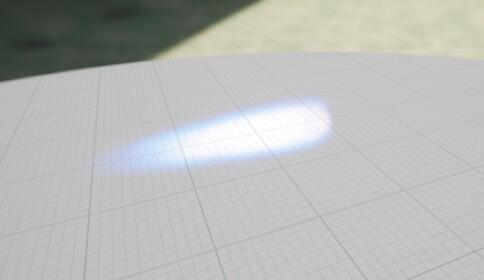
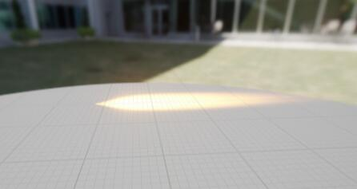
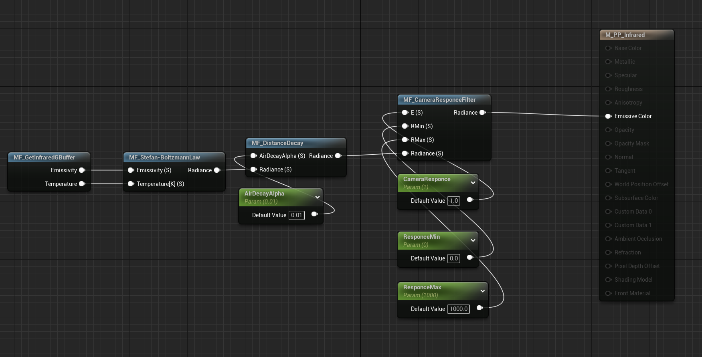
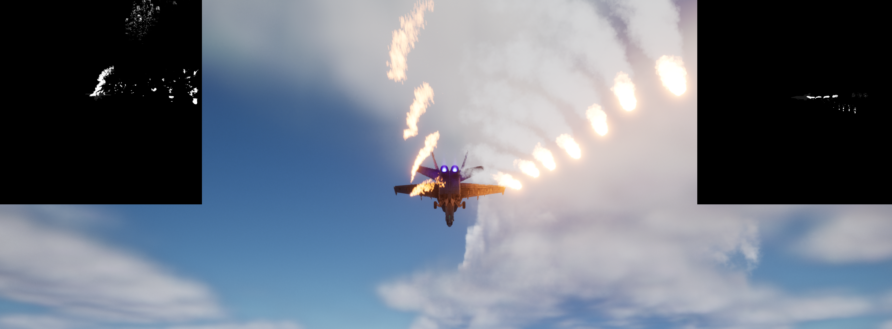
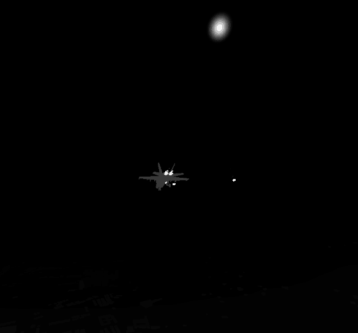

<!--more-->

## 旧项目迁移

由于我目前的源码版本是 5.1，之前的实现是 5.2，打不开，所以只能手动迁移，还好东西不多。

### Cesium for unreal

- 源码版本需要手动创建 Engine\Plugins\Marketplace，然后把 CesiumForUnreal 复制进来
- 开启之后 Water Body Collision profile 直接 fix 一下
- 新建 Empty Level，World Settings 禁用  World Bounds Checks，添加 Cesium SunSky，Directional Light component Intensity to 10.0，再加个 VolumetricCloud 好看一点（但这里 Cesium 官方文档提到了一个问题，但是对应的选项已经没有了，不知道会不会有什么问题）
- 添加 Cesium World Terrain + Bing Maps Aerial imagery，CesiumGeoreference 设置经纬度，25.037798 121.56517，CesiumSunSky timezone 设为 8，Solar Time 可以改时间，还可以加个 Cesium OSM Buildings，添加 DynamicPawn
- 可选，添加 local server 的地图，添加 Blank 3D Tileset，from url http://localhost:9090/data_gis/dem/single_dem/layer.json，添加 CesiumTileMapServiceRasterOverlay，http://localhost:9090/data_gis/fig/tilemapresource.xml，分别是加上高层图和影像地图。还可以加上一个 Cesium3DTileset，http://localhost:9090/data_gis/shp/height_50/tileset.json，添加白膜数据
- 加个光晕，PP，extent 打开，Lens Flares 的 Intensity 打开
- 去掉 Cesium Icon，点 Edit CesiumCreditSystemBP，选带 Widget 的那个（好像新版不起作用了？）

### VigilanteContent

- 直接文件夹粘贴过来，开一下 Cascade To Niagara 插件，把尾焰 FX_Engine_01_F18C 转一下，给 Mesh 材质 Override M_Cone_Engine_01_M，NS_West_Fighter_Typhoon_Jet 读不到，手动粘贴过来，记得把旧的文件直接删掉，不然会报错





- 打包记得添加 list map，不然容易 cook failed

### VFX

- 直接粘贴文件夹完全识别不了，手动 copy 材质和 VFX
- 要设置参数，粒子系统添加 UserParameter，然后在蓝图中 Set Parameter 即可，这里将粒子的速度和发射器初始的速度关联了起来，可以调控面弹的大小

### Blueprint

#### Projectile

负责具体一发干扰弹的发射逻辑

- BP_Projectile 负责具体一发干扰弹的发射逻辑，指定 FX 和初速度，在初始化构建时设置 ProjectileMovement 组件的参数，然后 BeginPlay 的时候进行一些碰撞、允许深度写入、生命周期都设置，Tick 增加随机扰动
  - 参数：发射速度，粒子效果，生命周期系数
  - SetProjectile：设置速度、阻力系数、重力系数
  - Construction：设置 Niagara Asset，SetProjectile
  - BeginPlay：允许 Niagara Custom Depth，delay 之后开启碰撞，不然会直接和机体碰撞，delay 之后 deactivate Niagara，设置该实体的 life span 方便自动销毁
  - Tick：随机添加 local location、rotation
- Dot
  - 继承 BP_Projectile，生成 BP_Projectile_Child_DotMissile0、BP_Projectile_Child_DotMissile1，选择对应的粒子效果
- Plane
  - 继承 BP_Projectile，生成 BP_Projectile_Child_PlaneMissile0、BP_Projectile_Child_PlaneMissile1、BP_Projectile_Child_PlaneMissile2，选择粒子，生命系数 0.4

### Strategy

描述发射策略

- StrategyPerMissile 描述一种干扰弹的发射策略
  - 数量、对应的 Projectil class、每发的发射间隔、初速度、生命周期系数、这一组到下一组的时间间隔
- ShootStrategy
  - 存储一组发射策略，也就是存储了多个顺序排列的 StrategyPerMissile，会按照StrategyPerMissile 里的时间间隔顺序发射里面具体的某种干扰弹，再存这一组到下一组发射的时间间隔
- ShootStrategyPerShooter
  - 存储多组发射策略，也就是存储了多个顺序排列的 ShootStrategy，会按照 StrategyPerMissile 里的时间间隔顺序发射这一组里的发射策略，继续发射器的序号和初始旋转
- 

#### Shooter

对应一个发射器，会按照发射策略来发射干扰弹

- BP_Shooter
  - BeginPlay：获得目标飞机对象，这里对接的时候需要注意具体类型
  - Shoot：接收旋转角度和要发射的策略，负责调用发射每组策略，因为涉及到 delay，只能用 event，用蓝图实现得比较绕，拿到发射器的旋转角和策略数组->按照索引获取具体一组策略然后调用 shoot one shoot strategy->判断索引，然后 delay 之后调用下一个策略
  - ShootOneShootStrategy：接收旋转角度和具体的一组发射策略，负责调用发射每组干扰弹的发射策略，拿到旋转角和按照索引拿到这组干扰弹的发射策略调用 Shoot One Missile Strategy->判断索引然后delay
  - ShootOneMissileStrategy：接收旋转角和具体的这组干扰弹发射策略，负责按照间隔发射每个干扰弹（这里每个干扰弹的发射间隔是固定，要改的话可以继续加结构），拿到旋转角和策略信息调用 ShootOneMissile->判断索引然后 delay
  - ShootOneMissile: 调用 SpawnOneMissile 来发射一个干扰弹
  - SpawnOneMissile：GetShooterForward 获得当前的发射器方向->GetSpeed 获得发射速度->按照位置、旋转、速度、生命周期等生成干扰弹
  - GetShooterForward：生成 Arrow Component 然后添加 local rotation，然后得到当前 arrow 的朝向，然后销毁（这里应该会有性能问题）
  - GetSpeed：发射速度叠加飞机的速度得到最终的干扰弹速度

实测中发现直接调用 Event 如果调用时间重合那么变量会被覆盖，所以记得策略之间不要互相覆盖了，不然会出问题

#### Flighter

飞机逻辑，负责调用发射干扰弹逻辑，后续需要对接

- BP_Flighter
  - BeginPlay：获取所有发射器（Get All Actors 这里只能保证一个飞机，以及索引可能不确定，可以改进为单独添加每个 child actor），设置尾焰的深度写入
  - Tick：设置飞机按照 CurrentForwardSpeed 匀速飞行看效果，需要对接
  - 简单控制相机方便查看
  - Shoot：遍历 ShootStrategies 数组，按照索引拿到对应的发射器，然后调用发射器的 Shoot 方法开始按照策略发射

#### InfraredCamera

红外相机，利用 SceneCapture 组件，写入 RenderTarget（需要注意性能）

- BP_InfraredCamera
  - 初始化指定 PT、创建对应的 PP 方便后期动态修改材质参数
- 创建对应的材质和 Widget


## Infrared

### PP Infrared Camera

- 利用 Custom 拿到 Infrared

```GLSL
// 获取gbuffer
return SceneTextureLookup(GetDefaultSceneTextureUV(Parameters, 31), 31, false);

// 玻尔兹曼
return e*5.67*pow(10, -8)*pow(T, 4);

// 相机响应
R *= E;
return saturate((R - RMin)/(RMax - RMin));

// 大气衰减
return R*exp(-alpha*dis);
```

- 加一个高斯模糊避免粒子是离散的点（有很多改进空间）

```GLSL
float Calculate1DGaussian(float x)
{
    return exp(-0.5 * pow(3.141 * (x), 2));
}

float4 GaussianBlur(int SceneTextureId, int Radius, float2 UV)
{
	float2 TexelSize = View.ViewSizeAndInvSize.zw;
	float4 PixelSum = float4(0, 0, 0, 0);
	float WeightSum = 0;

	for (int x = -Radius; x <= Radius; x++)
	{
    	for (int y = -Radius; y <= Radius; y++)
    	{
        	float2 Offset = UV + float2(x, y) * TexelSize;
        	float4 PixelColor = SceneTextureLookup(Offset, SceneTextureId, 0);
        	float Weight = Calculate1DGaussian(x / Radius) * Calculate1DGaussian(y / Radius);
        	PixelSum += PixelColor * Weight;
        	WeightSum += Weight;
    	}
	}

	return PixelSum / WeightSum;
}

=====

float2 UV = GetDefaultSceneTextureUV(Parameters, SceneTextureId);
return GaussianBlur(SceneTextureId, Radius, UV);
```

- 红外相机后处理这边简单实现了一下，从 GBuffer 中获取数据，加了高斯模糊（radius 太大衰减的好像挺厉害的）-> 玻尔兹曼根据温度和发射率简单计算辐射度->考虑大气衰减（衰减得好像很厉害，不太正确）->相机根据响应率和最大最小值得到最终的出射亮度
  


return SceneTextureLookup(GetDefaultSceneTextureUV(Parameters, 15), 15, false);

- SceneCapture2D 拿不到 PostProcess1 不知道为什么，但我自己的 Alpha Blend 在 CustomDepth 做出来很奇怪，模拟尾焰的圆锥状需要改进

### Tail Material

- 这个材质的原理需要搞明白，透明度比较低，我想模拟内外层渐变效果不好

### Dot Missile Material

- 把粒子的 Age 传过来做温度衰减，但是面片比较明显

### Plane Missile Material

- 点状很明显，想模拟温度被加热，目前考虑的时候在火花处生成一些看不到的烟，让烟来传递周围的温度，但实现起来效果并不好，还是面片的问题，以及渐变也不好弄，亮度太高了，几乎都变成 1 了



### Cesium Material

- 改 CesiumBaseMaterial，换成我们的 shading model，为了方便传参，用了 Material Parameter Collection 来存储温度和发射率，地表和建筑物用的不同的

### Sky

- **SkyAtmosphere.usf, SkyAtmosphereRendering.cpp** 等相关文件，RT 添加我们的 GBuffer，同时记得修改 BlendState
- 将很亮的区域视为太阳，但这个后面要加 bloom 效果才好
- 放弃了上面的方案，因为要加 bloom 比较麻烦。这里参考了 unity 中的程序化天空盒，计算太阳方向向量和绘制的天空盒的方向向量的距离，然后利用 smoothstep 得到一个光晕的效果（这里太阳不是标准的圆形，应该和 UV 拉伸有关系，后续可以调整优化一下）



## Temperature

### 飞机蒙皮

- 飞机蒙皮，利用驻点温度计算公式来算
  
  ```GLSL
    return T_b*(1+0.164*pow(M, 2));
  ```

- 发动机传热

```GLSL
float Q1 = Heat / pow(D, 2) * max(0, D - R);
D = max(D, R);
float f_in = pow(R, 2) / (D, 2) * max(0, _cos);
float Q2 = Alpha * f_in * Epsilon * 5.67 / pow(10, 8);
return Q1 + Q2;
```

- 尾焰传热类似发动机传热
- 太阳直射

```GLSL
return Alpha * lambda * E_sun * max(cos_, 0);
```

## 小结

简单的红外链路搞完了，接下来边写论文边完善了~还需要加一些配置界面丰富起来

## References

- [后处理模糊](https://blog.csdn.net/qq173681019/article/details/121426810)
- [Unity 卡通渲染 程序化天空盒](https://zhuanlan.zhihu.com/p/540692272)