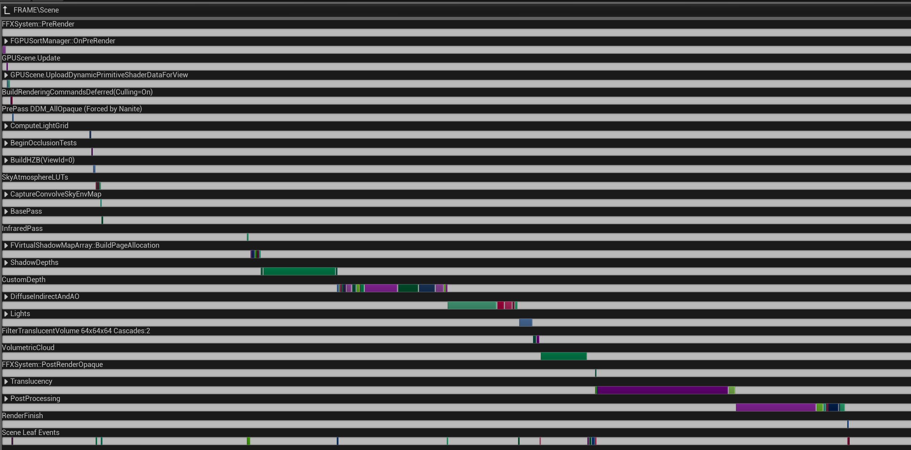
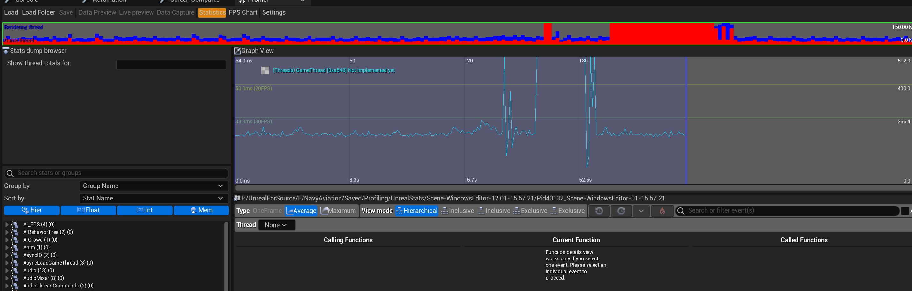

<!--more-->

## 性能分析

- Ctrl+Shift+, 可以召唤出 UE 自带的 gpu profiler，可以看到 timeline，还不错



- Build 出来的的不能直接用，但也可以按键触发，从 your project name\Saved\Logs 下面找到 log，这里的数据更全
- Stat fps 看帧率，stat unit 看详细耗时，Stat unitgraph 可视化耗时数据，Stat GPU 简化版看 GPU 耗时，Stat InitViews 查看 initview 各个阶段的耗时，Stat RHI 查看比如 target memory、draw call 等数据
- Stat startfile stat stopfile 可以记录引擎运行过程中的详细数据，在 Tools/SessionFrontend 中打开日志文件



## Boost

- Boost 在官方源码 ThirdParty 中已经有了，在我们自己的项目中添加 `AddEngineThirdPartyPrivateStaticDependencies(Target, "Boost");` 把 Boost 引用进来，然后就可以做一些数学运算了
- 比如我想要计算黑体辐射积分，可以这样做：

```C++
#include "boost/math/quadrature/gauss.hpp"
#include "boost/math/tools/minima.hpp"


double func(double x) {
	return FMath::Pow(x, 3) / (std::exp(x) - 1);
}

double F(double T, double lambda) {
	double c2 = 14387.9;
	double lowerBound = c2/(lambda*T);
	double upperBound = std::numeric_limits<double>::infinity();
	double integral = boost::math::quadrature::gauss<double, 12>::integrate(func, lowerBound, upperBound);
	return integral * 15 / FMath::Pow(boost::math::constants::pi<double>(), 4);
}

double F_(double T, double lambda1, double lambda2) {
	double F1 = F(T, lambda1);
	double F2 = F(T, lambda2);
	return F2 - F1;
}
```


## 小结


## References

- [Built-in GPU Visualizer](https://unrealartoptimization.github.io/book/profiling/gpu-visualizer/)