<!--more-->

## Customize Pixel Html

- .env.development 中的环境变量可以通过 `import.meta.env.VITE_APP_UE_PixelStream_IP_ADDRESS` 获取
- 使用 `iframe` 可以把网页嵌在网页上，`href` 可以进行地址跳转

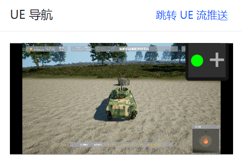

```Html
<a-card :style="{ width: '330px' }" title="UE 导航" hoverable>
    <template #extra>
        <a-link>
            <a :href=IP_ADDRESS>跳转 UE 流推送</a>
        </a-link>
    </template>
    <iframe :src=IP_ADDRESS> </iframe>
</a-card>
```

## Load Local Data with Cesium

- 不确定要不要用 cesium 的 gis 系统，cesium 可以帮助我进行经纬度转换，然后可以加载倾斜模型，但就是材质不是很好修改控制
- 直接生成地形贴个纹理的方案难点主要在 gis 坐标的映射，但可以考虑用插值的做法。但倾斜模型就加载不了了
- 目前我的想法还是基于 Cesium 来做，但沙地等效果还是需要基于自带的 terrain 系统来实现。以及后面需要考虑一下没有卫星贴图的区域能否去掉，现在看到的是白模

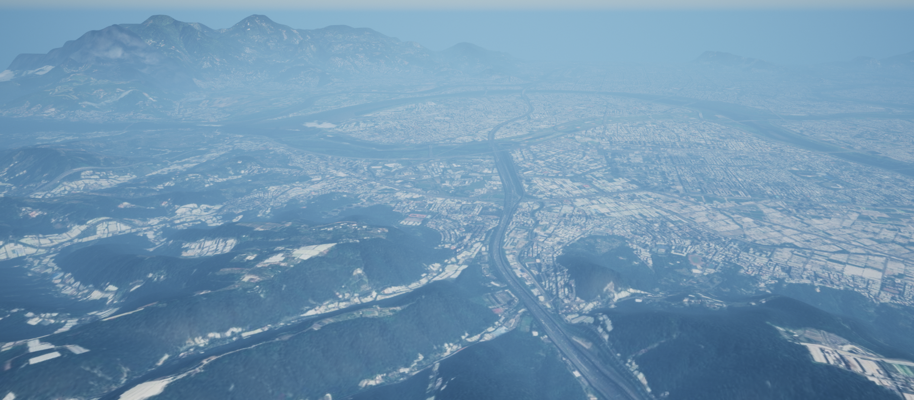

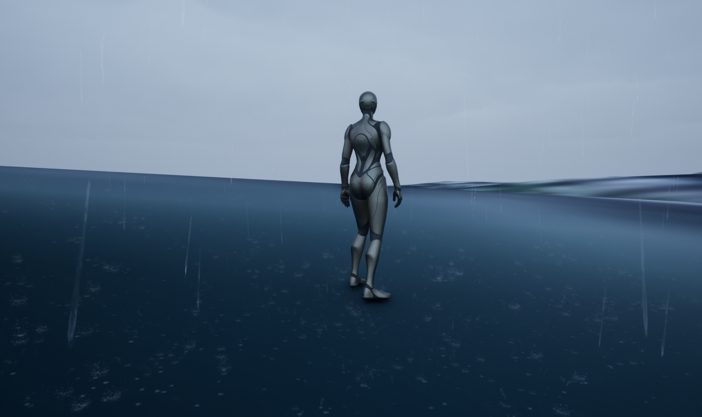

- 在处理 shp 文件时，需要添加空间参考系和高程图，才能很好地贴合地面

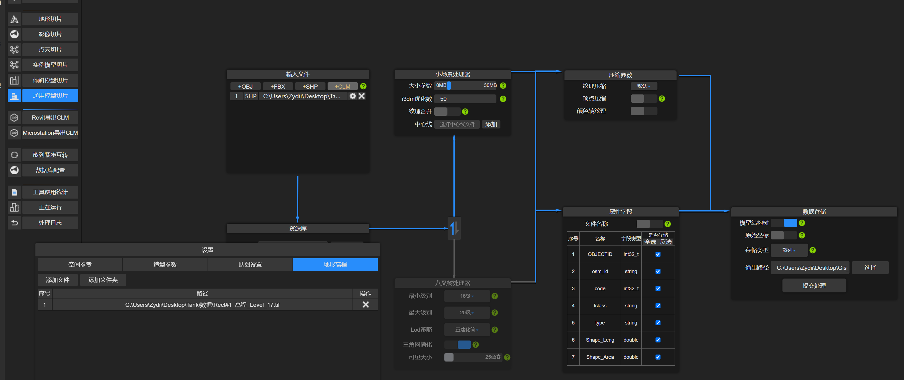


- 原来高程数据也可以直接用 tileset 加载，这下就可以去掉全部区域 terrain 组件了，并且这种方式倾斜摄影也更好地贴合了，很强

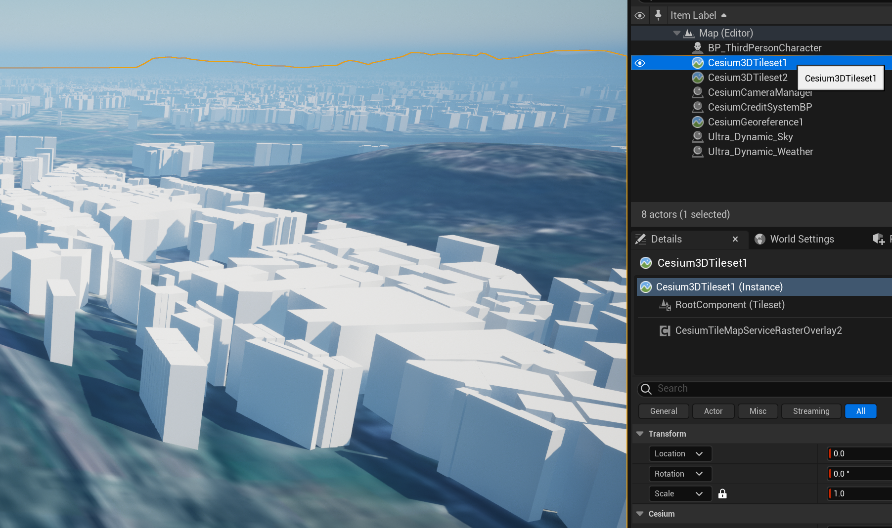

- 创建一个沙漠沙地地形，修改材质并且添加天气支持


- 如果 Unreal 打开就崩溃，可以试试在 DefaultEngine.ini 中修改默认地图
- Openland 的 Deform 只能支持第一块地形
- Landscape 可以给 Element 覆盖材质
- 在 Cesium 中添加水域需要用到 Polygon，并且修改 Water 材质的 Layer，Cesium 好强

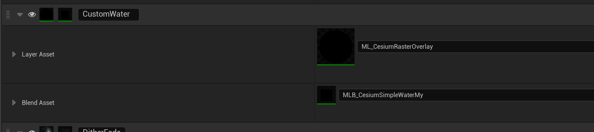

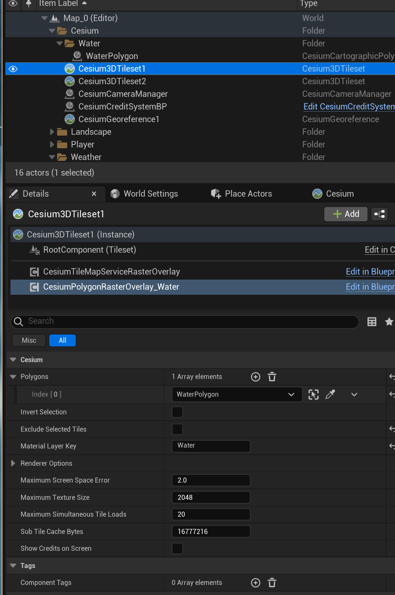

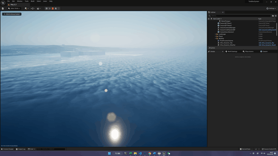

## Nav Spline

- 遇到打开 Rider 项目无法识别 Unreal，可以在 Tools/Refresh Project 下重新生成项目
- 犯了一个很傻的错误，我在切换控制权 Pawn，但我在 BeginPlay 的时候就在 GetPawn，这个时候新的 Pawn 还没有 Posses 上去，所以拿到的一直是空的，需要等 Posses 之后手动设置一下，找了我好久

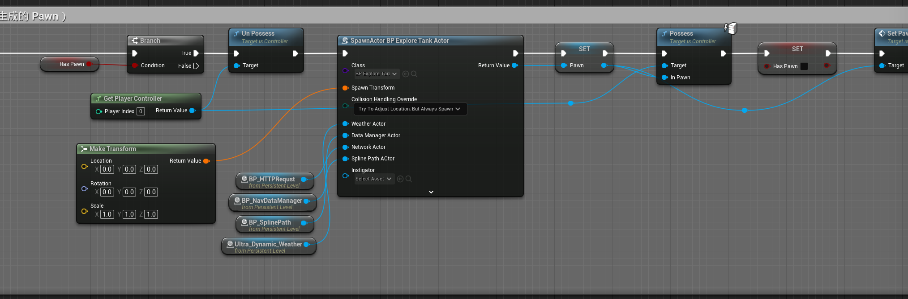

- 切换控制权目前我的逻辑比较简单，在 Player Controller 中，Get Player Controller，然后把旧的 Pawn 进行 Unpossess，旧的 Widget 也要清除 Remove from parent，然后生成新的 Pawn，并设置 Possess，然后就进行该 Pawn 的一些初始化和相关的设计即可

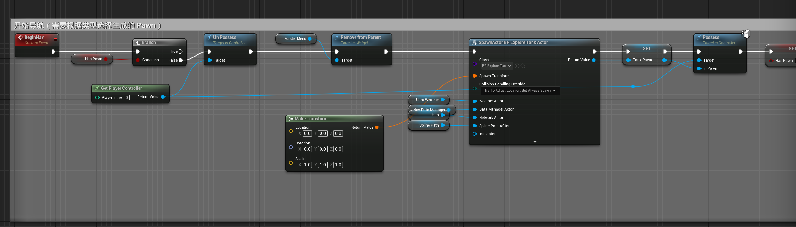

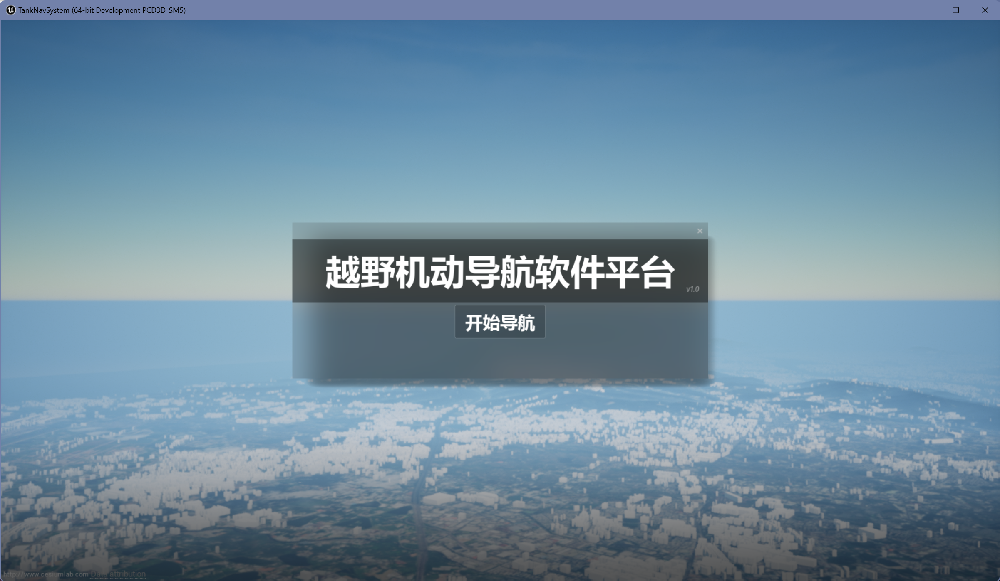

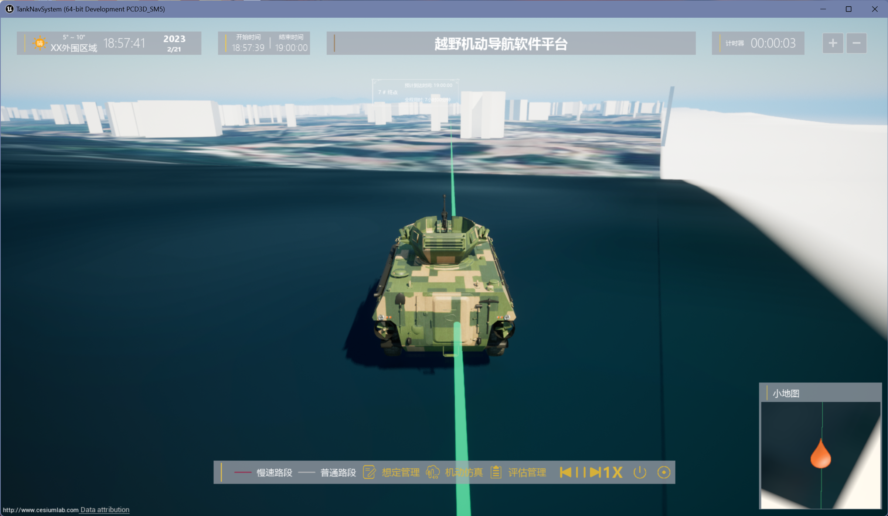

- 使用射线检测来找到车辆应该位于的点位，并且使用 Find Look At Rotation 来设置车辆的旋转量

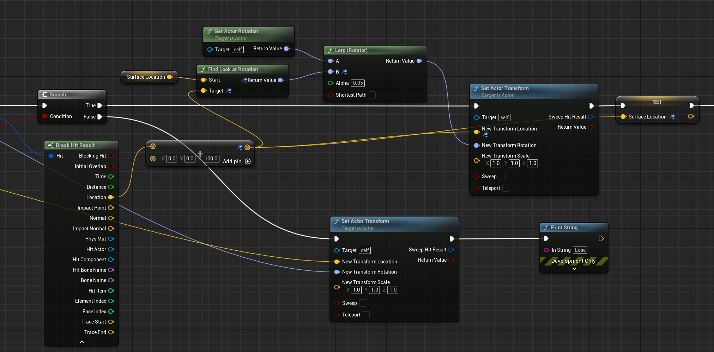

- 进度条用 slider，然后每个 tick 去设置进度条的值，但是当鼠标选中进度条时，要禁止设置，而是等进度条的值改变后反过来更新 timeline 的时间


- 快进快退通过获取 playback position 加上偏移，然后 set new time 即可，需要主要进度条的总时长，我之前为默认值 5，但是我的 timeline 第二个端点只设到了 1，所以会出现一点问题

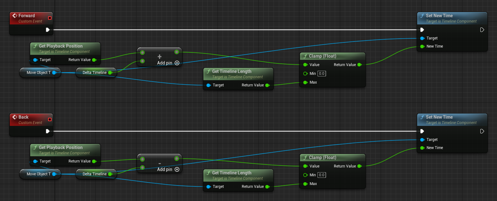

- 如果网络通信出了问题，需要关掉 VPN！然后如果两个通信有相互依赖关系，第二个通信要写到第一个通信的回调函数中调用，否则会出问题
- 遇到项目上奇怪的跳转错误，可以试试用 VS 清理解决方案，以及关掉一些程序后台
- 需要注意在使用 Spline 的时候，默认会有两个端点，需要把它们 Clear 掉
- toggledebugcamera 打开自由视角调试相机
- 让导航线贴着地面目前采用预处理，以一定比率插值进行插线检测，找到贴近地面的点，但是在进行射线检测时，Cesium 地面可能出现检测失败的情况，目前没有发现解决方案，现在只是在会失败的地方粗略加上了空气墙，但很奇怪的点在于坦克在行进过程中的射线检测看起来是对的，难道是在预处理的时候地形还没有完全生成？但是开始界面已经能看到所有地貌了，有点不太知道什么原因


- 处理模型，将连在一起的顶点分开用 P，Ctrl + P 组合父子类，Ctrl + A apply transform，然后记得 Set Origin To Geometry
- 导入 UE 中，后面这个部分因为很细，纹理在相机某些角度下看起来会有问题，感觉是太细了所以采样出了问题，不知道应该怎么解决，而且履带的悬挂系统应该怎么处理呢

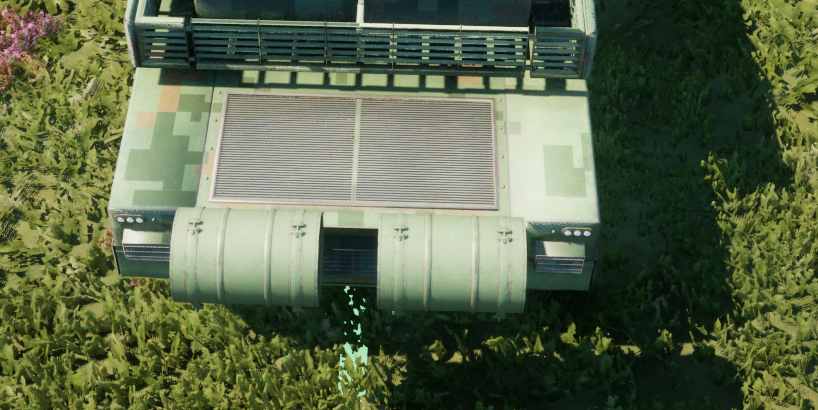

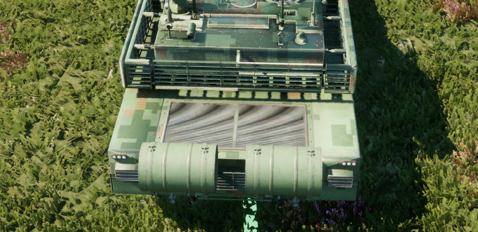


## 小结

## References

- [Unreal Engine 5 - Create a desert landscape procedurally](https://www.youtube.com/watch?v=0vDnDErh_2Q)
- [Ultra Dynamic Sky - Product Video + Quick Start (UE5 Version)](https://www.youtube.com/watch?v=b52npy-XUdQ)
- [unreal+cesium关于unreal加载cesiumlab处理的白模](https://blog.csdn.net/ys_ys_y/article/details/115767732)
- [Unreal Engine AI Car 2.0 Tutorial](https://www.youtube.com/watch?v=AlMPqZ2d4BQ)
- [Spider Pawn #1 - Movements and Animations](https://www.youtube.com/watch?v=z7WYuOf7tWs&list=PLNTm9yU0zou4qVdpM_45RCtf6yqAhlo74)
- [UE4/5 Move actor along spline (no timeline)](https://www.youtube.com/watch?v=qKIJMQJsx2Y&t=80s)
- [E06 - How to Make AI NPCs Follow Splines](https://www.youtube.com/watch?v=FVb5gQTIeYs)
- [UE4 - Moving Character along the Spline Tutorial](https://www.youtube.com/watch?v=2g3WTR6PqZY&t=64s)