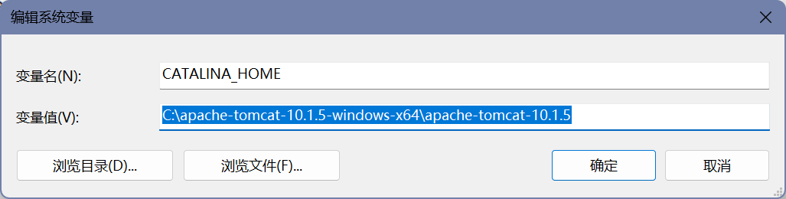
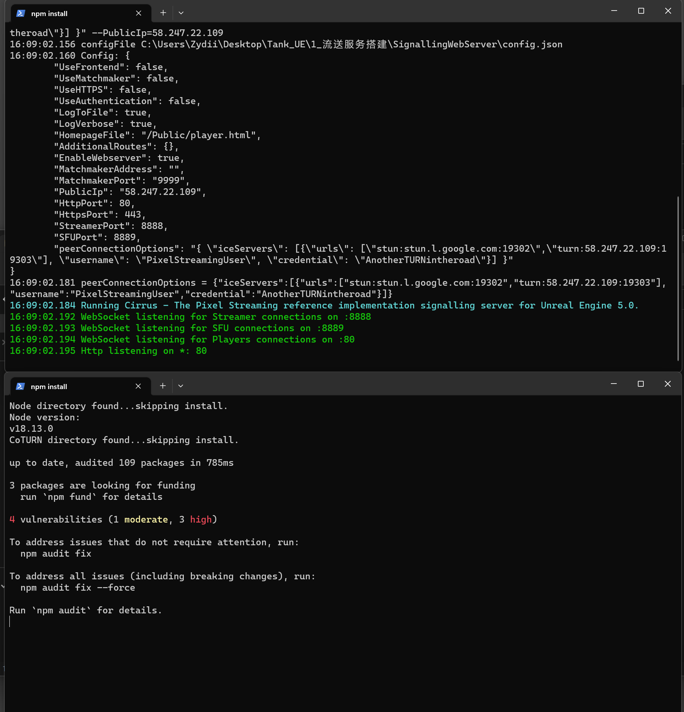

<!--more-->

<!-- ## 安装 Java 8 并设置环境变量（其他版本也可以，如果已经安装可以跳过）

1. 到 https://www.oracle.com/java/technologies/downloads/#java8-windows 下载 Java8 x64 Installer

2. 下载好之后直接双击安装，记下安装目录，比如 `C:\Program Files\Java\jdk1.8.0_361`
3. 配置环境变量
   1. 新建 JAVA_HOME 变量名，变量值为上一步记下的安装目录
      
        

   2. 配置 PATH 路径，添加一条 `%JAVA_HOME%\bin`
   
        
4. 检查是否配置成功 `java -version` 和 `javac` 命令查看输出是否正常
        
   
## 安装 Apache 10 并设置环境变量（其他版本也可以，如果已经安装可以跳过 1-4，进行 5、6 步）

1. 到 https://tomcat.apache.org/download-10.cgi 下载 Tomcat10 zip

2. 解压后保存到一个固定路径，记下目录地址，比如 `C:\apache-tomcat-10.1.5-windows-x64\apache-tomcat-10.1.5\bin`
3. 配置环境变量
   1. 新建 CATALINA_HOME 变量名，变量值为上一步记下的安装目录

        
    
    2. 配置 PATH 路径，添加一条 `%CATALINA_HOME%\bin`

        

4. 修改 Tomcat 端口为 9090（或其他没被占用的端口，需要提前告知 UE 一个固定的端口），在 /conf/server.xml 中的第 68 行中修改 port

5. 拷贝 gis 数据到 /webapps/ 下

6. 双击运行 /bin/startup.bat，访问 http://localhost:9090/data_gis/shp/height_50/tileset.json、http://localhost:9090/data_gis/dem/single_dem/layer.json、http://localhost:9090/data_gis/fig/tilemapresource.xml 查看文件是否能正常访问

## UE 流送服务器搭建

1. 右键使用 PowerShell 运行 /SignallingWebServer/platform_scripts/cmd/Start_WithTURN_SignallingServer.ps1，需要多等一会启动服务，需要保证 80、8888、8889、443、9999 端口不被其他进程占用，访问 localhost 能看到一个界面

## UE 客户端运行

1. 右键 /Windows/launch.bat 运行 UE，再次访问 localhost 点击屏幕中央，能够看到流送画面

2. 如果运行 launch.bat 后点击 Click to start 仍然没有画面，需要点击运行 /Windows/launch.bat 后出来的窗口，Ctrl+C 一下，看到很多命令在输出就可以了（不是 Ctrl+C 直接关掉窗口了，而是窗口显示仍然在运行） -->

## Cesium For Unreal 地景搭建

- 安装 Cesium 插件到 UE，参考 https://cesium.com/learn/unreal/unreal-quickstart/
- 新建一个空 Level，添加一个 SunSky，SunSky 下的 DirectionalLight 的 Intensity 改小一点，如 0.1

- 调整一下 SunSky 的 Time Zone 到 4.0 左右

- 将 CesiumGeorefence 的坐标改到台北附近 24.9389 121.184 2250.0

- 添加两个 Blank 3D Tiles Tileset

- 选中第一个 Cesium3DTileset，将 Source 改为 From Url，Url 输入本地文件 `/Gis_Data/dem/single_dem/layer.json` 的绝对地址，如 `file:///C:/Users/Zydii/Desktop/Gis_Data/dem/single_dem/layer.json`，本地文件前面加上 `file:///`，所有 `\` 需要改为 `/`，可以看到加载了高程地形

- 如果要加载贴图数据，仍然选中第一个 Cesium3DTileset，Add 一个 CesiumTileMapServiceRasterOverlay，在 Url 中填入本地文件 `/Gis_Data/fig/tilemapresource.xml` 的绝对地址，如 `file:///C:/Users/Zydii/Desktop/Gis_Data/fig/tilemapresource.xml`，可以看到加载了贴图数据

- 建筑数据同理，选中第二个 Cesium3DTileset，将 Source 改为 From Url，Url 输入 `/Gis_Data/shp/height_50/tileset.json` 的本地绝对地址，如 `file:///C:/Users/Zydii/Desktop/Gis_Data/shp/height_50/tileset.json`，可以看到加载了建筑数据

