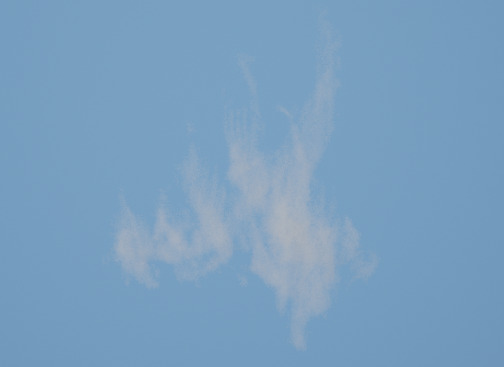

<!--more-->

## Missle

- 发现一个工具 EmberGen 可以用来模拟烟雾、火焰，其可以导出 VDB 数据，使用 VDB-UE 插件可以直接导入 VDB 形成 Sequence，但 Sequence 缺失一定的灵活性，感觉比较适合原地爆炸的效果，对于炮弹来说还是希望能用粒子系统来做



- EmberGen 可以导出 flipbook，可以用于粒子系统渲染动画帧，需要选择 loop mode，Simulation Time Control 选择 Loop Simulation，设置 frame，Render 参数要把 Alpha 加上，感觉是一种比较方便地生成烟雾素材的模拟方案(不过这个软件要钱)另外查到 UE 自带的 Niagara Fluid 也可以生成 flipbook


- 在定义 ENUM 时，如果需要蓝图访问，需要继承自 uint，并且从 0 开始

```C++
UENUM(BlueprintType)
enum class EMissileType : uint8 // 干扰弹的类型
{
	DotMissile UMETA(DisplayName = "DotMissile"), // 点弹
	PlaneMissile UMETA(DisplayName = "PlaneMissile") // 面弹
};
```

- 创建结构类 USTRUCT 时如果要写构造函数，则必须声明定义默认构造函数，如果只声明会报错
- 加载本地资源时可以使用 StaticLoadObject，但进行类型加载时 StaticLoadClass 会出现错误，目前查不到资料解决

```C++
FString DefualtIconPath = "Texture2D'/Game/Textures/VFX/T_Star.T_Star'";
Icon = Cast<UTexture2D>(StaticLoadObject(UTexture2D::StaticClass(), NULL, *(DefualtIconPath)));
```

- 创建 EMissileType 枚举表示干扰弹类型，FMissileData 结构存储干扰弹详细数据，AMissile 类用来生成粒子效果、控制发射
- 新建一个飞机类 AFlighter 控制飞机的飞行与开火，这里需要考虑一下是将一发干扰弹作为一个对象还是多发干扰弹统一由一个对象自动管理销毁，对象销毁的时机是什么，不然可能会占用大量内存
- 在发射点骨架创建 Sokcet，并且使自身坐标系 X 轴指向前方
- GetWorldTimerManager().SetTimer 不能放到构造函数中，需要在 BeginPlay 中，否则会 Crash
- 在计时器方法中使用 SetLifeSpan(MissileData.LifeTime) 好像会出现问题，但似乎是因为销毁后出现了空引用


## 小结

## References

- [Using EmberGen with Unreal Engine to Create Fire Effects with Flipbooks](https://www.youtube.com/watch?v=tnxdOo3pw2U)
- [EmberGen Tutorial #0005: Creating Flipbooks For Games](https://www.youtube.com/watch?v=JrBjEoX28-c)
- [加载资源的方式（二）使用StaticLoadClass和StaticLoadObject来加载](https://www.cnblogs.com/sin998/p/15505907.html)