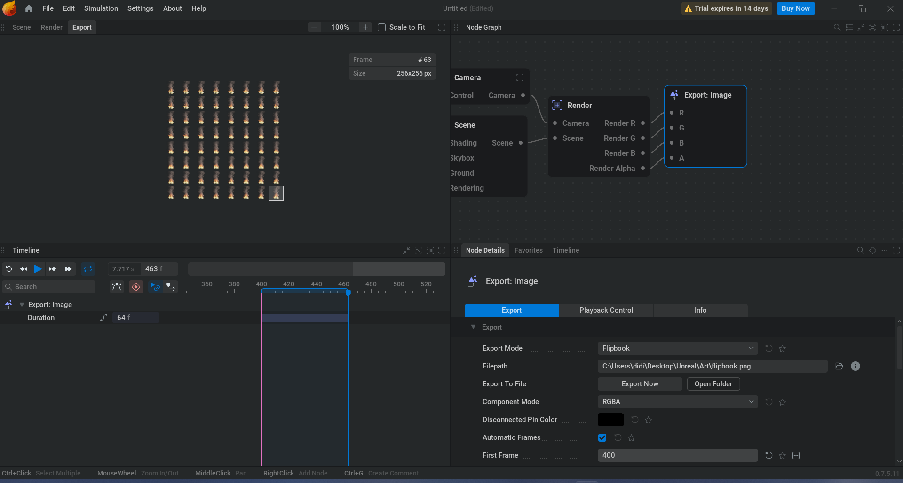

<!--more-->

## Missle

- 发现一个工具 EmberGen 可以用来模拟烟雾、火焰，其可以导出 VDB 数据，使用 VDB-UE 插件可以直接导入 VDB 形成 Sequence，但 Sequence 缺失一定的灵活性，感觉比较适合原地爆炸的效果，对于炮弹来说还是希望能用粒子系统来做

- EmberGen 可以导出 flipbook，可以用于粒子系统渲染动画帧，需要选择 loop mode，Simulation Time Control 选择 Loop Simulation，设置 frame，Render 参数要把 Alpha 加上，感觉是一种比较方便地生成烟雾素材的模拟方案(不过这个软件要钱)

- 

## 小结

## References

- [Using EmberGen with Unreal Engine to Create Fire Effects with Flipbooks](https://www.youtube.com/watch?v=tnxdOo3pw2U)
- [EmberGen Tutorial #0005: Creating Flipbooks For Games](https://www.youtube.com/watch?v=JrBjEoX28-c)