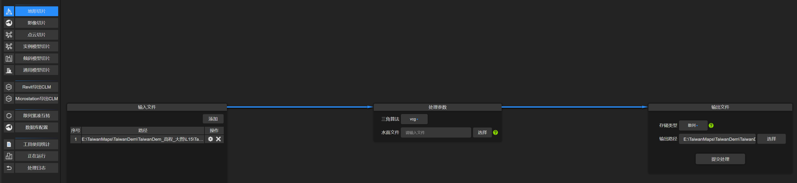
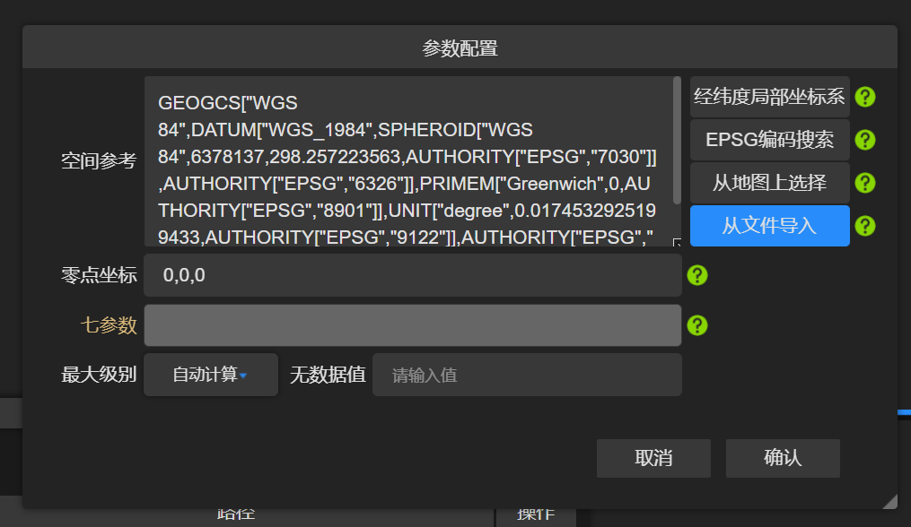
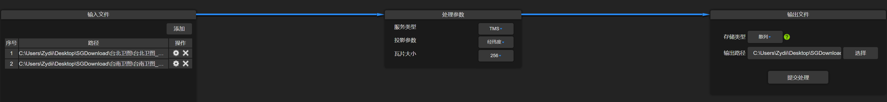
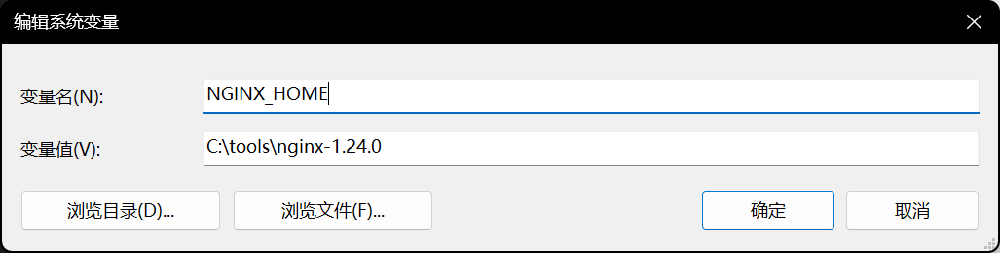
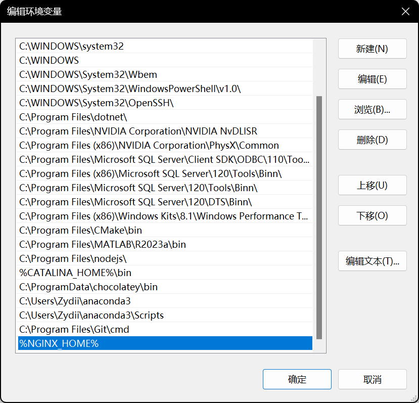
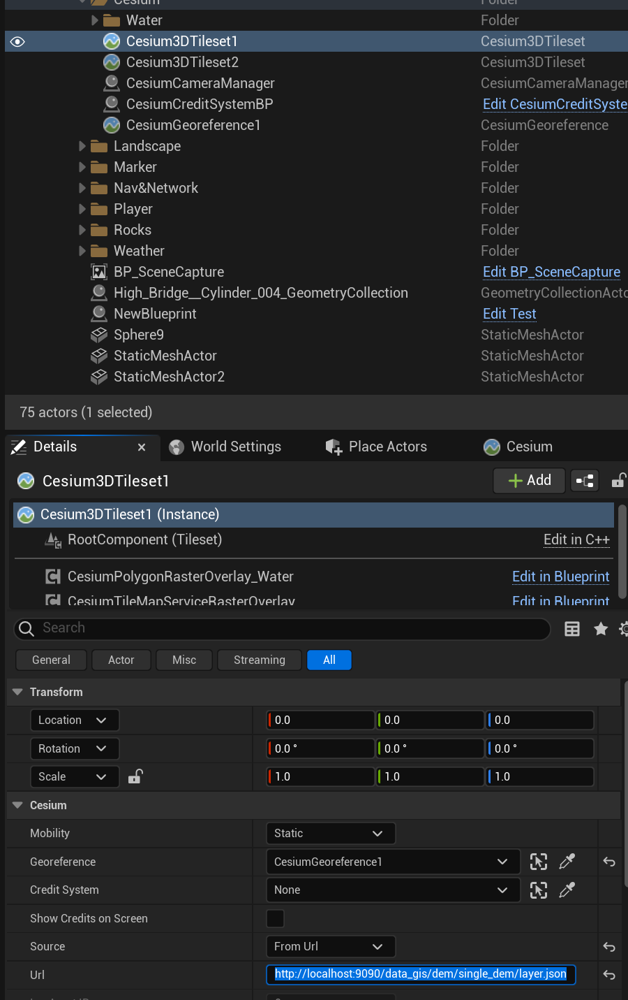
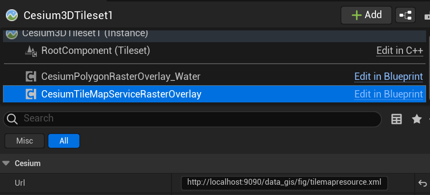

<!--more-->

## Cesiumlab 数据处理

- http://www.cesiumlab.com/ 点击免费下载并安装
- 安装好后双击 cesiumlab3 注册账号并登录

### dem 数据

- 选择地形切片，添加本地高程 .tif 文件，添加之后点击旁边的设置按钮，选择从文件导入 .prj，存储类型选择散列，然后选择输出文件夹后提交处理

    

    

### 影像数据

- 选择影像切片，添加本地影像文件 .tif，处理参数下服务类型选择 TMS、经纬度、256，输出文件存储类型选择散列，然后选择输出路径提交处理

    

## Nginx 发布静态文件服务

- 添加系统变量 `NGINX_HOME` 设置为 `nginx-1.24.0` 文件夹位置，然后把 `%NGINX_HOME%` 添加到 `Path` 中，配置好之后 `nginx -V` 可以查看版本号
 
    

    

- 在 nginx.exe 所在目录右键命令行，输入 `start nginx` 开启服务，关闭服务可以用 `nginx -s quit`
- 把切好的地图放到 `data/` 文件夹下面，然后可以通过 `9090` 端口访问，比如 `http://localhost:9090/data_gis/fig/tilemapresource.xml`
- 具体配置可以修改 `conf/nginx.conf`

    ```nginx
    server {
        listen       9090;
        server_name  localhost;

        #charset koi8-r;

        #access_log  logs/host.access.log  main;

        location / {
            root    data;
        }

        #error_page  404              /404.html;

        # redirect server error pages to the static page /50x.html
        #
        error_page   500 502 503 504  /50x.html;
        location = /50x.html {
            root   html;
        }
    }
    ```

## 在 Unreal 中使用

- 添加一个 `Cesium3DTileset`，将 Source 改为 `From Url`，填入发布的 dem 服务地址

    

- 在 `Cesium3DTileset` 上添加一个 `CesiumTileMapServiceRasterOverlay`，Url 填写上对应的影响服务地址

    

## Niagara 二号点弹

- 时隔一个多月甚至两个月？终于可以安心搞毕设了！但是我已经忘光了 = = 
- 那么我如果想要制作一个 NS 基类，应当如何做呢？试了直接创建 NS 和用代码创建，都不行。文档也查不到啊啊啊 ,,ԾㅂԾ,,