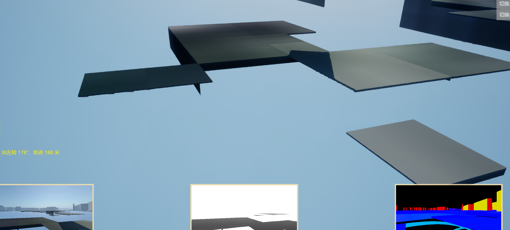
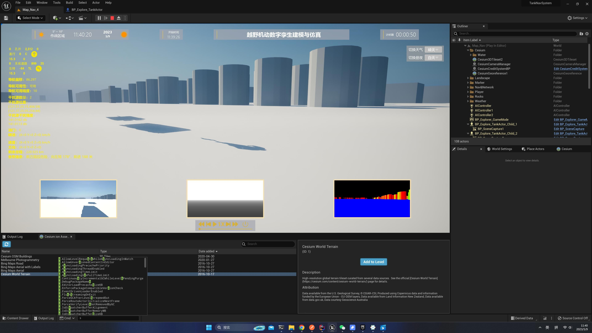

<!--more-->

## 一个关于 RT 的 bug

- 给甲方发布我的程序，但是却出现了意想不到的 bug！行进到特定区域后发现地面怎么没了？

- 本来以为是 Cesium 加载瓦片地图的 bug，于是把 cesium 去掉，用 cube 做了一个地板，地板倒是正常，但我的车和人只剩下影子了，mesh 去哪里了？

- 和学弟探讨分析，影子在说明 shadow pass 没问题，怀疑是不是渲染过程中开销过大，部分 mesh pass 被丢掉了
- 考虑到之前其实埋下过一个性能炸弹，获取 render target，之前偷懒给每个 Pawn 都上了两个 Scene Capture Component，三个车就是每帧要去拿 6 张 RT，确实开销很大，因为这个显示问题在只有一个车的时候不会出现，那么取消掉这两个 Component 再跑，果然问题没有了
- 那么解决方案还是单独用个对象去 capture 2 张 RT，将该对象 Attach 到其中一个 Pawn 上，目前测试下来看起来是对的，只能说 GPU 和 CPU 之间的通信确实很耗性能，今后需要注意

## 小结

## References