<!--more-->

## 评分标准

1. 骨骼动画，能动就给分了 20
2. PBR材质，作业上有渲染的结果，看渲染的结果，看起来是PBR的材质，有自发光就ok了，给分就看渲染的好不好，要有区分度，评估做了怎么样，就是渲染的质量高不高了，差不多就是自发光、方向光的 PBR实现、IBL的实现

    (1) PBR的材质纹理是否完整 10

    (2) 方向光的PBR是否实现 25，实现了就给10，另外是否看显示效果给

    (3) 环境光的PBR是否实现 25，实现了就给10，另外是否看显示效果给

3. tone 这个也是看起来有这个效果应该就ok了，做了就给 20
4. bonus：做了其他的功能，比如bloom 什么的后处理，看情况给0-10的 加分项

满分最高100，如：

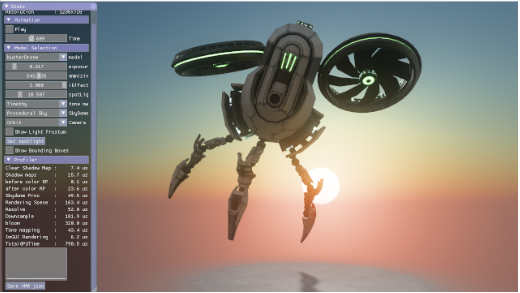

这个有 IBL的：

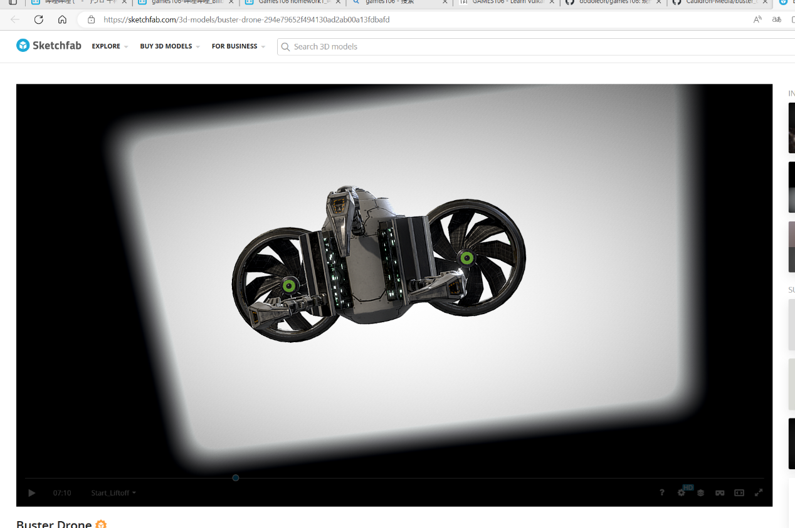

画出类似这种质量的 PBR 那块才能给满分：

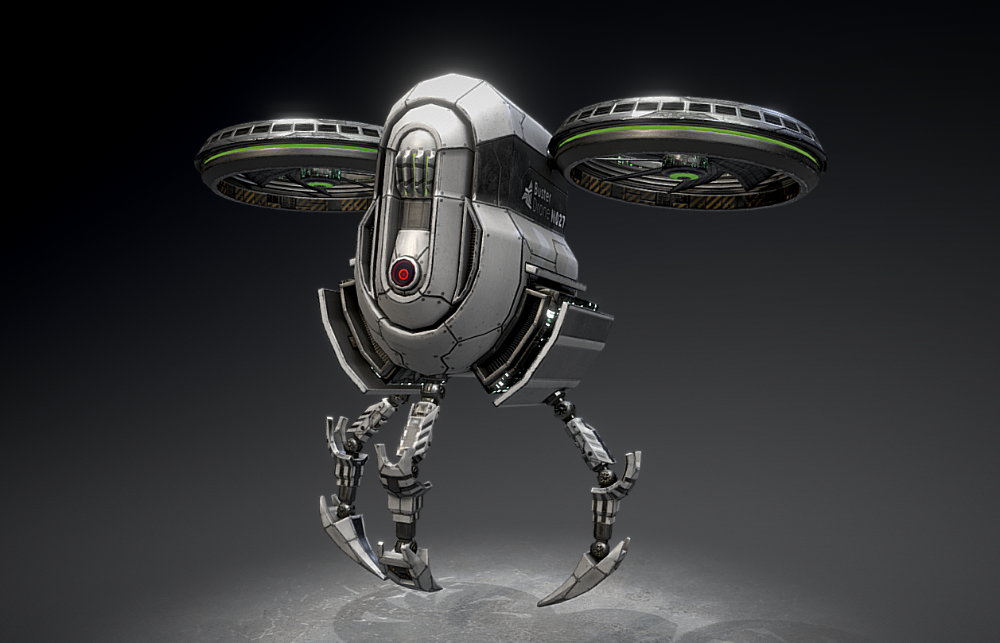

这个作业就是不怎么完整的，PBR的纹理丢了，这个少了PBR的纹理 -10，PBR的实现效果 -20， 70上下：

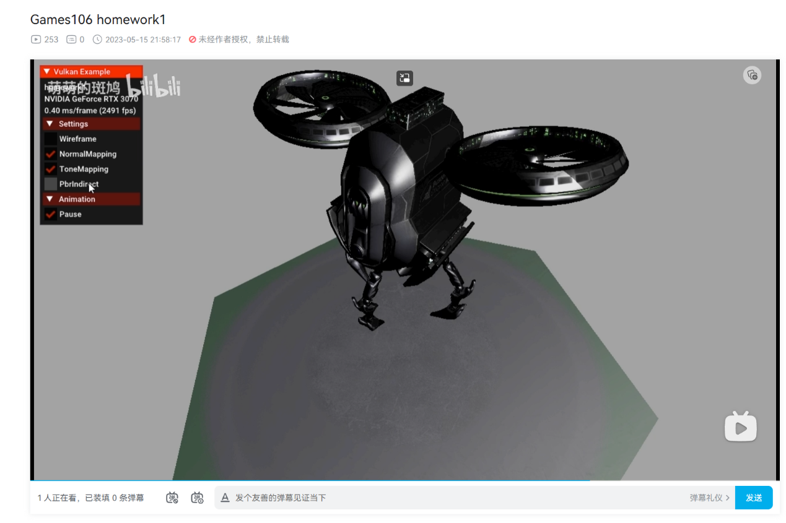

这个漏了环境光，这个我不确定是少了IBL 还是方向光。要来就那项没了，如果都有写，显示效果的30分要扣 15-20 分，加了bloom 再给+5分：

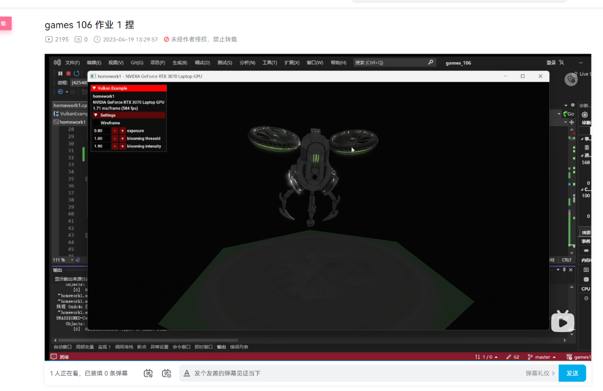

像这个作业应该是没有做IBL，但是多做了 PCF 要给bonus：

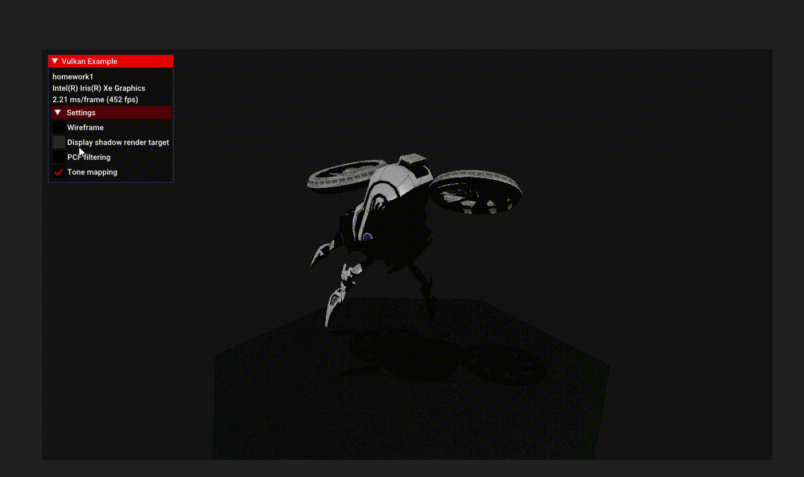

像这个，PBR纹理 肯定是丢了。扣对应的分，感觉只实现了IBL，对应分也要扣一下：

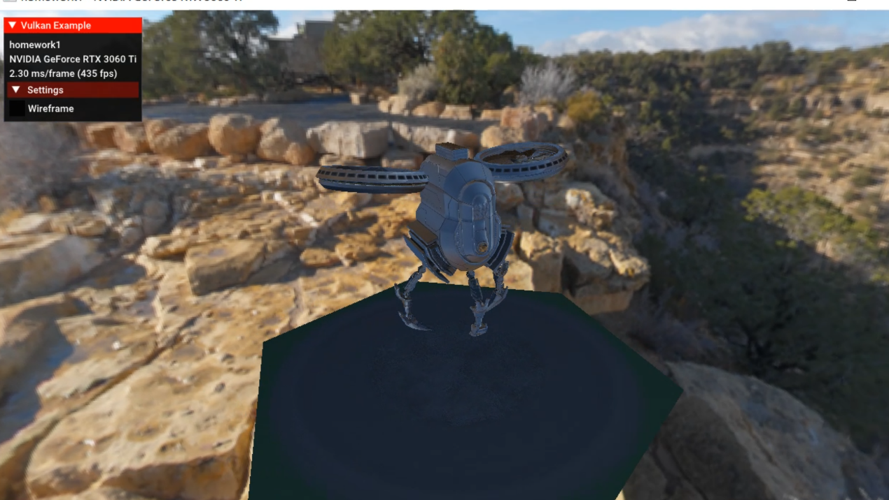

这个应该是该做的都做了。差不多按照渲染的结果，来扣分：

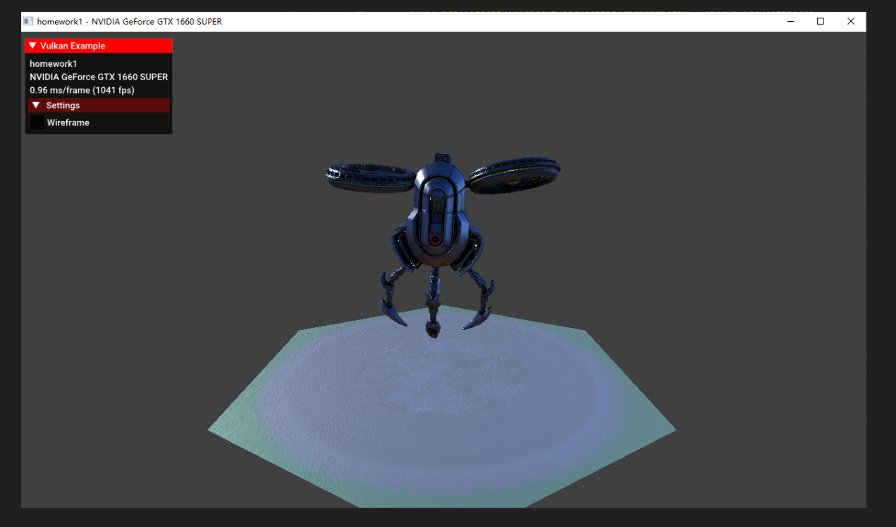

## homework1

- 发现不少学生交的文件是 .patch 格式，似乎是一种 linux 下的补丁文件，之前没用过，记录一下怎么用

```bash
# single file
制作补丁：diff -u old_file new_file > xxx.patch
打补丁：patch -p0 < xxx.patch 或 patch -p0 old_file xxx.patch
卸补丁：patch -RE -p0 < xxx.patch

# dir
制作补丁：diff -urN old_dir new_dir > xxx.patch
打补丁（进入old_dir目录）：patch -p1 < ../xxx.patch
git apply -p1 < ../F1__123456__Wang_Sherlock_TruNj.patch # binary file
卸补丁：patch -R -p1 < ../xxx.patch
```

- 谢 冬 - windows
  
  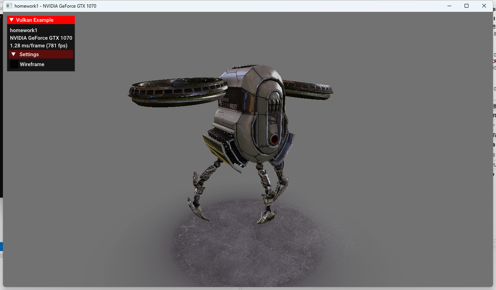

    - 骨骼动画
      - 有 +20
    - PBR
      - PBR的材质纹理是否完整 10
  
        材质完整 +10

      - 方向光的PBR是否实现 25
  
        有方向光 +10

        功能能完整运行，效果较好 +10

        只有一个方向光 -5

      - 环境光的 PBR 25
  
        添加了环境光 +10

        功能完整，实现的效果好 +10

        看不到天空盒 -5

    - tone mapping 20
  
      - 有 +20
  
    - bonus 10
  
      - 无

    合计： 70

    评分：实现了骨骼动画（20）+ PBR 材质纹理完整（10）+ 实现了 PBR 方向光（20）+ 实现了 ToneMapping（20），还可以考虑添加环境光使光照更完整

- Wang Sherlock - linux

    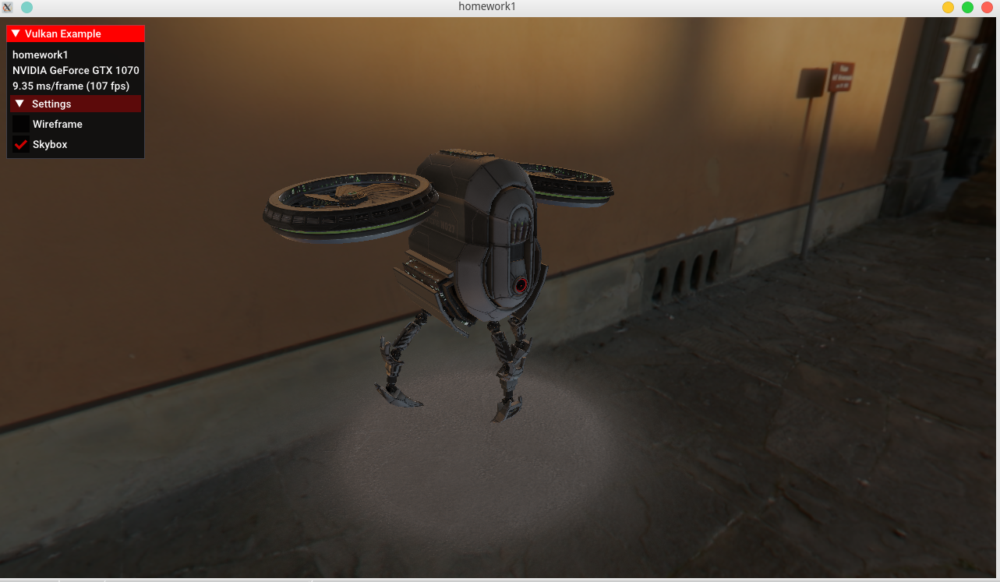

    - 骨骼动画
      - 有 +20
    - PBR
      - PBR的材质纹理是否完整 10
  
        材质完整 +10

      - 方向光的PBR是否实现 25
  
        有方向光 +10

        功能能完整运行，效果较好 +10

        只有一个方向光 -5

      - 环境光的 PBR
  
        实现了 +10

        功能能完整运行，效果较好，添加了 checkbox ui +10       

        缺少 Tone mapping 和 Gamma correction -5     

    - tone mapping 20
  
      - 有 +20
  
    - bonus 10
  
      - 无

  合计： 90

  评分：实现了骨骼动画（20）+ PBR 材质纹理完整（10）+ 实现了 PBR 方向光（20）+ 实现了 PBR 环境光（20）+ 实现了 ToneMapping（20），整体功能完成度很高，效果还可以进一步优化，如添加 Gamma correction、多光源等

- Wang winsfc - linux

   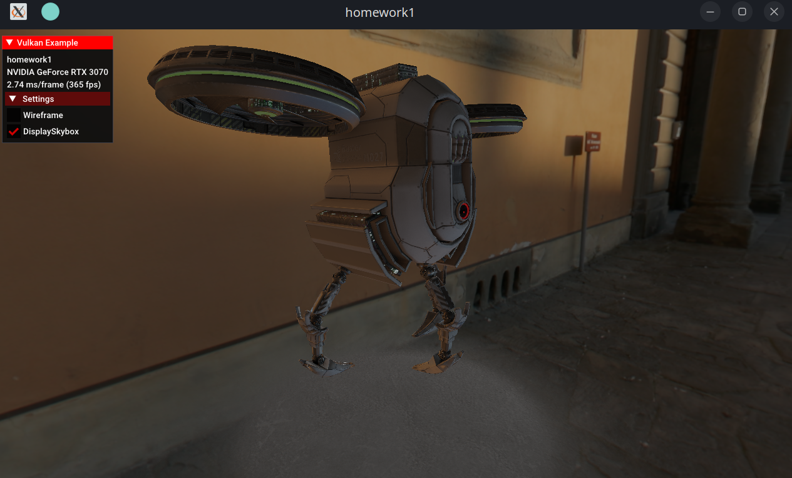

    - 骨骼动画
      - 有 +20
    - PBR
      - PBR的材质纹理是否完整 10
  
        添加了材质 +5

        材质纹理不完整 -5

      - 方向光的PBR是否实现 25
  
        有方向光 +10

        功能能完整运行，效果较好 +10

        只有一个方向光 -5

      - 环境光的 PBR 25
  
        没有实现 -25

    - tone mapping 20
  
      - 无 -20
  
    - bonus 10
  
      - 无

    合计： 45

    评分：实现了骨骼动画（20）+ 添加了部分 PBR 材质纹理（5）+ 实现了 PBR 方向光（20），还可以考虑添加更多的材质纹理和环境光使光照更完整
  
- 蒋 敦纯 - windows

   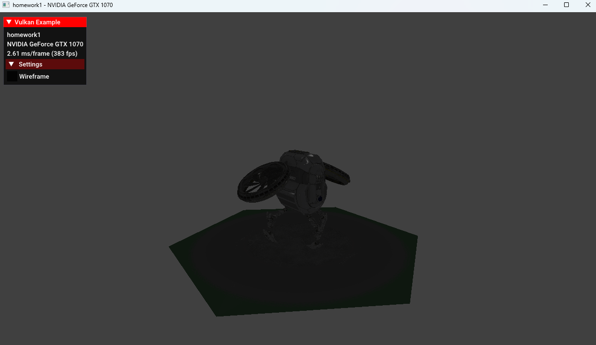

    - 骨骼动画
      - 有 +20
    - PBR
      - PBR的材质纹理是否完整 10
  
        添加了材质 +5

        材质纹理不完整 -5

      - 方向光的PBR是否实现 25
  
        有方向光 +10

        功能能完整运行，效果较好 +10

        只有一个方向光 -5

      - 环境光的 PBR 25
  
        没有实现 -25

    - tone mapping 20
  
      - 无 -20
  
    - bonus 10
  
      - 无

    合计： 45

    评分：实现了骨骼动画（20）+ 添加了部分 PBR 材质纹理（5）+ 实现了 PBR 方向光（20），还可以考虑添加更多的材质纹理和环境光使光照更完整

- 郭 凤威 - windows

  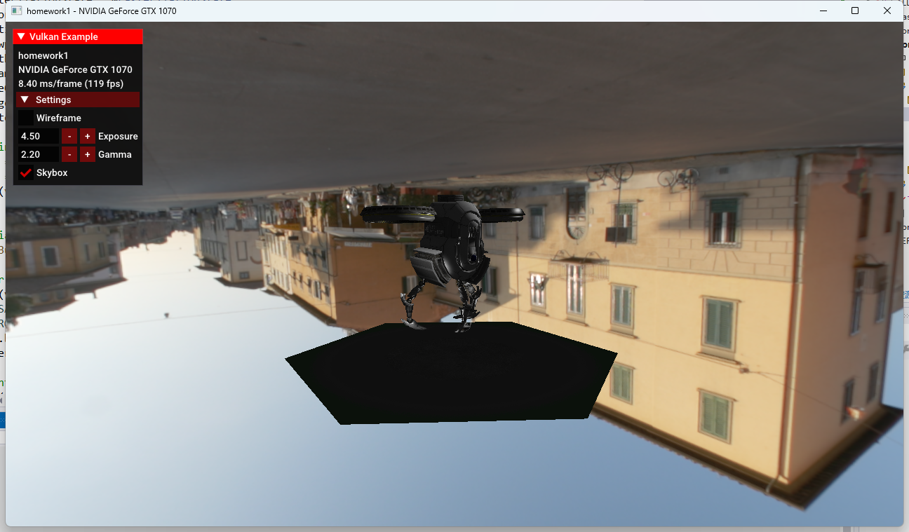

    - 骨骼动画
      - 有 +20
    - PBR
      - PBR的材质纹理是否完整 10
  
        添加了材质 +5

        材质纹理不完整 -5

      - 方向光的PBR是否实现 25
  
        有方向光 +10

        不是 PBR，只有一个方向光 -15

      - 环境光的 PBR 25
  
        有环境光 +10

        功能完整，效果较好，但 skybox 反了 +5

        直接用的示例路径下的 -5

    - tone mapping 20
  
      - 无 -20
  
    - bonus 10
  
      - 无

    合计： 50

    评分：实现了骨骼动画（20）+ 添加了部分 PBR 材质纹理（5）+ 实现了部分 PBR 方向光（10）+ 实现了部分环境光（15），还可以考虑添加更多的材质纹理以及完善 PBR 方向光使光照更完整

- huang Yuxuan - windows

  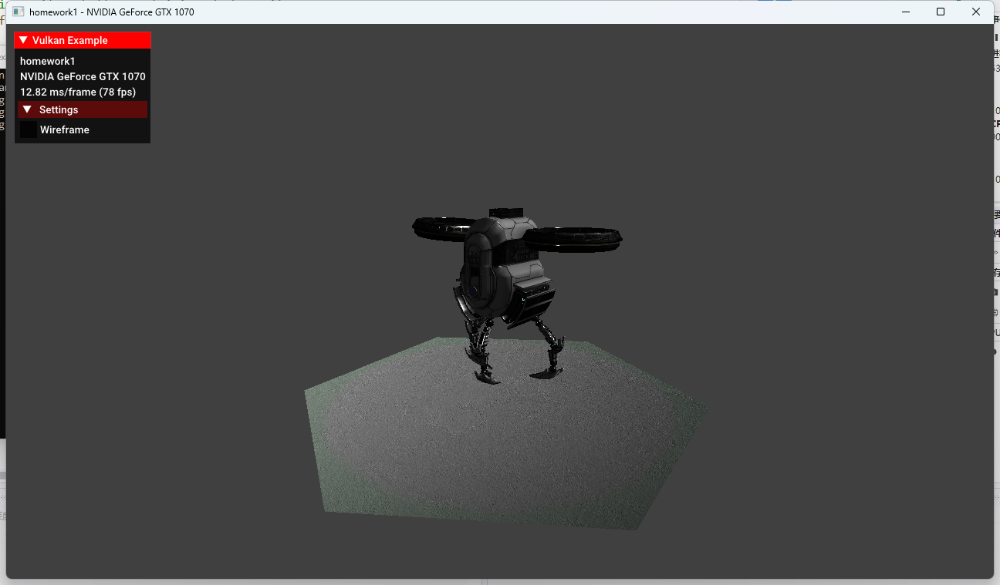

    - 骨骼动画
      - 有 +20
    - PBR
      - PBR的材质纹理是否完整 10
  
        添加了材质纹理 +5

        代码看起来都加了，但是实际效果纹理缺失 -5

      - 方向光的PBR是否实现 25
  
        有方向光 +10

        实现整体比较完整 +10

        只有一个方向光 -5

      - 环境光的 PBR 25
  
        加了部分环境光代码 +10

        无法看到天空盒 -15

    - tone mapping 20
  
      - 无 -20
  
    - bonus 10
  
      - 无
      - 代码结束运行会报错
      - 提供了演示视频和文档

    合计： 55

    评分：实现了骨骼动画（20）+ 添加了部分 PBR 材质纹理（5）+ 实现了 PBR 方向光（20）+ 实现了部分环境光（10），还可以考虑添加更多的材质纹理以及完善 PBR 环境光使光照更完整

- 林 宇杰 - windows

  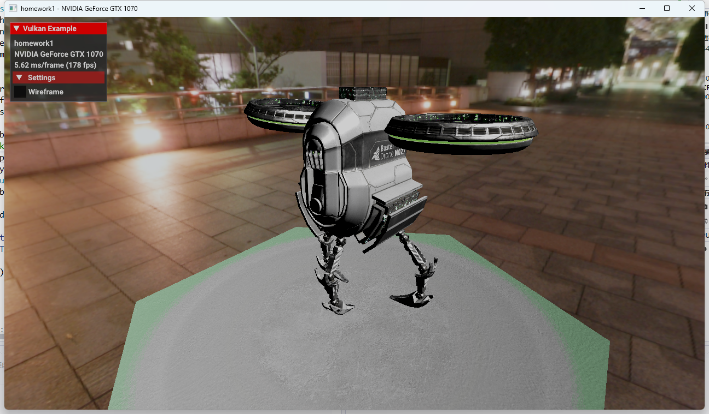

    - 骨骼动画
      - 有 +20
    - PBR
      - PBR的材质纹理是否完整 10
  
        添加了材质纹理 +5

        不完整 -5

      - 方向光的PBR是否实现 25
  
        有方向光 +10

        实现整体比较完整 +10

        只有一个方向光 -5

      - 环境光的 PBR 25
  
        加了环境光 +10

        实现完整，效果较好 +10

        缺少 SRGBtoLINEAR 和 tonemap -5

    - tone mapping 20
  
      - 有 +20
  
    - bonus 10
  
      - 无
      - 提供了文档

    合计： 85

    评分：实现了骨骼动画（20）+ 添加了部分 PBR 材质纹理（5）+ 实现了 PBR 方向光（20）+ 实现了 PBR 环境光（20）+ 实现了 Tonemapping（20），还可以考虑添加更多的材质纹理以及完善 PBR 环境光使光照更完整

## 小结

## References

- https://blog.csdn.net/weixin_44498318/article/details/108097194