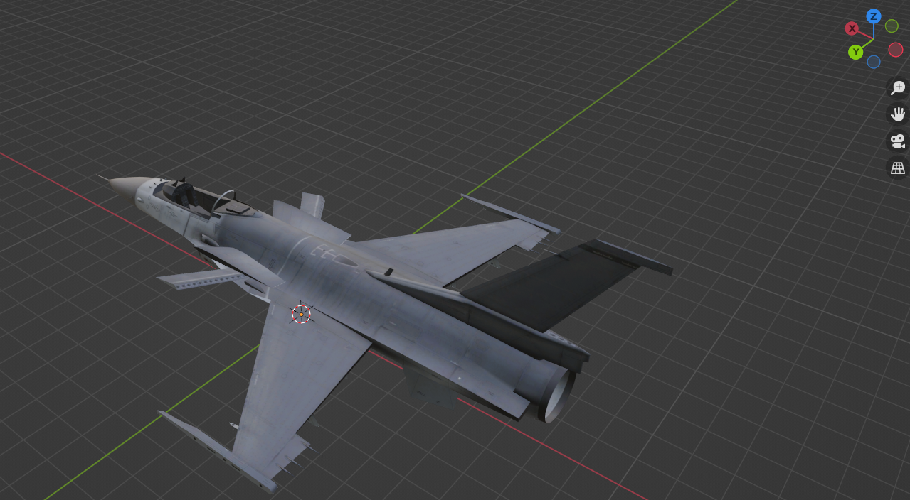

<!--more-->

## 旧项目 Unity 模型资源处理与导出

- （咱就是说能不能做一点正儿八经写代码的工作 = =）

### Jet_Engine_Flames

- 材质需要手动处理，玻璃材质需要将 transmission 设置为 1，roughness 设置为 0.01，导出时为了将材质纹理一并导出，Path Type 选择 Copy
- 需要注意一下坐标系，x 轴是正方向，缩放之后记得 Ctrl + A 应用 All Transform

- 选中所有 Mesh 右键 Set Origin 为 Geometry Center，选机体作为 Parent，然后 Shift + S 将选中的 Mesh Move To Cursor 移动到世界中心，然后适当调整高度
- 检查一下 Mesh 之间的层级关系，保证有个 Parent Node，导出为 FBX，Unreal 导入时勾选 Skeleton Mesh

## References

