<!--more-->

## 旧项目 Unity 模型资源处理与导出

- （咱就是说能不能做一点正儿八经写代码的工作 = =）

### Jet_Engine_Flames

- 在 Unity 中安装 FBX Exporter，这样可以正确导出材质，选择要导出的对象，然后在 GameObject 菜单下面 Export，格式选择 Binary

- 玻璃材质可能需要手动处理，Blender 里面玻璃材质需要将 transmission 设置为 1，roughness 设置为 0.01，或者直接在 Unreal 里面设置，将材质设置为半透明模式，然后调整参数

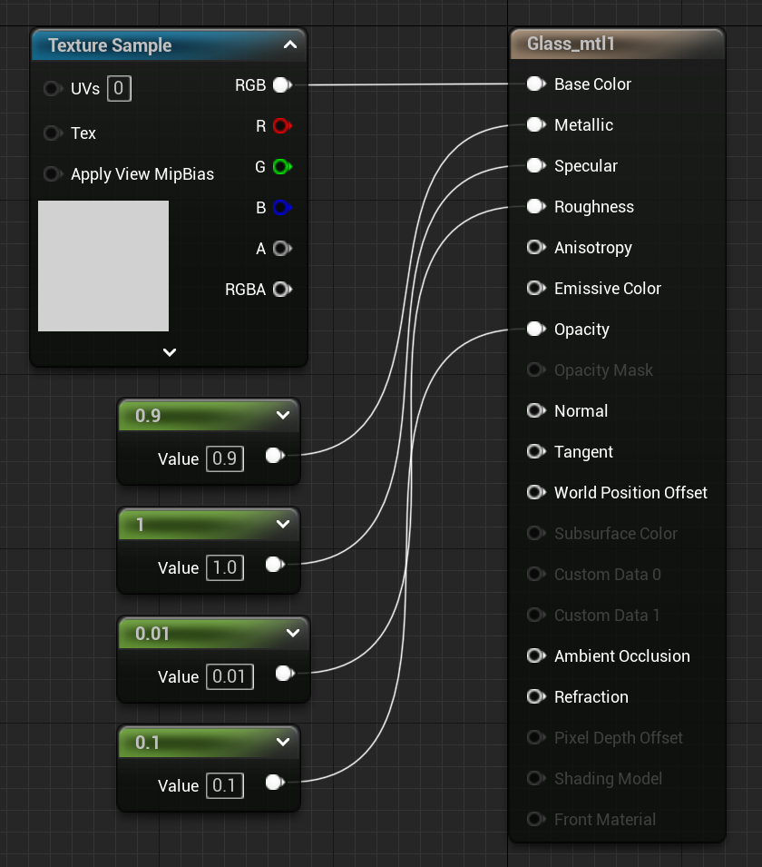

- 导出时为了将材质纹理一并导出，Path Type 选择 Copy
- 需要注意一下坐标系，x 轴是正方向，缩放之后记得 Ctrl + A 应用 All Transform

- 选中所有 Mesh 右键 Set Origin 为 Geometry Center（选机体作为 Parent，然后 Shift + S 将选中的 Mesh Move To Cursor 移动到世界中心，然后适当调整高度）
- 检查一下 Mesh 之间的层级关系，保证有个 Parent Node，导出为 FBX，Unreal 导入时勾选 Skeleton Mesh
- Unity 和 UE 的效果对比：

### daodan1

- 这个没有贴图材质，只改了颜色

### daodan2

### daodan3

### daodan4

### daodan5

### daodan6

### file

### haizhi9

### jian11b

### luzhi9

### yun8

### 模型（obj 格式）

- 我觉得为什么这些模型这么奇怪，材质很多都不对，根本没有纹理

### Super_Spitfire

- Blender 下面的材质变成了全透明，有一点奇怪，但 UE 是好的，没有发现怎么解决，不过这个飞机还挺可爱的

### yjj

- 3dmax 格式下的模型看起来是对的，但是 FBX 导入到 Blender 就不太对了，甚至不能直接导入 UE 会报错。导出 obj 倒是可以导入，但 mesh 多少有点问题

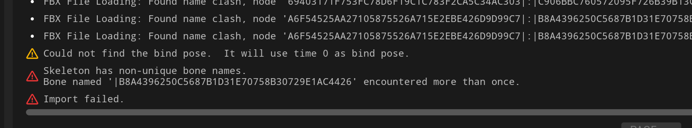

### MZ0139_侦察预警运输机集合

- 这些 3dmax 的文件绝对有问题啊，纹理材质路径根本就不对，感觉没有必要再导出了

### 苏30歼15机型集合

- Unreal 导入 .dds 纹理图片格式出错了，需要用 Photoshop 转成 png，需要安装插件 Adobe Photoshop Plugin https://developer.nvidia.com/nvidia-texture-tools-exporter，Photoshop 可以录制动作，这样就可以批量导出图片了，导出之后需要在 Blender 中把材质纹理改为对应的 png，目前没发现自动替换的方法，一个一个材质换还挺累人的
- 在 Blender 生成 J5_0.FBX 的时候卡住了很久，虽然最后导出成功，但是导入 Unreal 中也卡住了，后来新建了一个 Blender 文件重新改材质并导出就顺利了，可能是材质和纹理设置出现了一些问题

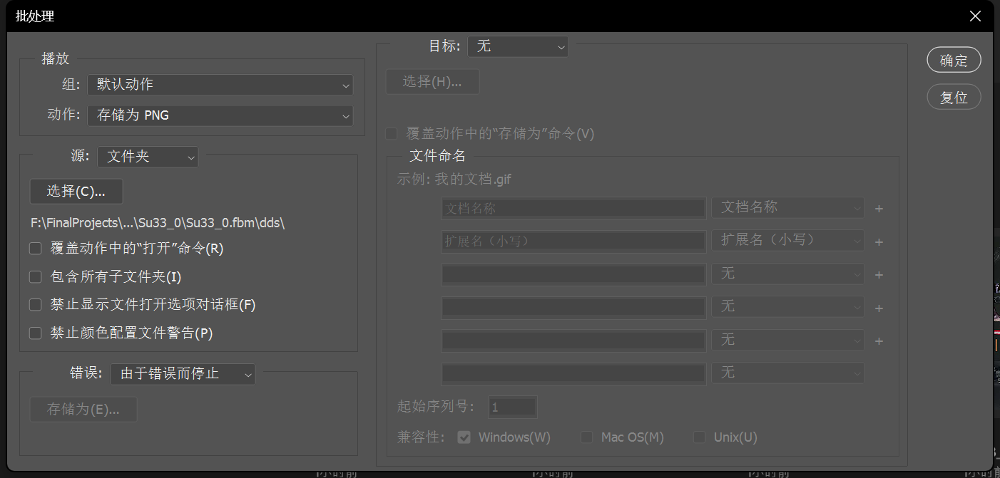

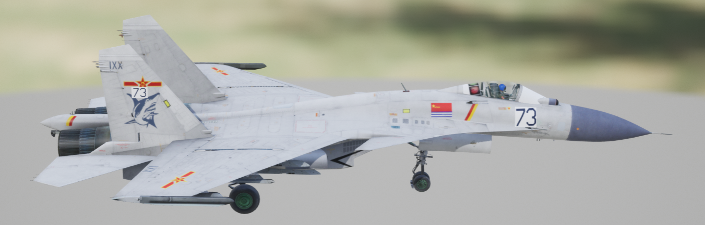

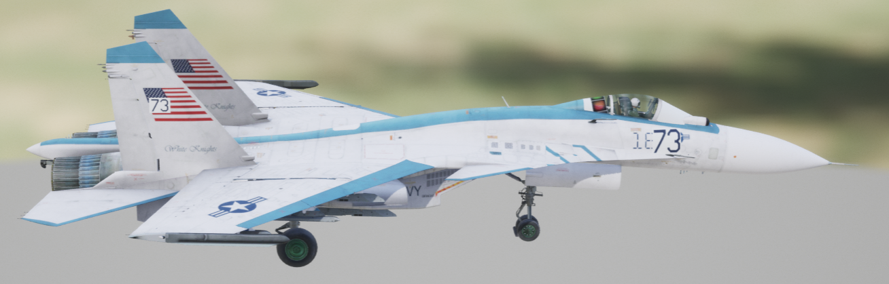

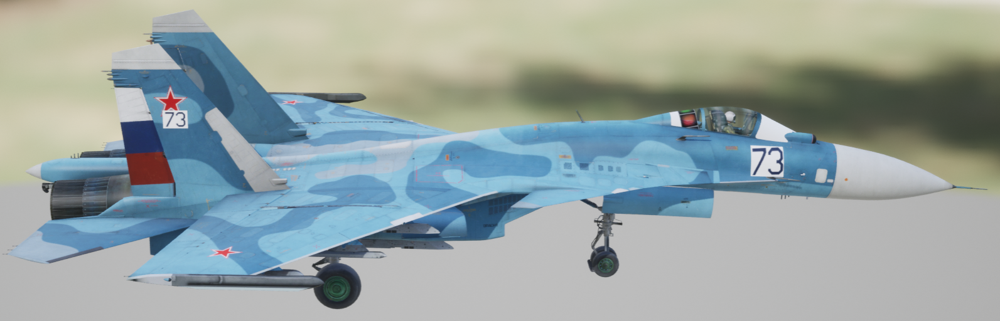

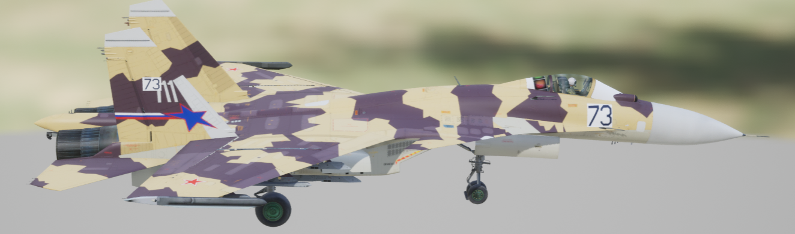

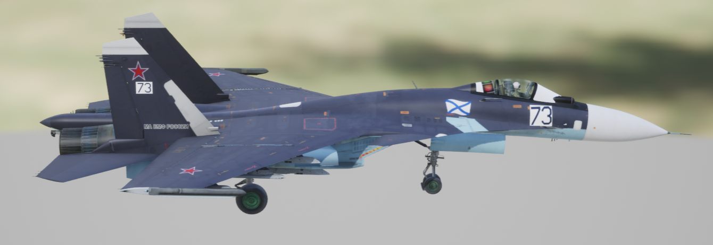

### Turbosquid - The Russian Arrows 2

- 听赵主任的话去买了淘宝的二手模型，发现这个模型是之前学长买过的！可恶
- 3DS 格式，Unity 能直接读取，但是材质有的不正确，所以正确的路线还是应该从 3DS 里面导出 FBX，本来想试试直接把 3DS 导出的 FBX 导入 Unreal，但是材质和模型大小都不太对劲，大小估计是因为比例尺不一样，但材质不好修复

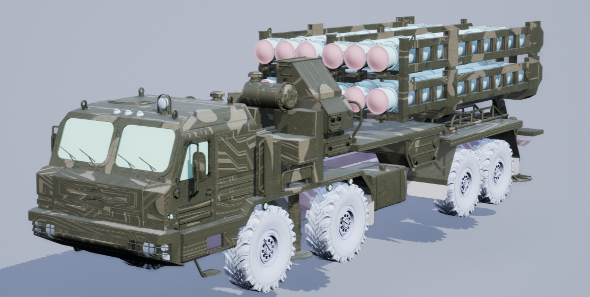

- 所以还是得先导入 Blender 中转处理一下再导入 Unreal，需要改的主要就是朝向，至于为什么经过 Blender 中转就能得到比较好的效果我也不太清楚

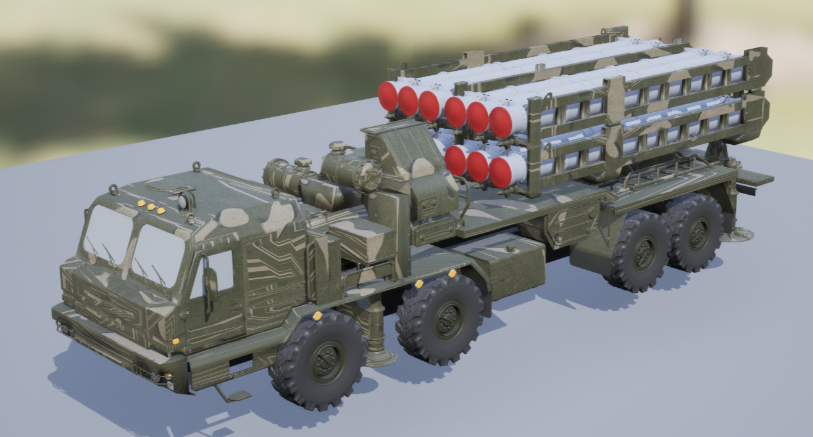

- 20 几个手动转换终于都导入 UE 了，搞得我头晕眼花，很想知道大型的游戏公司这种美术资源的 pipeline 都是如何构建的，应该是要写插件自动适配转换的，可惜能没去成米哈游的 Pipeline TD /(ㄒoㄒ)/~~

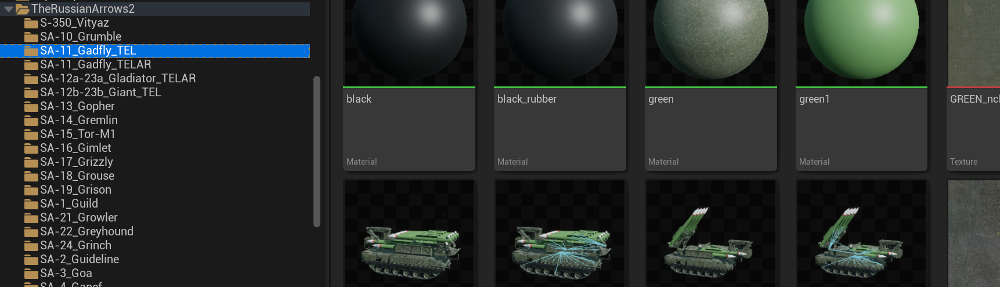

## UI

- 选中 CameraActor，右键点击 Pilot 可以以相机为视角遨游

## References

